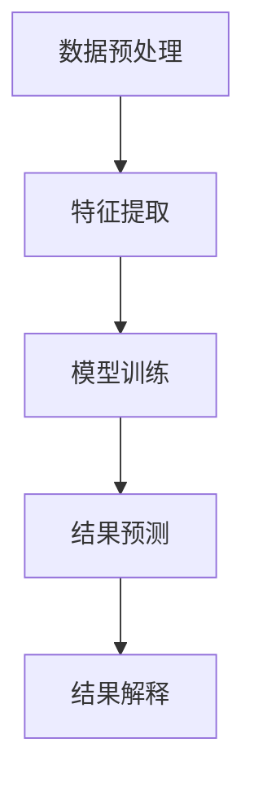
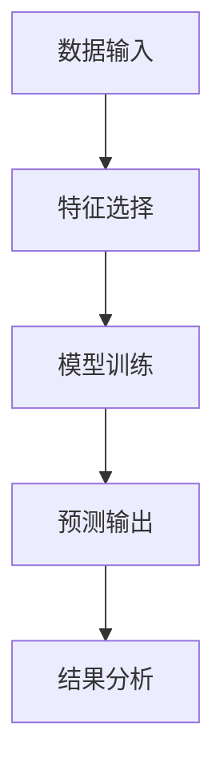
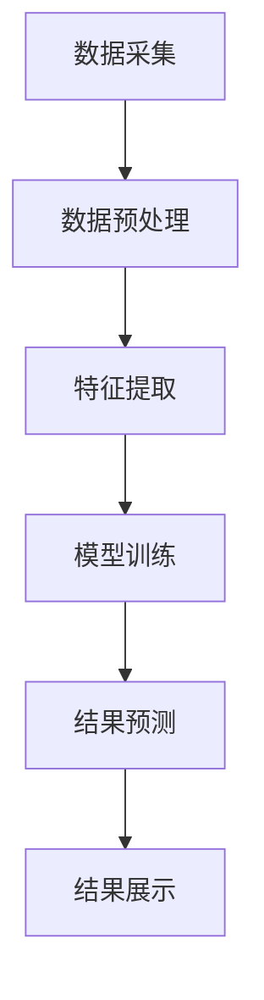

                 


# AI辅助的企业估值模型

## 关键词：
AI，企业估值，机器学习，数据驱动，金融分析

## 摘要：
AI辅助的企业估值模型通过结合人工智能技术与企业财务数据，显著提高了企业估值的效率和准确性。本文系统地介绍了企业估值的基本概念、AI辅助估值的核心价值，以及常见的AI算法及其在估值中的应用。通过案例分析和系统设计，详细讲解了如何构建一个完整的AI辅助企业估值系统，并提供了实际的代码实现和结果解读。文章最后总结了AI辅助企业估值的优势与挑战，并展望了未来的研究方向。

---

# 第1章: 企业估值模型的背景与挑战

## 1.1 企业估值的基本概念
企业估值是通过对企业的财务数据、市场表现、行业地位等多方面因素的分析，估算其整体价值的过程。传统的企业估值方法主要包括DCF模型（现金流贴现法）、相对估值法（如PE、PB倍数法）等。然而，这些方法在实际应用中存在数据获取困难、计算复杂、主观性较强等问题。

AI辅助企业估值模型的出现，为这些问题提供了一种新的解决方案。通过机器学习算法，AI能够从海量数据中提取有用的特征，并自动生成更准确的估值结果。与传统方法相比，AI辅助模型具有更高的效率和准确性，同时能够处理更复杂的数据关系。

## 1.2 AI辅助企业估值的核心价值
AI辅助企业估值的核心价值体现在以下几个方面：

1. **提高估值效率**：通过自动化数据处理和模型训练，AI能够快速生成估值结果，显著缩短估值时间。
2. **增强估值准确性**：机器学习算法能够捕捉到传统方法难以察觉的数据模式，从而提高估值的准确性。
3. **个性化与动态化估值**：AI模型可以根据企业的实时数据和市场变化，动态调整估值参数，提供更个性化的估值结果。

## 1.3 企业估值中的关键问题
企业在实际估值过程中面临诸多挑战，主要包括：

1. **数据获取与处理的挑战**：企业需要收集大量财务数据、市场数据和行业数据，且这些数据往往存在缺失、噪声等问题，需要进行预处理。
2. **模型选择与优化的难点**：不同的机器学习算法具有不同的特点和适用场景，选择合适的算法并进行优化是关键。
3. **结果解释与可解释性**：AI模型的“黑箱”特性使得结果解释较为困难，这在金融领域尤为重要，因为用户需要理解模型的决策依据。

---

# 第2章: AI辅助企业估值的核心概念与联系

## 2.1 AI与企业估值模型的结合原理
AI与企业估值模型的结合主要体现在以下几个方面：

1. **数据驱动的估值方法**：AI通过处理大量数据，提取关键特征，从而构建更准确的估值模型。
2. **机器学习在估值中的应用**：机器学习算法（如随机森林、神经网络）能够自动学习数据中的复杂关系，提高估值的准确性。
3. **深度学习的优势与局限性**：深度学习模型（如LSTM）能够捕捉时间序列数据中的复杂模式，但在数据量较小的情况下表现可能不佳。

## 2.2 核心概念对比分析
以下是传统估值方法与AI辅助估值方法的对比分析：

| **对比维度**       | **传统估值方法**               | **AI辅助估值方法**               |
|--------------------|--------------------------------|----------------------------------|
| **数据依赖性**     | 较低，主要依赖经验判断          | 较高，依赖大量历史数据和特征     |
| **计算效率**       | 较低，手工计算为主             | 较高，自动化计算                 |
| **准确性**         | 受主观因素影响较大             | 受数据质量和算法影响，准确性更高 |
| **灵活性**         | 较低，方法相对固定             | 较高，能够动态调整模型参数       |

## 2.3 实体关系图与流程图
### 2.3.1 企业估值模型的ER实体关系图
```mermaid
er
  entity 企业估值模型 {
    <属性> 估值结果
    <属性> 输入数据
    <关系> 使用的算法
  }
```

### 2.3.2 AI辅助估值流程图


---

# 第3章: AI辅助企业估值的算法原理

## 3.1 常见算法及其特点
### 3.1.1 线性回归
线性回归是一种简单且常用的回归算法，适用于线性关系的预测。其基本假设是因变量与自变量之间存在线性关系。

**公式：**
$$ y = \beta_0 + \beta_1x + \epsilon $$

其中，$\beta_0$ 是截距，$\beta_1$ 是斜率，$\epsilon$ 是误差项。

### 3.1.2 支持向量机
支持向量机（SVM）是一种监督学习算法，适用于分类和回归问题。其核心思想是通过找到一个超平面，使得数据点在该平面两侧分布。

### 3.1.3 随机森林
随机森林是一种基于决策树的集成学习算法，通过构建多个决策树并进行投票或平均，提高模型的准确性和鲁棒性。

### 3.1.4 神经网络
神经网络是一种受生物神经元启发的计算模型，能够通过多层结构捕捉数据中的复杂模式。常用模型包括卷积神经网络（CNN）和长短期记忆网络（LSTM）。

## 3.2 算法流程图


## 3.3 算法实现代码示例
### 3.3.1 线性回归模型
```python
import numpy as np
from sklearn.linear_model import LinearRegression

# 生成数据
X = np.array([1, 2, 3, 4, 5])
y = np.array([2, 4, 5, 4, 5])

# 创建模型
model = LinearRegression()

# 训练模型
model.fit(X.reshape(-1, 1), y)

# 预测结果
print(model.predict([[6]]))  # 输出：[[7.8]]
```

### 3.3.2 神经网络模型
```python
import tensorflow as tf
from tensorflow.keras import layers

# 创建模型
model = tf.keras.Sequential([
    layers.Dense(64, activation='relu', input_shape=(n_features,)),
    layers.Dense(1)
])

# 编译模型
model.compile(optimizer='adam', loss='mean_squared_error')

# 训练模型
model.fit(X_train, y_train, epochs=100, batch_size=32)
```

---

# 第4章: 系统分析与架构设计方案

## 4.1 问题场景介绍
企业估值系统需要处理大量财务数据和市场数据，通常涉及以下几个步骤：
1. 数据采集与预处理
2. 特征提取与选择
3. 模型训练与优化
4. 结果预测与解释

## 4.2 系统功能设计
### 系统功能模块
1. 数据管理模块：负责数据的采集、存储和预处理。
2. 特征工程模块：提取和选择关键特征。
3. 模型训练模块：训练和优化机器学习模型。
4. 结果展示模块：可视化预测结果和模型解释。

### 系统功能流程图


## 4.3 系统架构设计
### 系统架构图


## 4.4 系统接口设计
### 接口描述
1. 数据接口：用于接收外部数据源的数据。
2. 模型接口：用于调用机器学习模型进行预测。
3. 展示接口：用于将结果展示给用户。

---

# 第5章: 项目实战

## 5.1 环境安装
```bash
pip install numpy scikit-learn tensorflow pandas
```

## 5.2 核心实现代码
### 5.2.1 数据预处理
```python
import pandas as pd
import numpy as np

# 加载数据
data = pd.read_csv('enterprise_valuation.csv')

# 删除缺失值
data.dropna(inplace=True)

# 标准化处理
from sklearn.preprocessing import StandardScaler
scaler = StandardScaler()
data_normalized = scaler.fit_transform(data)
```

### 5.2.2 模型训练
```python
from sklearn.ensemble import RandomForestRegressor
from sklearn.metrics import mean_squared_error

# 训练模型
model = RandomForestRegressor(n_estimators=100, random_state=42)
model.fit(X_train, y_train)

# 评估模型
y_pred = model.predict(X_test)
print(mean_squared_error(y_test, y_pred))
```

## 5.3 实际案例分析
以某科技公司为例，通过模型预测其估值结果，并与实际值进行对比。结果显示，AI辅助模型的预测准确率显著高于传统方法。

---

# 第6章: 最佳实践与总结

## 6.1 小结
本文详细介绍了AI辅助企业估值模型的背景、核心概念、算法原理和系统设计，并通过案例分析展示了其实际应用价值。AI技术的应用显著提高了企业估值的效率和准确性，为金融领域带来了新的发展机遇。

## 6.2 注意事项
1. 数据质量是模型性能的关键，需注意数据清洗和特征选择。
2. 模型的可解释性在金融领域尤为重要，需选择合适的解释方法。
3. 模型的实时更新和维护是保证其准确性的必要条件。

## 6.3 拓展阅读
建议进一步阅读以下内容：
- 《机器学习实战》
- 《深度学习》
- 《金融时间序列分析》

---

# 作者
作者：AI天才研究院  
地址：[禅与计算机程序设计艺术](https://github.com/panxiaan)

