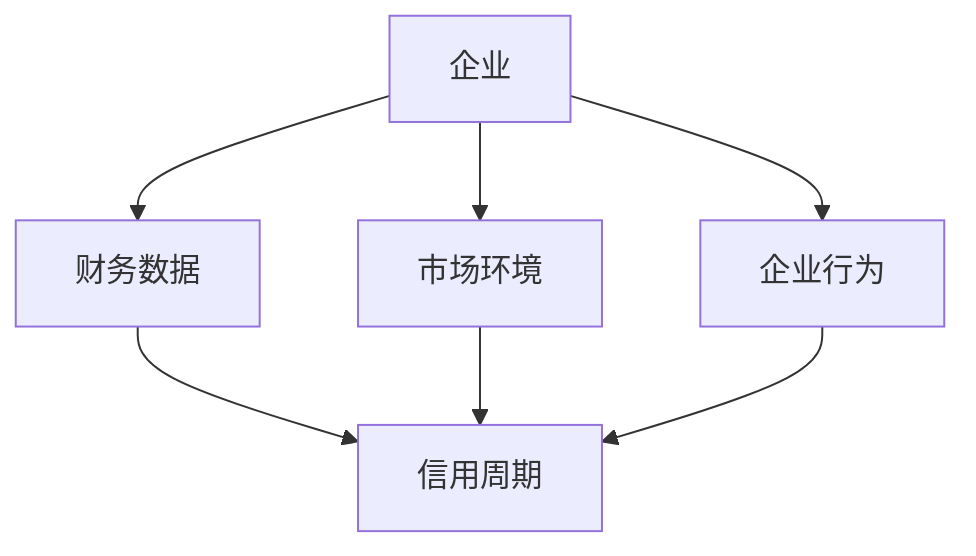
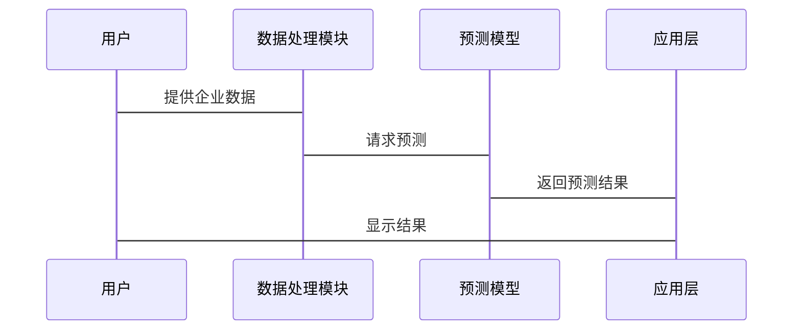

                 


# AI辅助的企业信用周期预测

## 关键词：AI，信用周期，企业信用，预测模型，机器学习，金融风险管理

## 摘要：本文探讨了人工智能技术在企业信用周期预测中的应用，详细分析了信用周期预测的核心概念、算法原理、系统架构及项目实战。通过结合理论与实践，本文展示了如何利用AI技术提升企业信用周期预测的准确性和效率。

---

## 第一部分: 企业信用周期预测的背景与挑战

### 第1章: 信用周期预测的背景与意义

#### 1.1 信用周期的基本概念
- 信用周期是指企业在经济活动中，由于信用行为的发生、发展和变化所形成的周期性波动。  
- 信用周期的核心要素包括企业的信用行为、市场环境和经济周期。  
- 信用周期的经济意义在于帮助企业识别风险，优化资源配置，提升经营效率。

#### 1.2 AI在信用周期预测中的作用
- 传统信用周期预测的局限性：  
  - 数据量不足，预测精度低。  
  - 人工分析耗时长，难以应对动态变化。  
- AI技术在信用周期预测中的优势：  
  - 高效的数据处理能力。  
  - 自动化特征提取与模型优化。  
  - 实时预测与动态调整。  
- 企业信用周期预测的场景与应用：  
  - 企业融资决策。  
  - 供应链管理优化。  
  - 风险控制与预警。

#### 1.3 企业信用周期预测的重要性
- 企业信用周期预测能够帮助企业更好地规划资金流动，降低财务风险。  
- 通过预测信用周期，企业可以优化供应链管理，提高运营效率。  
- 在金融领域，信用周期预测是风险评估和投资决策的重要依据。

---

### 第2章: 企业信用周期预测的挑战

#### 2.1 企业信用数据的特点
- 数据的多样性与复杂性：  
  - 包括财务数据、市场数据、行为数据等多类型数据。  
- 数据的不完整性与噪声：  
  - 数据缺失、错误或不一致。  
- 数据的动态变化性：  
  - 企业信用状况随时间变化，数据更新频繁。

#### 2.2 信用周期预测的主要挑战
- 数据获取与处理的难度：  
  - 数据来源多样，清洗与预处理复杂。  
- 模型选择与优化的复杂性：  
  - 不同场景下适用不同算法，模型调优耗时。  
- 预测结果的可解释性问题：  
  - 复杂模型（如深度学习）难以解释预测结果。

#### 2.3 企业信用周期预测的边界与外延
- 预测范围的界定：  
  - 明确预测的时间范围和数据范围。  
- 相关领域的关联性：  
  - 与企业财务、市场、政策等领域的关联。  
- 预测结果的应用场景：  
  - 风险管理、投资决策、供应链优化等。

---

## 第二部分: AI辅助信用周期预测的核心概念与联系

### 第3章: 信用周期预测的核心概念

#### 3.1 信用周期预测的原理
- 数据驱动的预测方法：  
  - 基于历史数据，通过统计分析或机器学习模型预测未来趋势。  
- 模型驱动的预测方法：  
  - 基于经济学理论或领域知识构建模型，模拟信用周期变化。  
- 综合驱动的预测方法：  
  - 结合数据驱动和模型驱动的优势，构建混合预测模型。

#### 3.2 信用周期预测的关键要素
- 企业财务数据：  
  - 包括收入、利润、资产负债等财务指标。  
- 市场环境数据：  
  - 包括宏观经济指标、行业趋势、市场波动等。  
- 企业行为数据：  
  - 包括企业战略、投资行为、信用记录等。

#### 3.3 信用周期预测的核心流程
- 数据采集与预处理：  
  - 数据清洗、标准化、特征提取。  
- 特征提取与选择：  
  - 选择对信用周期预测有影响力的特征。  
- 模型训练与优化：  
  - 使用机器学习算法训练模型，调整参数优化性能。  
- 结果分析与应用：  
  - 解释预测结果，制定相应的策略。

### 第4章: 核心概念的联系与对比

#### 4.1 核心概念的原理分析
- 数据驱动的预测模型：  
  - 以历史数据为基础，通过机器学习算法发现数据中的模式和规律。  
- 模型驱动的预测模型：  
  - 以理论模型为基础，结合领域知识模拟信用周期变化。  
- 综合驱动的预测模型：  
  - 结合数据驱动和模型驱动的优势，构建更准确的预测模型。

#### 4.2 核心概念的特征对比
| 对比维度       | 数据驱动模型         | 模型驱动模型         | 综合驱动模型         |
|----------------|----------------------|----------------------|----------------------|
| 数据依赖性     | 高                   | 低                   | 中                   |
| 模型可解释性     | 低                   | 高                   | 中                   |
| 预测精度       | 高（在数据充足时）   | 中（依赖模型假设）   | 高（结合两者优势）   |
| 适用场景       | 数据量大、模式复杂     | 数据量小、理论明确     | 数据量适中、模式复杂 |

#### 4.3 ER实体关系图架构


---

## 第三部分: AI辅助信用周期预测的算法原理

### 第4章: 常见算法及其原理

#### 4.1 逻辑回归（Logistic Regression）
- 逻辑回归是一种常用的分类算法，适用于二分类问题。  
- 原理：  
  - 通过线性回归模型将输入特征映射到一个概率空间。  
  - 使用sigmoid函数将线性输出转换为概率。  
  - 损失函数：交叉熵损失函数。  
- 公式：  
  $$ P(y=1|x) = \frac{e^{\beta x}}{1 + e^{\beta x}} $$  

#### 4.2 随机森林（Random Forest）
- 随机森林是一种基于决策树的集成学习算法。  
- 原理：  
  - 通过随机采样生成多棵决策树，最终通过投票或平均的方式得出结果。  
  - 适用于高维数据和非线性关系。  
- 公式：  
  $$ y = \sum_{i=1}^{n} \text{Tree}_i(x) $$  

#### 4.3 神经网络（Neural Networks）
- 神经网络是一种模拟人脑神经网络的深度学习模型。  
- 原理：  
  - 通过多层神经元网络，学习输入数据的非线性特征。  
  - 使用反向传播算法进行参数优化。  
- 公式：  
  $$ y = \sigma(Wx + b) $$  
  其中，$\sigma$ 是激活函数，$W$ 是权重矩阵，$b$ 是偏置。

---

## 第四部分: AI辅助信用周期预测的系统架构设计

### 第5章: 系统功能设计

#### 5.1 领域模型（Domain Model）


#### 5.2 系统架构设计


#### 5.3 系统接口设计
- 输入接口：  
  - 财务数据接口：提供企业的财务数据。  
  - 市场环境接口：提供宏观经济指标。  
- 输出接口：  
  - 预测结果接口：返回信用周期预测结果。  
  - 风险评估接口：提供风险等级评估。

#### 5.4 系统交互流程


---

## 第五部分: 项目实战

### 第6章: 项目实战

#### 6.1 环境安装
- 安装Python环境：  
  ```bash
  python --version
  ```
- 安装依赖库：  
  ```bash
  pip install numpy pandas scikit-learn tensorflow
  ```

#### 6.2 系统核心实现源代码
```python
import numpy as np
import pandas as pd
from sklearn.model_selection import train_test_split
from sklearn.linear_model import LogisticRegression
from sklearn.ensemble import RandomForestClassifier
from tensorflow.keras import layers, models

# 数据加载与预处理
data = pd.read_csv('credit_data.csv')
X = data.drop('credit_cycle', axis=1)
y = data['credit_cycle']

# 数据分割
X_train, X_test, y_train, y_test = train_test_split(X, y, test_size=0.2)

# 逻辑回归模型
lr_model = LogisticRegression()
lr_model.fit(X_train, y_train)
print("LR Accuracy:", lr_model.score(X_test, y_test))

# 随机森林模型
rf_model = RandomForestClassifier()
rf_model.fit(X_train, y_train)
print("RF Accuracy:", rf_model.score(X_test, y_test))

# 神经网络模型
nn_model = models.Sequential()
nn_model.add(layers.Dense(64, activation='relu', input_shape=(X_train.shape[1],)))
nn_model.add(layers.Dense(1, activation='sigmoid'))
nn_model.compile(optimizer='adam', loss='binary_crossentropy', metrics=['accuracy'])
nn_model.fit(X_train, y_train, epochs=10, batch_size=32)
print("NN Accuracy:", nn_model.evaluate(X_test, y_test)[1])
```

#### 6.3 代码应用解读与分析
- 数据加载与预处理：  
  - 使用Pandas加载数据，进行数据清洗和特征选择。  
- 模型训练：  
  - 分别使用逻辑回归、随机森林和神经网络模型进行训练。  
- 模型评估：  
  - 使用准确率评估模型性能。

#### 6.4 实际案例分析
- 数据来源：  
  - 企业财务数据、市场环境数据和企业行为数据。  
- 数据预处理：  
  - 去除缺失值，标准化特征。  
- 模型选择：  
  - 根据数据特点选择合适的模型。  
- 模型优化：  
  - 调整模型参数，优化预测精度。

---

## 第六部分: 总结与展望

### 第7章: 总结

#### 7.1 项目总结
- 本文详细介绍了AI辅助的企业信用周期预测的理论与实践。  
- 通过对比不同算法，展示了AI技术在信用周期预测中的优势。  
- 提供了一个完整的系统架构设计和项目实战案例。

#### 7.2 项目经验总结
- 数据预处理是预测模型成功的关键。  
- 模型选择和优化需要结合数据特点和业务需求。  
- 系统架构设计需要考虑可扩展性和可维护性。

### 第8章: 项目展望

#### 8.1 未来研究方向
- 结合时间序列分析，优化信用周期预测模型。  
- 研究模型的可解释性，提升预测结果的可信度。  
- 探索多模态数据的融合，提高预测精度。

#### 8.2 技术发展趋势
- 随着AI技术的发展，信用周期预测将更加智能化和自动化。  
- 增量学习和在线学习技术将提升模型的实时性。  
- 可解释性AI（XAI）技术将增强预测结果的可信度。

---

## 作者：AI天才研究院 & 禅与计算机程序设计艺术

