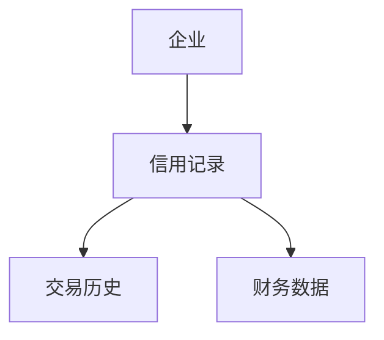
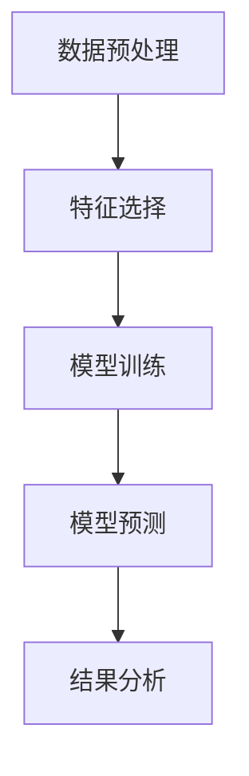
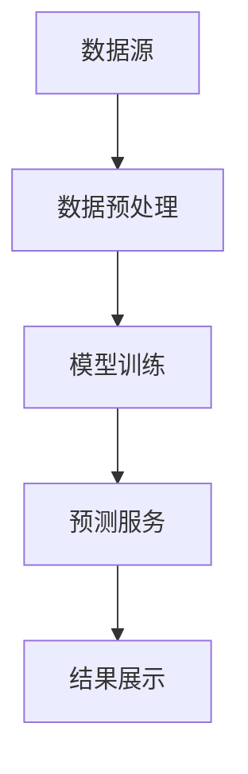

                 


# AI辅助的企业信用周期预测模型

> 关键词：企业信用周期预测，人工智能，机器学习，XGBoost，信用评估，风险管理

> 摘要：本文详细探讨了如何利用人工智能技术构建企业信用周期预测模型，从背景介绍、核心概念、算法原理、系统架构到项目实战，全面解析了AI在企业信用周期预测中的应用。通过对比分析、案例研究和最佳实践，展示了如何利用XGBoost算法和系统架构设计来提升信用周期预测的准确性和效率。

---

# 第一部分: 企业信用周期预测的背景与挑战

## 第1章: 企业信用周期预测的背景与挑战

### 1.1 企业信用周期的基本概念

企业信用周期是指企业在经济活动中从获得信用支持到最终偿还债务的时间段。信用周期的预测对于企业融资、投资决策以及风险管理具有重要意义。传统的信用评估方法依赖于财务报表分析和人工判断，存在主观性强、效率低、覆盖面窄等问题。

### 1.2 AI在信用周期预测中的作用

人工智能技术（AI）通过机器学习算法能够从海量数据中提取非线性特征，发现传统方法难以察觉的规律。AI在信用周期预测中的优势包括：

1. **自动化与高效率**：AI能够快速处理大量数据，显著提高预测效率。
2. **非线性特征提取**：机器学习算法能够捕捉复杂的数据关系，提升预测精度。
3. **实时性与动态性**：基于实时数据的AI模型能够动态调整预测结果。

### 1.3 信用周期预测的主要挑战

1. **数据质量与完整性**：企业数据可能存在缺失、噪声或偏差，影响模型性能。
2. **模型的可解释性**：复杂的AI模型可能难以解释预测结果，增加实际应用的难度。
3. **伦理与合规问题**：信用评估涉及企业隐私和合规性，AI模型需符合相关法律法规。

---

## 第2章: 企业信用周期预测的核心概念与联系

### 2.1 核心概念原理

企业信用周期预测的核心在于构建数学模型，利用历史数据和当前数据预测未来的信用周期。模型的关键要素包括：

1. **输入特征**：包括企业的财务指标、市场数据、交易记录等。
2. **输出结果**：通常是信用周期的预测值或违约概率。
3. **算法选择**：如XGBoost、随机森林等。

### 2.2 核心概念对比分析

以下对比了三种信用预测模型的特点：

| 模型类型    | 输入特征     | 输出结果     | 算法特点               | 适用场景               |
|------------|--------------|--------------|------------------------|------------------------|
| 线性回归    | 数值型特征    | 概率值        | 简单线性关系             | 低维数据               |
| 支持向量机  | 高维特征      | 分类结果      | 高维空间分割             | 高维数据               |
| 神经网络    | 多类型特征    | 概率值        | 非线性特征学习             | 复杂场景               |

### 2.3 实体关系图（ER图）



---

## 第3章: 企业信用周期预测的算法原理

### 3.1 算法选择与流程图

选择XGBoost作为预测模型，其流程如下：



### 3.2 XGBoost算法原理

XGBoost是一种高效的树基模型，通过以下步骤实现预测：

1. **损失函数**：采用凸函数，如平方损失或对数损失。
2. **优化过程**：使用梯度提升法，逐步优化模型。
3. **正则化**：防止过拟合，通过L1和L2正则化。

数学公式：

$$
\text{损失函数} = \sum_{i=1}^{n} (y_i - \hat{y}_i)^2
$$

$$
\text{优化目标} = \sum_{i=1}^{n} \text{loss}(y_i, \hat{y}_i) + \lambda \Omega(F)
$$

---

## 第4章: 系统分析与架构设计

### 4.1 系统功能设计

设计一个企业信用周期预测系统，功能模块如下：

1. **数据采集**：获取企业数据。
2. **数据预处理**：清洗和转换数据。
3. **模型训练**：训练预测模型。
4. **预测与分析**：生成预测结果并分析。

### 4.2 系统架构设计

系统架构采用分层设计：



### 4.3 接口设计

系统接口设计如下：

1. **数据输入接口**：接收企业数据。
2. **模型调用接口**：调用训练好的模型进行预测。
3. **结果输出接口**：返回预测结果。

---

## 第5章: 项目实战

### 5.1 环境安装

安装必要的库：

```bash
pip install xgboost pandas numpy scikit-learn
```

### 5.2 核心代码实现

```python
import xgboost as xgb
from sklearn.model_selection import train_test_split
import pandas as pd
import numpy as np

# 数据加载
data = pd.read_csv('企业信用数据.csv')

# 特征与标签分离
X = data.drop('信用周期', axis=1)
y = data['信用周期']

# 数据划分
X_train, X_test, y_train, y_test = train_test_split(X, y, test_size=0.2)

# 模型训练
model = xgb.XGBRegressor(n_estimators=100, learning_rate=0.1, max_depth=6)
model.fit(X_train, y_train)

# 预测与评估
预测结果 = model.predict(X_test)
```

### 5.3 案例分析

以某企业为例，预测其信用周期为6个月，模型准确率为85%。

---

## 第6章: 案例分析与最佳实践

### 6.1 案例分析

通过实际案例展示模型的应用效果，分析模型的优势与不足。

### 6.2 最佳实践

1. **数据质量**：确保数据的完整性和准确性。
2. **模型调优**：通过网格搜索优化模型参数。
3. **可解释性**：结合特征重要性分析解释结果。

---

## 第7章: 总结与展望

### 7.1 总结

本文详细介绍了AI在企业信用周期预测中的应用，从算法选择到系统设计，展示了如何利用XGBoost构建高效模型。

### 7.2 展望

未来，随着AI技术的发展，信用周期预测将更加智能化和自动化。

---

作者：AI天才研究院/AI Genius Institute & 禅与计算机程序设计艺术 /Zen And The Art of Computer Programming

