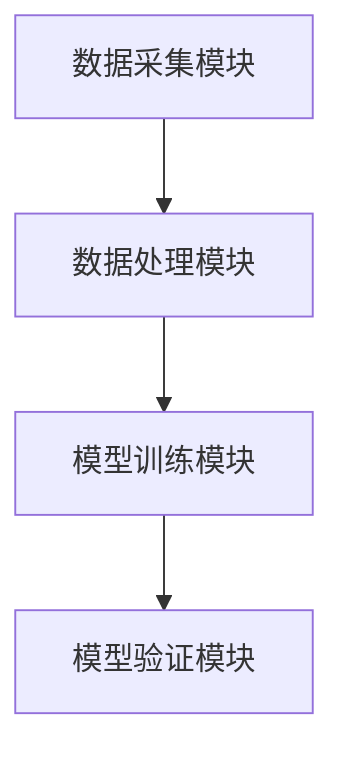
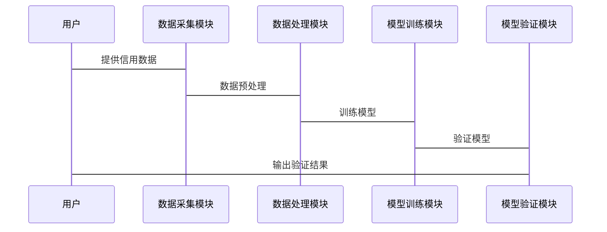

                 

# AI辅助的企业信用评分卡验证

**关键词：** AI辅助，企业信用评分卡，信用评分，AI技术，信用风险评估

**摘要：**  
随着人工智能技术的快速发展，AI在企业信用评分卡验证中的应用越来越广泛。本文从AI辅助企业信用评分卡的基本概念出发，详细探讨了AI在信用评分中的核心作用，分析了机器学习和深度学习算法在信用评分卡验证中的应用，以及系统架构设计和实际案例。最后，本文总结了AI辅助信用评分卡验证的优势和未来发展趋势。

---

## 第一部分: AI辅助的企业信用评分卡验证概述

### 第1章: 企业信用评分卡的基本概念

#### 1.1 信用评分卡的定义与作用
信用评分卡是一种用于评估企业信用状况的工具，通过对企业财务数据、经营状况、市场表现等多维度信息的综合分析，量化企业的信用风险。信用评分卡的结果通常以分数形式呈现，分数越高表示企业的信用风险越低。

#### 1.2 AI在信用评分中的优势
传统的信用评分卡主要依赖于经验丰富的信贷专家的主观判断，存在效率低、成本高、主观性强等问题。而AI技术的应用可以显著提高信用评分的效率和准确性。通过机器学习算法，AI可以从海量数据中提取特征，发现传统方法难以捕捉的规律，从而提供更精准的信用评分。

#### 1.3 信用评分卡验证的挑战与机遇
信用评分卡验证的核心在于确保评分的准确性和可靠性。然而，传统的验证方法往往依赖于人工审查，存在耗时长、成本高等问题。AI技术的应用可以自动化完成验证过程，提高效率，降低成本，同时还可以发现潜在的欺诈行为，提升信用评分的准确性。

---

## 第二部分: AI辅助信用评分卡验证的核心算法

### 第2章: 信用评分卡验证的机器学习算法

#### 2.1 逻辑回归算法
逻辑回归是一种常用的分类算法，广泛应用于信用评分卡验证中。其核心思想是通过建立一个线性模型，将输入特征映射到一个概率空间，从而判断企业的信用风险。

- **数学公式：**
  $$ P(y=1|x) = \frac{1}{1 + e^{-(\beta_0 + \beta_1x_1 + \beta_2x_2 + \dots + \beta_nx_n)}} $$
  其中，$y$ 是输出变量（信用风险），$x_i$ 是输入特征，$\beta_i$ 是模型参数。

- **实现步骤：**
  1. 数据预处理：清洗数据，处理缺失值和异常值。
  2. 特征选择：选择对信用评分影响较大的特征。
  3. 模型训练：使用训练数据训练逻辑回归模型。
  4. 模型验证：使用验证数据评估模型的准确性和稳定性。

#### 2.2 随机森林算法
随机森林是一种基于决策树的集成学习算法，具有高准确性和强健性的特点。在信用评分卡验证中，随机森林可以通过投票机制对多个决策树的结果进行综合，从而提高预测的准确性。

- **数学公式：**
  $$ y = \sum_{i=1}^{n} \frac{1}{n} \cdot \text{Tree}_i(x) $$
  其中，$\text{Tree}_i(x)$ 表示第$i$棵决策树的预测结果，$n$ 是决策树的数量。

- **实现步骤：**
  1. 数据预处理：清洗数据，处理缺失值和异常值。
  2. 特征选择：选择对信用评分影响较大的特征。
  3. 模型训练：使用训练数据训练随机森林模型。
  4. 模型验证：使用验证数据评估模型的准确性和稳定性。

#### 2.3 神经网络算法
神经网络是一种模拟人脑神经网络结构的深度学习算法，具有强大的非线性建模能力。在信用评分卡验证中，神经网络可以通过多层感知机（MLP）结构，自动提取复杂的特征关系，从而提高预测的准确性。

- **数学公式：**
  $$ y = \sigma(w_2 \cdot \sigma(w_1 x + b_1) + b_2) $$
  其中，$\sigma$ 是sigmoid函数，$w_1$ 和 $w_2$ 是权重，$b_1$ 和 $b_2$ 是偏置。

- **实现步骤：**
  1. 数据预处理：清洗数据，处理缺失值和异常值。
  2. 特征选择：选择对信用评分影响较大的特征。
  3. 模型训练：使用训练数据训练神经网络模型。
  4. 模型验证：使用验证数据评估模型的准确性和稳定性。

---

## 第三部分: 系统架构设计与实现

### 第3章: 系统架构设计

#### 3.1 系统模块划分
AI辅助信用评分卡验证系统的架构可以分为以下几个模块：
1. **数据采集模块：** 负责采集企业相关的信用数据。
2. **数据处理模块：** 负责对数据进行清洗、转换和特征提取。
3. **模型训练模块：** 负责训练机器学习模型。
4. **模型验证模块：** 负责验证模型的准确性和稳定性。

#### 3.2 系统架构图

#### 3.3 系统接口设计
系统接口设计需要考虑以下几个方面：
1. 数据输入接口：接收企业的信用数据。
2. 模型训练接口：训练机器学习模型。
3. 模型验证接口：验证模型的准确性和稳定性。

#### 3.4 系统交互流程图

---

## 第四部分: 实际案例与分析

### 第4章: 实际案例分析

#### 4.1 案例背景
假设某银行需要对一批企业客户进行信用评分。传统的信用评分方法需要大量的人工审查，效率低且成本高。为了提高效率和准确性，该银行决定引入AI技术，构建一个基于机器学习的信用评分卡验证系统。

#### 4.2 数据处理与特征提取
首先，我们需要对数据进行清洗和预处理，包括处理缺失值、异常值和重复值。然后，选择对信用评分影响较大的特征，如企业营业收入、净利润、资产负债率等。

#### 4.3 模型训练与验证
使用逻辑回归、随机森林和神经网络三种算法分别对数据进行训练，并对模型的准确性和稳定性进行验证。最终选择准确率最高且稳定性最好的模型进行实际应用。

#### 4.4 模型结果分析
通过实际案例分析，我们可以看到，AI辅助的信用评分卡验证系统能够显著提高信用评分的效率和准确性。相比于传统的信用评分方法，AI技术可以在短时间内处理大量的数据，并发现潜在的风险因素，从而为企业提供更精准的信用评分。

---

## 第五部分: 总结与展望

### 第5章: 总结与展望

#### 5.1 总结
本文详细探讨了AI辅助企业信用评分卡验证的核心算法和系统架构设计。通过实际案例分析，我们看到，AI技术能够显著提高信用评分的效率和准确性，为企业信用风险管理提供强有力的支持。

#### 5.2 展望
未来，随着AI技术的不断发展，信用评分卡验证将更加智能化和自动化。深度学习算法的引入将进一步提高信用评分的准确性，同时，区块链技术的应用也将提升信用评分的安全性和可信度。

---

## 作者：AI天才研究院 & 禅与计算机程序设计艺术

---

通过以上思考，我们可以看到，AI辅助企业信用评分卡验证是一个复杂但充满潜力的领域。随着技术的不断进步，AI将在信用风险管理中发挥越来越重要的作用。

