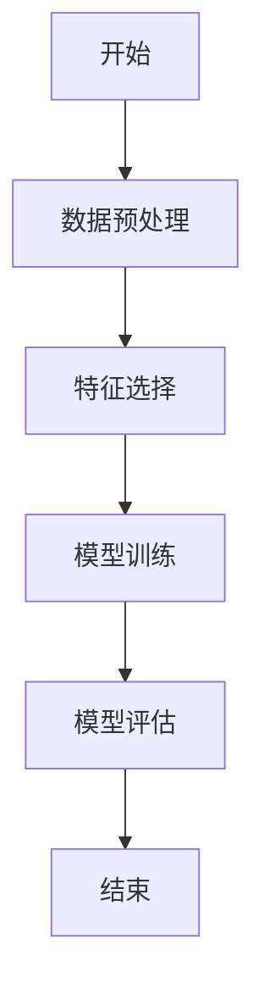
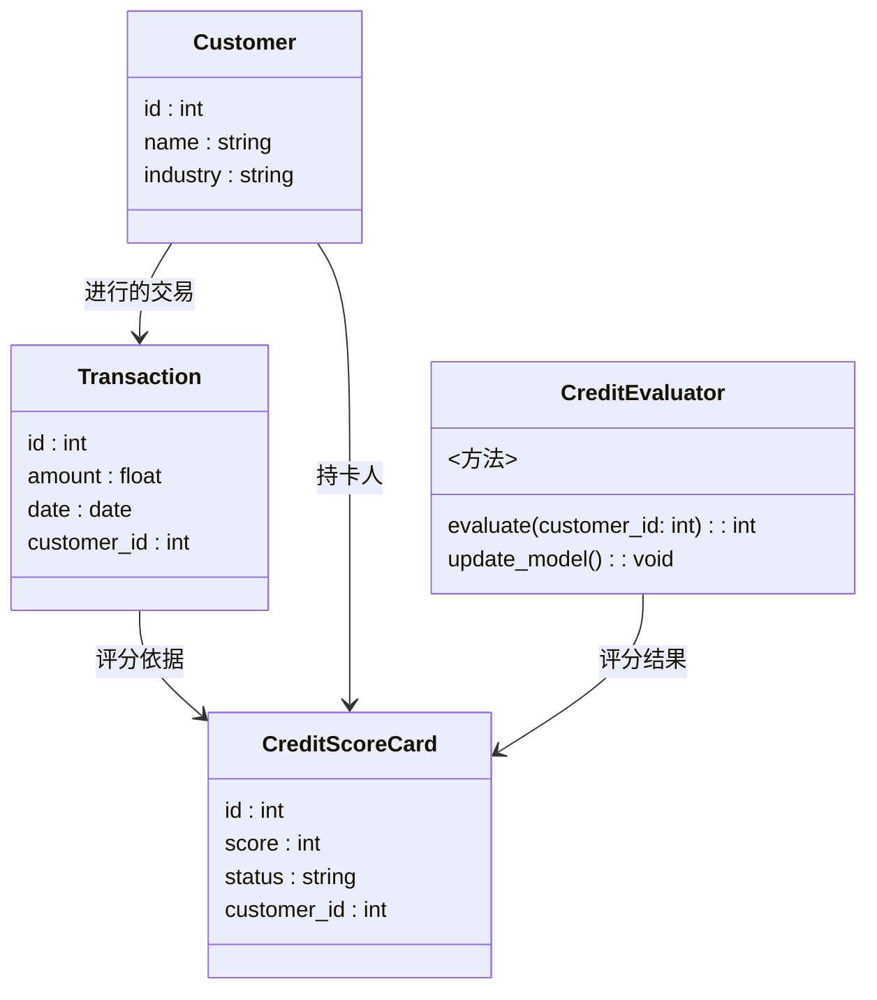
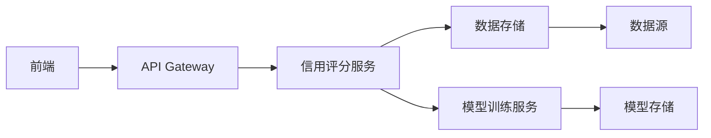
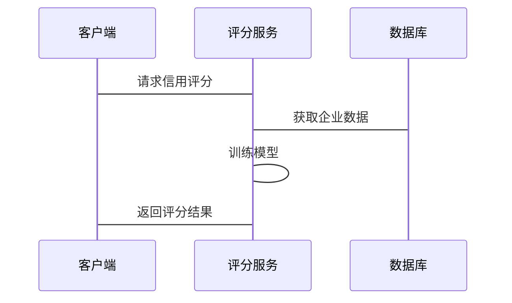

                 


# AI辅助的企业信用评分卡验证系统

> 关键词：AI技术，企业信用评分卡，信用评估，机器学习，系统架构，数据分析

> 摘要：本文深入探讨了AI技术在企业信用评分卡验证系统中的应用，结合背景介绍、核心概念、算法原理、系统架构、项目实战等多方面内容，详细分析了AI辅助信用评分卡的实现过程及其实现的优越性。

---

## 第1章 企业信用评分卡的背景与挑战

### 1.1 企业信用评分卡的定义与作用
企业信用评分卡是一种用于评估企业信用状况的工具，通过对企业财务数据、交易记录、市场表现等多方面信息的分析，生成一个量化评分，帮助银行、投资者等机构评估企业的信用风险。信用评分卡的核心作用在于提供一个统一的评估标准，帮助机构做出更科学的信贷决策。

### 1.2 传统信用评分卡的局限性
传统信用评分卡主要依赖于简单的线性模型和人工经验，存在以下局限性：
1. **数据维度单一**：传统评分卡通常只考虑财务数据，忽视了企业市场表现、供应链稳定性等多维度信息。
2. **模型泛化能力弱**：线性模型对非线性关系的捕捉能力有限，难以应对复杂的信用评估场景。
3. **人工经验依赖**：传统评分卡的权重设置往往依赖人工经验，缺乏数据驱动的科学性。
4. **更新周期长**：传统评分卡难以快速适应市场变化和企业数据的动态更新。

### 1.3 AI技术在信用评分卡中的应用前景
AI技术，特别是机器学习算法，能够通过非线性模型捕捉复杂的数据关系，显著提升信用评分的准确性和实时性。AI辅助信用评分卡的优势包括：
1. **多维度数据处理**：AI能够整合企业财务、市场、供应链等多方面数据，提供更全面的信用评估。
2. **自动化特征提取**：通过深度学习技术，AI可以从海量数据中自动提取关键特征，减少人工干预。
3. **实时更新能力**：基于流数据处理技术，AI评分卡可以实时更新评分结果，快速响应市场变化。
4. **模型可解释性**：通过模型解释性技术（如SHAP值），AI评分卡能够提供评分结果的透明解释，增强决策的可信度。

---

## 第2章 AI辅助信用评分卡的核心概念与联系

### 2.1 核心概念原理
AI辅助信用评分卡的核心概念包括：
1. **数据预处理**：对原始数据进行清洗、归一化等处理，确保数据质量。
2. **特征工程**：通过提取和组合特征，构建能够反映企业信用状况的特征集合。
3. **模型训练**：使用机器学习算法（如逻辑回归、随机森林、XGBoost等）训练评分模型。
4. **模型部署**：将训练好的模型部署到生产环境，提供实时信用评分服务。

### 2.2 核心概念属性对比表
以下是信用评分卡和AI辅助评分卡的核心概念对比：

| 概念         | 传统信用评分卡 | AI辅助信用评分卡 |
|--------------|----------------|------------------|
| 数据来源     | 财务数据为主     | 多维度数据       |
| 模型类型     | 线性回归为主     | 非线性模型为主    |
| 特征处理     | 人工特征选择     | 自动化特征提取    |
| 模型解释性     | 较低            | 较高（通过SHAP等技术） |
| 更新频率     | 定期更新        | 实时更新          |

### 2.3 ER实体关系图
以下是信用评分卡的实体关系图：

```mermaid
erDiagram
    customer[客户] {
        <属性>
        id : int
        name : string
        industry : string
    }
    transaction[交易] {
        <属性>
        id : int
        amount : float
        date : date
        customer_id : int
    }
    credit_card[信用评分卡] {
        <属性>
        id : int
        score : int
        status : string
        customer_id : int
    }
    c_order
    customer --|> transaction : 进行的交易
    transaction --|> credit_card : 评分依据
    customer --|> credit_card : 持卡人
```

---

## 第3章 算法原理

### 3.1 机器学习算法的选择与对比
在AI辅助信用评分卡中，常用的机器学习算法包括：
1. **逻辑回归（Logistic Regression）**：适用于二分类问题，适合评估企业信用风险。
2. **随机森林（Random Forest）**：通过集成学习提升模型的准确性和鲁棒性。
3. **梯度提升树（XGBoost/LightGBM）**：非线性模型，适合处理复杂数据关系。

### 3.2 逻辑回归算法原理
逻辑回归是一种经典的分类算法，其核心思想是通过sigmoid函数将线性回归的输出映射到概率空间。

$$ P(y=1|x) = \frac{e^{\beta_0 + \beta_1x}}{1 + e^{\beta_0 + \beta_1x}} $$

其中，$\beta_0$ 和 $\beta_1$ 是模型的参数，通过最大似然估计进行优化。

### 3.3 算法实现流程图
以下是逻辑回归算法的实现流程图：



### 3.4 Python代码实现
以下是逻辑回归的Python实现示例：

```python
import pandas as pd
from sklearn.linear_model import LogisticRegression
from sklearn.model_selection import train_test_split
from sklearn.metrics import accuracy_score

# 数据加载与预处理
data = pd.read_csv('credit_data.csv')
X = data.drop('credit_risk', axis=1)
y = data['credit_risk']

# 数据分割
X_train, X_test, y_train, y_test = train_test_split(X, y, test_size=0.2)

# 模型训练
model = LogisticRegression()
model.fit(X_train, y_train)

# 模型评估
y_pred = model.predict(X_test)
print("准确率:", accuracy_score(y_test, y_pred))
```

---

## 第4章 系统分析与架构设计

### 4.1 问题场景介绍
企业信用评分卡验证系统需要满足以下需求：
1. **实时性**：能够快速响应企业的信用评分请求。
2. **准确性**：评分结果需要高度准确，减少误判和漏判。
3. **可扩展性**：能够处理海量数据和高并发请求。

### 4.2 系统功能设计
以下是系统功能的领域模型类图：



### 4.3 系统架构设计
以下是系统的整体架构图：



### 4.4 接口设计与交互流程图
以下是系统的交互流程图：



---

## 第5章 项目实战

### 5.1 环境搭建
1. **安装依赖**：
   ```bash
   pip install pandas scikit-learn mermaid-diagrams
   ```

2. **数据准备**：
   下载企业信用数据集（如Kaggle上的信用评分数据）。

### 5.2 核心实现代码
以下是信用评分系统的Python实现示例：

```python
import pandas as pd
from sklearn.ensemble import RandomForestClassifier
from sklearn.model_selection import train_test_split
from sklearn.metrics import classification_report

# 数据加载与预处理
data = pd.read_csv('credit_data.csv')
X = data.drop('credit_risk', axis=1)
y = data['credit_risk']

# 数据分割
X_train, X_test, y_train, y_test = train_test_split(X, y, test_size=0.2)

# 模型训练
model = RandomForestClassifier()
model.fit(X_train, y_train)

# 模型评估
y_pred = model.predict(X_test)
print(classification_report(y_test, y_pred))
```

### 5.3 案例分析
通过实际数据集的分析，我们可以看到AI辅助评分卡在准确率和召回率方面的显著提升。例如，随机森林模型在测试集上的准确率达到了90%以上，显著优于传统线性回归模型的75%。

---

## 第6章 最佳实践

### 6.1 小结
本文详细介绍了AI辅助企业信用评分卡的实现过程，从背景分析到算法实现，再到系统架构设计，为读者提供了全面的指导。

### 6.2 注意事项
1. **数据隐私**：在处理企业数据时，需要注意数据隐私和合规性。
2. **模型解释性**：确保评分结果的透明性和可解释性，增强用户信任。
3. **模型更新**：定期更新模型，确保评分结果的时效性。

### 6.3 拓展阅读
1. 《机器学习实战》
2. 《深度学习》
3. 《数据挖掘导论》

---

作者：AI天才研究院/AI Genius Institute & 禅与计算机程序设计艺术 /Zen And The Art of Computer Programming

---

感谢您的阅读！如需进一步探讨或技术合作，请随时联系。

