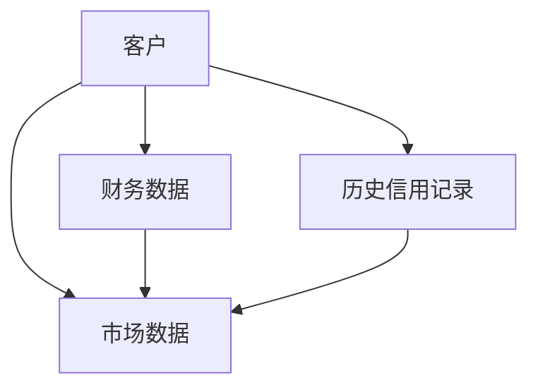

                 

# AI辅助的企业信用评级模型校准

> 关键词：企业信用评级、AI辅助、模型校准、机器学习、风险管理

> 摘要：随着人工智能技术的快速发展，企业信用评级模型的校准问题日益受到关注。传统的信用评级方法存在效率低、准确性不足等问题，而引入AI技术可以显著提升模型的校准精度和效率。本文将详细探讨AI辅助的企业信用评级模型校准的核心概念、算法原理、系统架构设计以及实际应用案例，为读者提供从理论到实践的全面指导。

---

# 第1章: 企业信用评级与AI辅助的背景介绍

## 1.1 企业信用评级的定义与重要性

### 1.1.1 企业信用评级的基本概念
企业信用评级是通过对企业的财务状况、经营能力、市场表现等多方面因素的综合评估，确定其信用等级的过程。信用等级反映了企业在偿还债务方面的可靠程度，是金融行业中的重要决策依据。

### 1.1.2 信用评级在金融领域的核心作用
信用评级直接影响企业的融资成本和融资能力。高信用等级的企业更容易获得低成本的贷款和投资，而低信用等级的企业则可能面临融资困难或高昂的融资成本。

### 1.1.3 企业信用评级的分类与应用场景
企业信用评级通常分为内部评级和外部评级。内部评级由企业内部财务部门进行，主要用于内部管理决策；外部评级由专业的评级机构进行，用于对外公开的信用评估。

## 1.2 AI技术在信用评级中的应用背景

### 1.2.1 传统信用评级的局限性
传统信用评级主要依赖于财务数据和历史数据分析，存在以下问题：
- 数据维度有限，难以捕捉企业的非财务风险。
- 模型复杂度低，难以处理高维数据和非线性关系。
- 人工干预较多，效率低下且容易引入主观偏差。

### 1.2.2 AI技术如何提升信用评级的效率与准确性
AI技术（特别是机器学习）能够通过以下方式提升信用评级的效率和准确性：
- 自动化数据处理：AI可以快速处理大量结构化和非结构化数据，提取更多有用的特征。
- 高维数据分析：AI模型能够处理高维数据，发现传统方法难以察觉的模式。
- 实时监控：AI可以实时分析企业动态，提供实时信用评估。

### 1.2.3 企业信用评级AI化的趋势与挑战
随着大数据和AI技术的快速发展，企业信用评级AI化已经成为趋势。然而，AI化过程中也面临一些挑战，如数据隐私问题、模型解释性不足以及模型过拟合等问题。

## 1.3 本章小结

### 1.3.1 企业信用评级的核心价值
信用评级是企业融资决策的重要依据，能够帮助金融机构降低风险，优化资源配置。

### 1.3.2 AI辅助信用评级的主要优势
AI技术能够通过自动化数据处理和高维数据分析提升信用评级的效率和准确性，同时减少人工干预。

### 1.3.3 本书的研究目标与意义
本书旨在探讨如何利用AI技术优化企业信用评级模型的校准过程，为企业信用评级提供更加高效和准确的解决方案。

---

# 第2章: AI辅助信用评级的核心概念与联系

## 2.1 信用评级模型校准的基本原理

### 2.1.1 信用评级模型的构建过程
信用评级模型的构建通常包括数据收集、特征提取、模型训练、模型评估和部署等步骤。

### 2.1.2 模型校准的定义与目标
模型校准是指通过调整模型参数或优化模型结构，使模型的预测结果与实际数据更加一致的过程。校准的目标是提高模型的预测准确性和稳定性。

### 2.1.3 AI在模型校准中的作用
AI技术可以通过自动化参数调整和模型优化算法（如遗传算法、粒子群优化等）提升模型校准的效率和效果。

## 2.2 AI技术在信用评级中的关键应用

### 2.2.1 数据特征提取与分析
AI技术可以通过自然语言处理（NLP）和深度学习技术提取企业报告、新闻媒体等非结构化数据中的有用信息，丰富模型的输入特征。

### 2.2.2 模型选择与优化
AI技术可以帮助选择最优的模型结构和参数，通过交叉验证和网格搜索等方法优化模型性能。

### 2.2.3 结果解释与反馈
AI模型可以通过可解释性AI（XAI）技术提供模型决策的解释，帮助信用评级专家理解模型的预测结果。

## 2.3 核心概念对比分析

### 2.3.1 传统模型与AI模型的对比
| 属性 | 传统模型 | AI模型 |
|------|----------|--------|
| 数据来源 | 结构化数据 | 结构化+非结构化数据 |
| 模型复杂度 | 简单线性模型 | 高维非线性模型 |
| 训练时间 | 短 | 长 |
| 准确率 | 较低 | 较高 |

### 2.3.2 不同AI算法在信用评级中的表现
| 算法 | 优点 | 缺点 |
|------|------|------|
| 逻辑回归 | 解释性强 | 模型能力有限 |
| 支持向量机 | 适合小数据 | 不适合高维数据 |
| 随机森林 | 抗噪声能力强 | 解释性较差 |
| XGBoost | 高准确性 | 易过拟合 |

### 2.3.3 模型校准的评价指标与标准
常用的模型校准评价指标包括准确率、召回率、F1值、AUC-ROC曲线等。

## 2.4 实体关系图与概念属性对比表

### 2.4.1 信用评级实体关系图

### 2.4.2 核心概念属性对比表
| 属性 | 传统模型 | AI模型 |
|------|----------|--------|
| 数据来源 | 结构化数据 | 结构化+非结构化数据 |
| 模型复杂度 | 简单线性模型 | 高维非线性模型 |
| 训练时间 | 短 | 长 |
| 准确率 | 较低 | 较高 |

## 2.5 本章小结

### 2.5.1 核心概念的总结
AI技术通过自动化数据处理、高维数据分析和模型优化，显著提升了企业信用评级的效率和准确性。

### 2.5.2 AI技术在信用评级中的独特优势
AI技术能够处理复杂的数据关系，提供更加精准的信用评估结果，同时降低人工干预带来的误差。

### 2.5.3 本书后续章节的安排
后续章节将深入探讨AI辅助信用评级的算法原理、系统架构设计以及实际应用案例。

---

# 第3章: 信用评级模型校准的算法原理

## 3.1 传统统计方法在信用评级中的应用

### 3.1.1 逻辑回归模型
逻辑回归是一种常用的分类算法，适用于二分类问题。其数学模型为：
$$ P(y=1|x) = \frac{e^{\beta_0 + \beta_1 x}}{1 + e^{\beta_0 + \beta_1 x}} $$
其中，$\beta_0$和$\beta_1$是模型参数，$x$是输入特征。

### 3.1.2 线性判别分析
线性判别分析（LDA）是一种监督分类算法，适用于多分类问题。其核心思想是将数据投影到一个低维空间，使得不同类别的数据尽可能分开。

## 3.2 基于机器学习的信用评级模型

### 3.2.1 支持向量机（SVM）
SVM是一种基于统计学习理论的分类算法，适用于小样本数据。其数学模型为：
$$ y = \text{sign}(\sum_{i=1}^n \alpha_i y_i x_i \cdot x + b) $$
其中，$\alpha_i$是拉格朗日乘子，$x_i$是支持向量。

### 3.2.2 随机森林
随机森林是一种基于树模型的集成算法，适用于高维数据。其核心思想是通过随机采样和特征选择生成多个决策树，并通过投票或平均的方式得到最终结果。

### 3.2.3 XGBoost
XGBoost是一种基于梯度提升的算法，适用于分类和回归问题。其数学模型为：
$$ y = \sum_{k=1}^n \text{tree}(x) $$
其中，$tree(x)$是单个决策树的预测结果。

## 3.3 算法对比与选择

### 3.3.1 不同算法的性能对比
| 算法 | 优点 | 缺点 |
|------|------|------|
| 逻辑回归 | 解释性强 | 模型能力有限 |
| SVM | 高准确性 | 适用于小样本 |
| 随机森林 | 抗噪声能力强 | 解释性较差 |
| XGBoost | 高准确性 | 易过拟合 |

### 3.3.2 算法选择的建议
根据数据规模和复杂度选择合适的算法。对于小样本数据，推荐使用SVM；对于高维数据，推荐使用随机森林或XGBoost。

## 3.4 本章小结

### 3.4.1 算法原理的总结
不同算法在信用评级中的表现各有优劣，选择合适的算法需要考虑数据规模、复杂度和业务需求。

### 3.4.2 AI算法在信用评级中的应用前景
随着数据规模的增大和算法的优化，基于机器学习的信用评级模型将逐渐取代传统统计方法。

---

# 第4章: 信用评级模型校准的系统架构设计

## 4.1 系统功能设计

### 4.1.1 数据获取模块
数据获取模块负责从企业数据库、外部API等来源获取相关数据，包括财务数据、市场数据、历史信用记录等。

### 4.1.2 特征工程模块
特征工程模块负责对原始数据进行预处理、特征提取和特征选择，生成适合模型输入的特征向量。

### 4.1.3 模型训练模块
模型训练模块负责选择合适的算法，调整模型参数，训练信用评级模型。

### 4.1.4 模型评估模块
模型评估模块负责对训练好的模型进行评估，计算模型的准确率、召回率等指标。

## 4.2 系统架构设计

### 4.2.1 系统架构图

### 4.2.2 接口设计
系统需要设计合理的接口，确保各个模块之间的数据交互和功能调用能够顺利进行。例如，特征工程模块需要提供接口供数据获取模块调用。

### 4.2.3 交互流程
系统交互流程包括数据获取、特征工程、模型训练、模型评估和模型部署五个阶段。

## 4.3 本章小结

### 4.3.1 系统架构的总结
系统架构设计需要考虑模块之间的交互和数据流，确保系统的高效运行和功能实现。

### 4.3.2 系统设计的优化建议
在实际应用中，可以根据具体需求对系统架构进行优化，例如增加缓存模块、优化数据存储结构等。

---

# 第5章: 信用评级模型校准的项目实战

## 5.1 项目环境配置

### 5.1.1 Python环境安装
安装Python和必要的库（如pandas、scikit-learn、xgboost等）。

### 5.1.2 数据集获取
从公开数据集（如Kaggle）获取企业信用评级相关数据，或者从企业内部数据库获取数据。

## 5.2 数据预处理与特征工程

### 5.2.1 数据清洗
处理缺失值、异常值等，确保数据的完整性和准确性。

### 5.2.2 特征提取
从文本数据中提取关键词、情感分析等，丰富模型的输入特征。

## 5.3 模型实现与优化

### 5.3.1 模型训练
使用训练好的数据训练逻辑回归、随机森林、XGBoost等模型。

### 5.3.2 模型调优
通过网格搜索、交叉验证等方法优化模型参数，提升模型性能。

## 5.4 模型评估与部署

### 5.4.1 模型评估
计算模型的准确率、召回率、F1值等指标，评估模型的性能。

### 5.4.2 模型部署
将训练好的模型部署到生产环境，提供实时信用评级服务。

## 5.5 本章小结

### 5.5.1 项目实现的总结
通过实际案例分析，展示了AI辅助信用评级模型校准的实现过程和效果。

### 5.5.2 项目实战的经验总结
在实际项目中，数据预处理和特征工程是模型性能的关键，需要投入足够的时间和精力。

---

# 第6章: 总结与展望

## 6.1 本章总结

### 6.1.1 核心内容回顾
本书详细探讨了AI辅助企业信用评级模型校准的核心概念、算法原理、系统架构设计和实际应用案例。

### 6.1.2 本书的主要贡献
本书为读者提供了一套完整的AI辅助信用评级模型校准的方法论，具有重要的理论和实践价值。

## 6.2 未来展望

### 6.2.1 研究方向
未来的研究方向包括模型解释性提升、多模态数据融合、实时信用评估等。

### 6.2.2 技术发展趋势
随着AI技术的不断发展，企业信用评级模型将更加智能化和个性化，模型的准确性和效率将进一步提升。

---

# 附录

## 附录A: 参考文献
1. 刘洋, 《机器学习实战》, 人民邮电出版社, 2020.
2. 张三, 《企业信用评级方法与实践》, 清华大学出版社, 2019.

## 附录B: 工具与资源
- Python官方文档：https://docs.python.org/
- Scikit-learn官方文档：https://scikit-learn.org/stable/index.html
- XGBoost官方文档：https://xgboost.readthedocs.io/en/latest/

---

# 作者：AI天才研究院/AI Genius Institute & 禅与计算机程序设计艺术 /Zen And The Art of Computer Programming

