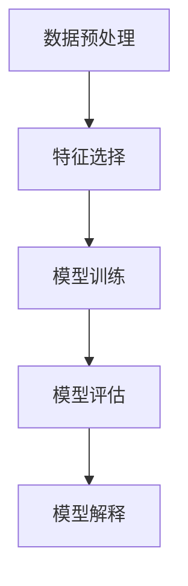
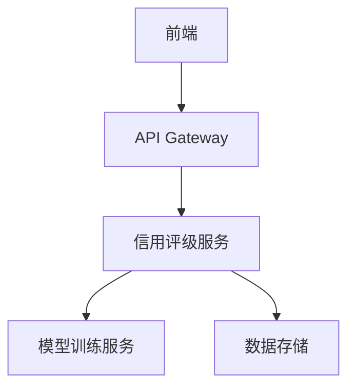

                 


# AI辅助的企业信用评级模型解释性研究

> 关键词：企业信用评级，AI辅助，可解释性，机器学习模型，金融风险管理

> 摘要：本文探讨了AI技术在企业信用评级中的应用，分析了传统信用评级的局限性，介绍了基于机器学习的AI辅助信用评级模型的构建过程，重点研究了模型的可解释性问题，并通过实际案例展示了模型的应用价值。本文旨在为金融领域的信用评级提供一种新的思路，同时为AI技术在金融风险管理中的应用提供理论支持和实践指导。

---

## 第1章: 企业信用评级与AI辅助的背景介绍

### 1.1 企业信用评级的定义与作用

#### 1.1.1 企业信用评级的基本概念
企业信用评级是指通过对企业的财务状况、经营能力、管理能力、行业风险等因素进行综合评估，确定企业偿还债务的能力和风险等级。信用评级结果通常以等级形式表示（如AAA、AA、A、BBB、BB、B、CCC、CC、C、D），等级越高，表示企业的信用风险越小。

#### 1.1.2 信用评级在金融领域的核心作用
信用评级是金融风险管理的重要工具，它帮助银行、投资者和其他金融机构评估企业的信用风险，从而做出贷款、投资等决策。信用评级结果直接影响企业的融资成本和市场准入。

#### 1.1.3 信用评级对企业融资的影响
良好的信用评级可以帮助企业获得更低的贷款利率和更长的贷款期限，而低信用评级的企业则可能面临高昂的融资成本或被拒贷的风险。

### 1.2 AI在信用评级中的应用背景

#### 1.2.1 传统信用评级方法的局限性
传统信用评级方法主要依赖于财务指标和少量的定性分析，存在以下问题：
- 数据维度有限，难以捕捉企业的多维风险特征。
- 人工分析主观性强，难以保证客观性和一致性。
- 无法处理非结构化数据（如文本、图像等）。
- 难以实时更新和动态评估企业信用状况。

#### 1.2.2 AI技术在金融领域的潜力
人工智能技术（如机器学习、深度学习、自然语言处理等）在金融领域的广泛应用，为信用评级带来了新的可能性。AI技术可以处理海量数据，提取非直观的特征，并通过复杂模型捕捉数据中的潜在规律。

#### 1.2.3 AI辅助信用评级的必要性
随着企业经营环境的复杂化，传统的信用评级方法已难以满足金融机构的需求。AI技术的应用可以帮助金融机构更准确地评估企业信用风险，提高决策效率，降低人为错误。

### 1.3 问题背景与目标

#### 1.3.1 当前信用评级的主要挑战
- 数据维度不足，难以全面反映企业的信用状况。
- 传统模型的可解释性较差，难以满足监管要求。
- 企业信用状况动态变化，需要实时更新评估。

#### 1.3.2 问题的边界与外延
本文聚焦于AI辅助的企业信用评级模型，主要解决以下问题：
- 如何利用AI技术提高信用评级的准确性和效率。
- 如何确保模型的可解释性，满足监管和用户需求。
- 如何实现模型的动态更新和实时评估。

#### 1.3.3 本书的研究目标与意义
本文旨在探索一种基于AI技术的企业信用评级模型，结合传统的财务指标和非结构化数据，构建一个高效、可解释、动态更新的信用评级系统，为金融机构提供更可靠的信用评估工具。

### 1.4 本章小结
本章介绍了企业信用评级的基本概念和作用，分析了传统信用评级方法的局限性，探讨了AI技术在信用评级中的应用潜力，明确了本文的研究目标和意义。

---

## 第2章: 核心概念与原理

### 2.1 AI辅助信用评级的核心概念

#### 2.1.1 数据特征与模型特征
- **数据特征**：包括企业的财务数据（如收入、利润、负债等）、行业数据、市场数据、管理团队信息、新闻舆情等。
- **模型特征**：包括模型的输入特征、权重、决策边界等。

#### 2.1.2 可解释性与不可解释性
- **可解释性**：模型的决策过程可以被人类理解，例如逻辑回归模型可以通过系数解释各特征对信用评级的影响。
- **不可解释性**：模型的决策过程难以被人类理解，例如深度神经网络模型。

#### 2.1.3 信用评级的关键指标
- 信用评分（Credit Score）
- 信用等级（Credit Rating）
- 信用风险（Credit Risk）

### 2.2 核心概念的联系与对比

#### 2.2.1 数据特征与模型特征的对比表格
| 数据特征                | 模型特征                |
|-------------------------|-------------------------|
| 收入                    | 模型权重               |
| 利润                    | 模型输入特征           |
| 负债                    | 模型决策边界           |

#### 2.2.2 实体关系图（ER图）架构
```mermaid
erd
    简单的ER模型，展示企业信用评级的核心实体和关系
```

### 2.3 本章小结
本章详细阐述了AI辅助信用评级的核心概念，包括数据特征、模型特征、可解释性与不可解释性等，并通过对比表格和ER图展示了核心概念之间的联系。

---

## 第3章: 算法原理与实现

### 3.1 选择适合的算法

#### 3.1.1 逻辑回归与XGBoost的对比
| 特性                | 逻辑回归                | XGBoost                |
|---------------------|-------------------------|-------------------------|
| 可解释性             | 高                     | 中                     |
| 处理非线性关系       | 低                     | 高                     |
| 对异常值的鲁棒性     | 低                     | 高                     |

#### 3.1.2 模型可解释性的实现方法
- 逻辑回归模型可以通过系数解释各特征对信用评级的影响。
- XGBoost模型可以通过特征重要性分析解释各特征的影响程度。

### 3.2 算法流程图



### 3.3 算法实现代码

#### 3.3.1 数据加载与预处理
```python
import pandas as pd
data = pd.read_csv('credit_data.csv')
data = data.dropna()
```

#### 3.3.2 模型训练与评估
```python
from sklearn.model_selection import train_test_split
from sklearn.linear_model import LogisticRegression
from sklearn.metrics import accuracy_score

X_train, X_test, y_train, y_test = train_test_split(data.drop('rating', axis=1), data['rating'], test_size=0.2)
model = LogisticRegression()
model.fit(X_train, y_train)
y_pred = model.predict(X_test)
print("Accuracy:", accuracy_score(y_test, y_pred))
```

#### 3.3.3 模型解释性分析
```python
coefficients = pd.DataFrame({
    'feature': data.columns[:-1],
    'coefficient': model.coef_[0]
})
print(coefficients)
```

### 3.4 数学模型与公式

#### 3.4.1 逻辑回归模型公式
$$ P(y=1|x) = \frac{e^{\beta_0 + \beta_1 x_1 + \beta_2 x_2}}{1 + e^{\beta_0 + \beta_1 x_1 + \beta_2 x_2}} $$

#### 3.4.2 XGBoost损失函数公式
$$ \text{损失函数} = \sum_{i=1}^{n} \left( y_i - \hat{y}_i \right)^2 $$

### 3.5 本章小结
本章介绍了AI辅助信用评级中常用的算法，包括逻辑回归和XGBoost，并详细讲解了算法的实现过程和数学模型。

---

## 第4章: 系统分析与架构设计

### 4.1 问题场景介绍

#### 4.1.1 信用评级系统的需求分析
- 数据输入：企业财务数据、行业数据、市场数据等。
- 模型训练：基于历史数据训练信用评级模型。
- 模型部署：将模型部署到生产环境中，实时评估企业信用状况。

#### 4.1.2 系统目标与功能概述
- 提供企业信用评级服务。
- 支持动态更新和实时评估。
- 提供模型可解释性报告。

### 4.2 系统功能设计

#### 4.2.1 领域模型类图
```mermaid
classDiagram
    简单的领域模型类图，展示企业信用评级系统的核心组件和关系
```

#### 4.2.2 系统架构设计


### 4.3 本章小结
本章通过系统分析和架构设计，明确了企业信用评级系统的功能需求和实现方案。

---

## 第5章: 项目实战

### 5.1 环境安装与配置

#### 5.1.1 安装Python和必要的库
```bash
pip install pandas numpy scikit-learn xgboost
```

#### 5.1.2 数据集准备
下载企业信用评级数据集（如Kaggle上的公开数据集）。

### 5.2 系统核心实现

#### 5.2.1 数据预处理
```python
import pandas as pd
data = pd.read_csv('credit_data.csv')
data = data.dropna()
```

#### 5.2.2 模型训练
```python
from sklearn.model_selection import train_test_split
from sklearn.linear_model import LogisticRegression

X_train, X_test, y_train, y_test = train_test_split(data.drop('rating', axis=1), data['rating'], test_size=0.2)
model = LogisticRegression()
model.fit(X_train, y_train)
```

#### 5.2.3 模型解释
```python
coefficients = pd.DataFrame({
    'feature': data.columns[:-1],
    'coefficient': model.coef_[0]
})
print(coefficients)
```

### 5.3 案例分析与结果解读

#### 5.3.1 实际案例分析
假设我们有一个企业的财务数据，通过模型预测其信用等级。

#### 5.3.2 结果解读
- 如果模型预测结果与实际结果一致，说明模型表现良好。
- 如果模型预测结果与实际结果不符，需要检查数据或模型的参数设置。

### 5.4 本章小结
本章通过实际案例展示了AI辅助信用评级模型的实现过程和应用价值。

---

## 第6章: 最佳实践与注意事项

### 6.1 最佳实践

#### 6.1.1 数据预处理
- 清洗数据，处理缺失值和异常值。
- 标准化或归一化数据。

#### 6.1.2 模型选择
- 根据问题需求选择合适的算法。
- 对比不同算法的性能和可解释性。

#### 6.1.3 模型解释
- 提供模型解释性报告，帮助用户理解模型的决策过程。
- 使用可视化工具展示模型的特征重要性。

### 6.2 注意事项

#### 6.2.1 数据隐私与安全
- 确保数据的安全性和隐私性，遵守相关法律法规。

#### 6.2.2 模型的可解释性
- 确保模型的可解释性，满足监管和用户需求。

#### 6.2.3 模型的动态更新
- 定期更新模型，确保模型的准确性和及时性。

### 6.3 本章小结
本章总结了AI辅助信用评级模型的最佳实践和注意事项，帮助读者更好地理解和应用本文提出的方法。

---

## 第7章: 小结与展望

### 7.1 小结
本文详细探讨了AI辅助企业信用评级模型的构建过程，分析了传统信用评级方法的局限性，介绍了基于机器学习的AI辅助信用评级模型的实现方法，并通过实际案例展示了模型的应用价值。

### 7.2 展望
未来，随着AI技术的不断发展，企业信用评级模型将更加智能化和动态化。同时，模型的可解释性问题也将得到进一步的研究和改进。

---

## 作者信息

作者：AI天才研究院/AI Genius Institute & 禅与计算机程序设计艺术 /Zen And The Art of Computer Programming

---

这篇文章涵盖了从理论到实践的各个方面，详细介绍了AI辅助企业信用评级模型的构建过程和应用价值，为金融领域的信用评级提供了新的思路和方法。

