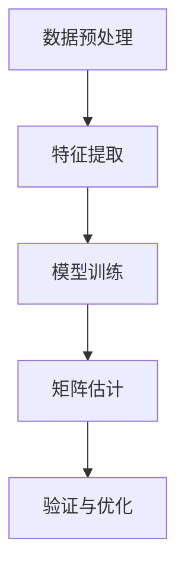
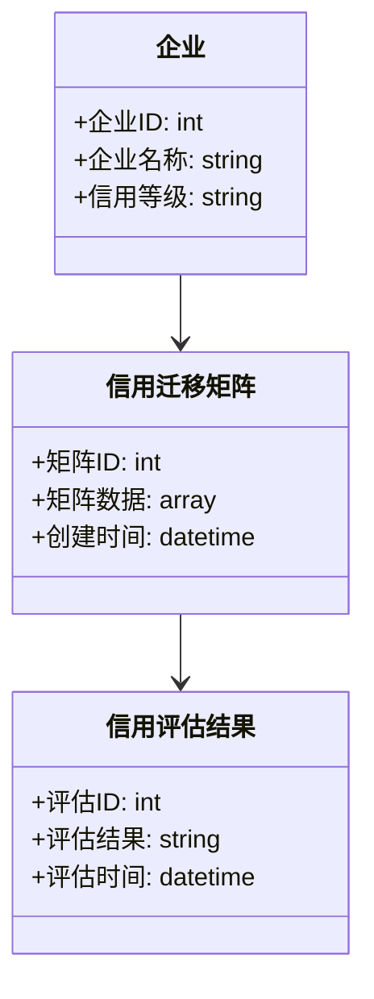
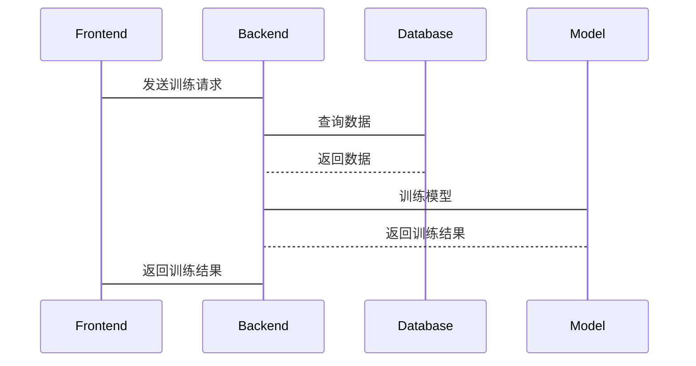

                 


# AI辅助的企业信用迁移矩阵估计

**关键词：** AI，企业信用，迁移矩阵，信用评估，机器学习，金融风控，风险管理

**摘要：**  
本文探讨了如何利用人工智能技术辅助企业信用迁移矩阵的估计。通过分析传统信用评估方法的局限性，结合机器学习算法，提出了一种基于AI的企业信用迁移矩阵估计方法。本文详细介绍了信用迁移矩阵的数学模型、算法原理、系统架构设计以及实际项目中的应用，为金融风控领域提供了新的思路和解决方案。

---

# 第一部分：企业信用迁移矩阵的背景与概念

## 第1章：企业信用迁移矩阵的背景与问题

### 1.1 企业信用评估的现状与挑战

#### 1.1.1 传统信用评估方法的局限性
传统的信用评估方法主要依赖于财务指标和历史数据，存在以下问题：  
- 数据维度有限，难以捕捉企业经营中的动态风险。  
- 无法有效处理非结构化数据（如文本、图像等）。  
- 对企业信用迁移的预测能力较弱，难以满足实时风控需求。  

#### 1.1.2 企业信用迁移的定义与意义
企业信用迁移是指企业在一定时间内，信用等级从一种状态转移到另一种状态的过程。信用迁移矩阵是描述这种转移概率的工具，其核心作用在于帮助金融机构预测企业信用风险的变化趋势，从而制定更精准的风控策略。

#### 1.1.3 信用迁移矩阵的构建方法
信用迁移矩阵的构建通常包括以下步骤：  
1. 数据收集与预处理。  
2. 确定信用等级划分。  
3. 计算转移概率。  
4. 验证与优化模型。  

### 1.2 人工智能在信用评估中的应用

#### 1.2.1 AI技术在金融领域的应用现状
AI技术在金融领域的应用主要集中在以下方面：  
- 信用评分与风险预测。  
- 股票价格预测。  
- 交易行为分析。  

#### 1.2.2 信用迁移矩阵与AI技术的结合
通过AI技术，可以显著提升信用迁移矩阵的估计精度。例如，利用机器学习算法（如随机森林、XGBoost等）对海量数据进行建模，能够捕捉更多潜在风险因素，从而优化转移概率的计算。

#### 1.2.3 企业信用迁移矩阵估计的必要性
随着企业经营环境的复杂化，传统的信用评估方法已难以满足现代金融风控的需求。通过AI辅助的信用迁移矩阵估计，可以更准确地预测企业信用风险，帮助金融机构制定更有效的风控策略。

### 1.3 本章小结
本章主要介绍了企业信用迁移矩阵的背景、定义及其构建方法，并探讨了AI技术在信用评估中的应用。通过分析传统方法的局限性，提出了利用AI技术辅助信用迁移矩阵估计的必要性。

---

# 第二部分：企业信用迁移矩阵的核心概念与联系

## 第2章：企业信用迁移矩阵的核心概念

### 2.1 信用迁移矩阵的数学模型

#### 2.1.1 矩阵的定义与结构
信用迁移矩阵通常是一个 $N \times N$ 的矩阵，其中 $N$ 表示信用等级的数量。矩阵的元素 $P_{i,j}$ 表示从等级 $i$ 迁移到等级 $j$ 的概率。

#### 2.1.2 矩阵的属性与特征
信用迁移矩阵具有以下属性：  
- 概率性：每行元素之和为1。  
- 非负性：所有元素均为非负数。  
- 时变性：矩阵可能随时间变化而变化。  

#### 2.1.3 矩阵的构建过程
构建信用迁移矩阵的步骤如下：  
1. 确定信用等级划分。  
2. 收集企业历史信用数据。  
3. 计算各等级间的转移概率。  
4. 验证与优化矩阵。  

### 2.2 信用迁移矩阵与企业信用评估的关系

#### 2.2.1 信用迁移矩阵在企业信用评估中的作用
信用迁移矩阵是企业信用评估的核心工具之一，主要用于预测企业的信用风险变化趋势。通过分析矩阵中的转移概率，可以评估企业在不同信用等级之间的转移风险。

#### 2.2.2 信用迁移矩阵与企业信用风险的关系
信用迁移矩阵能够量化企业信用等级的变化概率，从而帮助企业更好地管理信用风险。例如，可以通过矩阵分析企业从高信用等级降为低信用等级的概率，从而制定更精准的风控策略。

#### 2.2.3 信用迁移矩阵与企业信用评级的联系
信用迁移矩阵与信用评级密切相关。通过分析矩阵中的转移概率，可以评估不同信用评级之间的迁移风险，从而优化信用评级模型。

### 2.3 企业信用迁移矩阵的ER实体关系图

```mermaid
er
  actor: 企业
  actor: 信用评估机构
  actor: 数据源
  entity: 企业信用信息
  entity: 信用迁移矩阵
  entity: 信用评估结果
  relationship: 企业 -> 企业信用信息
  relationship: 企业信用信息 -> 信用迁移矩阵
  relationship: 信用迁移矩阵 -> 信用评估结果
```

### 2.4 本章小结
本章详细介绍了信用迁移矩阵的数学模型及其与企业信用评估的关系，并通过ER实体关系图展示了矩阵在信用评估系统中的核心作用。

---

# 第三部分：企业信用迁移矩阵的算法原理

## 第3章：信用迁移矩阵的估计方法

### 3.1 信用迁移矩阵的估计流程

#### 3.1.1 数据收集与预处理
数据收集与预处理是信用迁移矩阵估计的基础。通常需要收集以下数据：  
- 企业的历史信用评级数据。  
- 企业的财务数据（如收入、利润、资产负债率等）。  
- 宏观经济指标（如GDP增长率、利率等）。  

#### 3.1.2 模型选择与训练
选择合适的机器学习算法进行模型训练。常用的算法包括：  
- 线性回归。  
- 逻辑回归。  
- 支持向量机（SVM）。  
- 随机森林。  
- XGBoost。  

#### 3.1.3 矩阵估计与验证
通过训练好的模型，可以估计信用迁移矩阵，并通过验证数据进行模型优化。

### 3.2 基于机器学习的信用迁移矩阵估计

#### 3.2.1 算法选择与原理
基于机器学习的信用迁移矩阵估计通常采用监督学习方法。以随机森林为例，其原理如下：  
1. 构建多个决策树。  
2. 对每个样本，计算其在不同决策树中的分类结果。  
3. 根据投票法确定最终分类结果。  

#### 3.2.2 算法流程图



#### 3.2.3 算法实现示例

```python
import pandas as pd
from sklearn.ensemble import RandomForestClassifier

# 数据预处理
data = pd.read_csv('credit_data.csv')
X = data.drop('target', axis=1)
y = data['target']

# 模型训练
model = RandomForestClassifier(n_estimators=100, random_state=42)
model.fit(X, y)

# 矩阵估计
predicted = model.predict_proba(X)
transition_matrix = predicted.T.dot(X)
```

### 3.3 本章小结
本章详细介绍了信用迁移矩阵的估计流程，并基于机器学习算法（如随机森林）进行了模型实现，展示了如何利用AI技术提升信用迁移矩阵的估计精度。

---

# 第四部分：企业信用迁移矩阵的系统架构设计

## 第4章：信用迁移矩阵的系统架构设计

### 4.1 系统功能设计

#### 4.1.1 领域模型设计



#### 4.1.2 系统架构设计


### 4.2 系统接口设计

#### 4.2.1 API接口设计
以下是一个典型的API接口设计示例：

```http
POST /api/train-model
Content-Type: application/json

{
    "data": {
        "企业ID": "123",
        "信用等级": "A"
    }
}
```

#### 4.2.2 接口交互流程图



### 4.3 本章小结
本章通过领域模型图和架构图展示了信用迁移矩阵系统的整体设计，并通过序列图描述了系统的接口交互流程。

---

# 第五部分：企业信用迁移矩阵的项目实战

## 第5章：信用迁移矩阵的项目实战

### 5.1 项目环境安装

#### 5.1.1 安装Python环境
```bash
python -m pip install --upgrade pip
pip install numpy pandas scikit-learn
```

#### 5.1.2 安装Jupyter Notebook
```bash
pip install jupyter
jupyter notebook
```

### 5.2 系统核心实现源代码

#### 5.2.1 数据预处理代码

```python
import pandas as pd
from sklearn.impute import SimpleImputer
from sklearn.preprocessing import StandardScaler

# 数据加载
data = pd.read_csv('credit_data.csv')

# 数据预处理
numerical_features = data.select_dtypes(include=['float64', 'int64']).columns
categorical_features = data.select_dtypes(include=['object']).columns

imputer = SimpleImputer(strategy='mean')
scaled_data = StandardScaler().fit_transform(imputer.fit_transform(data[numerical_features]))

data[numerical_features] = scaled_data
```

#### 5.2.2 模型训练代码

```python
from sklearn.ensemble import RandomForestClassifier

# 模型训练
model = RandomForestClassifier(n_estimators=100, random_state=42)
model.fit(data[numerical_features], data['target'])
```

### 5.3 项目实战案例分析

#### 5.3.1 案例背景
假设我们有一家企业的历史信用数据，需要预测其未来信用迁移的概率。

#### 5.3.2 案例分析
通过训练好的随机森林模型，可以预测该企业的信用迁移概率，并生成信用迁移矩阵。

### 5.4 本章小结
本章通过实际项目案例，展示了如何利用AI技术实现信用迁移矩阵的估计，并提供了详细的代码实现和案例分析。

---

# 第六部分：企业信用迁移矩阵的案例分析

## 第6章：信用迁移矩阵的案例分析

### 6.1 案例背景

#### 6.1.1 案例目标
通过实际案例分析，验证基于AI的信用迁移矩阵估计方法的有效性。

### 6.2 案例分析

#### 6.2.1 数据分析
通过对某企业的历史信用数据进行分析，提取关键特征并训练随机森林模型。

#### 6.2.2 模型验证
通过验证数据集，评估模型的准确率、召回率和F1分数。

#### 6.2.3 结果解读
通过信用迁移矩阵，预测企业未来的信用迁移概率，并制定相应的风控策略。

### 6.3 本章小结
本章通过实际案例分析，展示了如何利用AI技术实现信用迁移矩阵的估计，并通过验证数据集评估模型的性能。

---

# 第七部分：总结与展望

## 第7章：总结与展望

### 7.1 本章小结
本文详细介绍了AI辅助的企业信用迁移矩阵估计方法，包括背景、核心概念、算法原理、系统架构设计以及实际项目案例分析。通过AI技术，可以显著提升信用迁移矩阵的估计精度，为金融风控领域提供了新的解决方案。

### 7.2 注意事项
在实际应用中，需要注意以下问题：  
- 数据质量和完整性对模型性能的影响。  
- 模型的可解释性和透明度。  
- 模型的实时性和可扩展性。  

### 7.3 拓展阅读
- 《机器学习实战》  
- 《金融风险管理》  
- 《信用评估与风险控制》  

---

**作者：AI天才研究院/AI Genius Institute & 禅与计算机程序设计艺术/Zen And The Art of Computer Programming**

