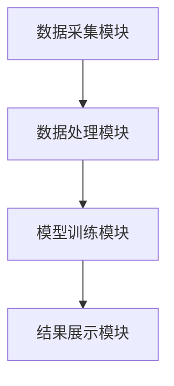

                 


# AI辅助的企业信用风险评估

## 关键词：AI技术、信用风险评估、机器学习、企业信用评分、风险管理

## 摘要：  
本文详细探讨了AI技术在企业信用风险评估中的应用，分析了传统信用评估方法的局限性，并介绍了基于AI的信用风险评估的核心概念、算法原理和系统架构设计。文章通过实际项目案例，展示了如何利用AI技术提升信用风险评估的准确性和效率，并对未来的发展方向进行了展望。

---

## 第1章: 信用风险评估的基本概念

### 1.1 信用风险的定义与特征

信用风险是指在信用交易中，由于债务人或交易对手无法履行其合同义务而可能导致债权人或投资者遭受损失的风险。在企业信用风险评估中，主要关注的是企业的偿债能力和意愿。以下是信用风险的主要特征：

- **可测量性**：信用风险可以通过定量指标（如财务比率、信用评分）进行量化。
- **相关性**：信用风险与企业的经营状况、财务状况密切相关。
- **动态性**：信用风险会随着市场环境的变化而变化，需要持续监测和评估。

### 1.2 AI技术在信用风险评估中的作用

AI技术通过大数据分析和机器学习算法，能够从海量数据中提取有价值的信息，帮助评估企业信用风险。以下是AI技术在信用风险评估中的主要作用：

- **数据处理能力**：AI能够处理结构化和非结构化数据，如财务报表、新闻舆情、社交数据等。
- **模式识别**：AI能够识别复杂的数据模式，发现潜在的风险因素。
- **实时监控**：AI可以实现对企业信用状况的实时监控和预警。

### 1.3 企业信用风险评估的背景与挑战

随着全球经济的快速发展，企业之间的信用交易日益频繁。然而，传统的信用风险评估方法存在以下挑战：

- **数据维度不足**：传统方法主要依赖财务数据，难以捕捉非财务风险因素。
- **人工成本高**：传统评估方法需要大量人工审核，效率低下。
- **模型泛化能力弱**：传统模型在面对复杂多变的市场环境时，泛化能力较弱。

---

## 第2章: AI辅助信用风险评估的核心概念

### 2.1 信用风险评估的核心要素

企业信用风险评估的核心要素包括以下几个方面：

- **财务状况**：包括资产负债表、利润表、现金流等财务数据。
- **经营状况**：包括企业所在行业的竞争状况、市场地位、供应链稳定性等。
- **信用历史**：包括企业过去的信用记录、违约历史等。

### 2.2 AI技术在信用风险评估中的核心算法

AI技术在信用风险评估中主要采用以下算法：

- **逻辑回归**：用于分类问题，适合二分类场景。
- **随机森林**：基于决策树的集成算法，适合特征较多的场景。
- **神经网络**：能够处理非线性关系，适合复杂的数据模式。

### 2.3 数据特征工程在信用风险评估中的作用

数据特征工程是信用风险评估的关键步骤，主要包括以下内容：

- **特征选择**：根据业务逻辑选择重要的特征。
- **特征提取**：通过数学方法从原始数据中提取有用的特征。
- **特征变换**：对特征进行标准化、归一化等处理。

---

## 第3章: AI辅助信用风险评估的算法原理

### 3.1 逻辑回归算法

逻辑回归是一种常用的分类算法，适用于二分类问题。其数学模型如下：

$$ P(y=1|x) = \frac{e^{\beta_0 + \beta_1x}}{1 + e^{\beta_0 + \beta_1x}} $$

其中，$\beta_0$ 和 $\beta_1$ 是模型的参数，$x$ 是输入特征，$y$ 是输出标签。

### 3.2 随机森林算法

随机森林是一种基于决策树的集成算法，通过随机采样和特征选择来提高模型的泛化能力。其数学模型如下：

$$ y = \text{sign}\left(\sum_{i=1}^{n} \text{tree}_i(x)\right) $$

其中，$\text{tree}_i(x)$ 是第$i$棵决策树的输出。

### 3.3 神经网络算法

神经网络是一种模拟人脑神经网络的算法，能够处理复杂的非线性关系。其数学模型如下：

$$ y = \sigma(Wx + b) $$

其中，$W$ 是权重矩阵，$x$ 是输入特征，$b$ 是偏置，$\sigma$ 是激活函数。

---

## 第4章: 信用风险评估的系统架构设计

### 4.1 系统架构设计概述

信用风险评估系统的架构设计需要考虑数据采集、处理、建模和部署等多个环节。以下是一个典型的系统架构设计：



### 4.2 系统功能设计

信用风险评估系统的主要功能模块包括：

- **数据采集模块**：负责采集企业的财务数据、市场数据等。
- **数据处理模块**：对数据进行清洗、特征工程和标准化处理。
- **模型训练模块**：基于处理后的数据，训练机器学习模型。
- **结果展示模块**：将模型的输出结果以可视化的方式展示给用户。

### 4.3 系统实现细节

以下是一个简单的Python代码示例，展示了如何实现逻辑回归模型：

```python
import pandas as pd
from sklearn.linear_model import LogisticRegression
from sklearn.metrics import accuracy_score

# 数据加载
data = pd.read_csv('credit_risk.csv')

# 特征与标签分离
X = data.drop('target', axis=1)
y = data['target']

# 模型训练
model = LogisticRegression()
model.fit(X, y)

# 模型预测
y_pred = model.predict(X)

# 模型评估
print('准确率:', accuracy_score(y, y_pred))
```

---

## 第5章: AI辅助信用风险评估的项目实战

### 5.1 项目背景与目标

本项目旨在利用AI技术构建一个企业信用风险评估系统，帮助金融机构提高信用评估的效率和准确性。

### 5.2 项目环境与工具安装

项目环境配置如下：

- **操作系统**：Linux/Windows/MacOS
- **编程语言**：Python 3.8+
- **工具安装**：安装Pandas、Scikit-learn、Matplotlib等库。

### 5.3 系统核心实现

以下是一个完整的Python代码示例，展示了如何实现信用风险评估系统的核心功能：

```python
import pandas as pd
from sklearn.ensemble import RandomForestClassifier
from sklearn.metrics import classification_report

# 数据加载
data = pd.read_csv('credit_risk.csv')

# 特征与标签分离
X = data.drop('target', axis=1)
y = data['target']

# 特征工程
# 假设我们已经进行了特征选择和标准化处理
processed_X = data_preprocessing(X)

# 模型训练
model = RandomForestClassifier(n_estimators=100, max_depth=5)
model.fit(processed_X, y)

# 模型预测
y_pred = model.predict(processed_X)

# 模型评估
print(classification_report(y, y_pred))
```

### 5.4 项目案例分析

通过一个实际案例分析，展示了如何利用AI技术评估企业的信用风险：

- **案例背景**：某制造企业最近财务状况恶化，可能面临违约风险。
- **数据准备**：收集该企业的财务数据、市场数据和信用历史。
- **模型训练**：使用随机森林模型进行训练。
- **结果分析**：模型预测该企业的违约概率为70%，建议金融机构加强监控。

---

## 第6章: 总结与展望

### 6.1 本章小结

本文详细探讨了AI技术在企业信用风险评估中的应用，介绍了核心概念、算法原理和系统架构设计，并通过项目实战展示了AI技术的实际应用价值。

### 6.2 未来展望

随着AI技术的不断发展，企业信用风险评估将更加智能化和自动化。未来的研究方向包括：

- **多模态数据融合**：结合文本、图像等多种数据源进行信用评估。
- **实时监控与预警**：利用流数据处理技术实现信用风险的实时监控。
- **模型可解释性**：提高模型的可解释性，增强用户的信任度。

---

## 作者：AI天才研究院/AI Genius Institute & 禅与计算机程序设计艺术 /Zen And The Art of Computer Programming

