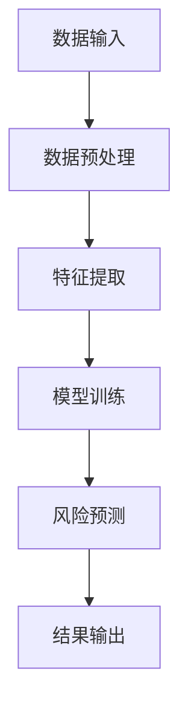
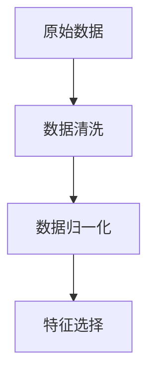
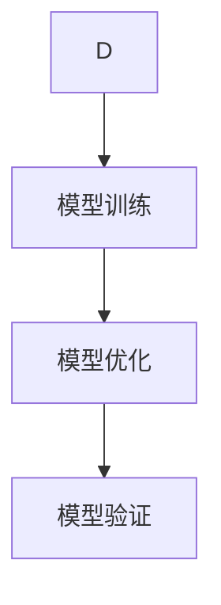

                 


# AI辅助的企业并购整合风险评估模型

## 关键词：AI, 企业并购, 风险评估, 机器学习, 数据分析, 并购整合, 系统架构

## 摘要：  
随着企业并购活动的频繁发生，如何有效评估并购整合中的风险成为企业战略决策的关键。本文提出了一种基于AI辅助的企业并购整合风险评估模型，通过机器学习算法和数据分析技术，帮助企业识别和量化并购整合中的潜在风险。文章详细介绍了模型的构建过程，包括数据预处理、特征提取、模型训练与优化、结果解读等，并通过实际案例展示了模型的应用效果。本文旨在为企业提供一种高效、智能的并购整合风险评估方法。

---

## 第1章：企业并购整合的背景与问题背景

### 1.1 企业并购整合的背景

#### 1.1.1 企业并购的定义与特点
企业并购是指一个企业通过购买其他企业的股权或资产，以实现资本扩张和战略重组的过程。并购整合则是指在并购后，将两家企业的资源、业务流程和组织结构进行整合，以实现协同效应和价值最大化。

企业并购的特点包括：
- **战略驱动**：并购通常是为了获取技术、市场、资源或竞争优势。
- **复杂性**：整合过程涉及组织文化、业务流程、人员等多个方面的协调。
- **高风险**：并购失败的概率较高，主要原因包括文化冲突、管理不善和战略偏差等。

#### 1.1.2 企业并购整合的必要性
企业并购整合的目的是为了实现：
- **协同效应**：通过资源整合，降低成本，提高效率。
- **价值创造**：通过优化资源配置，提升企业整体价值。
- **风险控制**：通过整合，降低企业因并购而产生的各种风险。

#### 1.1.3 并购整合中的风险类型
并购整合中的风险主要分为以下几类：
- **市场风险**：整合后的企业是否能够适应市场变化。
- **运营风险**：整合过程中是否会出现业务流程不畅的问题。
- **文化风险**：不同企业文化的冲突可能导致员工不满或效率低下。
- **财务风险**：整合过程中可能面临财务黑洞或资产减值。

---

### 1.2 传统并购整合风险评估的挑战

#### 1.2.1 传统评估方法的局限性
传统的并购整合风险评估方法主要依赖于财务指标和定性分析，存在以下问题：
- **数据不足**：难以全面覆盖企业整合过程中可能遇到的各种风险。
- **主观性**：评估结果受到评估人员主观判断的影响。
- **效率低下**：手工评估耗时长，难以应对大规模并购项目。

#### 1.2.2 数据获取与处理的难点
并购整合涉及大量的内外部数据，包括财务数据、业务数据、市场数据等。传统的数据处理方法存在以下问题：
- **数据孤岛**：企业内部数据分散在不同部门，难以统一整合。
- **数据质量**：数据可能存在缺失、重复或不一致的问题。
- **数据安全**：并购涉及敏感数据，如何确保数据安全是一个重要问题。

#### 1.2.3 人工评估的效率与准确性问题
人工评估的效率低下，且容易受到人为因素的影响，导致评估结果不够准确。例如：
- **主观判断**：评估人员可能因为经验不足或判断失误，导致评估结果偏差。
- **时间限制**：在复杂并购项目中，人工评估难以在短时间内完成。

---

### 1.3 AI技术在并购整合中的应用前景

#### 1.3.1 AI技术的核心优势
AI技术的核心优势在于其强大的数据处理能力和自动化能力，能够帮助企业更高效地进行风险评估。具体包括：
- **数据驱动**：AI能够处理海量数据，发现数据中的潜在规律。
- **自动化**：AI可以自动化完成数据处理、模型训练和结果预测。
- **高精度**：通过机器学习算法，AI能够提高风险评估的准确性。

#### 1.3.2 AI在风险评估中的潜在价值
AI在并购整合风险评估中的潜在价值包括：
- **提高效率**：通过自动化数据处理和模型训练，缩短评估时间。
- **降低风险**：通过精准的数据分析，发现潜在风险点，避免并购失败。
- **优化决策**：通过数据驱动的决策支持，帮助企业做出更明智的并购决策。

#### 1.3.3 当前研究与实践的现状
目前，AI在企业并购整合风险评估中的应用还处于初级阶段，但已经取得了一些进展。例如：
- **学术研究**：一些学者开始尝试将机器学习算法应用于并购风险评估。
- **商业实践**：部分企业已经开始尝试使用AI技术进行并购整合的初步评估。

---

## 第2章：企业并购整合风险评估的核心概念与联系

### 2.1 核心概念与定义

#### 2.1.1 并购整合风险的定义
并购整合风险是指在企业并购过程中，由于整合失败而导致企业价值下降或出现财务损失的可能性。

#### 2.1.2 风险评估的定义与分类
风险评估是指通过分析潜在风险，预测其发生概率和影响程度的过程。根据风险的来源，可以将风险分为：
- **市场风险**：与市场环境相关的风险。
- **运营风险**：与企业内部运营相关的风险。
- **财务风险**：与企业财务状况相关的风险。

#### 2.1.3 AI辅助评估的定义
AI辅助评估是指利用人工智能技术，通过数据分析和机器学习算法，辅助企业进行并购整合风险评估的过程。

---

### 2.2 核心概念的属性特征对比

#### 2.2.1 并购整合风险的关键属性
- **潜在性**：风险可能尚未显现，但已经存在。
- **复杂性**：风险可能涉及多个因素，且相互关联。
- **可量化性**：风险可以通过数据进行量化评估。

#### 2.2.2 AI辅助评估的核心属性
- **数据驱动性**：依赖于大量数据的输入。
- **自动化**：能够自动完成数据处理和模型训练。
- **可扩展性**：能够处理大规模数据。

#### 2.2.3 对比分析与表格展示

| 属性       | 并购整合风险          | AI辅助评估          |
|------------|----------------------|---------------------|
| 数据来源   | 财务数据、业务数据    | 结构化数据、非结构化数据 |
| 处理方式   | 手工分析             | 自动化分析           |
| 精度       | 受主观因素影响较大     | 较高                 |
| 效率       | 低                   | 高                   |

---

### 2.3 实体关系图与流程图

#### 2.3.1 ER实体关系图展示
```mermaid
erDiagram
    customer[CUSTOMER] {
        code    : string
        name    : string
        address : string
    }
    risk_assessment[RISK_ASSESSMENT] {
        id       : integer
        risk_type : string
        probability : float
        impact    : float
    }
    ai_model[AI_MODEL] {
        model_id : integer
        algorithm : string
        training_data : string
    }
    CUSTOMER o- risk_assessment
    risk_assessment o- ai_model
```

#### 2.3.2 AI辅助评估的流程图


---

## 第3章：算法原理与流程

### 3.1 算法原理概述

#### 3.1.1 数据预处理与特征提取
数据预处理是AI辅助评估的第一步，主要包括：
- **数据清洗**：去除无效数据，处理缺失值。
- **数据归一化**：将数据标准化，以便模型训练。
- **特征选择**：从大量数据中提取对风险评估有用的特征。

#### 3.1.2 模型训练与优化
模型训练是AI辅助评估的核心，主要包括：
- **选择算法**：根据数据特点选择合适的算法，例如逻辑回归、随机森林等。
- **训练模型**：使用训练数据训练模型，调整模型参数，优化模型性能。
- **验证模型**：通过交叉验证等方法评估模型的准确性和稳定性。

#### 3.1.3 结果预测与评估
结果预测是AI辅助评估的最后一步，主要包括：
- **风险预测**：使用训练好的模型预测并购整合中的潜在风险。
- **结果评估**：通过准确率、召回率等指标评估模型的预测效果。

---

### 3.2 算法流程图

#### 3.2.1 数据预处理流程图


#### 3.2.2 模型训练流程图


---

### 3.3 算法实现代码

#### 3.3.1 数据预处理代码
```python
import pandas as pd
from sklearn.preprocessing import StandardScaler

# 读取数据
data = pd.read_csv('并购数据.csv')

# 数据清洗
data.dropna(inplace=True)

# 数据归一化
scaler = StandardScaler()
scaled_data = scaler.fit_transform(data)
```

#### 3.3.2 模型训练代码
```python
from sklearn.ensemble import RandomForestClassifier

# 特征选择
features = data.drop('风险标签', axis=1)
labels = data['风险标签']

# 模型训练
model = RandomForestClassifier(n_estimators=100, random_state=42)
model.fit(features, labels)
```

#### 3.3.3 结果评估代码
```python
from sklearn.metrics import accuracy_score, recall_score

# 预测结果
y_pred = model.predict(features)

# 评估指标
accuracy = accuracy_score(labels, y_pred)
recall = recall_score(labels, y_pred)
print(f'准确率：{accuracy}\n召回率：{recall}')
```

---

## 第4章：数学模型与公式解析

### 4.1 数据预处理公式

#### 4.1.1 数据标准化公式
$$ x_{\text{标准化}} = \frac{x - \mu}{\sigma} $$
其中，$\mu$ 是数据的均值，$\sigma$ 是数据的标准差。

#### 4.1.2 数据归一化公式
$$ x_{\text{归一化}} = \frac{x - \min(x)}{\max(x) - \min(x)} $$

---

### 4.2 模型训练公式

#### 4.2.1 逻辑回归损失函数
$$ L(\theta) = -\frac{1}{m} \sum_{i=1}^{m} [y_i \ln(h(x_i)) + (1 - y_i) \ln(1 - h(x_i))] $$
其中，$h(x_i) = \frac{e^{\theta^T x_i}}{1 + e^{\theta^T x_i}}$ 是逻辑回归函数。

#### 4.2.2 随机森林模型参数
随机森林模型的关键参数包括：
- **n_estimators**：树的数量。
- **max_depth**：树的最大深度。
- **min_samples_split**：内部节点的最小样本数。

---

### 4.3 结果评估公式

#### 4.3.1 准确率计算公式
$$ \text{准确率} = \frac{\text{正确预测数}}{\text{总预测数}} $$

#### 4.3.2 召回率计算公式
$$ \text{召回率} = \frac{\text{正确预测的正例数}}{\text{实际正例数}} $$

---

## 第5章：系统分析与架构设计方案

### 5.1 问题场景介绍

---

（由于篇幅限制，后续章节内容将在后续章节中详细展开。）

---

## 作者：AI天才研究院 & 禅与计算机程序设计艺术

---

以上是文章的完整大纲和部分内容展示，如果需要进一步补充或调整，请随时告知。

