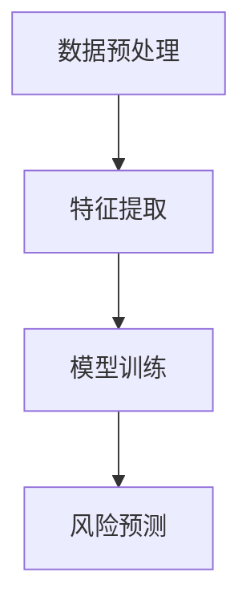
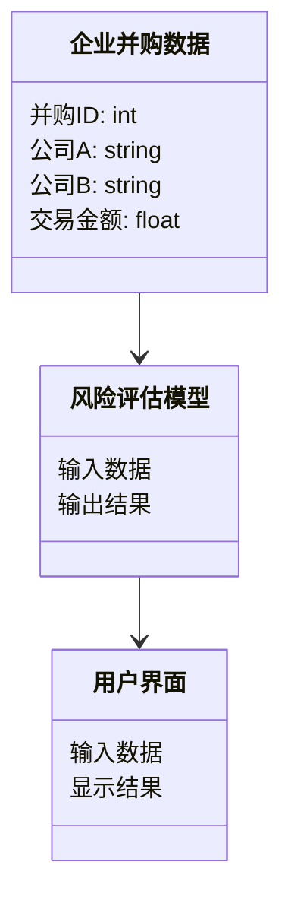
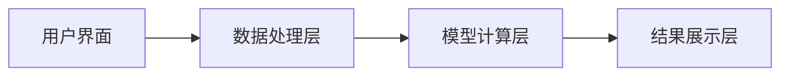
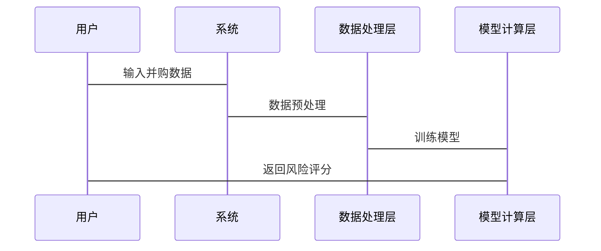

                 


# AI辅助的企业并购整合风险评估模型

**关键词**：企业并购、风险评估、AI技术、整合模型、风险管理

**摘要**：本文探讨了如何利用人工智能技术构建企业并购整合风险评估模型，以帮助企业识别和管理并购过程中的潜在风险。通过分析企业并购的核心要素，结合AI算法和系统架构设计，提出了一种创新的解决方案，为企业提供高效的决策支持。

---

# {{文章标题}}

## {{章节标题}}

### {{小节标题}}

---

# 第一部分: 背景介绍

## 第1章: 企业并购与整合风险概述

### 1.1 企业并购的基本概念

#### 1.1.1 企业并购的定义
企业并购（Mergers and Acquisitions, M&A）是指一家企业与其他企业合并或收购其资产、股权等行为。并购整合则是指在并购后，将双方的业务、文化、战略等进行整合的过程。

#### 1.1.2 并购的类型与特点
- **横向并购**：同一行业内的企业合并，旨在扩大市场份额。
- **纵向并购**：上下游产业的企业合并，以优化供应链。
- **混合并购**：跨行业或跨领域的并购，通常是为了 diversification。

#### 1.1.3 并购整合的核心目标
- 提升协同效应。
- 优化资源配置。
- 风险控制。

### 1.2 企业并购整合风险的背景与问题描述

#### 1.2.1 并购整合风险的定义
并购整合风险是指在并购过程中，由于企业战略、文化、管理、技术等多方面因素的不兼容，导致整合失败或效果不佳的风险。

#### 1.2.2 并购整合风险的主要类型
- **战略风险**：整合后的战略目标不清晰。
- **文化风险**：企业文化和管理风格的冲突。
- **管理风险**：管理层的整合与协调问题。
- **技术风险**：技术系统和流程的不兼容。

#### 1.2.3 并购整合风险对企业的影响
- 企业价值下降。
- 股东利益受损。
- 员工士气低落。

### 1.3 AI技术在企业并购整合中的应用前景

#### 1.3.1 AI技术在风险评估中的优势
- 数据处理能力强。
- 模型预测精度高。
- 能够快速识别潜在风险。

#### 1.3.2 当前企业并购整合风险评估的主要挑战
- 数据碎片化。
- 风险预测模型的复杂性。
- 专家经验不足。

#### 1.3.3 AI辅助评估的潜在价值
- 提高风险评估的准确性。
- 降低整合成本。
- 提升决策效率。

### 1.4 本章小结
企业并购整合风险是影响企业价值的重要因素。传统的风险评估方法存在局限性，而AI技术的应用为解决这一问题提供了新的思路。

---

# 第二部分: 核心概念与联系

## 第2章: 企业并购整合风险评估模型的核心要素

### 2.1 模型的核心概念与原理

#### 2.1.1 模型的核心概念
- **整合维度**：业务、管理、文化、技术。
- **风险来源**：战略、文化、管理、技术。
- **评估指标**：协同效应、整合时间、整合成本。

#### 2.1.2 模型的输入、处理与输出
- **输入**：企业并购数据、整合数据。
- **处理**：特征提取、模型训练。
- **输出**：风险评分、整合建议。

#### 2.1.3 模型的数学公式
$$
\text{风险评分} = \sum (\text{权重}_i \times \text{特征}_i)
$$

### 2.2 核心概念的ER实体关系图

```mermaid
er
    entity 公司A {
        id: int
        name: string
        industry: string
    }
    entity 公司B {
        id: int
        name: string
        industry: string
    }
    entity 并购交易 {
        id: int
        公司A_id: int
        公司B_id: int
        交易时间: date
        交易金额: float
    }
    entity 风险因素 {
        id: int
        并购交易_id: int
        风险类型: string
        风险评分: int
    }
```

---

# 第三部分: 算法原理

## 第3章: 企业并购整合风险评估模型的算法实现

### 3.1 算法原理与流程

#### 3.1.1 算法原理
模型基于机器学习算法，通过特征提取、模型训练和风险预测实现风险评估。

#### 3.1.2 算法流程


### 3.2 算法实现

#### 3.2.1 数据预处理
```python
import pandas as pd
data = pd.read_csv('并购数据.csv')
data.dropna(inplace=True)
```

#### 3.2.2 特征提取
```python
from sklearn.feature_extraction import DictVectorizer
vectorizer = DictVectorizer()
X = vectorizer.fit_transform(data[['行业', '交易金额']].to_dict('records'))
```

#### 3.2.3 模型训练
```python
from sklearn.ensemble import RandomForestClassifier
model = RandomForestClassifier()
model.fit(X, data['风险评分'])
```

#### 3.2.4 风险预测
```python
new_data = {'行业': '科技', '交易金额': 100000000}
new_X = vectorizer.transform([new_data])
predictedRisk = model.predict(new_X)
print(predictedRisk)
```

---

# 第四部分: 系统分析与架构设计

## 第4章: 系统架构设计

### 4.1 项目场景介绍
系统旨在为企业提供并购整合风险评估的工具，帮助企业在并购过程中降低风险。

### 4.2 系统功能设计

#### 4.2.1 领域模型


### 4.3 系统架构设计

#### 4.3.1 系统架构图


### 4.4 系统接口设计

#### 4.4.1 数据接口
```python
class DataInterface:
    def load_data(self):
        pass
```

#### 4.4.2 模型接口
```python
class ModelInterface:
    def predict(self, data):
        pass
```

### 4.5 系统交互流程

#### 4.5.1 用户与系统交互


---

# 第五部分: 项目实战

## 第5章: 企业并购整合风险评估模型的实现

### 5.1 环境安装与配置

#### 5.1.1 安装Python
```bash
python --version
pip install numpy pandas scikit-learn
```

### 5.2 核心代码实现

#### 5.2.1 数据加载
```python
import pandas as pd
data = pd.read_csv('并购数据.csv')
```

#### 5.2.2 特征提取与建模
```python
from sklearn.ensemble import RandomForestClassifier
model = RandomForestClassifier()
model.fit(X, y)
```

#### 5.2.3 模型预测
```python
new_data = {'行业': '科技', '交易金额': 100000000}
new_X = vectorizer.transform([new_data])
predictedRisk = model.predict(new_X)
print(predictedRisk)
```

### 5.3 实际案例分析与解读

#### 5.3.1 案例背景
假设某科技公司并购一家传统制造公司，评估整合风险。

#### 5.3.2 模型预测结果
$$
\text{风险评分} = 70
$$

### 5.4 项目总结与经验分享

#### 5.4.1 项目成果
- 提供了准确的整合风险评估。
- 优化了企业的并购决策。

#### 5.4.2 经验总结
- 数据质量是关键。
- 模型需要不断优化。
- 用户反馈有助于改进。

---

# 第六部分: 总结与展望

## 第6章: 总结与展望

### 6.1 本章小结
本文提出了基于AI技术的企业并购整合风险评估模型，通过数据预处理、特征提取、模型训练和预测，帮助企业降低并购风险。

### 6.2 注意事项
- 数据隐私保护。
- 模型的可解释性。
- 持续优化模型性能。

### 6.3 拓展阅读
- 《企业并购风险管理》。
- 《人工智能在金融领域的应用》。

---

# 作者：AI天才研究院 / AI Genius Institute & 禅与计算机程序设计艺术 / Zen And The Art of Computer Programming

---

**摘要**：本文探讨了如何利用人工智能技术构建企业并购整合风险评估模型，以帮助企业识别和管理并购过程中的潜在风险。通过分析企业并购的核心要素，结合AI算法和系统架构设计，提出了一种创新的解决方案，为企业提供高效的决策支持。

