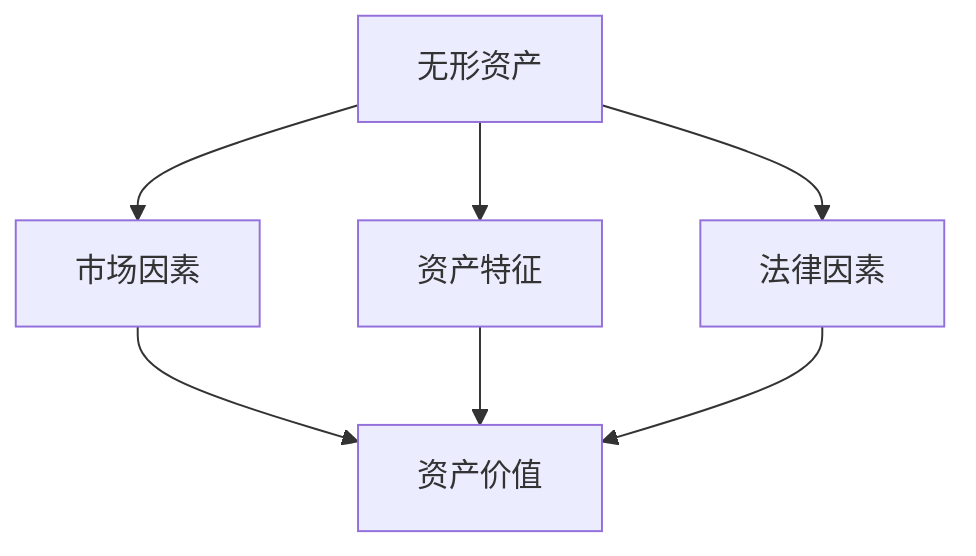
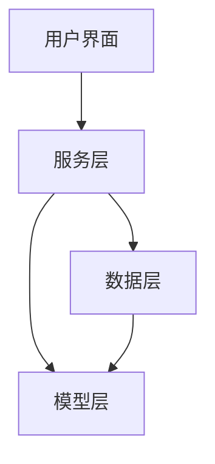

                 


# AI辅助的企业无形资产估值

**关键词：企业无形资产，人工智能，估值模型，机器学习，NLP，深度学习，系统架构**

**摘要：** 本文探讨了如何利用人工智能技术优化企业无形资产的估值过程。通过分析无形资产的特点和评估难点，结合机器学习、自然语言处理等技术，构建AI辅助的估值模型，提升评估效率和准确性。文章详细介绍了技术背景、核心算法、系统架构及实际应用案例，为企业管理者和技术人员提供参考。

---

## 第1章：企业无形资产估值的背景与挑战

### 1.1 无形资产的定义与分类
- **无形资产**：指企业拥有或控制的没有实物形态的长期资产，包括品牌价值、客户关系、知识产权、商誉等。
- **分类**：
  - 知识产权类：专利、商标、版权。
  - 客户关系类：客户数据库、客户忠诚度。
  - 技术类：技术诀窍、研发能力。
  - 品牌类：品牌知名度、品牌声誉。

### 1.2 无形资产评估的难点
- **数据复杂性**：无形资产难以量化，涉及主观判断和多维度数据。
- **动态变化**：市场环境、技术进步等因素影响无形资产价值。
- **评估成本高**：传统评估方法耗时长、成本高，且依赖专家经验。

### 1.3 AI技术的应用价值
- **数据处理能力**：AI能够处理大量非结构化数据，如文本、图像。
- **自动化评估**：通过机器学习模型自动预测无形资产价值。
- **实时更新**：AI模型可以实时跟踪市场变化，动态调整评估结果。

---

## 第2章：AI技术与无形资产评估的核心概念

### 2.1 AI技术的基本原理
- **机器学习**：通过训练模型从数据中学习规律，用于预测和分类。
- **自然语言处理（NLP）**：处理文本数据，提取关键词和情感信息。
- **深度学习**：利用神经网络进行特征提取和模式识别。

### 2.2 无形资产评估的关键要素
- **市场因素**：市场需求、竞争状况。
- **资产特征**：资产的独特性、可扩展性。
- **法律因素**：知识产权保护、法律纠纷风险。

### 2.3 核心概念关系图


---

## 第3章：机器学习基础与算法原理

### 3.1 机器学习基础
- **监督学习**：基于标记数据训练模型，如线性回归、支持向量机（SVM）。
- **无监督学习**：处理无标记数据，如聚类分析。
- **神经网络**：多层感知机（MLP）、卷积神经网络（CNN）。

### 3.2 机器学习在无形资产评估中的应用
- **特征提取**：从文本、数据中提取关键特征。
- **预测模型**：训练回归模型预测资产价值。
- **风险评估**：识别高风险资产，降低评估误差。

### 3.3 算法实现步骤
1. 数据预处理：清洗、特征工程。
2. 模型训练：选择算法，调整参数。
3. 模型评估：验证准确率、召回率。
4. 部署应用：集成到系统中，实时评估。

---

## 第4章：系统架构与设计

### 4.1 系统功能设计
- **数据输入**：接收企业无形资产数据。
- **模型计算**：运行AI模型进行估值。
- **结果输出**：展示评估结果和建议。

### 4.2 系统架构设计


### 4.3 接口设计
- **API调用**：其他系统通过API调用评估功能。
- **数据接口**：与企业数据源对接。

### 4.4 交互设计
```mermaid
sequenceDiagram
用户 -->+ 系统：提交评估请求
系统 -> 数据层：获取数据
数据层 -> 模型层：运行模型
模型层 -> 系统：返回结果
系统 --> 用户：展示结果
```

---

## 第5章：项目实战

### 5.1 环境安装
- **Python环境**：安装Python 3.8+，安装TensorFlow、Scikit-learn等库。
- **数据准备**：收集企业无形资产数据，清洗处理。

### 5.2 核心代码实现
```python
import pandas as pd
from sklearn.model import LinearRegression

# 数据加载
data = pd.read_csv('assets.csv')

# 特征与标签分离
X = data.drop('value', axis=1)
y = data['value']

# 模型训练
model = LinearRegression()
model.fit(X, y)

# 预测与评估
预测值 = model.predict(X)
评估误差 = mean_squared_error(y, 预测值)
print(f"预测误差：{评估误差}")
```

### 5.3 案例分析
- **案例背景**：某科技公司品牌价值评估。
- **数据处理**：提取品牌相关特征。
- **模型训练**：训练回归模型。
- **结果分析**：模型预测结果与实际价值对比。

### 5.4 项目总结
- **模型表现**：准确率、召回率。
- **优化方向**：引入更多特征、优化算法。

---

## 第6章：最佳实践与小结

### 6.1 最佳实践
- **数据质量**：确保数据准确性和完整性。
- **模型选择**：根据数据类型选择合适算法。
- **持续优化**：定期更新模型，适应市场变化。

### 6.2 小结
AI技术显著提升了企业无形资产评估的效率和准确性，但需要结合具体场景进行优化。未来，随着技术进步，AI在资产评估中的应用将更加广泛。

---

## 第7章：注意事项与拓展阅读

### 7.1 注意事项
- **数据隐私**：确保数据安全和隐私保护。
- **模型解释性**：选择可解释的模型，便于分析结果。

### 7.2 拓展阅读
- 《机器学习实战》：Ian Bishop
- 《深度学习》：Yann LeCun等
- 《自然语言处理入门》：NLP入坑指南

---

**作者：AI天才研究院 & 禅与计算机程序设计艺术**

---

通过以上结构，您可以开始撰写具体的正文内容，确保每一部分都详细展开，满足技术博客的专业性和可读性要求。

