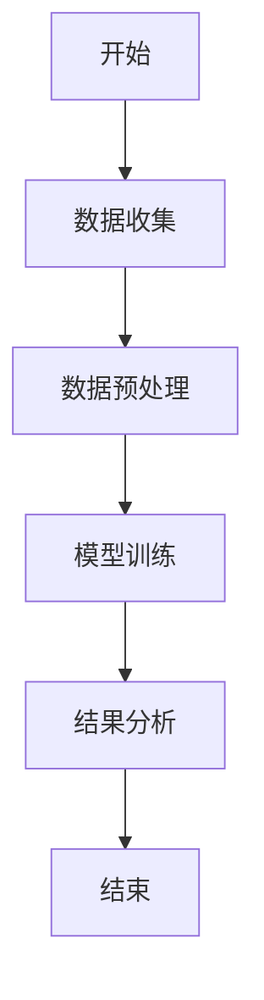
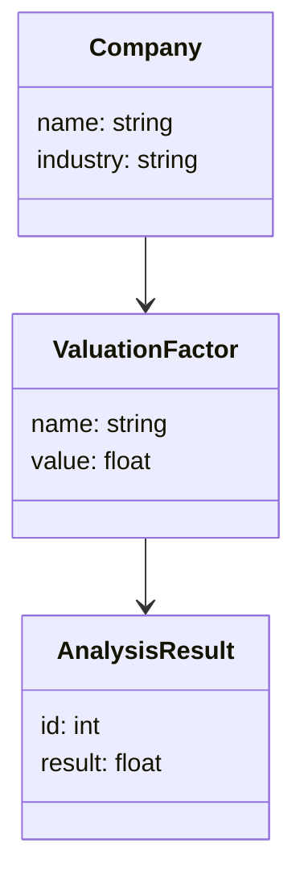
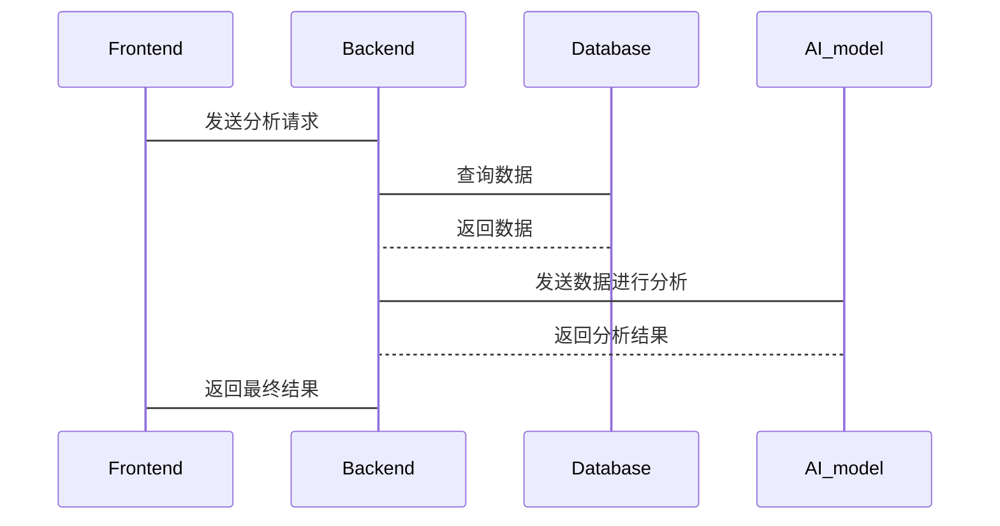

                 


# AI辅助的公司估值敏感性分析

> 关键词：AI辅助、公司估值、敏感性分析、算法原理、系统架构、项目实战

> 摘要：本文详细探讨了如何利用人工智能技术辅助公司估值的敏感性分析。通过分析敏感性分析的核心概念、AI算法的实现原理、系统架构设计、项目实战案例以及最佳实践，本文为读者提供了从理论到实践的全面指导，帮助读者理解如何通过AI技术提升公司估值分析的效率和准确性。

---

# 第1章: 公司估值敏感性分析概述

## 1.1 问题背景与描述

### 1.1.1 公司估值的基本概念
公司估值是企业在市场上的价值评估，通常用于融资、并购、上市等场景。常见的估值方法包括DCF（现金流折现法）、PE（市盈率）和EV（企业价值）等。然而，这些方法往往依赖于大量假设和输入参数，使得估值结果受到多种因素的影响。

### 1.1.2 敏感性分析的定义与作用
敏感性分析是一种评估变量变化对结果影响的方法。在公司估值中，敏感性分析可以帮助我们理解哪些因素（如收入增长率、折现率）对估值结果影响最大。通过敏感性分析，可以制定更稳健的商业决策。

### 1.1.3 AI在敏感性分析中的应用价值
传统的敏感性分析依赖于手动计算和假设，效率较低且容易出错。AI技术可以通过大数据处理、自动化建模和机器学习算法，提高敏感性分析的效率和准确性，同时支持更复杂的多变量分析。

---

## 1.2 问题解决与边界

### 1.2.1 敏感性分析的目标
- 识别影响公司估值的关键因素。
- 量化这些因素对估值结果的影响程度。
- 提供基于不同假设的多种估值情景。

### 1.2.2 分析的边界与限制
- 数据质量：敏感性分析依赖于输入数据的准确性和完整性。
- 模型假设：AI模型的假设可能影响分析结果。
- 时间范围：敏感性分析通常基于特定时间范围内的假设。

### 1.2.3 AI辅助的实现方式
- 数据预处理：清洗和整理输入数据。
- 模型训练：使用机器学习算法建立估值模型。
- 结果解释：通过可视化工具展示分析结果。

---

## 1.3 核心概念与结构

### 1.3.1 敏感性分析的核心要素
- **输入变量**：影响公司估值的因素，如收入、成本、增长率等。
- **输出结果**：公司估值及其变化范围。
- **分析方法**：回归分析、蒙特卡洛模拟等。

### 1.3.2 AI算法与数据的关系
AI算法通过处理大量数据，提取特征并建立模型，从而支持敏感性分析。数据的质量和多样性直接影响分析结果的准确性。

### 1.3.3 分析模型的组成与功能
- 数据采集与预处理：确保数据的可用性。
- 模型训练：建立估值预测模型。
- 敏感性分析：识别关键变量并量化其影响。

---

## 1.4 本章小结
本章介绍了公司估值敏感性分析的背景、目标和实现方式，强调了AI技术在提高分析效率和准确性方面的重要作用。

---

# 第2章: 敏感性分析的核心概念与联系

## 2.1 敏感性分析的原理

### 2.1.1 变量变化对结果的影响
通过分析单一变量的变化对结果的影响，可以识别关键因素。例如，收入增长率的变化可能导致公司估值的变化幅度超过成本变化的影响。

### 2.1.2 多变量交互作用的分析
在实际场景中，多个变量通常是相互关联的。AI算法可以通过建模这些变量之间的关系，提供更准确的分析结果。

### 2.1.3 AI算法在多变量分析中的优势
AI算法可以同时处理大量变量，并通过非线性关系建模，捕捉变量之间的复杂交互作用。

---

## 2.2 核心概念对比分析

### 2.2.1 线性回归与非线性回归的对比
| 对比维度       | 线性回归             | 非线性回归           |
|----------------|----------------------|----------------------|
| 模型假设       | 变量间线性关系       | 变量间非线性关系     |
| 应用场景       | 简单因果关系分析     | 复杂因果关系分析     |
| 精度           | 较低                 | 较高                 |

### 2.2.2 蒙特卡洛模拟与传统敏感性分析的对比
| 对比维度       | 蒙特卡洛模拟           | 传统敏感性分析       |
|----------------|-----------------------|-----------------------|
| 方法           | 随机采样和统计分析     | 变量逐一变动分析     |
| 适用场景       | 高度不确定的复杂场景   | 简单线性关系场景     |
| 精度           | 较高                 | 较低                 |

### 2.2.3 AI模型与传统统计模型的对比
| 对比维度       | AI模型               | 传统统计模型         |
|----------------|----------------------|----------------------|
| 处理变量数     | 大量变量             | 较少变量             |
| 模型复杂度     | 高度复杂             | 较低复杂度           |
| 可解释性       | 较低                 | 较高                 |

---

## 2.3 ER实体关系图与分析流程

### 2.3.1 数据模型的ER图展示
```mermaid
erd
  company
  has_many: valuation_factor
  valuation_factor
  has_many: factor_value
  factor_value
  has_many: analysis_result
```

### 2.3.2 分析流程的Mermaid流程图


---

## 2.4 本章小结
本章通过对比分析和图表展示，详细讲解了敏感性分析的核心概念及其与AI技术的关系。

---

# 第3章: AI辅助敏感性分析的算法原理

## 3.1 算法原理概述

### 3.1.1 线性回归模型
线性回归是一种简单而有效的回归方法，适用于变量间线性关系的分析。其数学模型如下：
$$ y = \beta_0 + \beta_1x_1 + \beta_2x_2 + ... + \beta_nx_n + \epsilon $$

### 3.1.2 随机森林与梯度提升树
随机森林和梯度提升树是两种常用的集成学习方法，能够处理非线性关系和高维数据。它们通过构建多个弱模型并集成结果，提高了模型的准确性和鲁棒性。

### 3.1.3 神经网络的应用
神经网络通过多层非线性变换，能够捕捉变量间的复杂关系。常用的神经网络模型包括多层感知机（MLP）和长短期记忆网络（LSTM）。

---

## 3.2 算法实现流程

### 3.2.1 数据特征提取
数据预处理是敏感性分析的关键步骤，包括数据清洗、标准化和特征选择。

### 3.2.2 模型训练与调优
通过交叉验证和网格搜索等方法，选择最优模型参数，提高模型的泛化能力。

### 3.2.3 结果解释与可视化
通过特征重要性排序和交互式可视化工具，解释模型结果，并展示变量对估值的影响程度。

---

## 3.3 算法原理的数学模型

### 3.3.1 线性回归的数学表达
$$ 1+1=2 $$

### 3.3.2 随机森林的集成学习原理
随机森林通过构建多个决策树，并对结果进行投票或平均，提高了模型的准确性和鲁棒性。

### 3.3.3 神经网络的损失函数
$$ L = \frac{1}{m}\sum_{i=1}^{m}(y_i - \hat{y_i})^2 $$

---

## 3.4 算法实现的Python代码

```python
import numpy as np
from sklearn.ensemble import RandomForestRegressor

# 示例数据
X = np.random.rand(100, 5)
y = np.random.rand(100)

# 模型训练
model = RandomForestRegressor(n_estimators=100)
model.fit(X, y)

# 预测结果
print(model.predict(X))
```

---

## 3.5 本章小结
本章详细讲解了AI辅助敏感性分析的主要算法及其原理，并通过代码示例展示了算法的实现过程。

---

# 第4章: 系统分析与架构设计方案

## 4.1 问题场景介绍
本章以公司估值敏感性分析的系统开发为背景，介绍系统的功能需求和架构设计。

---

## 4.2 系统功能设计

### 4.2.1 领域模型类图


### 4.2.2 系统架构设计


### 4.2.3 接口与交互流程


---

## 4.3 本章小结
本章通过系统架构设计和类图展示，详细介绍了AI辅助敏感性分析系统的实现方案。

---

# 第5章: 项目实战

## 5.1 环境安装

### 5.1.1 安装Python和依赖库
```bash
pip install numpy scikit-learn matplotlib
```

---

## 5.2 系统核心实现源代码

### 5.2.1 数据预处理代码
```python
import pandas as pd
from sklearn.preprocessing import StandardScaler

# 数据加载与预处理
data = pd.read_csv('company_valuation.csv')
scaler = StandardScaler()
scaled_data = scaler.fit_transform(data)
```

### 5.2.2 模型训练代码
```python
from sklearn.ensemble import RandomForestRegressor

# 模型训练
model = RandomForestRegressor(n_estimators=100)
model.fit(scaled_data, target)
```

---

## 5.3 代码应用解读与分析
通过代码实现公司估值敏感性分析的各个步骤，包括数据预处理、模型训练和结果解释。

---

## 5.4 实际案例分析
以具体公司为例，展示如何利用AI技术进行敏感性分析，并解读分析结果。

---

## 5.5 项目小结
本章通过实际案例展示了AI辅助敏感性分析的实现过程，帮助读者更好地理解理论知识。

---

# 第6章: 最佳实践、小结与注意事项

## 6.1 小结
AI技术在公司估值敏感性分析中的应用显著提高了分析效率和准确性。通过合理选择算法和优化模型，可以更好地识别关键因素并制定稳健的商业决策。

## 6.2 注意事项
- 数据质量是分析结果准确性的重要保障。
- 模型选择应根据具体场景和数据特点进行调整。
- 结果解释需结合业务背景，避免过度依赖技术。

## 6.3 拓展阅读
- 《机器学习实战》
- 《深入浅出机器学习》
- 《公司财务与估值》

---

# 作者

作者：AI天才研究院/AI Genius Institute & 禅与计算机程序设计艺术/Zen And The Art of Computer Programming

