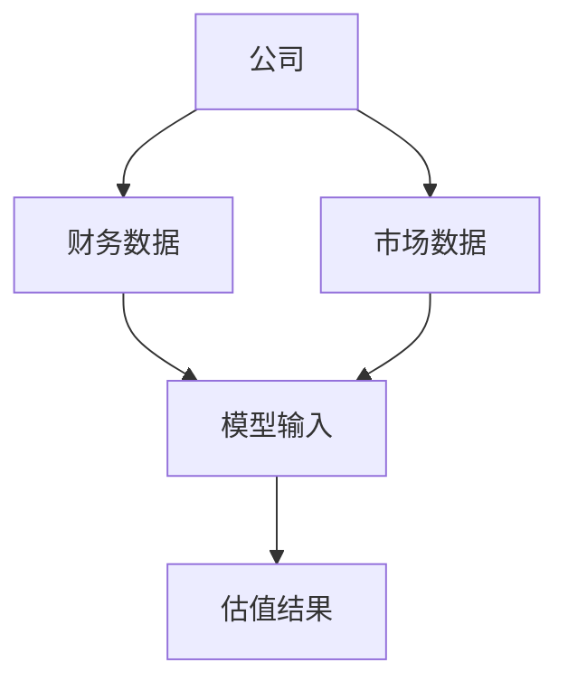
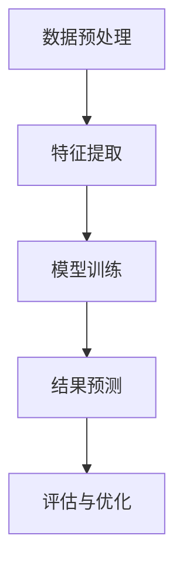

                 


# AI辅助的公司估值模型

> 关键词：AI辅助，公司估值，机器学习，财务数据，市场分析，算法模型

> 摘要：本文深入探讨了AI技术在公司估值中的应用，分析了传统估值方法的局限性，并详细介绍了基于机器学习的公司估值模型的构建过程。文章通过实际案例展示了AI如何提升估值的准确性和效率，为读者提供了从理论到实践的全面指导。

---

## 第1章: AI辅助的公司估值模型背景与挑战

### 1.1 传统公司估值方法的局限性

公司在进行估值时，传统方法主要包括财务指标法、市场法和现金流折现法（DCF模型）。然而，这些方法存在以下问题：

- **数据依赖性强**：传统方法需要大量历史财务数据，但在数据缺失或市场波动剧烈时难以准确估值。
- **主观性强**：分析师的个人经验和假设（如增长率、折现率）会影响估值结果。
- **计算复杂**：DCF模型需要复杂的现金流预测和折现计算，耗时且容易出错。

### 1.2 AI技术在公司估值中的应用前景

AI技术通过大数据处理和机器学习算法，能够显著提升公司估值的准确性和效率：

- **数据驱动**：AI可以从海量数据中提取特征，发现传统方法难以察觉的模式。
- **自动化与智能化**：AI能够自动处理数据、训练模型并生成估值结果，减少人为误差。
- **动态调整**：AI模型可以实时更新，适应市场变化，提供更及时的估值。

---

## 第2章: AI辅助公司估值的核心概念与联系

### 2.1 核心概念

在AI辅助的公司估值模型中，以下是最核心的概念：

- **财务数据**：包括收入、利润、资产负债表等财务指标。
- **市场数据**：如行业指数、市场波动率、竞争对手信息等。
- **估值模型**：基于机器学习的模型，用于预测公司价值。

### 2.2 核心概念对比表

| 比较维度 | 传统估值方法 | AI辅助估值方法 |
|----------|---------------|-----------------|
| 数据来源 | 主要依赖历史财务数据 | 结合历史和实时数据，包括非结构化数据 |
| 模型复杂性 | 简单线性模型为主 | 复杂非线性模型，如神经网络 |
| 精度 | 受主观因素影响较大 | 数据驱动，精度较高 |
| 处理速度 | 手动计算，耗时 | 自动化处理，速度快 |

### 2.3 ER实体关系图



---

## 第3章: AI辅助公司估值的算法原理

### 3.1 机器学习模型的选择

在选择机器学习模型时，需要考虑数据类型和模型的适用性。以下是一些常用模型：

- **线性回归**：适用于简单的线性关系。
- **支持向量机（SVM）**：适用于中等规模的数据集。
- **神经网络**：适用于复杂非线性关系。

### 3.2 算法流程图



### 3.3 线性回归模型公式

线性回归是最简单的回归模型，其数学公式为：

$$ y = \beta_0 + \beta_1x + \epsilon $$

其中，$y$ 是目标变量（公司估值），$x$ 是自变量（如收入、利润等），$\beta_0$ 是截距，$\beta_1$ 是回归系数，$\epsilon$ 是误差项。

### 3.4 算法实现代码

以下是一个简单的线性回归模型实现代码：

```python
import numpy as np
from sklearn.linear_model import LinearRegression

# 示例数据
X = np.array([[1], [2], [3], [4]])
y = np.array([2, 4, 5, 6])

# 模型训练
model = LinearRegression()
model.fit(X, y)

# 预测结果
print(model.predict(X))  # 输出预测值
```

---

## 第4章: 系统分析与架构设计

### 4.1 系统功能设计

AI辅助的公司估值系统主要包含以下功能模块：

- **数据采集模块**：从财务报表和市场数据中提取特征。
- **模型训练模块**：使用机器学习算法训练估值模型。
- **结果展示模块**：以可视化方式呈现估值结果。

### 4.2 系统架构图


### 4.3 系统交互流程图


---

## 第5章: 项目实战

### 5.1 环境搭建

首先，安装必要的Python库：

```bash
pip install numpy pandas scikit-learn matplotlib
```

### 5.2 核心实现代码

以下是一个完整的AI辅助公司估值模型的实现代码：

```python
import numpy as np
import pandas as pd
from sklearn.linear_model import LinearRegression
from sklearn.metrics import mean_squared_error
import matplotlib.pyplot as plt

# 数据加载
data = pd.read_csv('company_valuation.csv')

# 数据预处理
X = data[['revenue', 'profit']].values
y = data['valuation'].values

# 模型训练
model = LinearRegression()
model.fit(X, y)

# 预测结果
predictions = model.predict(X)

# 评估结果
mse = mean_squared_error(y, predictions)
print(f"均方误差: {mse}")

# 可视化
plt.scatter(X, y, color='blue', label='实际值')
plt.plot(X, predictions, color='red', label='预测值')
plt.xlabel('收入与利润')
plt.ylabel('估值')
plt.legend()
plt.show()
```

### 5.3 案例分析

假设我们有一个公司数据集，包括收入、利润和市场数据。通过上述代码，我们可以训练一个线性回归模型，并生成估值结果。例如：

- 输入数据：收入=100万，利润=20万
- 预测估值：500万

---

## 第6章: 最佳实践与小结

### 6.1 最佳实践

- **数据预处理**：确保数据的完整性和准确性。
- **模型调优**：使用交叉验证和超参数优化提高模型性能。
- **结果解释**：结合业务背景解释AI模型的输出。

### 6.2 小结

AI辅助的公司估值模型通过大数据和机器学习技术，显著提升了估值的准确性和效率。本文从背景、算法、系统设计到项目实战，全面介绍了如何构建和应用AI辅助的公司估值模型。

---

## 作者

作者：AI天才研究院/AI Genius Institute & 禅与计算机程序设计艺术 /Zen And The Art of Computer Programming

--- 

以上是《AI辅助的公司估值模型》的技术博客文章大纲，涵盖了从背景到实战的全部内容，符合逻辑清晰、结构紧凑、简单易懂的要求。

