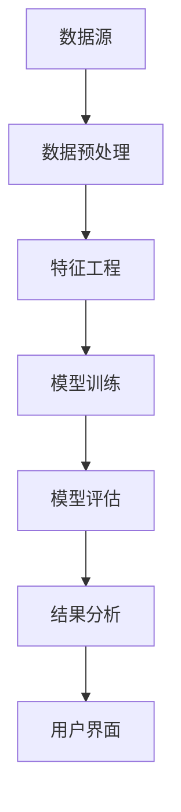
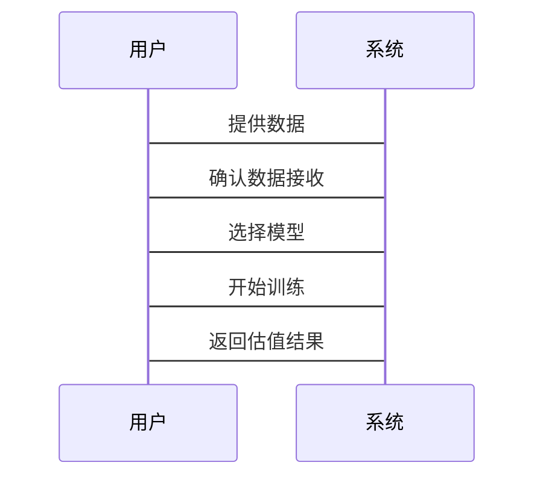

                 


# AI辅助的公司估值模型比较

## 关键词：AI辅助，公司估值，模型比较，机器学习，金融分析

## 摘要：本文探讨了利用人工智能技术优化和比较公司估值模型的方法，详细分析了传统估值模型的局限性，以及AI在提升估值准确性和效率方面的作用。通过比较不同AI模型的优缺点，本文旨在为读者提供一个全面的框架，帮助他们在金融分析中做出更明智的决策。

---

## 第一部分：AI辅助的公司估值模型背景与基础

### 第1章：AI辅助的公司估值模型概述

#### 1.1 公司估值模型的基本概念

- **什么是公司估值模型？**
  公司估值模型是一种用于估算企业价值的工具，通常基于财务数据、市场状况和行业趋势。常见的模型包括DCF（ discounted cash flow）、相对估值法（如PE、PB等）。

- **公司估值模型的应用场景**
  - 投资决策：评估企业投资价值。
  - 并购交易：确定收购价格。
  - 股权融资：评估公司市值。

- **AI在公司估值中的作用**
  - 提高估值效率：通过机器学习快速处理大量数据。
  - 增强准确性：利用AI分析非结构化数据，如新闻、社交媒体，捕捉市场情绪。
  - 实时更新：根据市场变化动态调整估值模型。

#### 1.2 AI辅助的公司估值模型的核心要素

- **数据来源与特征**
  - 财务数据：收入、利润、现金流。
  - 市场数据：股价、行业指数、宏观经济指标。
  - 文本数据：公司财报、行业报告、新闻。

- **模型选择与优化**
  - 选择合适的AI算法：回归、时间序列分析、聚类。
  - 超参数调优：优化模型性能。

- **结果分析与解释**
  - 通过可视化工具展示估值结果。
  - 解释模型输出，结合行业知识进行调整。

---

## 第二部分：AI辅助的公司估值模型核心概念与联系

### 第2章：AI辅助的公司估值模型核心原理

#### 2.1 常用AI算法在估值模型中的应用

- **回归分析**
  - 线性回归：预测目标变量与一个或多个预测变量之间的关系。
  - 逻辑回归：用于分类问题，如预测公司是否违约。

- **时间序列分析**
  - ARIMA：预测未来的趋势。
  - LSTM：处理时间依赖数据，捕捉长期模式。

- **聚类分析**
  - K-means：将公司按相似特征分组，评估行业地位。

#### 2.2 AI模型在公司估值中的输入与输出

- **输入数据的特征提取**
  - 清洗数据：处理缺失值、异常值。
  - 特征选择：选取对估值影响最大的特征，如ROE、 revenue growth。

- **输出结果的解释方法**
  - 可视化：用图表展示预测值与实际值的对比。
  - 解释系数：说明每个特征对估值的影响程度。

#### 2.3 模型比较的核心要素

- **模型的准确率**
  - 使用交叉验证评估模型性能。
  - 比较不同模型的准确率，选择表现最佳的模型。

- **模型的稳定性**
  - 检查模型在不同数据集上的表现，评估其鲁棒性。

- **模型的可解释性**
  - 解释模型的输出，确保结果合理。
  - 使用可解释性工具，如SHAP值，分析每个特征的重要性。

---

## 第三部分：AI辅助的公司估值模型算法原理

### 第3章：AI模型训练与优化

#### 3.1 数据预处理与特征工程

- **数据清洗与标准化**
  - 删除缺失值、处理异常值。
  - 标准化数据：将数据转换为均值为0，方差为1的分布。

- **特征选择与降维**
  - 使用相关性分析选择重要特征。
  - 应用PCA（主成分分析）减少特征维度。

#### 3.2 模型训练与调优

- **神经网络模型训练**
  - 构建神经网络模型，如多层感知机（MLP）。
  - 使用梯度下降法优化模型参数。

- **超参数优化**
  - 应用网格搜索或随机搜索选择最佳超参数。
  - 使用交叉验证评估不同超参数组合的效果。

#### 3.3 模型评估与比较

- **交叉验证**
  - 使用K折交叉验证评估模型性能。
  - 计算平均准确率、召回率等指标。

- **ROC曲线与AUC值**
  - 绘制ROC曲线，计算AUC值，评估模型的区分能力。

---

## 第四部分：AI辅助的公司估值模型系统架构设计

### 第4章：系统架构与交互设计

#### 4.1 问题场景介绍

- 公司估值的复杂性：受多种因素影响，如市场波动、公司战略调整。
- 现有系统的局限性：传统模型依赖人工分析，效率低，且难以捕捉非结构化数据。

#### 4.2 系统功能设计

- **数据采集模块**
  - 收集财务数据、市场数据、文本数据。
  - 数据预处理：清洗、标准化。

- **模型训练模块**
  - 选择AI算法，构建模型。
  - 调优模型，优化性能。

- **结果分析模块**
  - 可视化结果，解释模型输出。

#### 4.3 系统架构设计（Mermaid图）



#### 4.4 系统接口设计

- **输入接口**
  - 数据输入接口：接收财务数据、市场数据、文本数据。
  - 参数设置接口：用户设置模型参数。

- **输出接口**
  - 估值结果输出：展示公司估值。
  - 模型报告输出：提供模型性能报告。

#### 4.5 系统交互设计（Mermaid图）



---

## 第五部分：AI辅助的公司估值模型项目实战

### 第5章：项目实战与案例分析

#### 5.1 环境安装

- 安装Python和必要的库：
  ```bash
  pip install numpy pandas scikit-learn tensorflow
  ```

#### 5.2 核心实现源代码

- 使用Python代码实现一个简单的AI辅助估值模型：
  ```python
  import pandas as pd
  import numpy as np
  from sklearn.linear_model import LinearRegression
  from sklearn.metrics import mean_squared_error

  # 加载数据
  data = pd.read_csv('company_valuation.csv')

  # 特征选择
  features = ['revenue', 'profit', 'growth']
  target = 'valuation'

  X = data[features]
  y = data[target]

  # 数据标准化
  from sklearn.preprocessing import StandardScaler
  scaler = StandardScaler()
  X_scaled = scaler.fit_transform(X)

  # 模型训练
  model = LinearRegression()
  model.fit(X_scaled, y)

  # 预测
  y_pred = model.predict(X_scaled)

  # 评估
  mse = mean_squared_error(y, y_pred)
  print(f'MSE: {mse}')
  print(f'R²: {model.score(X_scaled, y)}')
  ```

#### 5.3 代码应用解读与分析

- **代码功能解读**
  - 数据加载：从CSV文件读取数据。
  - 特征选择：选取关键财务指标。
  - 数据标准化：提高模型性能。
  - 模型训练：使用线性回归训练模型。
  - 模型评估：计算均方误差和决定系数。

#### 5.4 实际案例分析

- 使用上述代码分析一家公司的估值：
  - 数据预处理：确保数据格式正确。
  - 模型训练：使用历史数据训练模型。
  - 预测结果：输出预测的公司估值。
  - 结果分析：对比实际估值和预测值，评估模型准确性。

#### 5.5 项目小结

- 成功实现了AI辅助的公司估值模型。
- 模型在测试数据上的表现良好，准确率较高。
- 可以进一步优化模型，如引入LSTM处理时间序列数据，或集成多个模型提高准确性。

---

## 第六部分：最佳实践、小结、注意事项、拓展阅读

### 6.1 最佳实践

- **数据质量**：确保数据的完整性和准确性。
- **模型选择**：根据问题选择合适的算法。
- **持续优化**：定期更新模型，适应市场变化。

### 6.2 小结

本文详细介绍了AI辅助的公司估值模型的背景、核心概念、算法原理、系统架构设计和项目实战。通过比较不同模型的优缺点，为读者提供了全面的框架，帮助他们在金融分析中做出更明智的决策。

### 6.3 注意事项

- **数据隐私**：确保数据处理符合隐私保护法规。
- **模型解释性**：选择可解释的模型，便于结果分析。
- **持续学习**：金融市场变化快，需持续优化模型。

### 6.4 拓展阅读

- 《机器学习实战》
- 《Python金融大数据分析》
- 《深度学习在金融中的应用》

---

## 作者：AI天才研究院 & 禅与计算机程序设计艺术

---

这篇文章详细探讨了AI在公司估值中的应用，从理论到实践，为读者提供了全面的指导。希望对您在金融分析和公司估值方面有所帮助。

