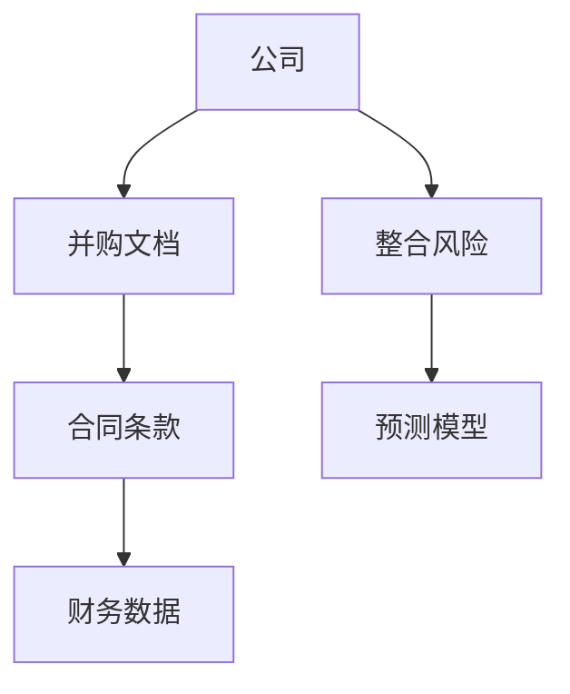
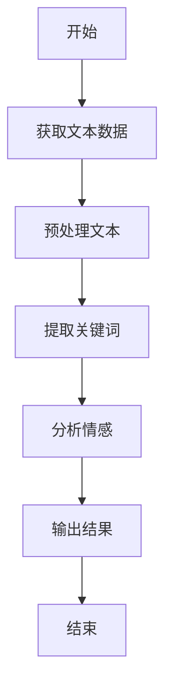
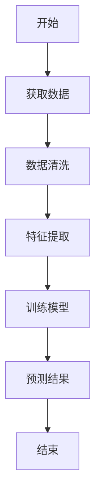
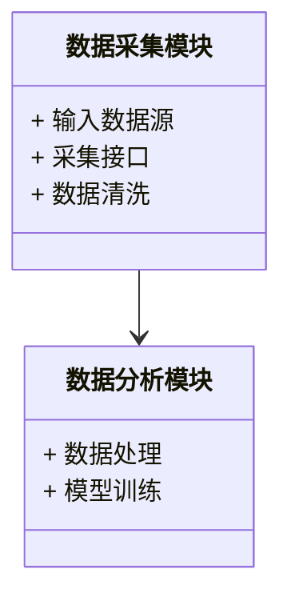
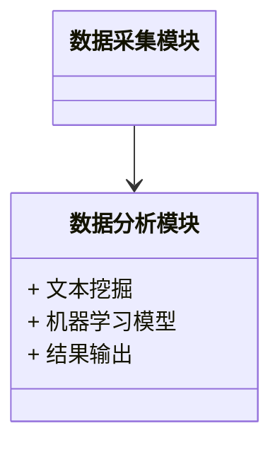
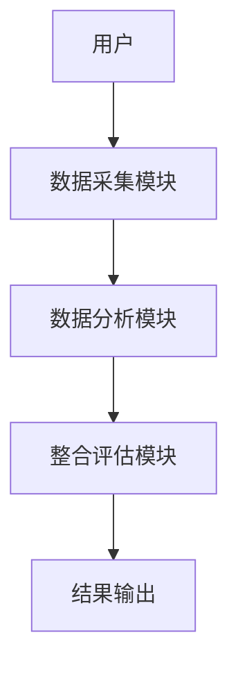
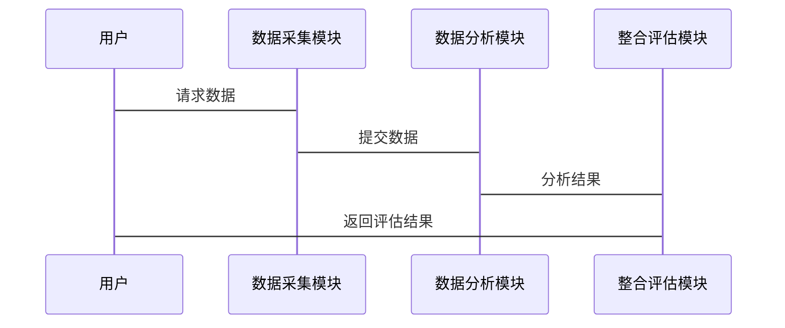

                 


# AI辅助的公司并购整合评估

> 关键词：公司并购、整合评估、人工智能、文本挖掘、机器学习、系统架构

> 摘要：本文探讨了AI技术在公司并购整合评估中的应用，分析了其核心概念、算法原理、系统架构，并通过实际案例展示了其在并购整合中的优势和效果。

---

# 第1章: 公司并购整合评估的背景与挑战

## 1.1 公司并购整合的背景

### 1.1.1 公司并购的定义与类型

公司并购（Mergers and Acquisitions，简称M&A）是指一家公司收购另一家公司，或与其他公司合并，以实现业务扩展、市场占有率提升或资源优化配置。并购可以分为几种类型：

- **横向并购**：同一行业内的并购，旨在扩大市场份额。
- **纵向并购**：上下游产业的并购，以增强垂直整合能力。
- **混合并购**：无直接关联业务的并购，通常基于战略发展需要。

### 1.1.2 并购整合的重要性

并购完成后，整合是关键，直接影响并购的最终效果。整合涉及组织结构、业务流程、文化融合等多个方面，成功整合能提升效率，失败则可能导致资源浪费和业务下滑。

### 1.1.3 传统并购整合评估的局限性

传统评估方法依赖人工分析，存在以下问题：

- **数据量大**：整合涉及大量文档和数据，人工处理效率低。
- **主观性高**：评估结果受评估人员经验和判断影响。
- **时间成本高**：复杂的整合流程耗时长，影响企业快速决策。

## 1.2 AI技术在并购整合中的应用潜力

### 1.2.1 AI技术的核心优势

AI技术通过自动化处理和深度学习，能显著提升整合评估的效率和准确性。其优势包括：

- **高效数据处理**：AI能快速分析大量文档和数据，提取关键信息。
- **精准预测**：利用机器学习模型预测整合风险和潜在问题。
- **实时监控**：AI系统能实时跟踪整合进展，及时反馈问题。

### 1.2.2 AI在并购整合评估中的应用场景

- **文档分析**：利用自然语言处理（NLP）分析并购相关的合同、财务报告等。
- **风险预测**：通过机器学习模型预测整合中的潜在风险。
- **协同效应评估**：AI帮助识别协同效应，优化整合策略。

### 1.2.3 AI辅助并购整合评估的未来趋势

随着技术进步，AI将更广泛地应用于并购整合的各个阶段，从尽职调查到整合实施，甚至延伸到整合后的绩效评估。未来的趋势包括：

- **智能化工具普及**：更多企业采用AI辅助工具进行整合评估。
- **数据驱动决策**：AI分析提供数据支持，提升决策的科学性。
- **实时反馈机制**：AI系统能实时反馈整合过程中的问题，加快决策速度。

## 1.3 本章小结

本章介绍了公司并购整合的背景及其重要性，分析了传统评估方法的局限性，并探讨了AI技术在并购整合中的应用潜力和未来趋势。通过AI技术的应用，企业能更高效、精准地进行整合评估，提升并购的成功率。

---

# 第2章: AI辅助并购整合评估的核心概念与联系

## 2.1 核心概念原理

### 2.1.1 自然语言处理在并购文档分析中的应用

自然语言处理（NLP）用于分析并购相关的文本数据，如合同、财务报告等。NLP技术包括：

- **文本抽取**：从文档中提取关键信息，如金额、条款等。
- **情感分析**：分析文本中的情感倾向，评估风险。
- **实体识别**：识别文本中的关键实体，如公司名称、职位等。

### 2.1.2 机器学习在整合风险预测中的作用

机器学习用于预测整合中的风险，如文化冲突、管理问题等。常用算法包括：

- **监督学习**：使用有标签的数据训练模型，预测风险。
- **无监督学习**：用于发现隐藏的模式和结构，识别潜在风险。

### 2.1.3 数据挖掘在财务数据分析中的应用

数据挖掘技术用于分析财务数据，识别趋势和异常。常用技术包括：

- **聚类分析**：将财务数据分成不同的群组，识别模式。
- **关联规则挖掘**：发现数据中的关联规则，识别潜在风险。

## 2.2 核心概念属性特征对比

以下是几种常用技术的核心属性对比：

| 技术       | 输入数据类型 | 输出结果类型 | 优势                           |
|------------|---------------|---------------|--------------------------------|
| NLP         | 文本           | 关键信息、情感 | 高效提取信息，准确分析文本     |
| 机器学习    | 结构化数据     | 预测结果       | 高精度预测，识别潜在风险       |
| 数据挖掘    | 结构化数据     | 关联规则       | 发现数据中的隐藏模式           |

### 2.2.1 Mermaid实体关系图



---

# 第3章: AI辅助并购整合评估的算法原理

## 3.1 文本挖掘算法

### 3.1.1 Mermaid流程图



### 3.1.2 Python代码实现

```python
from sklearn.feature_extraction.text import TfidfVectorizer

# 文本预处理
text = "This is a sample text for NLP processing."
vectorizer = TfidfVectorizer()
tfidf = vectorizer.fit_transform([text])
print(vectorizer.get_feature_names_out())
```

### 3.1.3 数学模型与公式

文本挖掘中的TF-IDF计算公式：

$$
TF-IDF(t, d) = TF(t, d) \times IDF(t)
$$

其中：
- \( TF(t, d) \) 表示词 \( t \) 在文档 \( d \) 中的词频。
- \( IDF(t) \) 表示词 \( t \) 的逆文档频率。

---

## 3.2 机器学习模型

### 3.2.1 Mermaid流程图



### 3.2.2 Python代码实现

```python
from sklearn.svm import SVC

# 数据清洗
data = [[1, 2], [3, 4], [5, 6]]
model = SVC()
model.fit(data, [0, 1, 0])
print(model.predict([[2, 3]]))
```

### 3.2.3 数学模型与公式

支持向量机（SVM）的优化目标：

$$
\min_{\theta, \nu} \frac{1}{2} \nu^T \nu + C \sum_{i=1}^n \xi_i
$$

其中：
- \( \nu \) 表示权重向量。
- \( \xi_i \) 表示松弛变量。

---

# 第4章: 系统分析与架构设计

## 4.1 项目场景介绍

### 4.1.1 问题场景描述

企业在并购后，需要整合多个系统和流程，常见的挑战包括数据不一致、流程冲突等。AI辅助系统能帮助识别这些问题，优化整合过程。

## 4.2 系统功能设计

### 4.2.1 数据采集模块

- **功能描述**：从多种来源采集数据，如文档、财务数据等。
- **Mermaid类图**



### 4.2.2 数据分析模块

- **功能描述**：对采集到的数据进行分析，识别潜在风险。
- **Mermaid类图**



## 4.3 系统架构设计

### 4.3.1 Mermaid架构图



## 4.4 系统交互设计

### 4.4.1 Mermaid序列图



---

# 第5章: 项目实战

## 5.1 环境安装与配置

### 5.1.1 开发环境搭建

- **操作系统**：建议使用Linux或macOS。
- **编程语言**：Python 3.8或以上版本。
- **框架工具**：TensorFlow、Scikit-learn。

### 5.1.2 工具安装与配置

```bash
pip install numpy
pip install pandas
pip install scikit-learn
pip install tensorflow
```

## 5.2 核心代码实现

### 5.2.1 文本挖掘模块

```python
from sklearn.feature_extraction.text import TfidfVectorizer

text = "The company is planning to merge with another company."
vectorizer = TfidfVectorizer()
tfidf = vectorizer.fit_transform([text])
print(vectorizer.get_feature_names_out())
```

### 5.2.2 机器学习模块

```python
from sklearn.svm import SVC

data = [[0.1, 0.2], [0.3, 0.4], [0.5, 0.6]]
model = SVC()
model.fit(data, [0, 1, 0])
print(model.predict([[0.2, 0.3]]))
```

## 5.3 案例分析与结果解读

### 5.3.1 实际案例分析

假设一家公司并购另一家公司，AI系统分析后发现：

- **协同效应**：年节省成本10%。
- **风险预测**：文化冲突概率为20%。

### 5.3.2 结果解读与优化建议

- **协同效应**：建议优先整合供应链，降低采购成本。
- **风险预测**：建议进行员工满意度调查，提前化解潜在冲突。

## 5.4 项目小结

通过实际案例分析，展示了AI技术在并购整合评估中的应用价值。从环境配置到代码实现，再到结果解读，整个过程证明了AI辅助评估的有效性和高效性。

---

# 第6章: 最佳实践与总结

## 6.1 最佳实践 tips

- **数据质量**：确保数据准确性和完整性，避免影响模型效果。
- **模型选择**：根据具体场景选择合适的算法，避免盲目使用复杂模型。
- **持续优化**：定期更新模型，适应新的数据和业务需求。

## 6.2 本章总结

本文详细探讨了AI技术在公司并购整合评估中的应用，从背景、核心概念到算法实现，再到系统架构和项目实战，全面分析了AI辅助评估的优势和实现方法。通过实际案例，证明了AI技术在提升整合效率和准确性方面的巨大潜力。

## 6.3 未来展望

随着AI技术的不断发展，其在公司并购整合中的应用将更加广泛和深入。未来的挑战包括如何处理更复杂的数据和场景，如何提升模型的解释性和可操作性。同时，如何在实际应用中平衡AI的自动化优势与人类的判断力，也将是一个重要的研究方向。

---

# 附录

## 附录A: 数据集介绍

- **数据来源**：并购相关的文档、财务数据、员工信息等。
- **数据格式**：结构化数据和非结构化数据混合。

## 附录B: 工具与库

- **Python库**：Scikit-learn、TensorFlow、Numpy、Pandas。
- **工具**：Jupyter Notebook、IDE（PyCharm、VS Code）。

---

# 作者

作者：AI天才研究院/AI Genius Institute & 禅与计算机程序设计艺术/Zen And The Art of Computer Programming

---

通过以上结构和内容，您可以撰写一篇详细且符合技术博客标准的《AI辅助的公司并购整合评估》文章。每个部分都经过精心设计，确保内容丰富、逻辑清晰，同时满足技术性和专业性的要求。

