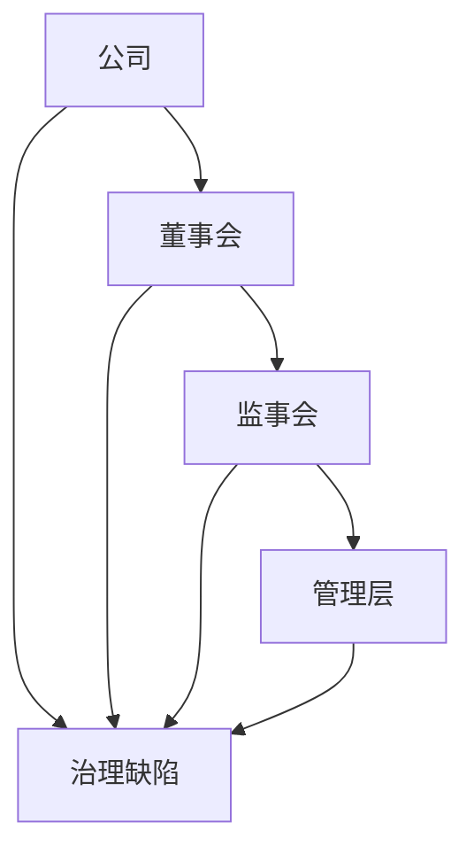
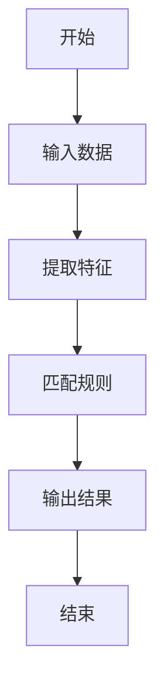
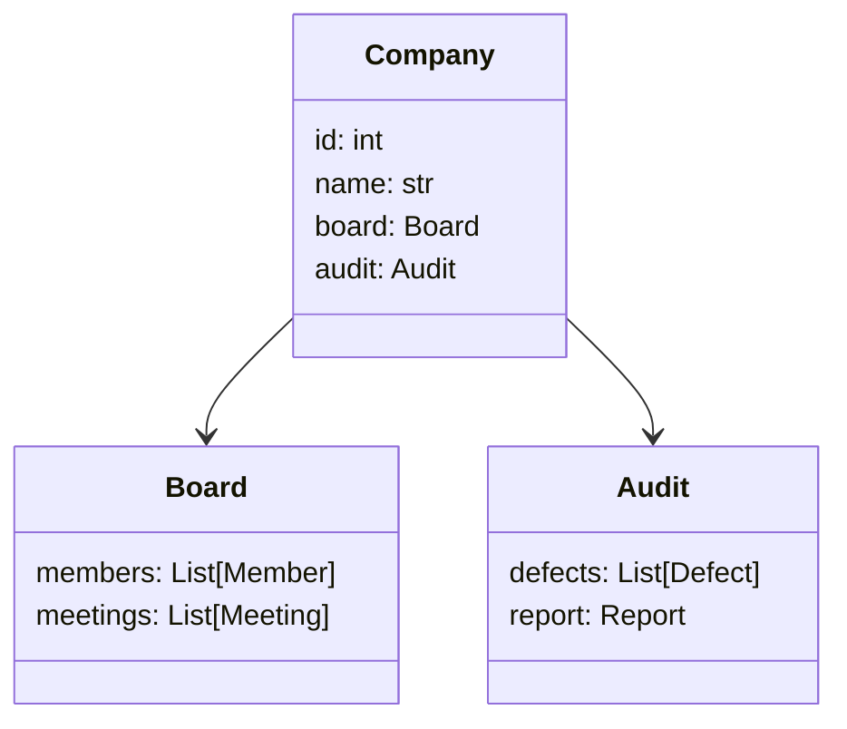
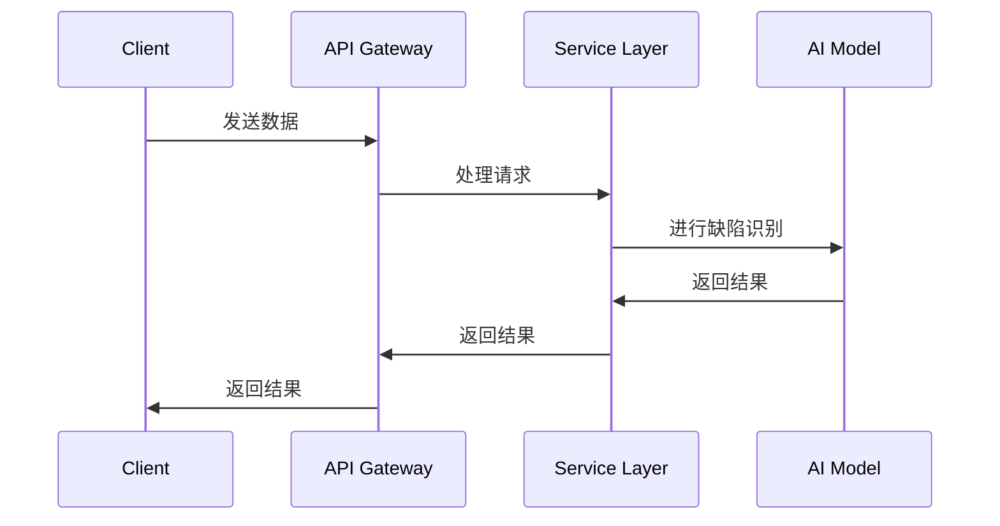

                 


# AI辅助的公司治理缺陷识别

> 关键词：公司治理，人工智能，缺陷识别，机器学习，自然语言处理

> 摘要：随着企业规模的不断扩大和业务复杂性的增加，公司治理的缺陷识别变得日益重要。本文将探讨如何利用人工智能技术辅助公司治理缺陷识别，从背景、核心概念、算法原理到系统设计和项目实战，详细阐述AI在公司治理中的应用。

---

# 第一部分: 公司治理与AI辅助缺陷识别背景

# 第1章: 公司治理缺陷识别概述

## 1.1 公司治理的基本概念

### 1.1.1 公司治理的定义与核心要素

公司治理是指通过一系列制度、流程和机制，确保公司战略目标的实现、股东权益的保护以及公司合规运营的过程。其核心要素包括：

1. **治理结构**：董事会、监事会、管理层的职责划分。
2. **治理流程**：决策、执行、监督和反馈的闭环流程。
3. **治理目标**：确保公司合规性、透明性和可持续发展。

### 1.1.2 公司治理中的常见问题与挑战

在实际运营中，公司治理常面临以下问题：

- **合规性不足**：部分企业在遵循法律法规和行业标准时存在疏漏。
- **透明度低**：内部信息传递不畅，导致管理层决策失误。
- **效率低下**：传统治理模式依赖人工检查，效率难以提升。
- **风险识别滞后**：难以及时发现潜在风险，导致问题扩大化。

### 1.1.3 公司治理缺陷的分类与影响

公司治理缺陷主要分为以下几类：

1. **结构性缺陷**：治理结构不合理，职责划分不清。
2. **流程性缺陷**：治理流程不完善，执行不到位。
3. **合规性缺陷**：违反相关法律法规或行业标准。

这些缺陷可能导致公司声誉受损、财务损失或法律纠纷，严重威胁企业的可持续发展。

## 1.2 AI辅助公司治理的必要性

### 1.2.1 传统公司治理的局限性

传统公司治理依赖人工检查和经验判断，存在以下局限性：

- **效率低**：人工检查耗时长，难以覆盖所有业务场景。
- **主观性高**：依赖个人经验，可能存在主观判断误差。
- **覆盖面有限**：难以全面识别潜在风险和缺陷。

### 1.2.2 AI技术在公司治理中的优势

人工智能技术在公司治理中的应用具有显著优势：

- **高效性**：AI能够快速处理大量数据，显著提高缺陷识别效率。
- **客观性**：基于数据和模型的分析，减少人为主观因素的影响。
- **全面性**：AI能够覆盖更多潜在风险点，提升缺陷识别的全面性。

### 1.2.3 AI辅助公司治理的应用场景

AI在公司治理中的应用主要集中在以下几个方面：

1. **合规性检查**：利用AI技术自动识别企业行为是否符合相关法律法规。
2. **风险预警**：通过分析历史数据和实时信息，提前发现潜在风险。
3. **决策支持**：为管理层提供数据支持，优化决策过程。
4. **流程优化**：通过分析治理流程中的瓶颈，提出优化建议。

## 1.3 本书的核心目标与内容框架

### 1.3.1 本书的核心目标

本书旨在探讨如何利用人工智能技术辅助公司治理缺陷识别，通过理论分析和实践案例，帮助读者掌握AI在公司治理中的应用方法。

### 1.3.2 本书的主要内容框架

- **第二部分**：AI辅助公司治理缺陷识别的核心概念与联系。
- **第三部分**：AI辅助公司治理缺陷识别的算法原理。
- **第四部分**：AI辅助公司治理缺陷识别的系统分析与架构设计。
- **第五部分**：AI辅助公司治理缺陷识别的项目实战。
- **第六部分**：总结与展望。

### 1.3.3 本书的读者群体与适用范围

本书适合以下读者群体：

- **技术专家**：希望了解AI技术在公司治理中的应用。
- **公司治理人员**：希望通过技术手段提升治理效率。
- **企业高管**：希望利用AI优化公司管理。

---

# 第二部分: AI辅助公司治理缺陷识别的核心概念与联系

# 第2章: 公司治理缺陷识别的核心概念

## 2.1 公司治理缺陷识别的关键要素

### 2.1.1 企业治理结构与流程

公司治理结构包括董事会、监事会和管理层，治理流程涉及决策、执行、监督和反馈。

### 2.1.2 治理缺陷的识别标准

治理缺陷的识别需要遵循以下标准：

- **合规性标准**：是否符合相关法律法规。
- **效率标准**：是否影响公司运营效率。
- **风险标准**：是否可能导致潜在风险。

### 2.1.3 数据来源与特征分析

治理缺陷识别的数据来源包括：

- **财务数据**：收入、支出、利润等财务指标。
- **文本数据**：公司章程、董事会决议、会议记录。
- **行为数据**：员工行为、交易记录、系统日志。

## 2.2 AI技术在缺陷识别中的应用原理

### 2.2.1 机器学习在缺陷识别中的作用

机器学习通过训练模型，能够自动识别数据中的异常模式，帮助发现潜在的治理缺陷。

### 2.2.2 自然语言处理在缺陷识别中的应用

自然语言处理技术能够分析文本数据，识别潜在的治理问题，如合同中的风险条款。

### 2.2.3 数据挖掘与知识图谱的结合

通过数据挖掘技术，提取治理相关数据中的关联关系，并构建知识图谱，帮助发现潜在缺陷。

## 2.3 核心概念的对比分析

### 2.3.1 基于规则的缺陷识别与基于模型的缺陷识别对比

| 对比维度 | 基于规则 | 基于模型 |
|----------|-----------|-----------|
| **适用场景** | 简单规则场景 | 复杂模式场景 |
| **灵活性** | 低 | 高 |
| **维护成本** | 高 | 中 |

### 2.3.2 不同AI模型在缺陷识别中的表现

| 模型类型 | 优点 | 缺点 |
|----------|-------|-------|
| **规则模型** | 易解释 | 难应对复杂场景 |
| **机器学习模型** | 高准确性 | 需大量数据 |
| **深度学习模型** | 强大学习能力 | 计算资源需求高 |

### 2.3.3 治理缺陷识别的实体关系图（ER图）



---

# 第三部分: AI辅助公司治理缺陷识别的算法原理

# 第3章: 基于规则的缺陷识别算法

## 3.1 基于规则的缺陷识别原理

### 3.1.1 规则的定义与设计

规则是根据公司治理的合规要求制定的条件判断标准，例如：

- 规则1：如果董事会成员未按时召开会议，则视为治理缺陷。
- 规则2：如果公司年度报告未按时披露，则视为治理缺陷。

### 3.1.2 规则匹配的流程

1. **数据输入**：获取待检查的治理数据。
2. **特征提取**：提取数据中的关键特征。
3. **规则匹配**：将特征与预定义的规则进行匹配。
4. **结果输出**：输出匹配到的治理缺陷。

### 3.1.3 规则的优化与维护

- **规则优化**：根据实际应用效果，调整或新增规则。
- **规则维护**：定期检查和更新规则库，确保其准确性和有效性。

## 3.2 基于规则的缺陷识别算法实现

### 3.2.1 算法流程图（Mermaid）



### 3.2.2 代码实现示例

```python
def rule_based_defect_detection(data, rules):
    for rule in rules:
        if rule.check(data):
            return rule.result(data)
    return "No defect detected"
```

### 3.2.3 代码解读

- `rule_based_defect_detection`函数遍历每个规则，检查数据是否匹配。
- 如果匹配到缺陷，返回对应的结果；否则，返回“无缺陷”。

---

# 第四部分: AI辅助公司治理缺陷识别的系统分析与架构设计

# 第4章: 系统分析与架构设计

## 4.1 项目介绍

本项目旨在开发一个基于AI的公司治理缺陷识别系统，帮助公司及时发现和解决治理缺陷。

## 4.2 系统功能设计

### 4.2.1 领域模型（Mermaid类图）



### 4.2.2 系统架构设计（Mermaid架构图）

```mermaid
graph LR
    Client --> API Gateway
    API Gateway --> Service Layer
    Service Layer --> Database
    Database --> AI Model
```

## 4.3 系统接口设计

### 4.3.1 输入接口

- **输入数据**：治理相关的数据，如董事会决议、财务数据。
- **接口类型**：RESTful API。

### 4.3.2 输出接口

- **输出结果**：识别到的治理缺陷。
- **接口类型**：RESTful API。

## 4.4 系统交互设计（Mermaid序列图）



---

# 第五部分: AI辅助公司治理缺陷识别的项目实战

# 第5章: 项目实战

## 5.1 环境安装

### 5.1.1 安装Python和必要的库

```bash
pip install numpy pandas scikit-learn spacy
```

## 5.2 系统核心实现源代码

### 5.2.1 模型训练代码

```python
import spacy

# 加载英文模型
nlp = spacy.load("en_core_web_sm")

def train_model(documents):
    # 文本预处理
    processed_texts = [doc.text for doc in nlp.pipe(documents)]
    # 训练模型
    from sklearn.feature_extraction.text import TfidfVectorizer
    vectorizer = TfidfVectorizer()
    X = vectorizer.fit_transform(processed_texts)
    # 模型训练
    from sklearn.svm import SVC
    model = SVC()
    model.fit(X, labels)
    return model
```

### 5.2.2 缺陷识别代码

```python
def detect_defects(data, model, vectorizer):
    # 文本预处理
    processed_texts = [data.text]
    # 特征提取
    X = vectorizer.transform(processed_texts)
    # 模型预测
    prediction = model.predict(X)
    return prediction[0]
```

## 5.3 代码应用解读与分析

- **模型训练**：使用TF-IDF进行特征提取，训练SVM模型。
- **缺陷识别**：对输入文本进行特征提取，并使用训练好的模型进行预测。

## 5.4 实际案例分析

### 5.4.1 案例背景

某公司董事会未按时召开会议，导致治理缺陷。

### 5.4.2 案例分析

- **输入数据**：董事会会议记录缺失。
- **模型识别**：识别为治理缺陷。
- **输出结果**：董事会未按时召开会议。

## 5.5 项目小结

通过实际案例分析，验证了AI辅助公司治理缺陷识别的有效性。

---

# 第六部分: 总结与展望

# 第6章: 总结与展望

## 6.1 项目总结

本书详细探讨了AI辅助公司治理缺陷识别的核心概念、算法原理、系统设计和项目实战，展示了AI技术在公司治理中的巨大潜力。

## 6.2 项目展望

未来，随着AI技术的不断发展，公司治理缺陷识别将更加智能化和自动化，为企业治理提供更有力的支持。

---

# 作者

作者：AI天才研究院/AI Genius Institute & 禅与计算机程序设计艺术 /Zen And The Art of Computer Programming

