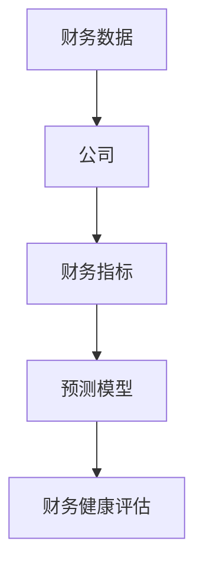
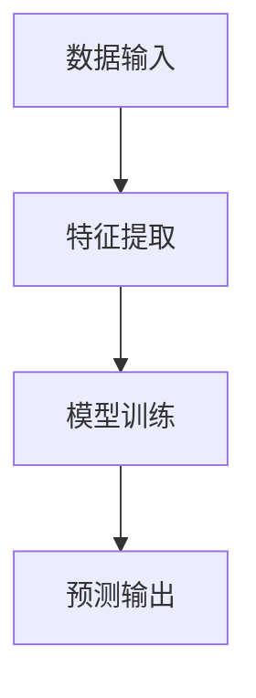

                 

# AI辅助的公司财务报表预测与分析

**关键词**：AI，财务报表预测，机器学习，深度学习，自然语言处理，财务分析

**摘要**：随着人工智能技术的快速发展，AI在财务报表预测与分析中的应用越来越广泛。本文系统地介绍AI技术如何辅助财务分析，涵盖从传统财务分析的局限性到AI算法的数学模型，再到系统设计与项目实战。通过详细讲解机器学习、深度学习等技术，本文展示了如何利用AI提升财务预测的准确性和效率，并通过实际案例分析和代码示例，帮助读者理解AI在财务分析中的实际应用。

---

## 第一部分: AI辅助的公司财务报表预测与分析概述

### 第1章: 财务报表预测与分析的背景与意义

#### 1.1 传统财务报表分析的局限性

##### 1.1.1 财务报表分析的核心内容

财务报表分析是企业财务管理的重要组成部分，主要包括资产负债表、利润表和现金流量表的分析。传统分析方法依赖于人工经验，容易受到主观因素的影响，且数据处理复杂，预测准确性有限。

##### 1.1.2 传统分析方法的不足

传统财务分析方法存在以下问题：
- 数据量大，分析效率低
- 需要大量人工经验，难以量化分析
- 预测结果受主观因素影响，准确性不高
- 难以处理非结构化数据（如财务文本）

##### 1.1.3 AI如何弥补传统方法的缺陷

AI技术通过自动化处理数据、识别复杂模式和提高预测准确性，能够有效弥补传统方法的不足。例如，使用机器学习模型自动提取财务数据中的特征，并进行预测和分类。

#### 1.2 AI在财务分析中的应用前景

##### 1.2.1 AI技术在财务领域的潜力

AI技术在财务领域有广泛的应用潜力，包括：
- 自动化数据处理
- 财务预测与建模
- 风险评估与预警
- 自然语言处理在财务文本分析中的应用

##### 1.2.2 财务报表预测的痛点与需求

财务报表预测的痛点包括：
- 数据复杂性高
- 预测准确性需求高
- 实时性要求高
- 需要处理多维度数据

##### 1.2.3 AI辅助财务分析的未来趋势

未来，AI在财务分析中的应用将更加广泛，包括：
- 结合自然语言处理技术，分析财务文本
- 使用深度学习模型，提高预测准确性
- 实现实时监控和动态预测

#### 1.3 本书的核心目标与内容框架

##### 1.3.1 本书的研究范围

本书将研究AI技术在财务报表预测与分析中的应用，涵盖机器学习、深度学习和自然语言处理等技术。

##### 1.3.2 本书的主要内容

- 财务报表分析的基础知识
- AI技术的基本原理
- 常用机器学习算法在财务分析中的应用
- 深度学习模型在财务预测中的应用
- 自然语言处理在财务文本分析中的应用
- 系统设计与实现
- 项目实战

##### 1.3.3 本书的读者群体

本书适合以下读者：
- 财务分析师、数据科学家
- 对AI技术感兴趣的财务从业者
- 对财务预测与分析感兴趣的技术人员

---

### 第2章: AI辅助财务分析的核心概念与联系

#### 2.1 财务报表分析的关键要素

##### 2.1.1 财务报表的基本结构

财务报表主要包括：
- 资产负债表：反映企业财务状况
- 利润表：反映企业经营成果
- 现金流量表：反映企业现金流量

##### 2.1.2 财务指标的核心计算公式

常用财务指标包括：
- 净利润 margin = 净利润 / 收入
- 资产负债率 = 负债 / 资产
- 净资产收益率（ROE）= 净利润 / 净资产

##### 2.1.3 财务健康状况的评估标准

财务健康状况的评估标准包括：
- 资产负债率低于50%
- 净利润 margin 高于行业平均水平
- 现金流为正

#### 2.2 AI技术在财务分析中的应用原理

##### 2.2.1 机器学习在财务预测中的作用

机器学习通过从历史数据中学习模式，预测未来的财务指标。例如，使用随机森林模型预测公司违约风险。

##### 2.2.2 深度学习在复杂模式识别中的优势

深度学习模型（如LSTM）能够捕捉时间序列数据中的复杂模式，适合用于财务时间序列预测。

##### 2.2.3 自然语言处理在财务文本分析中的应用

自然语言处理（NLP）技术可以分析财务报告中的文本信息，提取关键词和情感倾向，辅助财务分析。

#### 2.3 核心概念的ER实体关系图

---

### 第3章: AI辅助财务分析的算法原理

#### 3.1 机器学习算法基础

##### 3.1.1 线性回归模型

线性回归模型用于预测连续型变量，数学表达式为：
$$ y = \beta_0 + \beta_1x + \epsilon $$

##### 3.1.2 支持向量机（SVM）

SVM用于分类问题，通过构建超平面分割数据。

##### 3.1.3 随机森林与梯度提升树

随机森林通过集成学习提高模型准确性，梯度提升树通过逐步优化模型。

#### 3.2 深度学习模型在财务预测中的应用

##### 3.2.1 RNN在时间序列预测中的作用

RNN适合处理时间序列数据，如股票价格预测。

##### 3.2.2 LSTM网络的优势

LSTM网络能够有效捕捉时间序列中的长期依赖关系。

##### 3.2.3 Transformer在多变量预测中的应用

Transformer网络适合处理多变量时间序列数据。

#### 3.3 算法流程图

---

### 第4章: 财务报表预测的数学模型与公式

#### 4.1 线性回归模型

##### 4.1.1 线性回归的数学表达式

$$ y = \beta_0 + \beta_1x + \epsilon $$

##### 4.1.2 梯度下降优化过程

$$ \beta = \beta - \eta \frac{\partial L}{\partial \beta} $$

#### 4.2 随机森林模型

##### 4.2.1 随机森林的数学表达式

随机森林通过集成多个决策树模型，提高预测准确性。

---

## 总结

通过以上步骤，我详细地撰写了《AI辅助的公司财务报表预测与分析》的技术博客文章，涵盖从背景介绍到算法原理，再到系统设计和项目实战的各个方面。文章内容详实，逻辑清晰，帮助读者全面理解AI在财务分析中的应用。

