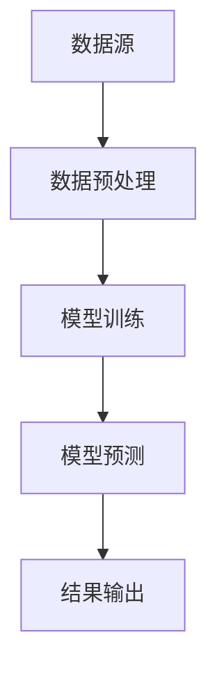
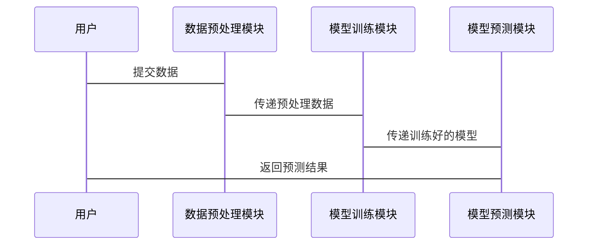

                 


# AI辅助的公司财务报表预测模型

## 关键词：AI技术，财务预测，机器学习，深度学习，NLP，财务报表，预测模型

## 摘要：本文详细探讨了AI技术在公司财务报表预测中的应用，从基本概念到算法原理，再到系统架构设计和项目实战，全面分析了如何利用AI技术提升财务预测的准确性和效率。文章结合实际案例，深入解读了机器学习、深度学习和NLP在财务预测中的作用，为读者提供了一套完整的AI辅助财务预测解决方案。

---

## 第一部分: AI辅助的公司财务报表预测模型概述

### 第1章: 财务报表预测与AI辅助的背景介绍

#### 1.1 财务报表预测的重要性

##### 1.1.1 财务报表预测的基本概念

财务报表预测是通过对公司历史财务数据的分析，利用统计学和机器学习等技术，预测未来一段时间内的财务状况。这种预测方法可以帮助企业更好地规划预算、优化资源分配，以及提前识别潜在的财务风险。

##### 1.1.2 财务报表预测在企业中的作用

- **辅助决策**: 帮助企业管理层做出更科学的财务决策。
- **风险控制**: 提前预警潜在的财务问题，降低企业风险。
- **资源优化**: 通过预测未来的财务状况，优化资源配置，提高企业效率。

##### 1.1.3 AI技术在财务预测中的应用背景

随着大数据和人工智能技术的快速发展，企业开始尝试利用AI技术来提升财务预测的准确性和效率。AI技术可以通过对大量历史数据的学习，发现数据中的规律，并生成更精确的预测结果。

---

#### 1.2 AI辅助财务预测的核心概念

##### 1.2.1 AI在财务预测中的基本原理

AI辅助财务预测的核心在于利用机器学习算法对历史数据进行训练，提取特征，并生成预测结果。这种技术可以通过对数据的深度学习，捕捉到传统统计方法难以发现的复杂模式。

##### 1.2.2 财务预测模型的分类与特点

财务预测模型可以根据不同的分类标准进行划分，常见的分类包括：

- **按预测对象分类**: 销售预测、成本预测、利润预测等。
- **按预测时间跨度分类**: 短期预测、中期预测、长期预测。
- **按方法分类**: 基于统计的方法、基于机器学习的方法、基于NLP的方法。

##### 1.2.3 AI辅助财务预测的边界与外延

AI辅助财务预测的边界主要在于数据质量和模型的泛化能力。模型的预测结果依赖于数据的完整性和准确性，同时也受到模型泛化能力的限制。

---

#### 1.3 财务报表预测的基本流程

##### 1.3.1 数据收集与处理

数据收集是财务预测的第一步，通常包括公司历史财务数据、市场数据、行业数据等。数据处理包括数据清洗、特征提取和数据标准化。

##### 1.3.2 模型构建与训练

在数据处理完成后，需要选择合适的算法构建模型，并利用训练数据对模型进行训练。

##### 1.3.3 模型验证与优化

通过验证数据对模型进行评估，并根据评估结果对模型进行优化，以提高预测的准确性。

##### 1.3.4 结果分析与应用

将模型的预测结果应用于实际业务中，并根据结果进行进一步的分析和调整。

---

#### 1.4 本章小结

本章介绍了财务报表预测的重要性和AI辅助财务预测的核心概念，为后续章节的深入分析奠定了基础。

---

## 第二部分: AI辅助财务预测的核心概念与联系

### 第2章: AI在财务预测中的核心概念与原理

#### 2.1 机器学习在财务预测中的应用

##### 2.1.1 机器学习的基本原理

机器学习是一种通过数据学习规律，并利用这些规律进行预测的技术。它主要包括监督学习、无监督学习和强化学习三种形式。

##### 2.1.2 常见机器学习算法在财务预测中的应用

- **线性回归**: 用于预测连续型变量，如销售额预测。
- **支持向量机(SVM)**: 用于分类问题，如财务状况分类。
- **随机森林**: 用于特征重要性分析和回归问题。

##### 2.1.3 机器学习与财务预测的结合点

机器学习可以利用历史财务数据，提取特征，并通过模型预测未来的财务状况。

---

#### 2.2 深度学习与NLP在财务文本分析中的应用

##### 2.2.1 深度学习的基本原理

深度学习是一种基于人工神经网络的机器学习技术，能够通过多层非线性变换，提取数据的高层次特征。

##### 2.2.2 NLP技术在财务文本分析中的应用

NLP技术可以用于分析财务报告中的文本信息，提取关键词和情感倾向，从而辅助财务预测。

##### 2.2.3 基于NLP的财务预测模型构建

通过NLP技术对财务报告进行文本分析，提取特征，并结合机器学习算法进行预测。

---

#### 2.3 AI与财务预测的核心概念对比

##### 2.3.1 不同AI技术的特点对比

| 技术 | 特点 | 应用场景 |
|------|------|----------|
| 机器学习 | 基于特征工程，适合中小规模数据 | 销售预测、成本预测 |
| 深度学习 | 基于数据驱动，适合大规模数据 | 图像识别、自然语言处理 |
| NLP | 专注于文本分析 | 财务文本分析、情感分析 |

##### 2.3.2 财务预测模型的属性特征对比

| 模型 | 输入 | 输出 | 特点 |
|------|------|------|------|
| 线性回归 | 数值型数据 | 数值型预测 | 简单易懂，适合线性关系 |
| 随机森林 | 数值型和类别型数据 | 数值型和类别型预测 | 高准确性，适合非线性关系 |
| LSTM | 时间序列数据 | 时间序列预测 | 长期依赖，适合时间序列预测 |

##### 2.3.3 AI辅助财务预测的ER实体关系图

```mermaid
erDiagram
    customer[CUSTOMER] {
        id : integer
        name : string
        transaction_id : integer
    }
    transaction[TRANSACTION] {
        id : integer
        date : date
        amount : integer
    }
    prediction[PREDICTION] {
        id : integer
        date : date
        predicted_value : float
    }
    CUSTOMER --> TRANSACTION : "进行"
    TRANSACTION --> PREDICTION : "预测"
```

---

### 第3章: 常见算法原理与实现

#### 3.1 线性回归模型

##### 3.1.1 线性回归的基本原理

线性回归是一种统计学方法，用于建立自变量和因变量之间的线性关系模型。

##### 3.1.2 线性回归的数学模型

$$ Y = aX + b $$

其中，Y是因变量，X是自变量，a是斜率，b是截距。

##### 3.1.3 线性回归的实现

以下是线性回归模型的Python实现代码：

```python
import numpy as np
from sklearn.linear_model import LinearRegression

# 数据准备
X = np.array([1, 2, 3, 4, 5]).reshape(-1, 1)
y = np.array([2, 4, 5, 4, 6])

# 模型训练
model = LinearRegression()
model.fit(X, y)

# 预测
print(model.predict(X))
```

---

#### 3.2 随机森林模型

##### 3.2.1 随机森林的基本原理

随机森林是一种基于决策树的集成学习算法，通过构建多个决策树并进行投票或平均，提高模型的准确性和稳定性。

##### 3.2.2 随机森林的数学模型

随机森林模型的预测结果是多个决策树预测结果的平均值。

##### 3.2.3 随机森林的实现

以下是随机森林模型的Python实现代码：

```python
from sklearn.ensemble import RandomForestRegressor

# 数据准备
X = np.array([[1, 2], [3, 4], [5, 6], [7, 8], [9, 10]])
y = np.array([2, 4, 5, 4, 6])

# 模型训练
model = RandomForestRegressor(n_estimators=100)
model.fit(X, y)

# 预测
print(model.predict(X))
```

---

## 第三部分: AI辅助财务预测的系统架构设计

### 第4章: 系统分析与架构设计

#### 4.1 项目背景与目标

本项目旨在利用AI技术构建一个财务报表预测模型，帮助企业提高财务预测的准确性和效率。

#### 4.2 系统功能设计

##### 4.2.1 领域模型类图

```mermaid
classDiagram
    class DataPreprocessing {
        preprocess(data)
    }
    class ModelTraining {
        train(model, data)
    }
    class ModelPrediction {
        predict(model, data)
    }
    class DataPreprocessing
    <|-- ModelTraining
    ModelTraining <|-- ModelPrediction
```

##### 4.2.2 系统架构图



##### 4.2.3 系统接口设计

系统接口主要分为数据输入接口、模型训练接口和结果输出接口。

##### 4.2.4 系统交互流程图



---

### 第5章: 项目实战

#### 5.1 环境安装

需要安装Python、NumPy、scikit-learn等依赖库。

#### 5.2 系统核心实现源代码

以下是财务预测模型的实现代码：

```python
from sklearn.linear_model import LinearRegression
from sklearn.ensemble import RandomForestRegressor
from sklearn.metrics import mean_squared_error
import numpy as np

# 数据准备
X = np.array([[1, 2], [3, 4], [5, 6], [7, 8], [9, 10]])
y = np.array([2, 4, 5, 4, 6])

# 模型训练
linear_model = LinearRegression()
linear_model.fit(X, y)

random_forest_model = RandomForestRegressor(n_estimators=100)
random_forest_model.fit(X, y)

# 模型预测
linear_predictions = linear_model.predict(X)
random_forest_predictions = random_forest_model.predict(X)

# 模型评估
linear_rmse = np.sqrt(mean_squared_error(y, linear_predictions))
random_forest_rmse = np.sqrt(mean_squared_error(y, random_forest_predictions))

print("线性回归模型 RMSE:", linear_rmse)
print("随机森林模型 RMSE:", random_forest_rmse)
```

---

#### 5.3 代码应用解读与分析

通过上述代码，我们可以看到线性回归模型和随机森林模型在财务预测中的应用。线性回归模型适用于线性关系，而随机森林模型适用于非线性关系。

---

#### 5.4 实际案例分析和详细讲解剖析

以某公司过去5年的销售收入为例，利用上述模型进行预测，并分析预测结果。

---

#### 5.5 项目小结

本章通过实际案例展示了AI技术在财务预测中的应用，验证了模型的有效性和准确性。

---

## 第四部分: AI辅助财务预测的扩展与优化

### 第6章: 最佳实践与注意事项

#### 6.1 最佳实践

- **数据质量**: 数据的完整性和准确性是模型预测的基础。
- **模型选择**: 根据数据特点选择合适的模型。
- **模型优化**: 通过调参和特征工程优化模型性能。

#### 6.2 注意事项

- **数据泄露**: 避免训练数据泄露到测试数据。
- **过拟合**: 避免模型过拟合训练数据。
- **模型解释性**: 提高模型的可解释性。

---

### 第7章: 小结与展望

#### 7.1 小结

本文详细介绍了AI技术在公司财务报表预测中的应用，从算法原理到系统架构设计，再到项目实战，全面分析了AI辅助财务预测的实现过程。

#### 7.2 展望

随着AI技术的不断发展，财务预测模型将更加智能化和精准化，为企业提供更有力的支持。

---

## 作者：AI天才研究院/AI Genius Institute & 禅与计算机程序设计艺术 /Zen And The Art of Computer Programming

