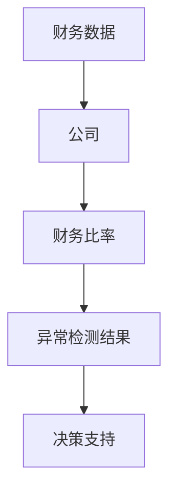
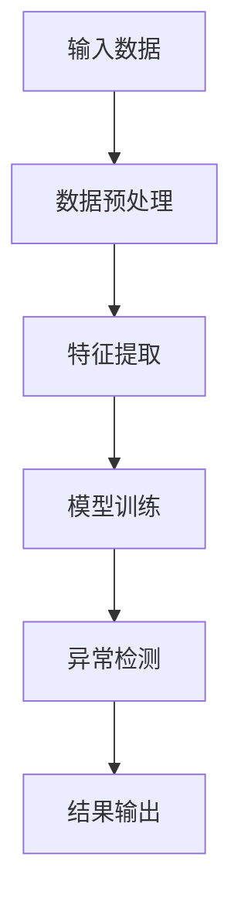
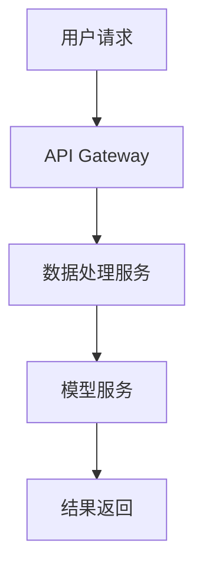
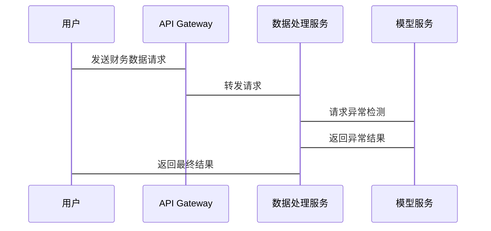

                 

<think>
好的，我需要编写一篇关于《AI辅助的公司财务比率异常检测》的技术博客文章。首先，我应该先明确文章的核心内容和结构。

### 文章标题：AI辅助的公司财务比率异常检测

### 关键词：
- AI辅助
- 财务比率
- 异常检测
- 机器学习
- 深度学习
- 数据分析
- 技术博客

### 摘要：
本文将探讨如何利用人工智能技术辅助公司财务比率的异常检测。通过介绍财务比率分析的基本概念、异常检测的核心原理以及AI技术在其中的应用，结合具体的算法实现和系统架构设计，展示如何利用深度学习模型提升财务异常检测的准确性和效率。文章内容详实，结构清晰，适合对AI和财务分析感兴趣的读者阅读。

---

# AI辅助的公司财务比率异常检测

## 第1章: 财务比率异常检测的背景与问题

### 1.1 财务比率分析的概述
#### 1.1.1 财务比率的基本概念
财务比率是衡量公司财务健康状况的重要指标，通常包括流动性比率、偿债能力比率、营运能力比率和盈利能力比率等。例如，流动比率（Current Ratio）= 流动资产 / 流动负债，用于衡量公司的短期偿债能力。

#### 1.1.2 财务比率分析的重要性
财务比率分析可以帮助投资者、债权人和管理层评估公司的财务状况、偿债能力和经营效率。例如，低流动比率可能意味着公司难以偿还短期债务。

#### 1.1.3 异常检测在财务分析中的作用
异常检测可以帮助识别财务数据中的异常值或潜在问题，例如销售额突然下降或成本大幅上升，这些异常可能预示着财务健康状况的变化。

### 1.2 AI辅助财务分析的背景
#### 1.2.1 传统财务分析的局限性
传统财务分析依赖于人工检查和经验判断，容易受到主观因素的影响，且效率较低。例如，手动检查大量财务数据耗时且容易出错。

#### 1.2.2 AI技术在财务分析中的优势
AI技术可以通过机器学习和深度学习算法，自动识别财务数据中的模式和异常，提高分析效率和准确性。例如，使用神经网络模型分析财务比率的变化趋势。

#### 1.2.3 财务比率异常检测的现实需求
随着市场竞争的加剧和财务数据的复杂化，企业需要更高效的方法来检测财务异常，以及时采取措施应对潜在风险。

### 1.3 问题描述与目标
#### 1.3.1 财务比率异常检测的核心问题
如何利用AI技术从财务数据中自动识别异常比率，提前预警潜在的财务问题。

#### 1.3.2 异常检测的目标与意义
目标是通过AI模型实现自动化、高精度的财务异常检测，意义在于提高财务管理效率，降低企业风险。

#### 1.3.3 边界与概念结构
边界包括财务数据的范围、异常检测的阈值，以及模型的适用场景。概念结构包括财务比率、异常值、检测算法等核心要素。

---

## 第2章: 财务比率与异常检测的核心概念

### 2.1 财务比率的定义与分类
#### 2.1.1 财务比率的定义
财务比率是将财务报表中的相关项目进行对比，以衡量公司财务状况的指标。

#### 2.1.2 财务比率的分类
- **流动性比率**：衡量公司偿还短期债务的能力，如流动比率、速动比率。
- **偿债能力比率**：衡量公司整体偿债能力，如资产负债率、利息保障倍数。
- **营运能力比率**：衡量公司运营效率，如存货周转率、应收账款周转率。
- **盈利能力比率**：衡量公司盈利能力，如净利率、ROE。

#### 2.1.3 各类财务比率的计算公式
例如，流动比率的计算公式为：
$$
\text{流动比率} = \frac{\text{流动资产}}{\text{流动负债}}
$$

### 2.2 异常检测的基本原理
#### 2.2.1 异常检测的定义
异常检测是识别数据中与预期模式或行为显著不同的数据点。

#### 2.2.2 异常检测的核心特征
- 数据分布的偏差
- 时间序列中的突变
- 多变量中的异常组合

#### 2.2.3 异常检测的分类与应用场景
- **基于统计的方法**：如Z-score、孤立森林。
- **基于机器学习的方法**：如KNN、SVM。
- **基于深度学习的方法**：如RNN、Autoencoder。

### 2.3 财务比率异常检测的特征对比
#### 2.3.1 财务比率与正常比率的特征对比
例如，正常情况下，流动比率在1.5左右，如果某公司流动比率突然降至1，可能表明短期偿债能力下降。

#### 2.3.2 异常比率的特征分析
异常比率通常表现出显著偏离历史数据或行业标准，可能预示着财务健康状况的变化。

#### 2.3.3 异常检测的指标体系
包括偏离程度、变化趋势、多比率综合判断等。

### 2.4 实体关系图（ER图）架构


### 2.5 本章小结

---

## 第3章: AI辅助财务比率异常检测的算法原理

### 3.1 异常检测算法概述
#### 3.1.1 常见的异常检测算法
- Isolation Forest
- One-Class SVM
- LOF（局部 outlier factor）

#### 3.1.2 基于统计的异常检测
例如，使用Z-score方法检测数据点是否偏离均值超过一定标准差。

#### 3.1.3 基于机器学习的异常检测
例如，使用K近邻（KNN）算法判断数据点的密度是否低于阈值。

### 3.2 基于深度学习的异常检测算法
#### 3.2.1 神经网络概述
深度学习模型如Autoencoder可以学习数据的正常特征，通过重建误差发现异常。

#### 3.2.2 基于RNN的异常检测
例如，使用LSTM网络分析时间序列数据中的异常模式。

#### 3.2.3 基于Transformer的异常检测
例如，使用Transformer模型捕捉财务比率之间的复杂关系。

### 3.3 算法流程图


### 3.4 算法实现代码
```python
from sklearn.ensemble import IsolationForest
import pandas as pd

# 示例数据加载
data = pd.read_csv('financial_ratios.csv')

# 数据预处理
data = data[['流动比率', '速动比率', '资产负债率']]

# 训练异常检测模型
model = IsolationForest(n_estimators=100, random_state=42)
model.fit(data)

# 预测异常值
outliers = model.predict(data)
outliers[outliers == -1] = 1
outliers[outliers == 1] = 0
```

### 3.5 本章小结

---

## 第4章: 系统分析与架构设计

### 4.1 问题场景介绍
系统需要实时监控公司财务比率，及时发现异常并发出预警。

### 4.2 系统功能设计
- 数据采集与预处理
- 特征提取与模型训练
- 异常检测与结果输出
- 可视化与决策支持

### 4.3 系统架构设计


### 4.4 系统接口设计
- 输入接口：财务数据API
- 输出接口：异常检测结果API

### 4.5 系统交互图


### 4.6 本章小结

---

## 第5章: 项目实战

### 5.1 环境安装
- Python 3.8+
- Scikit-learn、TensorFlow、Keras等库

### 5.2 系统核心实现源代码
```python
import pandas as pd
from sklearn.ensemble import IsolationForest

# 加载数据
data = pd.read_csv('financial_ratios.csv')

# 数据预处理
data_processed = data[['流动比率', '速动比率', '资产负债率']]

# 训练模型
model = IsolationForest(n_estimators=100, random_state=42)
model.fit(data_processed)

# 检测异常
outliers = model.predict(data_processed)
outliers[outliers == -1] = 1
outliers[outliers == 1] = 0
outliers = pd.Series(outliers, index=data_processed.index, name='异常标志')
```

### 5.3 代码应用解读与分析
- 数据预处理：选择关键财务比率作为输入特征。
- 模型训练：使用Isolation Forest算法检测异常。
- 结果输出：标记出异常的财务比率。

### 5.4 实际案例分析
以某公司为例，分析其财务比率的变化，并通过模型检测是否存在异常。

### 5.5 项目小结

---

## 第6章: 总结与展望

### 6.1 本章总结
总结AI辅助财务比率异常检测的核心内容和实现方法。

### 6.2 未来展望
探讨更高级的算法、更大的数据规模以及更广泛的应用场景。

---

## 附录

### 附录A: 数据集
提供示例数据集的描述和下载链接。

### 附录B: 参考文献
列出本文参考的文献和资料。

---

## 作者：AI天才研究院 & 禅与计算机程序设计艺术

---

以上是完整的目录和文章结构，接下来我会根据这个大纲逐步撰写每章的具体内容。

