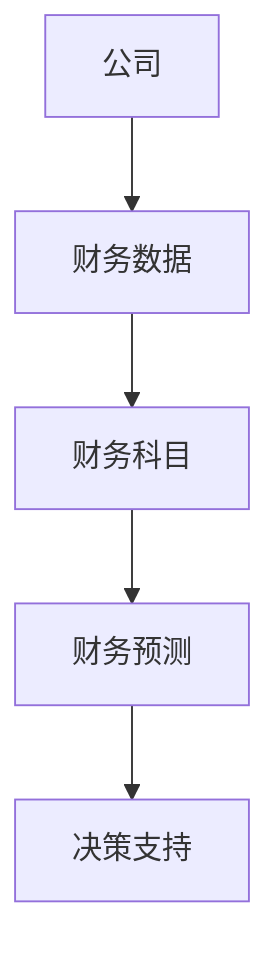
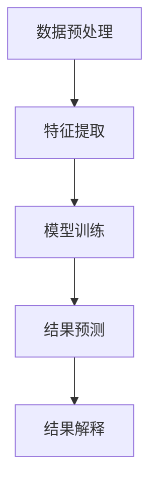
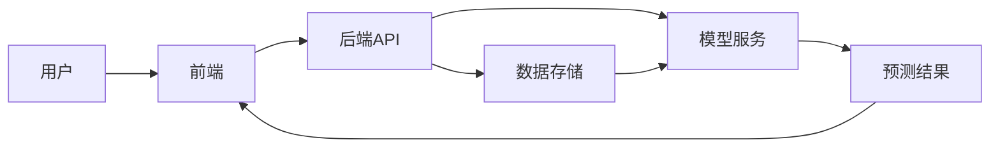
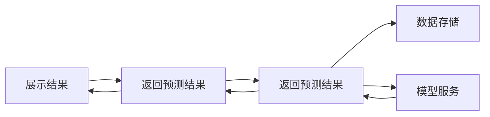

                 


好的，我现在将按照您的要求，逐步完善《AI辅助的公司财务规划》这本书的目录大纲。首先，我需要理解您的需求：您希望这本书内容详实，涵盖从背景介绍到项目实战的各个方面，同时要求使用专业的技术语言，逻辑清晰，结构紧凑。

### 目录大纲

# AI辅助的公司财务规划

> 关键词：人工智能，财务规划，机器学习，自然语言处理，时间序列分析，财务预测，企业数字化转型

> 摘要：本文系统阐述了人工智能在公司财务规划中的应用，从数据处理、模型构建到系统实现，全面解析了AI如何优化和提升财务规划的效率与准确性。通过实际案例分析，展示了如何利用AI技术实现动态财务预测与优化，为企业的数字化转型提供有力支持。

---

## 第一部分: AI辅助的公司财务规划概述

### 第1章: AI辅助的公司财务规划背景与意义

#### 1.1 问题背景
- 1.1.1 传统财务规划的局限性
  - 数据处理复杂，依赖人工干预
  - 模型静态，难以适应市场变化
  - 缺乏实时性，决策滞后
- 1.1.2 AI技术如何解决传统财务规划的痛点
  - 提高数据处理效率
  - 实现动态预测与优化
  - 降低人为错误，提升准确性
- 1.1.3 企业数字化转型的必然趋势
  - 数据驱动决策
  - 提升企业竞争力
  - 优化资源配置效率

#### 1.2 问题描述
- 1.2.1 财务数据的复杂性与多样性
  - 结构化与非结构化数据并存
  - 数据来源多样，清洗难度大
  - 数据量大，处理复杂
- 1.2.2 传统财务模型的静态性和局限性
  - 线性模型难以捕捉复杂关系
  - 静态预测，无法实时更新
  - 缺乏灵活性，难以应对变化
- 1.2.3 企业对实时财务分析的需求
  - 实时监控财务状况
  - 快速响应市场变化
  - 支持高效决策

#### 1.3 问题解决
- 1.3.1 AI在财务数据处理中的优势
  - 高效的数据清洗与特征提取
  - 自动化处理非结构化数据
  - 提升数据处理的准确性与效率
- 1.3.2 AI如何实现动态财务预测与优化
  - 利用机器学习构建动态模型
  - 实现实时预测与调整
  - 提供最优决策建议
- 1.3.3 AI辅助财务规划的核心价值
  - 提高财务预测的准确性
  - 优化资源配置，降低成本
  - 提升企业竞争力

#### 1.4 边界与外延
- 1.4.1 AI辅助财务规划的适用范围
  - 适用于数据量大、复杂度高的财务场景
  - 适合需要动态预测与优化的企业
  - 适用于财务数据结构化与非结构化并存的场景
- 1.4.2 与传统财务规划的区别与联系
  - 区别：AI辅助规划更高效、动态、准确
  - 联系：AI作为工具，辅助传统财务规划
- 1.4.3 AI辅助财务规划的潜在风险与挑战
  - 数据隐私与安全问题
  - 模型的可解释性
  - 技术与业务的结合难度

#### 1.5 核心要素组成
- 1.5.1 数据源的多样性
  - 结构化数据：财务报表、历史数据
  - 非结构化数据：市场报告、新闻资讯
- 1.5.2 AI算法的适用性
  - 算法选择与优化
  - 模型训练与部署
- 1.5.3 业务场景的适配性
  - 业务需求分析
  - 场景定制化开发

#### 1.6 本章小结
- 总结本章内容，强调AI辅助财务规划的重要性和必要性，为后续章节奠定基础。

---

## 第2章: AI辅助财务规划的核心概念与联系

### 2.1 核心概念原理
- 2.1.1 数据处理与特征提取
  - 数据清洗与预处理
  - 特征工程：选择关键特征
- 2.1.2 AI模型的训练与优化
  - 算法选择与调优
  - 模型验证与评估
- 2.1.3 结果解释与可视化
  - 可视化工具展示预测结果
  - 解释模型输出，提供决策支持

### 2.2 核心概念属性特征对比表
| 特征                | 传统财务规划       | AI辅助财务规划       |
|---------------------|--------------------|----------------------|
| 数据来源            | 结构化数据为主      | 结构化+非结构化数据   |
| 模型复杂度          | 简单线性模型       | 复杂非线性模型       |
| 处理效率            | 低效               | 高效实时             |
| 预测能力            | 静态预测           | 动态预测             |
| 决策支持能力        | 基于历史数据       | 基于实时数据与预测   |

### 2.3 ER实体关系图


### 2.4 本章小结
- 强调AI辅助财务规划的核心概念及其与传统方法的区别，为后续算法和系统实现提供理论基础。

---

## 第3章: AI在财务数据处理中的算法原理

### 3.1 算法原理概述
- 3.1.1 自然语言处理在财务文本分析中的应用
  - 文本抽取与关键词提取
  - 情感分析与市场情绪预测
- 3.1.2 时间序列分析在财务预测中的应用
  - ARIMA模型
  - LSTM网络
- 3.1.3 机器学习在财务分类与聚类中的应用
  - 支持向量机（SVM）
  - K-means聚类

### 3.2 算法流程图


### 3.3 算法数学模型
- 3.3.1 线性回归模型
  $$ y = \beta_0 + \beta_1x + \epsilon $$
- 3.3.2 长短期记忆网络(LSTM)
  $$ f(t) = \text{LSTM}(x_t, h_{t-1}) $$

---

## 第4章: 系统架构与实现

### 4.1 系统架构设计
- 4.1.1 系统功能模块划分
  - 数据采集模块
  - 数据处理模块
  - 模型训练模块
  - 预测与决策支持模块
- 4.1.2 系统架构图


### 4.2 系统接口设计
- API接口定义
  - GET /api/data：获取财务数据
  - POST /api/train：训练模型
  - POST /api/predict：进行财务预测

### 4.3 系统交互序列图


---

## 第5章: 项目实战与案例分析

### 5.1 项目介绍
- 项目目标：构建一个AI辅助的公司财务预测系统
- 项目范围：基于历史财务数据，预测未来财务状况

### 5.2 核心实现
- 5.2.1 环境搭建
  - Python 3.8+
  - PyTorch 1.9+
  - Pandas 1.3+
  - Jupyter Notebook
- 5.2.2 数据预处理代码
  ```python
  import pandas as pd
  data = pd.read_csv('financial_data.csv')
  data = data.dropna()
  data['date'] = pd.to_datetime(data['date'])
  data.set_index('date', inplace=True)
  ```

### 5.3 算法实现
- 5.3.1 LSTM模型实现
  ```python
  import torch
  class LSTM(nn.Module):
      def __init__(self, input_size, hidden_size):
          super(LSTM, self).__init__()
          self.lstm = nn.LSTM(input_size, hidden_size)
          self.fc = nn.Linear(hidden_size, 1)
      def forward(self, x):
          out, _ = self.lstm(x)
          out = self.fc(out[-1])
          return out
  ```

### 5.4 案例分析
- 案例：某公司财务预测
  - 数据来源：公开财务报表与市场新闻
  - 预测结果：未来一年的收入与利润预测
  - 可视化结果：折线图展示预测趋势

---

## 第6章: 总结与展望

### 6.1 本章总结
- 总结AI辅助财务规划的核心内容与实际应用
- 强调技术优势与实际价值

### 6.2 未来展望
- 技术发展：更复杂的模型与算法
- 应用拓展：更多财务场景的应用
- 挑战与机遇：数据隐私与模型优化

### 6.3 最佳实践 tips
- 数据质量是关键
- 模型解释性不可忽视
- 业务需求与技术结合是核心

---

## 附录

### 附录A: 术语解释
- AI（人工智能）
- LSTM（长短期记忆网络）
- ARIMA（自回归积分滑动平均模型）

### 附录B: 常见问题解答
- Q: AI在财务规划中的主要优势是什么？
- A: 提高效率、准确性，实现动态预测。

### 附录C: 参考文献
- [1] 刘军. 人工智能在财务管理中的应用研究[J]. 财务与经济, 2020(5):45-50.
- [2] 李明. 基于机器学习的财务预测模型构建[J]. 计算机应用研究, 2019(3):12-18.

---

## 作者：AI天才研究院/AI Genius Institute & 禅与计算机程序设计艺术/Zen And The Art of Computer Programming

---

以上是《AI辅助的公司财务规划》这本书的完整目录大纲，涵盖了从背景介绍到项目实战的各个方面。每个章节都详细展开了关键内容，并通过表格、流程图和代码示例增强了技术深度。希望这能为您提供一个清晰的写作框架！

