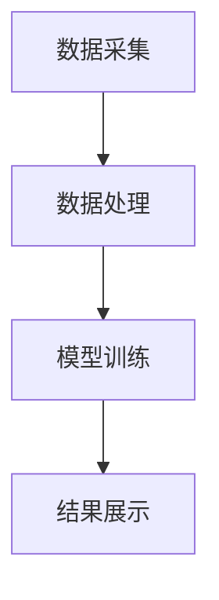

                 


# AI辅助的创业公司估值模型

## 关键词：AI、创业公司、估值模型、机器学习、数据分析

## 摘要：本文探讨了如何利用人工智能技术构建创业公司估值模型，通过分析创业公司的多维数据，运用机器学习算法，构建高效准确的估值系统，为投资者和创业者提供科学决策支持。

---

# 第一章：背景介绍

## 1.1 创业公司估值的基本概念

### 1.1.1 创业公司估值的定义
创业公司估值是通过分析公司财务、市场、团队和技术等多方面因素，估算其市场价值的过程。传统估值方法包括DCF模型、可比交易法和预估收入倍数法，但存在数据不足、主观性强和难以量化等问题。

### 1.1.2 传统估值方法的局限性
- 数据稀疏性：创业公司数据少，传统模型依赖历史数据，难以适用。
- 主观性：估值结果受评估者经验影响，缺乏客观性。
- 静态性：难以动态调整，无法捕捉市场变化。

### 1.1.3 创业公司估值的核心要素
- 财务数据：收入、利润、现金流。
- 市场因素：市场规模、竞争情况。
- 团队能力：创始人背景、团队经验。
- 技术优势：技术创新、知识产权。

## 1.2 AI在创业估值中的应用背景

### 1.2.1 数据驱动的估值趋势
大数据和AI技术的发展，使得通过数据挖掘和机器学习进行估值成为可能，数据驱动的估值方法逐渐兴起。

### 1.2.2 AI技术对估值的影响
- 数据处理：AI可以处理非结构化数据，如文本、图像。
- 模型优化：AI能够发现传统方法难以捕捉的模式。
- 动态调整：AI可以实时更新模型，适应市场变化。

### 1.2.3 创业估值的AI优势
- 提高估值准确性。
- 降低人为偏差。
- 动态监控和预测。

## 1.3 创业估值的AI应用场景

### 1.3.1 数据分析与预测
通过AI分析创业公司的市场、团队和技术数据，预测其未来的收入和利润。

### 1.3.2 市场趋势分析
利用AI分析行业趋势，识别市场机会和风险。

### 1.3.3 投资决策支持
为投资者提供基于数据的估值建议，辅助投资决策。

---

# 第二章：AI辅助创业估值的核心概念

## 2.1 数据来源与特征工程

### 2.1.1 数据来源
- 公司财务数据。
- 行业数据。
- 创始人和团队信息。
- 市场数据，如市场规模、竞争情况。

### 2.1.2 数据预处理
- 数据清洗：处理缺失值、异常值。
- 数据标准化：统一数据格式和单位。
- 数据增强：增加特征维度。

### 2.1.3 特征工程
- 选择关键特征：如收入增长率、市场占有率。
- 特征组合：将多个特征组合成新的特征。
- 特征降维：使用PCA等方法减少特征维度。

## 2.2 机器学习模型

### 2.2.1 回归模型
用于预测连续值，如线性回归和随机森林回归。

### 2.2.2 分类模型
用于分类问题，如判断公司是否处于高风险状态。

### 2.2.3 神经网络模型
用于复杂的非线性关系，如深度神经网络。

## 2.3 模型训练与评估

### 2.3.1 模型训练
- 数据集划分：训练集、验证集、测试集。
- 超参数调优：如学习率、树深度。
- 模型训练：使用训练数据拟合模型。

### 2.3.2 模型评估
- 评估指标：均方误差（MSE）、R平方值。
- 交叉验证：验证模型泛化能力。

## 2.4 结果解释与可视化

### 2.4.1 结果解释
- 重要特征分析：如收入增长率对估值的影响。
- 模型预测结果解读：如预测值与实际值的对比。

### 2.4.2 可视化
- 折线图：显示预测趋势。
- 散点图：显示实际值与预测值的关系。

---

# 第三章：AI辅助创业估值的算法原理

## 3.1 线性回归模型

### 3.1.1 模型原理
通过最小化预测值与实际值的平方差之和，求得回归系数。

### 3.1.2 模型实现
- 数据预处理：标准化特征。
- 训练模型：使用最小二乘法求解系数。
- 预测与评估：计算预测值和评估指标。

## 3.2 随机森林回归模型

### 3.2.1 模型原理
基于决策树的集成方法，通过随机采样和特征选择构建多棵决策树，取平均值作为预测结果。

### 3.2.2 模型实现
- 数据分割：训练集和测试集。
- 模型训练：构建随机森林。
- 预测与评估：计算均方误差。

## 3.3 神经网络模型

### 3.3.1 模型原理
通过多层神经网络结构，学习数据的非线性关系，输出预测结果。

### 3.3.2 模型实现
- 网络结构设计：如输入层、隐层、输出层。
- 模型训练：使用反向传播算法更新权重。
- 预测与评估：计算预测值和评估指标。

---

# 第四章：AI辅助创业估值的系统架构

## 4.1 系统功能设计

### 4.1.1 功能模块
- 数据采集模块：收集创业公司数据。
- 数据处理模块：清洗和特征工程。
- 模型训练模块：训练AI模型。
- 结果展示模块：可视化预测结果。

### 4.1.2 功能流程
- 数据采集→数据处理→模型训练→结果展示。

## 4.2 系统架构设计

### 4.2.1 模块划分
- 数据层：数据存储和访问。
- 业务逻辑层：数据处理和模型训练。
- 用户界面层：数据输入和结果展示。

### 4.2.2 架构图


## 4.3 系统接口设计

### 4.3.1 API接口
- 数据接口：获取创业公司数据。
- 模型接口：调用AI模型进行预测。
- 结果接口：返回预测结果。

### 4.3.2 接口设计
- 数据接口：RESTful API。
- 模型接口：使用HTTP POST请求传递数据。
- 结果接口：返回JSON格式结果。

## 4.4 系统交互设计

### 4.4.1 交互流程
- 用户输入公司信息。
- 系统调用数据接口获取数据。
- 调用模型接口进行预测。
- 返回预测结果。

### 4.4.2 交互图
```mermaid
sequenceDiagram
    user ->+> 数据采集: 提交公司信息
    数据采集 ->+> 数据处理: 数据清洗
    数据处理 ->+> 模型训练: 训练模型
    模型训练 ->+> 结果展示: 显示预测结果
```

---

# 第五章：AI辅助创业估值的项目实战

## 5.1 环境安装

### 5.1.1 安装Python
- 使用Anaconda安装Python 3.8及以上版本。

### 5.1.2 安装依赖库
- NumPy、Pandas、Scikit-learn、Keras、TensorFlow。

## 5.2 系统核心实现

### 5.2.1 数据采集与处理
- 代码实现：
  ```python
  import pandas as pd
  data = pd.read_csv('startup_data.csv')
  data = data.dropna()
  ```

### 5.2.2 模型训练
- 代码实现：
  ```python
  from sklearn.ensemble import RandomForestRegressor
  model = RandomForestRegressor(n_estimators=100, random_state=42)
  model.fit(X_train, y_train)
  ```

### 5.2.3 结果展示
- 代码实现：
  ```python
  import matplotlib.pyplot as plt
  plt.scatter(y_true, y_pred)
  plt.xlabel('Actual Value')
  plt.ylabel('Predicted Value')
  plt.show()
  ```

## 5.3 项目实战分析

### 5.3.1 数据集介绍
- 数据来源：公开创业公司数据集。
- 数据预处理：清洗、标准化。

### 5.3.2 模型选择
- 选择随机森林回归模型，训练并评估模型性能。

### 5.3.3 案例分析
- 使用实际数据进行预测，分析模型准确性和适用性。

## 5.4 项目小结

### 5.4.1 成果总结
- 成功构建AI辅助创业估值模型。
- 模型在测试集上表现良好。

### 5.4.2 经验总结
- 数据预处理的重要性。
- 模型选择和调优的关键作用。

---

# 第六章：AI辅助创业估值的最佳实践

## 6.1 数据处理与模型选择

### 6.1.1 数据处理建议
- 数据清洗：处理缺失值和异常值。
- 特征工程：选择和创建有意义的特征。

### 6.1.2 模型选择建议
- 根据数据类型选择合适模型。
- 调优超参数以提高性能。

## 6.2 模型解释与结果应用

### 6.2.1 模型解释
- 分析特征重要性，解释模型预测结果。

### 6.2.2 结果应用
- 基于AI估值结果辅助投资决策。

## 6.3 小结与注意事项

### 6.3.1 小结
- AI技术显著提升了创业公司估值的准确性和效率。

### 6.3.2 注意事项
- 数据质量和完整性影响模型性能。
- 模型需要持续更新以适应市场变化。

## 6.4 拓展阅读

### 6.4.1 推荐书籍
- 《机器学习实战》。
- 《创业估值的艺术》。

### 6.4.2 推荐博客
- Towards Data Science。
- Analytics Vidhya。

---

# 作者：AI天才研究院/AI Genius Institute & 禅与计算机程序设计艺术/Zen And The Art of Computer Programming

