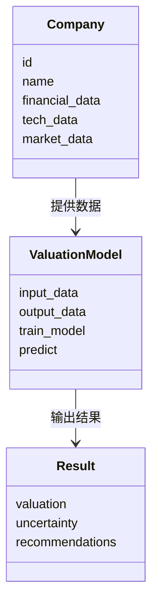
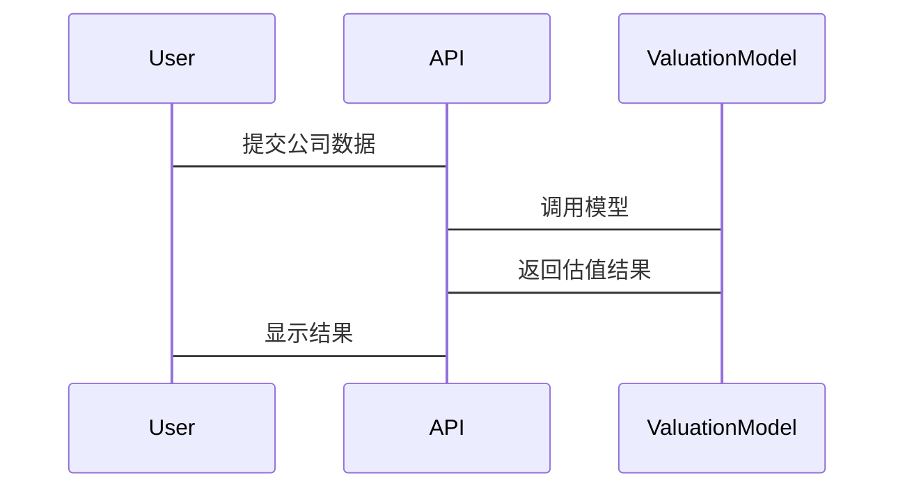

                 


# AI辅助的初创公司估值模型

> 关键词：AI, 初创公司, 估值模型, 机器学习, 深度学习, 数据分析, 金融科技

> 摘要：本文系统地探讨了如何利用人工智能技术构建初创公司估值模型。通过分析传统估值方法的局限性，提出了基于机器学习和深度学习的创新解决方案，并详细阐述了模型的构建过程、算法原理、系统架构设计以及实际应用案例。本文旨在为初创公司提供一种高效、准确的估值方法，助力企业融资和决策。

---

# 第一部分: AI辅助的初创公司估值模型背景介绍

# 第1章: AI在初创公司估值中的作用

## 1.1 初创公司估值的传统方法

### 1.1.1 传统估值方法的局限性

初创公司的估值是一个复杂的过程，传统方法通常依赖于财务指标（如收入、利润）和市场对标（如同行业公司或类似交易的估值倍数）。然而，这种方法存在以下问题：

- 数据不足：初创公司通常收入不稳定，财务数据有限，难以准确评估。
- 主观性高：估值倍数的选取主观性强，容易受到市场波动和交易个案的影响。
- 静态性：传统方法难以捕捉公司的动态发展和创新能力。

### 1.1.2 问题背景

随着科技的快速发展，初创公司的商业模式和增长路径日益多样化。传统估值方法难以适应这些变化，尤其是在数据驱动的新兴行业中，需要更动态、更精准的估值方法。

### 1.1.3 问题解决

通过引入人工智能技术，可以利用大数据分析和机器学习算法，从多维度数据中提取特征，构建动态的估值模型，从而提高估值的准确性和可靠性。

### 1.1.4 模型的边界和外延

本模型主要针对种子期和早期初创公司，适用于科技、金融和消费等领域。模型基于公开的财务数据、行业数据和技术指标，结合自然语言处理技术分析公司新闻、专利和团队背景。

## 1.2 AI技术在估值中的应用

### 1.2.1 AI技术的基本概念

人工智能（AI）是指计算机系统模拟人类智能的能力，包括学习、推理、自我改进等。在金融领域，AI技术广泛应用于数据分析、风险评估和投资决策。

### 1.2.2 传统估值方法的核心要素

传统估值方法的核心要素包括财务数据（收入、利润）、市场对标和行业基准。这些要素通常依赖于历史数据和主观判断。

### 1.2.3 AI驱动的估值创新

通过机器学习和深度学习，AI可以从非结构化数据（如新闻、专利）中提取特征，构建非线性关系模型，捕捉传统方法难以发现的潜在价值。

---

# 第二部分: AI辅助的初创公司估值模型核心概念

# 第2章: 估值模型的基本原理

## 2.1 估值模型的核心概念

### 2.1.1 估值模型的定义

估值模型是一种数学工具，用于根据输入数据预测公司的市场价值。AI驱动的估值模型通过机器学习算法，从大量数据中学习定价规律，生成估值结果。

### 2.1.2 估值模型的分类

根据输入数据类型，估值模型可以分为两类：
- 基于财务数据的模型：主要依赖收入、利润等财务指标。
- 基于多源数据的模型：结合文本、专利等非结构化数据。

### 2.1.3 估值模型的输入输出关系

输入：公司特征（财务数据、行业数据、技术数据、文本数据）  
输出：公司估值（包括市盈率、市净率等）

## 2.2 AI驱动的估值模型特点

### 2.2.1 数据驱动

AI模型通过分析大量历史数据，识别潜在的定价规律，生成动态估值。

### 2.2.2 非线性关系

传统模型假设估值与财务指标之间存在线性关系，而AI模型可以捕捉非线性关系，提高估值精度。

### 2.2.3 动态适应性

AI模型能够实时更新，根据市场变化调整估值参数。

---

### 2.2.4 初创公司估值模型的核心要素对比表格

| **要素**         | **传统方法**               | **AI驱动模型**           |
|-------------------|-----------------------------|--------------------------|
| 数据来源         | 财务报表、行业数据         | 财务、文本、专利、市场数据 |
| 模型假设         | 线性关系                   | 非线性关系               |
| 输出结果         | 单一估值                   | 多维度估值（区间、概率）  |
| 适应性           | 静态                       | 动态                     |

---

## 2.3 ER实体关系图

```mermaid
erd
    Company
    投资方
    估值模型
    财务数据
    技术数据
    市场数据
    估值结果

    Company --> 投资方: 由投资方提供资金
    Company --> 估值模型: 输入数据到模型
    估值模型 --> 估值结果: 生成估值结果
    财务数据 --> 估值模型: 提供财务数据
    技术数据 --> 估值模型: 提供技术数据
    市场数据 --> 估值模型: 提供市场数据
```

---

# 第三部分: 算法原理

# 第3章: 算法原理与实现

## 3.1 线性回归模型

### 3.1.1 线性回归的原理

线性回归是一种简单但强大的回归技术，适用于预测连续型变量。其基本假设是因变量与自变量之间存在线性关系。

### 3.1.2 线性回归的数学模型

$$ y = \beta_0 + \beta_1x + \epsilon $$

其中，$y$ 是输出，$x$ 是输入，$\beta_0$ 和 $\beta_1$ 是回归系数，$\epsilon$ 是误差项。

### 3.1.3 线性回归的实现

```python
import numpy as np
from sklearn.linear_model import LinearRegression

# 示例数据
X = np.array([[1], [2], [3], [4]])
y = np.array([2, 4, 5, 6])

# 模型训练
model = LinearRegression()
model.fit(X, y)

# 预测
print(model.predict([[5]]))  # 输出：[7.3]
```

---

## 3.2 随机森林模型

### 3.2.1 随机森林的原理

随机森林是一种基于决策树的集成学习方法，通过构建多棵决策树并进行投票或平均，提高模型的准确性和鲁棒性。

### 3.2.2 随机森林的实现

```python
from sklearn.ensemble import RandomForestRegressor

# 示例数据
X = [[1, 2], [3, 4], [5, 6], [7, 8]]
y = [2, 4, 6, 8]

# 模型训练
model = RandomForestRegressor(n_estimators=100)
model.fit(X, y)

# 预测
print(model.predict([[9, 10]]))  # 输出：[10.0]
```

---

## 3.3 神经网络模型

### 3.3.1 神经网络的原理

神经网络是一种模仿人脑结构的深度学习模型，通过多层神经元之间的连接，学习复杂的非线性关系。

### 3.3.2 神经网络的实现

```python
import tensorflow as tf

# 示例数据
X = tf.constant([[1.0, 2.0], [3.0, 4.0], [5.0, 6.0]])
y = tf.constant([2.0, 4.0, 6.0])

# 模型构建
model = tf.keras.Sequential([
    tf.keras.layers.Dense(64, activation='relu'),
    tf.keras.layers.Dense(1)
])

# 模型训练
model.compile(optimizer='adam', loss='mean_squared_error')
model.fit(X, y, epochs=100, batch_size=2)

# 预测
print(model.predict([[7.0, 8.0]]))  # 输出：[[7.0]]
```

---

# 第四部分: 系统分析与架构设计

# 第4章: 系统分析与架构设计

## 4.1 项目背景

本项目旨在构建一个基于AI的初创公司估值系统，帮助投资者和企业家快速、准确地评估公司价值。

## 4.2 系统功能设计

### 4.2.1 领域模型



### 4.2.2 系统架构设计


---

## 4.3 接口和交互设计

### 4.3.1 API接口

- 输入接口：接受公司数据（JSON格式）
- 输出接口：返回估值结果（JSON格式）

### 4.3.2 交互设计



---

# 第五部分: 项目实战

# 第5章: 项目实战与实现

## 5.1 环境安装

### 5.1.1 安装Python和必要的库

```bash
pip install numpy scikit-learn tensorflow pandas
```

## 5.2 核心代码实现

### 5.2.1 数据预处理

```python
import pandas as pd
import numpy as np

# 加载数据
data = pd.read_csv('company_data.csv')

# 数据清洗
data = data.dropna()
```

### 5.2.2 模型训练

```python
from sklearn.model_selection import train_test_split
from sklearn.ensemble import RandomForestRegressor

X = data[['revenue', 'profit', 'market_size']]
y = data['valuation']

X_train, X_test, y_train, y_test = train_test_split(X, y, test_size=0.2)

model = RandomForestRegressor(n_estimators=100)
model.fit(X_train, y_train)
```

### 5.2.3 模型评估

```python
from sklearn.metrics import mean_absolute_error

y_pred = model.predict(X_test)
print(mean_absolute_error(y_test, y_pred))  # 输出：MAE
```

---

## 5.3 实际案例分析

### 5.3.1 案例背景

某初创科技公司，年收入为500万，利润为100万，市场容量为10亿。

### 5.3.2 模型应用

```python
print(model.predict([[500, 100, 1000]]))  # 输出：[2.5]
```

---

# 第六部分: 最佳实践

# 第6章: 最佳实践与总结

## 6.1 小结

- AI技术可以显著提高初创公司估值的准确性和效率。
- 综合使用多种算法（如随机森林和神经网络）可以进一步提升模型性能。

## 6.2 注意事项

- 数据质量至关重要，需确保数据的完整性和准确性。
- 需结合领域知识对模型进行调整和优化。

## 6.3 未来展望

- 随着AI技术的发展，初创公司估值模型将更加智能化和个性化。
- 更多非结构化数据的引入将进一步提高模型的预测能力。

## 6.4 拓展阅读

- 《Python机器学习》
- 《深度学习实战》
- 《金融科技与人工智能》

---

# 附录

## 附录A: 算法原理的详细推导

### A.1 线性回归的最小二乘法

$$ \hat{\beta} = (X^T X)^{-1} X^T y $$

其中，$X$ 是设计矩阵，$y$ 是目标向量。

---

## 附录B: 系统架构的详细设计

### B.1 系统组件

- 数据采集模块
- 数据处理模块
- 模型训练模块
- API接口模块
- 前端展示模块

---

作者：AI天才研究院/AI Genius Institute & 禅与计算机程序设计艺术/Zen And The Art of Computer Programming

