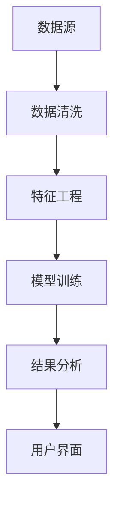

                 


# AI辅助的初创公司估值模型校准

**关键词**：AI辅助、初创公司、估值模型、机器学习、深度学习、系统架构

**摘要**：本文详细探讨了如何利用人工智能技术优化初创公司的估值模型。通过分析传统估值方法的局限性，结合机器学习和深度学习算法，提出了一种基于AI的估值模型校准方法。文章从背景介绍、核心概念、算法原理到系统架构、项目实战，全面阐述了AI在初创公司估值中的应用，最后总结了最佳实践和未来研究方向。

---

# 第1章: 初创公司估值与AI辅助的背景介绍

## 1.1 初创公司估值的背景与重要性

### 1.1.1 初创公司估值的基本概念
初创公司的估值是企业融资、并购和战略规划的重要基础。传统估值方法依赖于财务指标和行业经验，但在数据不足和市场波动大的情况下，往往存在较大的主观性和不确定性。

### 1.1.2 传统估值方法的局限性
传统估值方法如DCF模型和相对估值法在初创公司中应用受限。初创公司通常缺乏历史数据，且未来现金流难以预测，导致传统模型的假设难以满足。

### 1.1.3 AI技术在估值中的潜在价值
AI技术通过大数据分析和模式识别，能够从非结构化数据中提取有价值的信息，提升估值的准确性和鲁棒性。AI还能实时更新模型，适应市场变化，为初创公司提供动态估值支持。

## 1.2 AI在金融领域的应用现状

### 1.2.1 AI在金融分析中的应用领域
AI在金融领域的应用包括股票预测、风险评估、欺诈检测和信用评分等。在企业估值方面，AI技术能够处理海量数据，发现传统方法难以察觉的模式。

### 1.2.2 AI在企业估值中的优势
AI能够处理非结构化数据，如新闻、社交媒体和行业报告，构建更全面的估值模型。此外，AI的自适应学习能力使其能够快速响应市场变化，提供实时估值支持。

### 1.2.3 当前AI辅助估值的挑战与机遇
尽管AI在估值中表现出巨大潜力，但数据质量、模型解释性和计算资源等仍面临挑战。未来，随着技术进步和数据积累，AI辅助估值将更加普及和精准。

## 1.3 本书的核心目标与内容框架

### 1.3.1 本书的核心目标
本书旨在探讨如何利用AI技术优化初创公司的估值模型，提供从理论到实践的全面指导。

### 1.3.2 本书的主要内容框架
- 第1章：背景介绍
- 第2章：估值模型的核心概念与原理
- 第3章：估值模型的核心算法与实现
- 第4章：估值模型的系统架构与设计
- 第5章：项目实战：AI辅助的初创公司估值模型实现
- 第6章：最佳实践、小结与展望

### 1.3.3 本书的读者群体与适用场景
本书适合金融从业者、数据科学家、初创公司创始人以及对AI在金融领域应用感兴趣的技术人员阅读。内容涵盖理论与实践，适合不同层次的读者学习和参考。

---

# 第2章: 估值模型的核心概念与原理

## 2.1 估值模型的基本原理

### 2.1.1 估值模型的定义与分类
估值模型通过分析企业的财务数据、市场环境和行业趋势，预测其市场价值。常见的模型包括DCF模型、相对估值法和情景分析法。

### 2.1.2 常见的估值方法概述
- **绝对估值法**：DCF模型，基于未来现金流的现值计算企业价值。
- **相对估值法**：市盈率、市净率等指标，基于可比公司数据进行估值。
- **情景分析法**：基于不同假设分析企业价值的变化。

### 2.1.3 数据驱动的估值模型特点
数据驱动的估值模型依赖于大量数据，通过机器学习算法自动提取特征，建立预测模型。其优势在于能够处理非结构化数据，并实时更新模型参数。

## 2.2 机器学习在估值中的应用原理

### 2.2.1 机器学习的基本概念
机器学习通过训练数据，学习特征与目标变量之间的关系，构建预测模型。监督学习、无监督学习和强化学习是常用的三种学习方式。

### 2.2.2 监督学习在估值中的应用
监督学习通过训练数据，预测目标变量。在估值中，监督学习常用于预测企业价值或判断企业是否被高估或低估。

### 2.2.3 特征工程在估值模型中的作用
特征工程是将原始数据转化为模型可用的特征，直接影响模型的性能。常用的特征包括财务指标、市场数据和文本数据等。

## 2.3 估值模型校准的数学基础

### 2.3.1 线性回归与最小二乘法
线性回归是最简单的回归模型，通过最小化预测值与实际值的平方差之和，找到最佳拟合线。数学公式如下：
$$
\hat{y} = \beta_0 + \beta_1x
$$
其中，$\hat{y}$是预测值，$\beta_0$和$\beta_1$是回归系数，$x$是自变量。

### 2.3.2 距离度量与相似性分析
距离度量如欧氏距离和曼哈顿距离用于衡量数据点的相似性，常用于聚类分析和降维技术。

### 2.3.3 概率论与统计推断基础
概率论是机器学习的理论基础，统计推断用于模型参数估计和假设检验。例如，贝叶斯定理常用于概率建模。

---

# 第3章: 估值模型的核心算法与实现

## 3.1 线性回归算法

### 3.1.1 线性回归的基本原理
线性回归通过最小二乘法找到最佳拟合线，预测目标变量。其优点是简单易懂，但对非线性关系的拟合能力有限。

### 3.1.2 最小二乘法的数学推导
最小二乘法通过优化目标函数找到最佳回归系数：
$$
\text{最小化} \sum_{i=1}^n (y_i - (\beta_0 + \beta_1x_i))^2
$$

### 3.1.3 线性回归的Python实现
以下代码示例展示了线性回归的实现：
```python
import numpy as np
from sklearn.linear_model import LinearRegression

# 示例数据
X = np.array([1, 2, 3, 4, 5]).reshape(-1, 1)
y = np.array([2, 4, 5, 4, 6])

# 模型训练
model = LinearRegression()
model.fit(X, y)

# 预测
print(model.predict(X))
```

### 3.1.4 线性回归的优缺点
线性回归的优点是简单高效，缺点是无法处理复杂的数据关系，容易受异常值影响。

## 3.2 机器学习算法在估值中的应用

### 3.2.1 传统机器学习算法
- **支持向量机(SVM)**：适用于分类问题，也可用于回归。
- **随机森林**：通过集成学习提升模型的准确性和鲁棒性。
- **K-近邻算法(KNN)**：基于相似性进行预测。

### 3.2.2 深度学习算法
- **神经网络**：通过多层网络结构学习复杂特征。
- **长短期记忆网络(LSTM)**：适用于时间序列数据的预测。

### 3.2.3 传统机器学习与深度学习的对比
| 特性 | 传统机器学习 | 深度学习 |
|------|--------------|----------|
| 数据需求 | 需要大量特征工程 | 需要大量数据 |
| 模型复杂度 | 较低 | 较高 |
| 可解释性 | 较高 | 较低 |

## 3.3 估值模型的特征工程

### 3.3.1 特征选择与降维
特征选择通过筛选重要特征提高模型性能，降维技术如主成分分析(PCA)减少特征数量。

### 3.3.2 特征变换与标准化
特征变换如对数变换和正则化处理，标准化如Z-score标准化，确保模型输入的均匀性。

### 3.3.3 文本数据的特征提取
文本数据通过词袋模型或词嵌入技术（如Word2Vec）转化为数值特征，用于模型训练。

---

# 第4章: 估值模型的系统架构与设计

## 4.1 系统架构设计

### 4.1.1 系统架构概述
系统架构包括数据采集、特征工程、模型训练、结果分析和用户界面五个模块。

### 4.1.2 数据流图


### 4.1.3 模块功能描述
- 数据清洗：处理缺失值和异常值。
- 特征工程：提取和转换特征。
- 模型训练：训练机器学习模型。
- 结果分析：评估模型性能并优化。
- 用户界面：提供交互界面，供用户查询和分析。

## 4.2 系统设计中的关键技术

### 4.2.1 数据采集与处理
数据采集包括财务数据、市场数据和文本数据，处理过程包括清洗和预处理。

### 4.2.2 模型部署与优化
模型部署后，定期更新数据和优化参数，确保模型性能。

### 4.2.3 结果可视化与解释
通过可视化工具展示模型结果，帮助用户理解和使用估值结果。

---

# 第5章: 项目实战：AI辅助的初创公司估值模型实现

## 5.1 项目背景与目标

### 5.1.1 项目背景
选择一家初创公司，利用AI技术优化其估值模型。

### 5.1.2 项目目标
实现一个基于机器学习的估值模型，准确预测公司价值。

## 5.2 环境配置与数据收集

### 5.2.1 环境配置
安装必要的Python库，如NumPy、Pandas、Scikit-learn和TensorFlow。

### 5.2.2 数据收集
收集目标公司的财务数据、市场数据和行业报告。

## 5.3 特征工程与模型训练

### 5.3.1 数据清洗
处理缺失值和异常值，确保数据质量。

### 5.3.2 特征工程
提取关键特征，如收入增长率和利润率。

### 5.3.3 模型训练
选择合适的算法，训练模型并评估性能。

## 5.4 模型优化与结果分析

### 5.4.1 模型优化
调整超参数，如学习率和正则化系数，优化模型性能。

### 5.4.2 结果分析
评估模型的准确性和稳定性，分析预测结果与实际值的差异。

## 5.5 项目小结

### 5.5.1 项目成果
成功实现了AI辅助的估值模型，提高了估值的准确性和效率。

### 5.5.2 经验总结
数据质量、特征工程和模型选择是影响模型性能的关键因素。

---

# 第6章: 最佳实践、小结与展望

## 6.1 最佳实践

### 6.1.1 数据质量的重要性
确保数据的准确性和完整性，是模型性能的基础。

### 6.1.2 模型调优的注意事项
合理选择算法和超参数，避免过拟合和欠拟合。

### 6.1.3 结果验证的技巧
使用交叉验证和性能指标，如R²和均方误差，评估模型性能。

## 6.2 小结

本文系统介绍了AI辅助的初创公司估值模型校准方法，从理论到实践，详细讲解了模型的设计与实现。通过项目实战，展示了AI技术在企业估值中的应用潜力。

## 6.3 未来展望

未来的研究方向包括多模态数据融合、模型解释性和实时估值系统开发。随着技术进步，AI将在企业估值中发挥更大的作用。

---

# 作者：AI天才研究院/AI Genius Institute & 禅与计算机程序设计艺术 /Zen And The Art of Computer Programming

