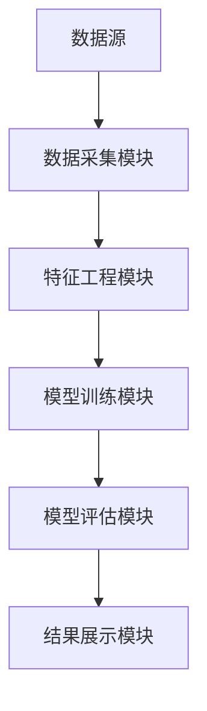
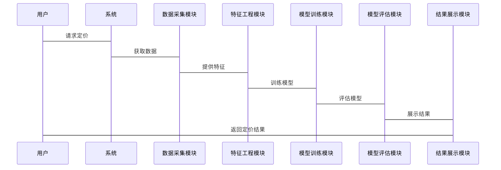

                 


# AI辅助的多资产类别定价模型

> 关键词：AI辅助，多资产定价，机器学习，定价模型，金融数据分析

> 摘要：本文深入探讨了AI在多资产类别定价中的应用，从基础理论到实际应用，详细讲解了如何利用机器学习算法构建高效、准确的定价模型。文章涵盖了从数据特征工程、算法原理到系统架构设计的全过程，通过实际案例展示了AI在金融定价中的潜力与价值。

---

## 第1章: 多资产类别定价模型的背景与目标

### 1.1 多资产定价的背景与重要性

#### 1.1.1 传统资产定价模型的局限性
传统的资产定价模型（如CAPM和APT）在金融领域被广泛应用，但它们存在以下局限性：
- 无法处理高维数据。
- 忽略了市场动态变化和非线性关系。
- 无法有效捕捉复杂市场行为。

#### 1.1.2 AI技术在金融领域的应用潜力
人工智能技术的快速发展为金融领域带来了新的机遇：
- **数据处理能力**：AI能够处理海量数据，提取复杂特征。
- **非线性建模**：机器学习算法可以捕捉数据中的非线性关系。
- **实时性**：AI能够快速响应市场变化，提供实时定价支持。

#### 1.1.3 多资产定价模型的目标与意义
多资产定价模型的目标是通过AI技术，实现对多种资产的高效定价，提升定价的准确性和效率。其意义在于：
- 提高投资决策的科学性。
- 优化资产配置。
- 提升金融机构的核心竞争力。

### 1.2 AI辅助定价的核心概念

#### 1.2.1 什么是AI辅助定价
AI辅助定价是指利用人工智能技术（如机器学习、深度学习）来辅助或替代传统定价模型，实现对资产价格的预测和评估。

#### 1.2.2 多资产定价模型的特点
- **多维性**：能够同时处理多种资产类别。
- **动态性**：能够实时更新定价模型。
- **复杂性**：需要处理复杂的市场数据和非线性关系。

#### 1.2.3 AI在定价中的作用与优势
- **数据驱动**：AI能够从大量数据中提取有价值的信息。
- **自适应性**：模型能够自动调整以适应市场变化。
- **高精度**：通过复杂算法，提高定价的准确性。

---

## 第2章: 多资产定价模型的理论基础

### 2.1 资产定价的基本原理

#### 2.1.1 资产定价的定义与分类
- **定义**：资产定价是通过分析资产的内在价值，确定其合理价格的过程。
- **分类**：资产可以分为股票、债券、房地产等多种类别。

#### 2.1.2 资产定价的核心要素
- **风险**：资产的风险程度直接影响其定价。
- **收益**：资产的预期收益是定价的重要依据。
- **市场环境**：宏观经济环境和市场情绪影响定价。

#### 2.1.3 资产定价的数学模型
- **CAPM模型**：
  $$ E(r_i) = r_f + \beta_i (E(r_m) - r_f) $$
  其中，\(E(r_i)\) 是资产 \(i\) 的预期收益，\(r_f\) 是无风险利率，\(\beta_i\) 是资产 \(i\) 的贝塔系数，\(E(r_m)\) 是市场预期收益。

### 2.2 AI在资产定价中的应用

#### 2.2.1 机器学习在资产定价中的作用
- **特征工程**：提取有用的特征，如技术指标、市场情绪等。
- **模型训练**：利用机器学习算法（如随机森林、神经网络）训练定价模型。
- **预测与评估**：通过模型预测资产价格，并评估模型的准确性。

#### 2.2.2 常见的AI定价算法
- **线性回归**：适用于线性关系的资产定价。
- **随机森林**：适用于高维数据和非线性关系。
- **神经网络**：适用于复杂的市场行为和动态变化。

#### 2.2.3 数据特征对定价的影响
- **特征的重要性**：不同特征对定价的影响程度不同。
- **特征选择**：通过特征选择优化模型性能。

### 2.3 多资产定价模型的构建逻辑

#### 2.3.1 数据采集与特征工程
- **数据来源**：市场数据、财务数据、新闻数据等。
- **特征工程**：提取有用的特征，如技术指标、市场情绪、宏观经济指标等。

#### 2.3.2 模型选择与训练
- **模型选择**：根据数据特点选择合适的模型。
- **模型训练**：利用训练数据训练模型。
- **超参数调优**：通过调优模型参数提升性能。

#### 2.3.3 模型验证与优化
- **验证方法**：利用测试数据验证模型性能。
- **模型优化**：通过优化算法和参数提升模型性能。
- **持续更新**：定期更新模型以适应市场变化。

---

## 第3章: AI辅助定价模型的算法原理

### 3.1 线性回归模型

#### 3.1.1 线性回归的定义与特点
- **定义**：线性回归是一种统计学方法，用于建立自变量和因变量之间的线性关系。
- **特点**：简单易懂，计算效率高，但只能处理线性关系。

#### 3.1.2 线性回归的数学公式
$$ y = \beta_0 + \beta_1x + \epsilon $$
其中，\(y\) 是因变量，\(x\) 是自变量，\(\beta_0\) 和 \(\beta_1\) 是回归系数，\(\epsilon\) 是误差项。

#### 3.1.3 线性回归的实现步骤
1. 数据准备：收集和整理数据。
2. 特征工程：选择和处理特征。
3. 模型训练：利用最小二乘法求解回归系数。
4. 模型评估：计算模型的拟合优度和预测准确性。

### 3.2 随机森林模型

#### 3.2.1 随机森林的定义与特点
- **定义**：随机森林是一种基于决策树的集成学习算法。
- **特点**：能够处理高维数据，具有较强的抗过拟合能力，计算效率较高。

#### 3.2.2 随机森林的工作原理
1. **特征选择**：随机选择部分特征进行决策树的构建。
2. **袋装法**：通过随机抽样生成多棵决策树。
3. **投票法**：通过投票法确定最终的预测结果。

#### 3.2.3 随机森林的优缺点
- **优点**：能够处理高维数据，具有较强的泛化能力。
- **缺点**：计算复杂度较高，解释性较差。

### 3.3 神经网络模型

#### 3.3.1 神经网络的定义与特点
- **定义**：神经网络是一种模仿人脑结构和功能的计算模型。
- **特点**：能够处理复杂的非线性关系，具有较强的适应性。

#### 3.3.2 神经网络的工作原理
1. **输入层**：接收输入数据。
2. **隐藏层**：通过激活函数进行非线性变换。
3. **输出层**：输出最终的预测结果。

#### 3.3.3 神经网络的优缺点
- **优点**：能够处理复杂的市场行为和动态变化。
- **缺点**：计算复杂度高，解释性较差。

---

## 第4章: 多资产定价模型的系统架构设计

### 4.1 系统功能设计

#### 4.1.1 系统模块划分
- **数据采集模块**：负责采集市场数据、财务数据等。
- **特征工程模块**：负责提取和处理特征。
- **模型训练模块**：负责训练定价模型。
- **模型评估模块**：负责评估模型的性能。
- **结果展示模块**：负责展示定价结果。

#### 4.1.2 系统功能流程
1. 数据采集：从多种数据源采集数据。
2. 特征工程：对数据进行清洗和特征提取。
3. 模型训练：利用训练数据训练定价模型。
4. 模型评估：通过测试数据评估模型性能。
5. 结果展示：将定价结果以可视化形式展示。

#### 4.1.3 系统功能的实现步骤
1. 数据源的选择与采集。
2. 数据清洗与预处理。
3. 特征工程与模型训练。
4. 模型评估与优化。
5. 结果展示与分析。

### 4.2 系统架构设计

#### 4.2.1 系统架构图
以下是系统架构设计的mermaid图：



#### 4.2.2 系统接口设计
- **数据接口**：提供数据输入和输出的接口。
- **模型接口**：提供模型训练和预测的接口。
- **结果接口**：提供结果展示和分析的接口。

#### 4.2.3 系统交互设计
以下是系统交互的mermaid序列图：



---

## 第5章: AI辅助多资产定价模型的项目实战

### 5.1 环境安装与配置

#### 5.1.1 环境需求
- **操作系统**：Windows/Mac/Linux
- **Python版本**：Python 3.6以上
- **依赖库**：numpy、pandas、scikit-learn、tensorflow

#### 5.1.2 环境配置
1. 安装Python和必要的依赖库。
2. 配置开发环境（如Jupyter Notebook）。

### 5.2 项目核心实现

#### 5.2.1 数据采集与预处理

```python
import pandas as pd
import numpy as np

# 数据采集
data = pd.read_csv('stock_data.csv')

# 数据清洗
data = data.dropna()
data = data.drop_duplicates()

# 特征工程
data['Moving_Average_50'] = data['Close'].rolling(50).mean()
data['Moving_Average_20'] = data['Close'].rolling(20).mean()
```

#### 5.2.2 模型训练与优化

```python
from sklearn.ensemble import RandomForestRegressor
from sklearn.metrics import mean_squared_error

# 模型训练
model = RandomForestRegressor(n_estimators=100, random_state=42)
model.fit(X_train, y_train)

# 模型预测
y_pred = model.predict(X_test)

# 模型评估
mse = mean_squared_error(y_test, y_pred)
print(f'Mean Squared Error: {mse}')
```

#### 5.2.3 结果展示与分析

```python
import matplotlib.pyplot as plt

plt.figure(figsize=(10, 6))
plt.plot(y_test, label='实际值')
plt.plot(y_pred, label='预测值')
plt.xlabel('时间')
plt.ylabel('价格')
plt.legend()
plt.show()
```

### 5.3 项目小结

#### 5.3.1 项目实现的关键点
- 数据采集与预处理：确保数据的完整性和准确性。
- 模型选择与优化：选择合适的模型并进行参数调优。
- 结果展示与分析：通过可视化工具展示结果并分析模型性能。

#### 5.3.2 项目的意义与价值
- 通过实际案例展示了AI在多资产定价中的应用。
- 提供了一套完整的项目实现流程，为读者提供参考。

---

## 第6章: 总结与展望

### 6.1 总结

#### 6.1.1 本书的核心内容回顾
- 多资产定价模型的背景与目标。
- AI在资产定价中的应用与优势。
- 常见AI定价算法的原理与实现。
- 系统架构设计与项目实战。

#### 6.1.2 本书的收获与启示
- 掌握了AI辅助多资产定价的核心理论。
- 学习了如何利用机器学习算法构建定价模型。
- 理解了系统架构设计的重要性。

### 6.2 展望

#### 6.2.1 未来的发展方向
- **多模态数据的应用**：结合文本、图像等多种数据源。
- **可解释性提升**：提高模型的透明度和解释性。
- **实时定价系统**：开发实时更新的定价模型。

#### 6.2.2 对读者的建议
- 持续关注AI在金融领域的最新进展。
- 多实践，积累实际经验。
- 深入学习相关算法和理论。

---

## 作者：AI天才研究院 & 禅与计算机程序设计艺术

