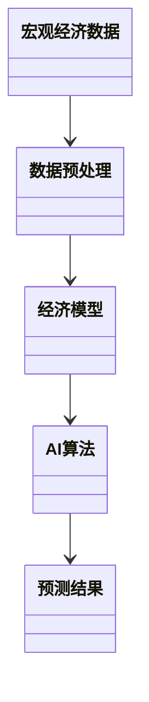
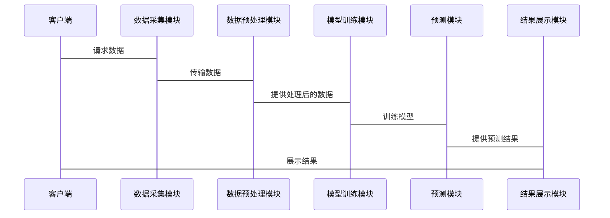

                 


# AI辅助的宏观经济情景分析

## 关键词：
AI技术、宏观经济分析、情景分析、时间序列分析、机器学习、深度学习、经济预测

## 摘要：
本文详细探讨了AI技术在宏观经济情景分析中的应用，从基本概念、算法原理到系统架构设计，再到实际案例分析，全面解析了AI如何辅助宏观经济分析。通过分析宏观经济模型与AI技术的结合，阐述了AI在数据处理、模型优化和预测中的重要作用，并展示了实际项目中的实现步骤和结果解读，为读者提供了深入的技术指导和实践参考。

---

## 第一部分: 宏观经济情景分析的背景与概念

### 第1章: 宏观经济情景分析概述

#### 1.1 宏观经济情景分析的定义与背景
##### 1.1.1 宏观经济分析的基本概念
宏观经济分析是研究经济整体运行状况的学科，主要关注GDP、通货膨胀率、失业率等关键指标。通过分析这些指标，可以帮助政府和企业制定更有效的经济政策和商业策略。

##### 1.1.2 宏观经济情景分析的背景与意义
随着经济全球化和数据化的加速，宏观经济分析的复杂性不断增加。传统的分析方法依赖于人工经验，难以应对海量数据和复杂模型的挑战。AI技术的引入为宏观经济分析提供了新的可能性，能够提高分析效率和准确性。

##### 1.1.3 宏观经济情景分析的核心问题
- 如何利用AI技术优化宏观经济模型？
- 如何处理和分析宏观经济数据？
- 如何构建高效的宏观经济情景分析系统？

#### 1.2 AI在宏观经济分析中的作用
##### 1.2.1 AI技术的基本概念
AI（人工智能）是模拟人类智能的技术，涵盖机器学习、自然语言处理、计算机视觉等领域。在宏观经济分析中，AI主要用于数据处理、模型优化和预测。

##### 1.2.2 AI在宏观经济分析中的优势
- **数据处理能力**：AI能够快速处理海量数据，提取关键特征。
- **预测准确性**：通过机器学习算法，AI可以提高经济预测的准确性。
- **自动化分析**：AI能够自动化地进行数据建模和分析，减少人工干预。

##### 1.2.3 AI辅助宏观经济情景分析的必要性
随着经济数据的复杂化，传统的分析方法已难以满足需求。AI技术的引入能够帮助经济学家更高效地分析经济趋势，预测经济风险，并制定应对策略。

### 第2章: 宏观经济情景分析的核心概念

#### 2.1 宏观经济模型与AI的结合
##### 2.1.1 宏观经济模型的基本结构
宏观经济模型通常包括IS-LM模型、AD-AS模型等，用于描述经济体系的运行机制。这些模型通过方程组描述变量之间的关系。

##### 2.1.2 AI在宏观经济模型中的应用
AI技术可以用于优化宏观经济模型的参数估计，提高模型的预测能力。例如，使用神经网络模型拟合复杂的经济关系。

##### 2.1.3 宏观经济模型与AI结合的可行性分析
通过AI技术，宏观经济模型可以更好地适应实际经济数据的变化，提高模型的灵活性和鲁棒性。

#### 2.2 宏观经济数据的处理与分析
##### 2.2.1 数据的来源与分类
宏观经济数据来源包括政府统计机构、国际组织等。数据分类包括时间序列数据、横截面数据等。

##### 2.2.2 数据预处理的关键步骤
- 数据清洗：处理缺失值、异常值。
- 数据转换：标准化、归一化。
- 数据特征提取：提取关键经济指标。

##### 2.2.3 数据分析的基本方法
- 描述性分析：总结数据的基本特征。
- 预测性分析：利用机器学习模型进行预测。
- 因果性分析：分析变量之间的因果关系。

#### 2.3 宏观经济情景分析的流程
##### 2.3.1 情景分析的基本流程
1. 数据收集与预处理。
2. 建立宏观经济模型。
3. 利用AI技术优化模型。
4. 进行情景模拟与预测。
5. 分析结果并制定策略。

##### 2.3.2 AI在情景分析中的具体应用
- 利用机器学习模型进行经济预测。
- 利用深度学习模型分析经济文本数据。
- 利用自然语言处理技术提取经济新闻中的关键词。

##### 2.3.3 情景分析的输出与结果解读
情景分析的输出包括经济预测结果、风险评估报告等。结果解读需要结合经济理论和实际情况进行分析。

---

## 第二部分: 宏观经济情景分析的AI技术基础

### 第3章: AI技术在宏观经济分析中的核心算法

#### 3.1 时间序列分析算法
##### 3.1.1 ARIMA模型的原理与实现
ARIMA（自回归积分滑动平均模型）是一种常用的时间序列分析模型。它通过自回归和滑动平均的组合，预测未来的经济指标。

##### 3.1.2 LSTM网络在时间序列预测中的应用
LSTM（长短期记忆网络）是一种特殊的RNN结构，能够有效捕捉时间序列中的长期依赖关系。

##### 3.1.3 算法优缺点分析
- **ARIMA模型**：优点是简单易用，缺点是需要手动选择参数。
- **LSTM网络**：优点是能够捕捉长期依赖关系，缺点是训练时间较长。

#### 3.2 统计学习与机器学习算法
##### 3.2.1 线性回归模型的宏观经济应用
线性回归模型用于分析经济变量之间的线性关系，例如GDP与消费支出的关系。

##### 3.2.2 支持向量机在经济预测中的应用
支持向量机（SVM）是一种监督学习算法，适用于经济分类和回归问题。

##### 3.2.3 集成学习算法的宏观经济应用
集成学习通过组合多个模型的结果，提高预测的准确性和稳定性。

#### 3.3 深度学习算法
##### 3.3.1 卷积神经网络在经济数据处理中的应用
卷积神经网络（CNN）常用于处理图像数据，但在经济数据的特征提取中也有应用。

##### 3.3.2 Transformer模型在宏观经济分析中的应用
Transformer模型通过自注意力机制，能够捕捉经济数据中的全局依赖关系。

##### 3.3.3 深度学习算法的优缺点分析
- **优点**：能够捕捉复杂的非线性关系。
- **缺点**：计算资源消耗较大，模型解释性较差。

### 第4章: 宏观经济情景分析的数学模型

#### 4.1 宏观经济基本模型
##### 4.1.1 IS-LM模型
IS-LM模型描述了产品市场和货币市场的均衡关系，用于分析经济的短期波动。

##### 4.1.2 AD-AS模型
AD-AS模型描述了总需求和总供给的关系，用于分析经济的长期趋势。

##### 4.1.3 消费者选择模型
消费者选择模型分析个体的消费行为，用于预测市场需求。

#### 4.2 AI辅助的宏观经济模型
##### 4.2.1 线性回归模型的宏观经济应用
线性回归模型用于分析经济变量之间的线性关系，例如GDP与消费支出的关系。

##### 4.2.2 时间序列模型的宏观经济应用
时间序列模型如ARIMA用于预测经济指标的变化趋势。

##### 4.2.3 神经网络模型的宏观经济应用
神经网络模型用于捕捉经济数据中的复杂模式和非线性关系。

#### 4.3 数学模型与AI算法的结合
##### 4.3.1 经济模型的数学表达
经济模型通常用方程组表示，例如：
$$ GDP = C + I + G + X - M $$
其中，C是消费，I是投资，G是政府支出，X是出口，M是进口。

##### 4.3.2 AI算法的数学表达
机器学习算法如随机森林和梯度提升树可以用数学公式表示，例如：
$$ y = \sum_{i=1}^{n} \theta_i x_i $$
其中，$\theta_i$是模型参数，$x_i$是输入特征。

---

## 第三部分: 宏观经济情景分析的系统架构设计

### 第5章: 系统功能设计
#### 5.1 领域模型
使用Mermaid语法绘制领域模型类图：


#### 5.2 系统架构
使用Mermaid语法绘制系统架构图：
```mermaid
container 宏观经济分析系统 {
    组件 数据采集模块
    组件 数据预处理模块
    组件 模型训练模块
    组件 预测模块
    组件 结果展示模块
}
```

#### 5.3 系统接口设计
使用Mermaid语法绘制系统接口序列图：


---

## 第四部分: 项目实战与案例分析

### 第6章: 项目实战

#### 6.1 环境安装与配置
安装Python、TensorFlow、Pandas等工具，并配置开发环境。

#### 6.2 核心代码实现
使用Python代码实现宏观经济预测模型：
```python
import pandas as pd
from sklearn.model_selection import train_test_split
from sklearn.linear_model import LinearRegression
from sklearn.metrics import mean_squared_error

# 加载数据
data = pd.read_csv('economic_data.csv')

# 数据预处理
X = data[['GDP', '失业率', '通胀率']]
y = data['预测指标']

# 划分训练集和测试集
X_train, X_test, y_train, y_test = train_test_split(X, y, test_size=0.2, random_state=42)

# 训练模型
model = LinearRegression()
model.fit(X_train, y_train)

# 预测结果
y_pred = model.predict(X_test)

# 评估模型
mse = mean_squared_error(y_test, y_pred)
print(f"均方误差: {mse}")
```

#### 6.3 实际案例分析
以GDP预测为例，分析模型的预测结果，并解读其经济意义。

#### 6.4 项目小结
总结项目的实现过程，分析模型的优缺点，并提出改进建议。

### 第7章: 案例分析

#### 7.1 案例背景
描述一个具体的宏观经济情景分析案例，例如预测某国的经济增长趋势。

#### 7.2 数据收集与处理
详细说明数据的来源、预处理步骤和特征选择。

#### 7.3 模型构建与训练
描述模型的构建过程，包括选择算法、训练参数优化等。

#### 7.4 模型评估与分析
分析模型的预测结果，解读其经济意义，并提出相应的政策建议。

---

## 第五部分: 总结与展望

### 第8章: 总结与展望

#### 8.1 本文总结
总结本文的主要内容，强调AI技术在宏观经济情景分析中的重要性。

#### 8.2 未来展望
展望AI技术在宏观经济分析中的未来发展方向，提出可能的研究热点和挑战。

#### 8.3 最佳实践 tips
- 数据预处理是关键，需仔细清洗和特征提取。
- 模型选择需结合实际问题，避免盲目追求复杂性。
- 结果解读需结合经济理论，避免机械式分析。

#### 8.4 小结
通过本文的探讨，读者可以深入了解AI技术在宏观经济情景分析中的应用，掌握相关算法和系统设计方法。

#### 8.5 注意事项
- 数据隐私和安全问题需引起重视。
- 模型的可解释性需在实际应用中加以考虑。
- 需结合实际情况调整模型参数，避免过度拟合。

#### 8.6 拓展阅读
推荐相关领域的书籍和论文，供读者进一步学习和研究。

---

## 作者：AI天才研究院/AI Genius Institute & 禅与计算机程序设计艺术 /Zen And The Art of Computer Programming

---

本文通过系统地探讨AI技术在宏观经济情景分析中的应用，从理论到实践，全面解析了AI如何助力宏观经济分析。希望本文能为读者提供有价值的参考，帮助他们在实际工作中更好地应用AI技术。

