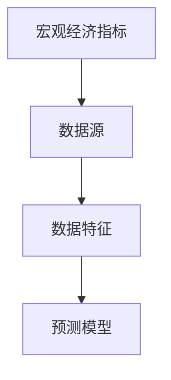
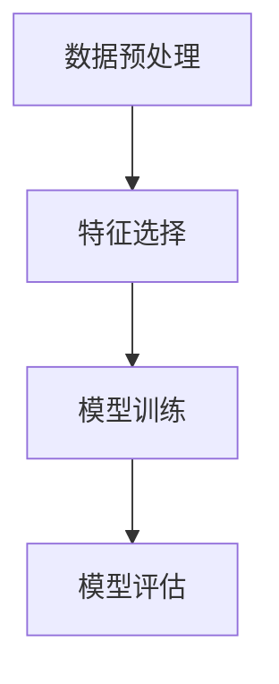
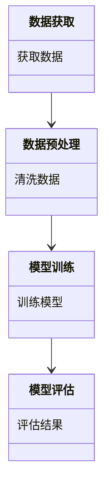
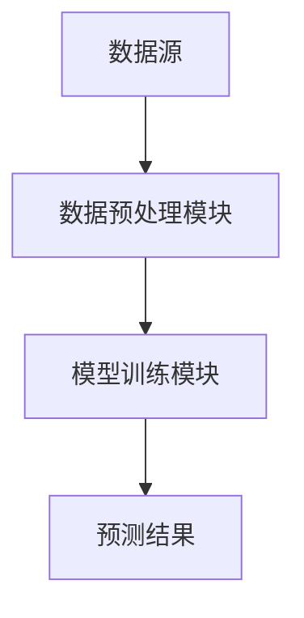
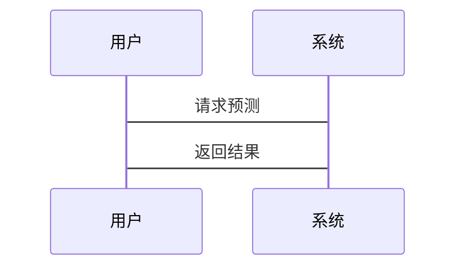

                 


# AI辅助的宏观经济指标预测

## 关键词：宏观经济预测、人工智能、机器学习、时间序列分析、数据驱动决策

## 摘要：本文探讨了如何利用人工智能技术辅助宏观经济指标预测。通过分析宏观经济指标的定义、分类及其与AI预测的关系，详细讲解了线性回归、时间序列分析和集成学习等算法的原理和实现。结合系统架构设计和项目实战，展示了AI在宏观经济预测中的实际应用，并总结了最佳实践和注意事项。

## 第1章: 宏观经济指标预测的背景与挑战

### 1.1 宏观经济指标的基本概念
#### 1.1.1 宏观经济指标的定义与分类
宏观经济指标是衡量一个国家或地区经济运行状况的关键数据，主要包括GDP、CPI、失业率等。这些指标可以分为总量指标、结构指标和价格指标。

#### 1.1.2 宏观经济指标预测的重要性
准确预测宏观经济指标有助于政府制定有效的经济政策，帮助企业做出正确的投资决策，避免经济损失。

#### 1.1.3 宏观经济指标预测的难点与挑战
宏观经济数据受到多种因素影响，如政策变化、国际环境等，导致预测难度大。传统方法在处理复杂关系和非线性问题上存在局限性。

### 1.2 AI在宏观经济预测中的作用
#### 1.2.1 AI技术在宏观经济分析中的优势
AI能够处理大量数据，发现隐藏的模式，提高预测的准确性和及时性。

#### 1.2.2 AI辅助宏观经济预测的核心价值
通过AI技术，可以快速分析数据，提供实时预测，帮助决策者及时调整策略。

#### 1.2.3 宏观经济预测中的AI应用场景
AI广泛应用于GDP预测、通货膨胀预测和货币政策制定等领域。

## 第2章: 宏观经济指标预测的核心概念与联系

### 2.1 宏观经济指标预测的理论基础
#### 2.1.1 宏观经济指标预测的基本原理
宏观经济预测基于经济理论和统计方法，结合历史数据和当前经济状况进行分析。

#### 2.1.2 宏观经济指标预测的关键要素
数据质量、模型选择和参数设置是影响预测结果的重要因素。

### 2.2 宏观经济指标与AI预测的关系
#### 2.2.1 宏观经济指标的数据特征分析
宏观经济数据通常具有时间序列特性，包含趋势、周期性和随机性。

#### 2.2.2 AI预测在宏观经济指标中的应用模式
AI通过机器学习算法，从海量数据中提取特征，构建预测模型。

### 2.3 宏观经济指标预测的核心概念对比表
| 对比项       | 传统预测方法 | AI预测方法 |
|--------------|--------------|------------|
| 数据需求     | 低           | 高         |
| 模型复杂度   | 简单         | 复杂       |
| 预测精度     | 中等         | 高         |

### 2.4 宏观经济指标预测的ER实体关系图


## 第3章: 宏观经济指标预测的算法原理

### 3.1 常见的宏观经济预测算法
#### 3.1.1 线性回归模型
线性回归是一种简单但有效的预测方法，适用于线性关系的数据。

#### 3.1.2 时间序列分析
时间序列分析广泛应用于宏观经济预测，捕捉数据中的趋势和周期性。

#### 3.1.3 集成学习算法
集成学习通过组合多个模型的结果，提高预测的准确性和稳定性。

#### 3.1.4 深度学习模型
深度学习在处理复杂非线性关系方面具有显著优势。

### 3.2 算法原理的数学模型与公式

#### 3.2.1 线性回归模型公式
$$ y = \beta_0 + \beta_1x + \epsilon $$

#### 3.2.2 时间序列模型公式
$$ ARIMA(p, d, q) $$

#### 3.2.3 集成学习模型公式
$$ y = \sum_{i=1}^{n} \alpha_i \cdot y_i $$

### 3.3 算法流程图

#### 3.3.1 线性回归算法流程图


## 第4章: 宏观经济指标预测的系统架构设计

### 4.1 问题场景介绍
设计一个AI辅助的宏观经济指标预测系统，帮助用户快速获取预测结果。

### 4.2 项目介绍
开发一个基于机器学习的宏观经济预测系统，涵盖数据获取、预处理、模型训练和结果分析等功能。

### 4.3 系统功能设计
#### 4.3.1 领域模型


### 4.4 系统架构设计


### 4.5 系统接口设计
API接口定义了数据输入、模型调用和结果返回的流程。

### 4.6 系统交互设计


## 第5章: 宏观经济指标预测的项目实战

### 5.1 环境安装
安装必要的Python库，如pandas、numpy、scikit-learn和tensorflow。

### 5.2 系统核心实现源代码
```python
import pandas as pd
from sklearn.linear_model import LinearRegression
from sklearn.metrics import mean_squared_error

# 数据预处理
data = pd.read_csv('macro_data.csv')
X = data[['GDP', 'CPI']]
y = data[' unemployment']

# 模型训练
model = LinearRegression()
model.fit(X, y)

# 模型评估
y_pred = model.predict(X)
mse = mean_squared_error(y, y_pred)
print(f'Mean Squared Error: {mse}')
```

### 5.3 代码应用解读与分析
上述代码展示了如何使用线性回归模型进行宏观经济指标预测，包括数据加载、模型训练和结果评估。

### 5.4 实际案例分析
以GDP预测为例，展示AI如何通过历史数据预测未来的经济趋势。

### 5.5 项目小结
通过项目实战，验证了AI在宏观经济预测中的有效性，同时也发现了模型调优的必要性。

## 第6章: 宏观经济指标预测的最佳实践

### 6.1 最佳实践 tips
- 数据预处理是关键，确保数据质量
- 选择合适的算法，避免过拟合
- 定期更新模型，适应数据变化

### 6.2 小结
AI辅助的宏观经济指标预测具有广阔的前景，但也需要克服数据质量和模型解释性等挑战。

### 6.3 注意事项
- 数据隐私问题需谨慎处理
- 模型的实时性需考虑计算资源
- 结果验证是确保预测准确性的必要步骤

### 6.4 拓展阅读
推荐学习时间序列分析和深度学习在宏观经济预测中的应用。

## 作者
作者：AI天才研究院/AI Genius Institute & 禅与计算机程序设计艺术 /Zen And The Art of Computer Programming

---

本文详细介绍了AI在宏观经济指标预测中的应用，从理论到实践，帮助读者全面理解并掌握相关技术。

