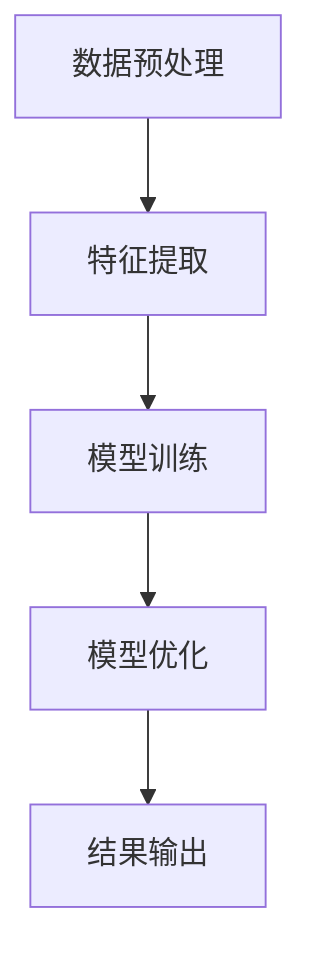
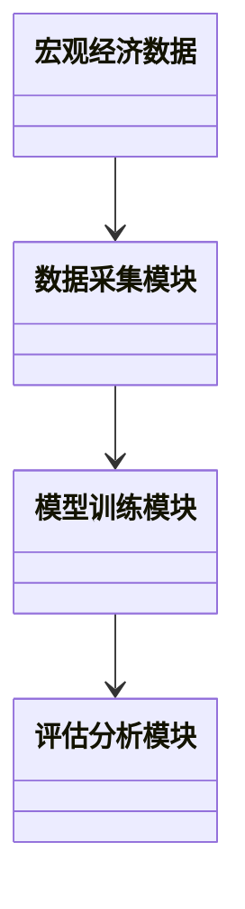

                 


# AI辅助的宏观经济政策效果量化评估

> 关键词：宏观经济政策、人工智能、量化评估、机器学习、政策效果、深度学习

> 摘要：本文探讨了如何利用人工智能技术辅助宏观经济政策效果的量化评估。通过分析宏观经济政策的基本概念、AI技术的应用优势，以及量化评估的重要性，本文详细阐述了AI在宏观经济政策分析中的算法原理、系统架构设计和项目实战。通过具体的案例分析和代码实现，本文展示了AI辅助政策效果评估的实际应用价值和未来发展方向。

---

## 第1章 宏观经济政策的基本概念

### 1.1 宏观经济政策的定义与分类

#### 1.1.1 宏观经济政策的定义
宏观经济政策是指政府或中央银行为了实现特定经济目标（如经济增长、就业增加、物价稳定等）而采取的措施。这些政策通常包括财政政策（如政府支出和税收）和货币政策（如利率和货币供应量）。

#### 1.1.2 宏观经济政策的主要分类
- **财政政策**：通过政府支出和税收调节经济活动。
- **货币政策**：通过控制货币供应量和利率影响经济。
- **产业政策**：通过扶植特定产业促进经济增长。
- **汇率政策**：通过调整汇率影响出口和进口。

#### 1.1.3 宏观经济政策的目标与工具
- **目标**：稳定物价、充分就业、经济增长、国际收支平衡。
- **工具**：政府预算、税收、利率、货币发行等。

### 1.2 AI技术在宏观经济分析中的应用

#### 1.2.1 AI技术的基本概念
人工智能（AI）是指计算机系统执行人类智能任务的能力，如视觉识别、语音识别、决策制定等。

#### 1.2.2 AI技术在宏观经济分析中的优势
- **数据处理能力**：AI能够处理大量复杂数据，发现传统方法难以察觉的模式。
- **预测准确性**：通过机器学习模型，AI能够提高经济预测的准确性。
- **实时分析**：AI系统可以实时分析经济数据，提供及时的政策建议。

#### 1.2.3 AI技术与宏观经济政策的结合
AI技术可以通过分析历史数据，预测政策实施后的效果，帮助制定更有效的政策。

---

## 第2章 宏观经济政策效果量化评估的背景与意义

### 2.1 宏观经济政策效果评估的重要性

#### 2.1.1 宏观经济政策对经济的影响
- 宏观经济政策直接影响GDP、就业率、物价水平等关键经济指标。
- 政策效果的好坏直接影响社会稳定和经济发展。

#### 2.1.2 政策效果评估的必要性
- 通过评估政策效果，可以验证政策的有效性。
- 评估结果为政策调整提供依据。

#### 2.1.3 现有政策评估方法的局限性
- 传统评估方法通常依赖于统计数据和专家判断，存在主观性和片面性。
- 数据量有限，难以捕捉复杂经济现象。

### 2.2 AI辅助量化评估的优势

#### 2.2.1 数据处理能力的提升
AI能够处理海量数据，发现数据中的潜在规律。

#### 2.2.2 模型复杂度的增加
AI模型可以处理非线性关系，捕捉复杂经济现象。

#### 2.2.3 评估结果的精确性
通过机器学习模型，AI可以提高政策效果预测的准确性。

---

## 第3章 宏观经济政策效果量化评估的核心概念

### 3.1 宏观经济政策效果的定义

#### 3.1.1 宏观经济指标的选取
- GDP增长率、失业率、物价指数、消费指数等。

#### 3.1.2 政策效果的度量方法
- 对比分析法：比较政策实施前后的经济指标变化。
- 因果分析法：分析政策对经济指标的因果关系。

#### 3.1.3 政策效果的动态变化
- 政策效果可能随时间变化而变化，需要动态评估。

### 3.2 AI模型在政策评估中的应用

#### 3.2.1 机器学习模型的基本原理
- 通过数据训练模型，模型学会预测经济指标的变化。

#### 3.2.2 深度学习模型的优势
- 深度学习模型可以自动提取特征，提高预测准确性。

#### 3.2.3 模型选择与优化
- 根据数据特点选择合适的模型，通过交叉验证优化模型参数。

---

## 第4章 宏观经济政策效果量化评估的算法原理

### 4.1 机器学习模型的训练过程

#### 4.1.1 数据预处理
- 数据清洗：处理缺失值、异常值。
- 数据标准化：将数据标准化，便于模型训练。

#### 4.1.2 特征提取
- 从原始数据中提取有用的特征，如GDP增长率、失业率等。

#### 4.1.3 模型训练与优化
- 使用训练数据训练模型，通过验证数据调整模型参数。

### 4.2 算法流程图



### 4.3 算法实现代码

```python
import pandas as pd
from sklearn.model import LinearRegression

# 数据预处理
data = pd.read_csv('macro_policy.csv')
data = data.dropna()  # 删除缺失值

# 特征提取
X = data[['GDP增长率', '失业率']]
y = data['政策效果']

# 模型训练
model = LinearRegression()
model.fit(X, y)

# 模型预测
predicted = model.predict(X)
```

---

## 第5章 宏观经济政策效果量化评估的系统架构设计

### 5.1 系统功能设计

#### 5.1.1 数据采集模块
- 从数据库中采集宏观经济数据。
- 数据来源包括政府统计机构、国际货币基金组织等。

#### 5.1.2 模型训练模块
- 使用机器学习模型训练政策效果预测模型。
- 支持多种模型选择和参数调整。

#### 5.1.3 评估分析模块
- 对政策效果进行量化评估。
- 提供可视化报告和政策建议。

### 5.2 系统架构图



---

## 第6章 项目实战

### 6.1 安装环境

```bash
pip install pandas scikit-learn
```

### 6.2 核心代码实现

```python
import pandas as pd
from sklearn.model import LinearRegression

# 数据加载
data = pd.read_csv('macro_policy.csv')

# 数据预处理
data = data.dropna()

# 特征提取
X = data[['GDP增长率', '失业率']]
y = data['政策效果']

# 模型训练
model = LinearRegression()
model.fit(X, y)

# 预测结果
predicted = model.predict(X)
```

### 6.3 代码解读与分析

- 数据加载：从CSV文件中读取数据。
- 数据预处理：删除缺失值。
- 特征提取：选择GDP增长率和失业率作为特征。
- 模型训练：使用线性回归模型训练。
- 预测结果：模型预测政策效果。

### 6.4 实际案例分析

假设我们有一个政策实施前后的数据集，通过模型可以预测政策实施后的效果，并与实际结果对比，评估政策的有效性。

### 6.5 项目小结

通过实际案例分析，展示了如何利用AI技术进行宏观经济政策效果的量化评估。模型预测结果与实际数据对比，验证了模型的有效性。

---

## 第7章 最佳实践与小结

### 7.1 小结

本文详细介绍了AI辅助宏观经济政策效果量化评估的核心概念、算法原理和系统架构设计，并通过实际案例展示了AI技术的应用价值。

### 7.2 最佳实践

- 数据质量：确保数据的准确性和完整性。
- 模型可解释性：选择合适的模型，确保模型的可解释性。
- 持续优化：定期更新模型，适应经济环境的变化。

### 7.3 注意事项

- 数据隐私：注意宏观经济数据的隐私保护。
- 模型局限性：AI模型不能完全替代人类专家的判断。

### 7.4 拓展阅读

- 《机器学习实战》
- 《深度学习》

---

作者：AI天才研究院/AI Genius Institute & 禅与计算机程序设计艺术 /Zen And The Art of Computer Programming

