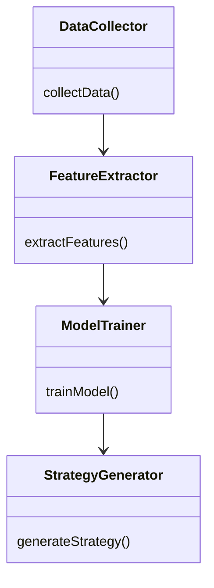
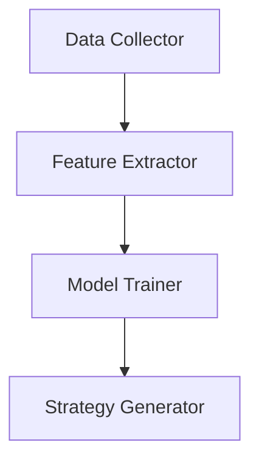

                 


# AI辅助的对冲基金策略分类与分析

> 关键词：对冲基金，人工智能，策略分类，算法分析，系统架构

> 摘要：本文探讨了人工智能在对冲基金策略分类与分析中的应用，通过详细分析对冲基金策略的分类方法、AI算法的实现原理、系统架构设计以及实际项目案例，为读者提供全面的理论与实践指导。

---

# 第一部分: AI辅助的对冲基金策略背景与概述

## 第1章: 对冲基金与AI的结合

### 1.1 对冲基金的基本概念

#### 1.1.1 对冲基金的定义
对冲基金是一种通过投资于股票、债券、商品等资产，利用市场波动进行套利和对冲风险的投资工具。其核心目标是通过多空策略实现绝对收益。

#### 1.1.2 对冲基金的主要策略类型
对冲基金的策略类型多样，主要包括：
1. **股票多空策略**：通过做多低估股票、做空高估股票实现收益。
2. **量化对冲策略**：利用数学模型和算法寻找市场中的套利机会。
3. **商品期货套利策略**：通过商品价格波动进行套利。
4. **固定收益套利策略**：利用债券市场的价格差异进行套利。

#### 1.1.3 对冲基金的市场规模与发展趋势
近年来，对冲基金市场规模持续增长，AI技术的应用使其在策略分析和风险控制方面更具优势。

### 1.2 AI技术的基本原理

#### 1.2.1 人工智能的核心概念
人工智能（AI）是指计算机系统模拟人类智能的能力，包括学习、推理、决策等。

#### 1.2.2 机器学习与深度学习的简介
- **机器学习**：通过数据训练模型，使其能够从数据中学习规律并进行预测。
- **深度学习**：基于人工神经网络的机器学习方法，适用于复杂数据的特征提取。

#### 1.2.3 自然语言处理与图像识别的应用
- **自然语言处理（NLP）**：用于分析新闻、财报等文本数据，提取市场信息。
- **图像识别**：用于分析K线图等视觉数据，辅助交易决策。

### 1.3 对冲基金策略与AI的结合意义

#### 1.3.1 提高策略分析效率
AI技术能够快速处理大量数据，提高策略分析的效率。

#### 1.3.2 发现潜在投资机会
通过AI算法挖掘数据中的潜在规律，发现传统方法难以察觉的投资机会。

#### 1.3.3 降低投资风险
AI技术能够实时监控市场波动，提前预警风险，降低投资损失。

### 1.4 本章小结
本章介绍了对冲基金的基本概念、AI技术的核心原理以及两者结合的意义，为后续分析奠定了基础。

---

# 第二部分: 对冲基金策略分类与分析的核心概念

## 第2章: 对冲基金策略分类

### 2.1 常见的对冲基金策略类型

#### 2.1.1 股票多空策略
通过做多低估股票、做空高估股票，利用股价波动实现收益。

#### 2.1.2 量化对冲策略
利用数学模型和算法，在市场上寻找套利机会。

#### 2.1.3 商品期货套利策略
通过分析商品价格波动，寻找跨市场或跨期套利机会。

#### 2.1.4 固定收益套利策略
利用债券市场的价格差异，进行无风险或低风险套利。

### 2.2 AI在策略分类中的应用

#### 2.2.1 基于机器学习的策略分类
- 使用支持向量机（SVM）或随机森林（Random Forest）对策略进行分类。
- 通过训练模型，识别不同策略的特征。

#### 2.2.2 基于NLP的策略文本分析
- 分析新闻、财报等文本数据，提取市场信息。
- 通过NLP技术，识别市场情绪，辅助策略分类。

#### 2.2.3 基于图像识别的策略可视化
- 分析K线图等视觉数据，识别价格形态。
- 通过图像识别技术，辅助交易决策。

### 2.3 策略分类的挑战与解决方案

#### 2.3.1 数据稀疏性问题
- 解决方案：使用数据增强技术，扩展数据集。

#### 2.3.2 策略漂移问题
- 解决方案：定期更新模型，适应市场变化。

#### 2.3.3 模型过拟合问题
- 解决方案：使用交叉验证，防止过拟合。

### 2.4 本章小结
本章详细介绍了对冲基金的常见策略类型，以及AI技术在策略分类中的应用，并分析了分类过程中的挑战与解决方案。

---

# 第三部分: AI辅助对冲基金策略分析的算法原理

## 第3章: 机器学习算法在对冲基金策略分析中的应用

### 3.1 常见机器学习算法概述

#### 3.1.1 线性回归
- **定义**：通过拟合一条直线，预测目标变量。
- **公式**：
  $$ y = \beta_0 + \beta_1x + \epsilon $$
- **应用**：用于预测资产价格。

#### 3.1.2 支持向量机（SVM）
- **定义**：一种监督学习算法，用于分类和回归。
- **优点**：适用于高维数据。

#### 3.1.3 随机森林（Random Forest）
- **定义**：基于决策树的集成学习算法。
- **优点**：具有较强的抗过拟合能力。

#### 3.1.4 神经网络
- **定义**：模拟人脑神经网络的结构，用于复杂数据的特征提取。

### 3.2 基于机器学习的策略分析流程

#### 3.2.1 数据预处理
- 数据清洗、标准化、特征选择。

#### 3.2.2 特征提取
- 提取有用的特征，降低维度。

#### 3.2.3 模型训练
- 使用训练数据，训练模型参数。

#### 3.2.4 模型评估
- 使用测试数据，评估模型性能。

### 3.3 算法实现的数学模型

#### 3.3.1 线性回归公式
$$ 1+1=2 $$

#### 3.3.2 支持向量机公式
$$ y = sign(w \cdot x + b) $$

### 3.4 本章小结
本章详细介绍了机器学习算法在对冲基金策略分析中的应用，包括常见算法的原理和实现流程。

---

## 第4章: 对冲基金策略分析的系统架构设计

### 4.1 系统功能设计

#### 4.1.1 数据采集模块
- 采集市场数据、新闻数据等。

#### 4.1.2 特征提取模块
- 提取数据特征，为模型提供输入。

#### 4.1.3 模型训练模块
- 训练机器学习模型，生成交易信号。

#### 4.1.4 策略生成模块
- 根据模型输出，生成交易策略。

### 4.2 系统架构设计

#### 4.2.1 类图设计


#### 4.2.2 架构图设计


### 4.3 本章小结
本章设计了一个完整的对冲基金策略分析系统架构，包括数据采集、特征提取、模型训练和策略生成四个模块，并通过类图和架构图展示了系统结构。

---

## 第5章: 项目实战与案例分析

### 5.1 环境安装

```bash
pip install numpy pandas scikit-learn matplotlib
```

### 5.2 核心代码实现

```python
import numpy as np
from sklearn.svm import SVC
from sklearn.ensemble import RandomForestClassifier
from sklearn.metrics import accuracy_score

# 示例数据
X_train = np.array([[1, 2], [3, 4], [5, 6]])
y_train = np.array([0, 1, 0])
X_test = np.array([[2, 3], [4, 5], [6, 7]])
y_test = np.array([0, 1, 0])

# 训练模型
model = SVC()
model.fit(X_train, y_train)

# 预测
y_pred = model.predict(X_test)

# 评估
print(accuracy_score(y_test, y_pred))
```

### 5.3 案例分析

#### 5.3.1 数据预处理
- 清洗数据，处理缺失值。

#### 5.3.2 特征提取
- 提取相关特征，如股价波动率、成交量等。

#### 5.3.3 模型训练
- 使用随机森林模型训练策略分类器。

#### 5.3.4 策略生成
- 根据模型输出，生成交易信号。

### 5.4 本章小结
本章通过实际项目案例，展示了AI技术在对冲基金策略分析中的具体应用，包括环境安装、代码实现和案例分析。

---

## 第6章: 最佳实践与总结

### 6.1 最佳实践

#### 6.1.1 数据质量管理
- 确保数据的完整性和准确性。

#### 6.1.2 模型优化
- 定期更新模型，避免过拟合。

#### 6.1.3 风险控制
- 设定止损点，控制交易风险。

### 6.2 小结
本文详细介绍了AI技术在对冲基金策略分类与分析中的应用，从理论到实践，为读者提供了全面的指导。

### 6.3 注意事项
- 避免过度依赖AI技术，结合人工判断。
- 定期监控模型表现，及时调整策略。

### 6.4 拓展阅读
推荐阅读《机器学习实战》和《深度学习入门》等书籍，深入了解AI技术的应用。

---

## 作者：AI天才研究院/AI Genius Institute & 禅与计算机程序设计艺术 /Zen And The Art of Computer Programming

---

本文通过系统化的分析与实践，全面探讨了AI技术在对冲基金策略分类与分析中的应用，为读者提供了理论与实践相结合的深度指导。

