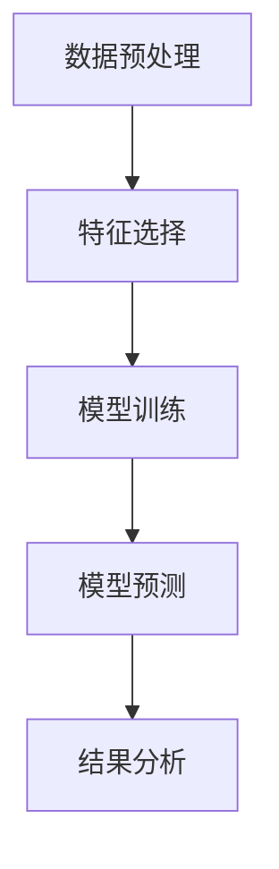
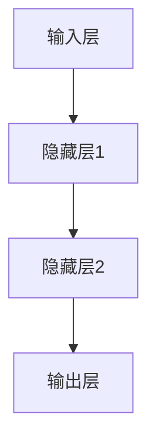
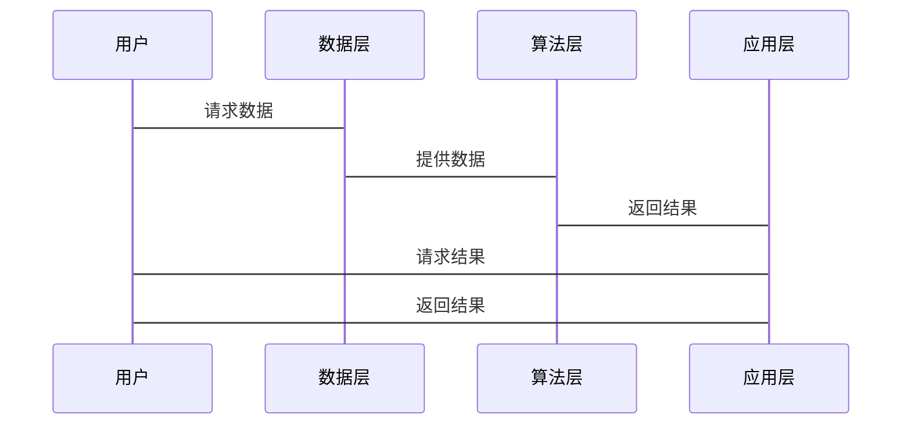

                 


# AI辅助的对冲基金风格分析

## 关键词：AI技术、对冲基金、风格分析、机器学习、量化分析、深度学习

## 摘要：随着人工智能技术的飞速发展，对冲基金领域正经历一场深刻的变革。通过AI技术，投资者能够更精准地识别和分析对冲基金的风格，从而做出更明智的投资决策。本文将详细探讨AI技术在对冲基金风格分析中的应用，从基础概念到算法实现，再到系统设计和项目实战，全面解析AI如何助力对冲基金风格分析。

---

## 第一部分：AI辅助的对冲基金风格分析概述

### 第1章：对冲基金与AI技术的结合

#### 1.1 对冲基金的背景与特点

##### 1.1.1 对冲基金的定义与分类
对冲基金是一种通过多种投资策略对冲市场风险、追求绝对收益的投资基金。根据投资策略的不同，对冲基金可以分为以下几类：
- **股票多空策略**：主要通过做多和做空股票来获利。
- **量化策略**：利用数学模型和算法进行投资决策。
- **事件驱动策略**：关注公司并购、重组等特定事件带来的投资机会。
- **市场中性策略**：通过多空平衡来降低市场风险。

##### 1.1.2 对冲基金的运作模式
对冲基金通过多种策略在不同市场环境下进行投资，以实现稳定的收益。其运作模式通常包括以下几个步骤：
1. **数据采集**：收集市场数据、公司基本面数据、新闻数据等。
2. **策略制定**：根据市场环境和数据，制定投资策略。
3. **风险控制**：通过多种手段控制投资风险，确保收益的稳定性。
4. **投资执行**：根据策略执行交易，并实时监控市场变化。

##### 1.1.3 对冲基金的风格分析意义
对冲基金的风格分析是理解其风险收益特征、投资策略和绩效表现的重要手段。通过风格分析，投资者可以更好地选择适合自己的基金，并进行有效的风险管理。

#### 1.2 AI技术在金融领域的应用

##### 1.2.1 AI技术的基本概念
AI（Artificial Intelligence）是指通过计算机模拟人类智能的技术。在金融领域，AI技术主要应用于数据处理、模式识别、预测分析和自动化交易等方面。

##### 1.2.2 AI在金融中的典型应用
- **智能投顾**：通过AI技术为投资者提供个性化的投资建议。
- **风险管理**：利用AI技术预测市场风险并制定应对策略。
- **量化交易**：基于AI算法进行高频交易和自动化投资决策。

##### 1.2.3 对冲基金与AI技术的结合点
- **数据处理**：AI技术能够高效处理海量金融数据，提取有用信息。
- **策略优化**：通过机器学习算法优化对冲基金的投资策略。
- **风险控制**：利用AI技术实时监控市场风险，制定风险控制措施。

#### 1.3 本章小结
本章主要介绍了对冲基金的基本概念、运作模式及其与AI技术的结合点。通过对冲基金的背景与特点的分析，读者可以更好地理解AI技术在对冲基金风格分析中的重要性。

---

## 第二部分：AI辅助对冲基金风格分析的核心概念

### 第2章：对冲基金风格分析的数学模型与算法

#### 2.1 风格分析的基本原理

##### 2.1.1 风格分析的定义
风格分析是对冲基金的一种分析方法，旨在识别基金的投资风格、风险特征和收益来源。

##### 2.1.2 风格分析的核心要素
- **收益来源**：分析基金收益的主要来源，如股票收益、债券收益等。
- **风险特征**：评估基金的风险水平，如波动率、最大回撤等。
- **投资策略**：了解基金采用的具体投资策略，如多空策略、量化策略等。

##### 2.1.3 风格分析的边界与外延
风格分析的边界在于如何准确地识别和量化基金的投资风格。其外延则包括对市场环境、宏观经济因素等的综合分析。

#### 2.2 基于机器学习的风格分析

##### 2.2.1 机器学习在风格分析中的应用
机器学习是一种通过数据学习模式并进行预测的技术。在风格分析中，机器学习可以用于分类、回归和聚类等任务。

##### 2.2.2 常见的机器学习算法
- **线性回归**：用于预测连续型变量，如基金的预期收益。
- **支持向量机（SVM）**：用于分类任务，如将基金分为成长型和价值型。
- **随机森林**：用于分类和回归任务，具有较高的准确性和鲁棒性。

##### 2.2.3 算法选择与优化
在选择机器学习算法时，需要考虑数据的特征、任务的类型以及模型的复杂度。优化可以通过参数调优和模型集成等方法实现。

#### 2.3 风格分析的核心概念与联系

##### 2.3.1 核心概念的原理
风格分析的核心概念包括因子模型、聚类分析和分类模型。这些概念相互关联，共同构成了风格分析的理论基础。

##### 2.3.2 核心概念的属性特征对比表格
| 概念       | 特征                     | 应用场景                   |
|------------|--------------------------|---------------------------|
| 因子模型   | 基于统计因子进行分析     | 量化投资策略               |
| 聚类分析   | 基于相似性进行分类       | 基金风格聚类               |
| 分类模型   | 基于标签进行分类         | 基金风格分类               |

##### 2.3.3 ER实体关系图架构的 Mermaid 流程图
```mermaid
er
    Fund
    Strategy
    Risk
    Return
    Fund-Strategy: 实现
    Fund-Risk: 具有
    Fund-Return: 具有
    Strategy-Risk: 关联
    Strategy-Return: 关联
```

---

## 第三部分：AI辅助对冲基金风格分析的算法原理

### 第3章：基于机器学习的风格分析算法

#### 3.1 机器学习算法的数学模型

##### 3.1.1 线性回归模型
线性回归模型用于预测连续型变量，其数学模型为：
$$ y = \beta_0 + \beta_1x_1 + \beta_2x_2 + \ldots + \beta_nx_n + \epsilon $$
其中，$y$ 是目标变量，$x_i$ 是自变量，$\beta_i$ 是回归系数，$\epsilon$ 是误差项。

##### 3.1.2 支持向量机模型
支持向量机模型用于分类任务，其数学模型为：
$$ y = \text{sign}(w \cdot x + b) $$
其中，$w$ 是权重向量，$x$ 是输入向量，$b$ 是偏置项。

##### 3.1.3 随机森林模型
随机森林模型是一种基于树的集成方法，其数学模型为：
$$ y = \text{mean}(y_i) $$
其中，$y_i$ 是每个树的预测结果。

#### 3.2 算法原理的详细讲解

##### 3.2.1 算法流程图的 Mermaid 绘制


##### 3.2.2 算法实现的 Python 源代码
```python
import pandas as pd
from sklearn.model_selection import train_test_split
from sklearn.ensemble import RandomForestClassifier
from sklearn.metrics import accuracy_score

# 数据预处理
data = pd.read_csv('fund_data.csv')
X = data.drop('style', axis=1)
y = data['style']

# 数据分割
X_train, X_test, y_train, y_test = train_test_split(X, y, test_size=0.2, random_state=42)

# 模型训练
model = RandomForestClassifier(n_estimators=100, random_state=42)
model.fit(X_train, y_train)

# 模型预测
y_pred = model.predict(X_test)

# 结果分析
print("Accuracy:", accuracy_score(y_test, y_pred))
```

##### 3.2.3 算法的数学公式与实例说明
随机森林模型的数学公式为：
$$ y = \text{mean}(y_i) $$
其中，$y_i$ 是每个树的预测结果。通过投票机制，随机森林能够提高模型的准确性和鲁棒性。

#### 3.3 基于深度学习的风格分析算法

##### 3.3.1 深度学习算法的数学模型
深度学习算法，如神经网络和卷积神经网络（CNN），在处理非结构化数据（如文本和图像）方面具有显著优势。

##### 3.3.2 神经网络模型的实现
神经网络模型的数学模型为：
$$ y = f(Wx + b) $$
其中，$W$ 是权重矩阵，$x$ 是输入向量，$b$ 是偏置项，$f$ 是激活函数。

##### 3.3.3 深度学习模型的 Mermaid 流程图


---

## 第四部分：AI辅助对冲基金风格分析的系统设计

### 第4章：系统设计与实现

#### 4.1 系统总体架构

##### 4.1.1 系统功能设计
对冲基金风格分析系统的功能模块包括数据采集、特征提取、模型训练和风格识别。

##### 4.1.2 系统架构设计
系统的架构设计包括数据层、算法层和应用层。数据层负责数据的存储和管理，算法层负责模型的训练和预测，应用层负责结果的展示和应用。

##### 4.1.3 系统接口设计
系统的接口设计包括数据接口、模型接口和用户接口。

##### 4.1.4 系统交互的 Mermaid 序列图


---

## 第五部分：AI辅助对冲基金风格分析的项目实战

### 第5章：项目实战与案例分析

#### 5.1 环境配置

##### 5.1.1 安装必要的库
需要安装的Python库包括：Pandas、NumPy、Scikit-learn、TensorFlow和Keras。

##### 5.1.2 数据源配置
数据源可以是公开的金融数据API，如Yahoo Finance和Quandl。

#### 5.2 核心实现

##### 5.2.1 数据预处理
数据预处理包括数据清洗、特征选择和数据标准化。

##### 5.2.2 特征工程
特征工程包括特征提取、特征选择和特征变换。

##### 5.2.3 模型训练
模型训练包括选择合适的算法、参数调优和模型验证。

#### 5.3 案例分析

##### 5.3.1 案例背景
以某对冲基金为例，分析其风格特征。

##### 5.3.2 数据分析与处理
使用Pandas和NumPy对数据进行清洗和处理。

##### 5.3.3 模型实现与验证
通过随机森林模型对基金风格进行分类，并验证模型的准确性和稳定性。

#### 5.4 项目总结

##### 5.4.1 项目成果
成功实现对冲基金风格分析系统，能够准确识别基金的投资风格。

##### 5.4.2 经验总结
在项目中，数据的准确性和完整性对模型的性能有重要影响，因此在数据预处理阶段需要特别注意。

---

## 第六部分：高级主题与扩展

### 第6章：AI辅助对冲基金风格分析的高级主题

#### 6.1 强化学习在对冲基金中的应用

##### 6.1.1 强化学习的基本概念
强化学习是一种通过试错机制进行学习的技术，常用于策略优化和自动化交易。

##### 6.1.2 强化学习在对冲基金中的应用
强化学习可以用于高频交易、动态资产配置和风险管理。

#### 6.2 NLP技术在对冲基金中的应用

##### 6.2.1 NLP技术的基本概念
NLP（Natural Language Processing）是处理自然语言文本的技术，常用于情感分析和文本挖掘。

##### 6.2.2 NLP技术在对冲基金中的应用
NLP技术可以用于分析新闻和社交媒体数据，帮助识别市场情绪和投资机会。

#### 6.3 实时交易系统的设计

##### 6.3.1 实时交易系统的架构设计
实时交易系统需要高效的计算能力和快速的响应速度。

##### 6.3.2 实时交易系统的实现
实时交易系统的实现包括数据流处理、交易策略执行和风险管理。

---

## 第七部分：结论与展望

### 第7章：结论与展望

#### 7.1 本章总结
通过对冲基金与AI技术的结合，投资者能够更精准地识别和分析对冲基金的风格，从而做出更明智的投资决策。

#### 7.2 未来展望
未来，随着AI技术的不断发展，对冲基金风格分析将更加智能化和自动化。深度学习和强化学习等技术将在对冲基金领域发挥更重要的作用。

---

## 作者：AI天才研究院/AI Genius Institute & 禅与计算机程序设计艺术 /Zen And The Art of Computer Programming

---

以上是《AI辅助的对冲基金风格分析》的完整内容，涵盖了从基础概念到算法实现再到系统设计和项目实战的各个方面。希望对您有所帮助！

