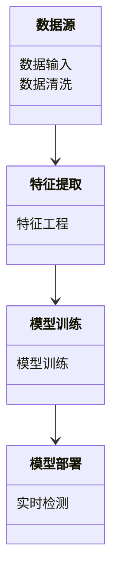
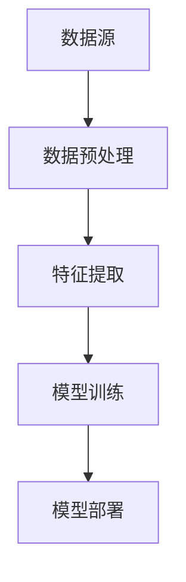
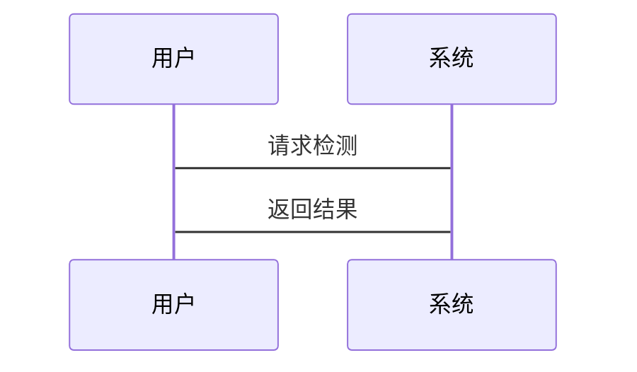

                 


# AI辅助的对冲基金风格漂移检测

---

**关键词**：对冲基金，风格漂移，AI检测，机器学习，NLP，风险管理

---

**摘要**：  
本文探讨了AI技术在对冲基金风格漂移检测中的应用，详细介绍了风格漂移的定义、检测方法及其对投资组合的影响。通过结合机器学习和自然语言处理技术，本文提出了一种基于AI的风格漂移检测系统，并通过实际案例展示了系统的实现和优化过程。本文旨在为对冲基金行业提供一种高效、准确的风格漂移检测解决方案。

---

## 第1章: 对冲基金风格漂移概述

### 1.1 风格漂移的定义与问题背景

#### 1.1.1 风格漂移的定义  
风格漂移是指对冲基金的投资策略或风险敞口与其初始设定的目标发生偏离的现象。这种偏离可能导致基金的表现与预期不符，增加投资风险。

#### 1.1.2 风格漂移的产生原因  
风格漂移的主要原因包括市场环境变化、投资经理的策略调整、交易成本增加以及市场流动性不足等。

#### 1.1.3 风格漂移对对冲基金的影响  
风格漂移可能导致基金的风险暴露增加，影响投资收益，并降低投资者的信任度。

### 1.2 对冲基金风格漂移的检测需求

#### 1.2.1 投资者对风格漂移的关注  
投资者希望了解基金是否偏离了预定的投资策略，以便做出投资决策。

#### 1.2.2 管理层对风格漂移的监控需求  
基金公司需要监控风格漂移，以确保投资策略的稳定性和合规性。

#### 1.2.3 风险管理中的风格漂移问题  
风格漂移可能导致基金的风险管理失效，增加整体投资组合的波动性。

### 1.3 风格漂移检测的技术基础

#### 1.3.1 传统风格漂移检测方法  
传统方法主要依赖于统计分析和因子分析，但存在计算复杂、实时性差的问题。

#### 1.3.2 AI技术在风格漂移检测中的应用  
AI技术，特别是机器学习和自然语言处理，能够高效地处理大量数据，提高检测的准确性和实时性。

#### 1.3.3 当前技术的优劣势对比  
传统方法的优势在于稳定性，而AI技术的优势在于高效性和适应性。

## 第2章: 对冲基金风格漂移的核心概念

### 2.1 风格漂移的特征分析

#### 2.1.1 风格漂移的量化指标  
常用的量化指标包括夏普比率、最大回撤和波动率等。

#### 2.1.2 风格漂移的多维度表现  
风格漂移可以从资产配置、风险敞口和投资策略等多个维度进行分析。

#### 2.1.3 风格漂移的时间序列特征  
时间序列分析可以帮助识别风格漂移的变化趋势和周期性。

### 2.2 风格漂移与风险管理

#### 2.2.1 风险管理中的风格漂移问题  
风格漂移可能导致风险敞口的增加，影响投资组合的稳定性。

#### 2.2.2 风格漂移对投资组合的影响  
风格漂移可能导致投资组合的表现与预期不符，增加投资者的损失。

#### 2.2.3 风险控制中的风格漂移检测  
通过实时监控风格漂移，可以及时调整投资策略，降低风险敞口。

### 2.3 风格漂移与投资策略

#### 2.3.1 不同投资策略下的风格漂移  
不同的投资策略（如量化投资、对冲策略）对风格漂移的敏感性不同。

#### 2.3.2 风格漂移对策略有效性的影响  
风格漂移可能导致投资策略失效，影响基金的长期表现。

#### 2.3.3 策略调整中的风格漂移检测  
通过检测风格漂移，可以及时调整投资策略，提高策略的有效性。

## 第3章: AI辅助风格漂移检测的技术基础

### 3.1 机器学习在风格漂移检测中的应用

#### 3.1.1 机器学习的基本概念  
机器学习是一种通过数据训练模型，实现预测和分类的技术。

#### 3.1.2 机器学习在金融领域的应用  
机器学习在金融领域的应用包括股票预测、风险评估和风格漂移检测。

#### 3.1.3 机器学习在风格漂移检测中的优势  
机器学习能够处理大量数据，发现复杂模式，提高检测的准确性。

### 3.2 自然语言处理（NLP）在风格漂移检测中的应用

#### 3.2.1 NLP的基本概念  
NLP是一种处理自然语言文本的技术，能够从文本中提取有用的信息。

#### 3.2.2 NLP在金融文本分析中的应用  
NLP在金融领域的应用包括新闻情感分析和公司财报挖掘。

#### 3.2.3 NLP在风格漂移检测中的优势  
NLP能够从非结构化数据中提取信息，帮助检测风格漂移。

## 第4章: 对冲基金风格漂移检测的核心算法

### 4.1 基于机器学习的风格漂移检测算法

#### 4.1.1 算法概述  
基于机器学习的风格漂移检测算法包括监督学习和无监督学习。

#### 4.1.2 算法实现流程  
算法实现流程包括数据收集、特征提取、模型训练和结果分析。

#### 4.1.3 算法的数学模型  
监督学习的损失函数为：$$\mathcal{L} = \frac{1}{n}\sum_{i=1}^{n} (y_i - \hat{y}_i)^2$$

### 4.2 基于NLP的风格漂移检测算法

#### 4.2.1 算法概述  
基于NLP的风格漂移检测算法包括文本特征提取和情感分析。

#### 4.2.2 算法实现流程  
算法实现流程包括数据预处理、文本特征提取、模型训练和结果分析。

#### 4.2.3 算法的数学模型  
情感分析模型的损失函数为：$$\mathcal{L} = -\sum_{i=1}^{n} y_i \log(p_i) + (1-y_i)\log(1-p_i)$$

## 第5章: 对冲基金风格漂移检测系统架构设计

### 5.1 系统功能设计

#### 5.1.1 领域模型类图  
领域模型类图展示了系统的主要类及其关系。



#### 5.1.2 系统架构图  
系统架构图展示了系统的各个部分及其关系。



#### 5.1.3 系统接口设计  
系统接口设计包括数据接口、模型接口和用户接口。

#### 5.1.4 系统交互序列图  
系统交互序列图展示了系统的主要交互流程。



## 第6章: 对冲基金风格漂移检测项目实战

### 6.1 项目环境搭建

#### 6.1.1 环境需求  
需要安装Python、机器学习库（如scikit-learn）和NLP库（如spaCy）。

#### 6.1.2 数据集准备  
需要收集对冲基金的相关数据，包括历史表现和市场数据。

### 6.2 系统核心实现

#### 6.2.1 数据预处理代码  
```python
import pandas as pd
data = pd.read_csv('data.csv')
data_cleaned = data.dropna()
```

#### 6.2.2 特征工程代码  
```python
from sklearn.preprocessing import StandardScaler
scaler = StandardScaler()
features = scaler.fit_transform(data_cleaned)
```

#### 6.2.3 模型训练代码  
```python
from sklearn.ensemble import RandomForestClassifier
model = RandomForestClassifier()
model.fit(features, labels)
```

#### 6.2.4 实时检测代码  
```python
def detect_style_drift(new_data):
    processed_data = preprocess(new_data)
    features = extract_features(processed_data)
    prediction = model.predict(features)
    return prediction
```

### 6.3 实际案例分析

#### 6.3.1 案例背景  
假设某对冲基金的投资策略发生了变化，导致风格漂移。

#### 6.3.2 数据分析  
通过对历史数据的分析，发现基金的风险敞口增加。

#### 6.3.3 结果解读  
模型预测结果显示，基金的风格漂移风险较高。

## 第7章: 对冲基金风格漂移检测的优化与扩展

### 7.1 系统优化

#### 7.1.1 性能优化  
通过分布式计算和模型优化提高检测的效率。

#### 7.1.2 算法优化  
引入深度学习和强化学习技术，提高检测的准确性。

### 7.2 功能扩展

#### 7.2.1 多维度检测  
从资产配置、风险敞口和投资策略等多个维度进行检测。

#### 7.2.2 实时监控  
实现实时数据流的监控，及时发现风格漂移。

### 7.3 案例分析

#### 7.3.1 优化前后的对比  
对比优化前后的检测结果，验证优化的有效性。

#### 7.3.2 拓展应用  
探讨风格漂移检测在其他金融领域的应用。

## 第8章: 总结与展望

### 8.1 全文总结  
本文详细介绍了AI辅助的对冲基金风格漂移检测技术，提出了基于机器学习和NLP的解决方案，并通过实际案例验证了系统的有效性。

### 8.2 未来展望  
未来的研究方向包括引入更先进的AI技术，如深度学习和强化学习，进一步提高检测的准确性和实时性。

---

**作者：AI天才研究院/AI Genius Institute & 禅与计算机程序设计艺术 /Zen And The Art of Computer Programming**

