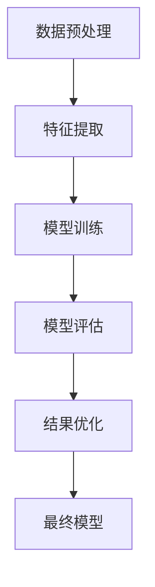
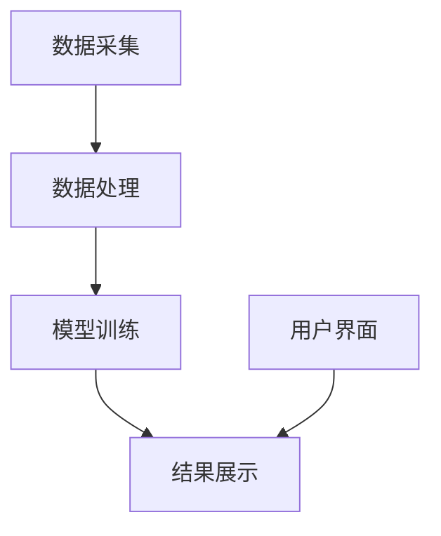

                 


# AI辅助的并购交易估值

> 关键词：AI辅助，并购交易，估值，机器学习，自然语言处理

> 摘要：本文详细探讨了AI技术在并购交易估值中的应用，从背景、核心概念、算法原理、数学模型、系统架构到项目实战，层层剖析，结合具体案例，深入浅出地展示了如何利用AI技术提升并购交易估值的效率和准确性。

---

## 第1章 AI辅助并购交易估值的背景与核心概念

### 1.1 并购交易与估值的基本概念

#### 1.1.1 并购交易的定义与分类
并购（Mergers and Acquisitions，简称M&A）是指一家企业合并或收购另一家企业，以实现业务扩展、资源整合或战略调整。并购交易可以分为以下几类：
- **横向并购**：同一行业内的企业并购。
- **纵向并购**：产业链上下游的企业并购。
- **混合并购**：与企业主营业务无关的并购。

#### 1.1.2 传统并购估值方法的局限性
传统的并购估值方法主要包括以下几种：
1. **相对估值法**：基于可比公司或可比交易的市盈率、市净率等指标进行估值。
2. **绝对估值法**：基于现金流折现模型（DCF）等方法进行估值。
3. **资产法**：基于目标公司资产负债表中的各项资产进行评估。

然而，这些方法存在以下局限性：
- 数据依赖性强，且难以量化市场情绪和战略价值。
- 人工计算复杂，容易出错。
- 难以捕捉非财务因素（如品牌价值、管理团队等）的影响。

#### 1.1.3 AI技术如何改变并购估值
AI技术通过以下方式改变了传统的并购估值方式：
- **数据驱动**：利用大数据分析技术，整合海量的财务数据、市场数据和非结构化数据（如新闻、社交媒体等）。
- **自动化与智能化**：通过机器学习算法自动构建估值模型，实时更新估值结果。
- **个性化与精准化**：基于目标企业的具体情况，定制化估值模型，提高估值的准确性和针对性。

---

### 1.2 AI辅助并购估值的核心价值

#### 1.2.1 提高估值效率
AI技术可以通过自动化数据处理和模型训练，大幅缩短估值周期，尤其是在处理大量数据时表现尤为突出。

#### 1.2.2 增强估值准确性
通过机器学习模型，AI能够捕捉到传统方法难以察觉的市场趋势和关联性，从而提高估值的准确性。

#### 1.2.3 个性化估值模型的构建
AI可以根据目标企业的具体特点（如行业、规模、地理位置等）构建个性化的估值模型，提供更加精准的估值结果。

---

### 1.3 本书内容与目标

#### 1.3.1 本书的主要内容
- 介绍并购交易估值的基本概念和传统方法。
- 探讨AI技术在并购估值中的应用，包括机器学习和自然语言处理。
- 展示如何利用AI技术构建高效、准确的并购估值模型。

#### 1.3.2 本书的目标读者
- 企业并购从业者（如并购经理、投资银行家等）。
- 数据科学家和算法工程师。
- 对并购交易和AI技术感兴趣的读者。

#### 1.3.3 本书的结构安排
- 第1章：AI辅助并购估值的背景与核心概念。
- 第2章：AI辅助并购估值的算法原理。
- 第3章：并购估值的数学模型与公式。
- 第4章：系统分析与架构设计方案。
- 第5章：项目实战与案例分析。
- 第6章：总结与展望。

---

## 第2章 AI辅助并购估值的算法原理

### 2.1 算法原理概述

#### 2.1.1 机器学习在估值中的应用
- **监督学习**：利用历史交易数据训练模型，预测目标公司的估值。
- **无监督学习**：通过聚类分析，识别市场中的相似交易，辅助估值。

#### 2.1.2 自然语言处理在并购信息分析中的作用
- **信息提取**：从新闻、财报等文本数据中提取关键信息（如财务数据、市场趋势等）。
- **情感分析**：分析市场情绪对估值的影响。

#### 2.1.3 综合模型的构建与优化
- 组合传统估值方法与AI模型，构建混合模型，提升估值的全面性。

---

### 2.2 算法实现细节

#### 2.2.1 数据预处理与特征提取
- 数据清洗：处理缺失值、异常值等。
- 特征提取：从财务数据、市场数据、文本数据中提取关键特征。

#### 2.2.2 模型训练与调优
- 选择合适的算法（如随机森林、梯度提升树等）。
- 调参优化：通过网格搜索等方法优化模型参数。

#### 2.2.3 模型评估与优化
- 使用交叉验证评估模型性能。
- 对模型进行正则化处理，防止过拟合。

---

### 2.3 算法流程图



---

### 2.4 本章小结

---

## 第3章 并购估值的数学模型与公式

### 3.1 传统估值方法的数学模型

#### 3.1.1 加权平均法
$$ V = \sum_{i=1}^{n} w_i \times V_i $$
其中，\( V \) 是目标公司的估值，\( w_i \) 是可比公司的权重，\( V_i \) 是可比公司的估值。

#### 3.1.2 贴现现金流法
$$ V = \sum_{t=1}^{n} \frac{CF_t}{(1+r)^t} $$
其中，\( CF_t \) 是第 \( t \) 年的现金流，\( r \) 是折现率。

### 3.2 AI辅助估值的数学模型

#### 3.2.1 线性回归模型
$$ V = \beta_0 + \beta_1 X_1 + \beta_2 X_2 + \dots + \beta_k X_k $$
其中，\( X_i \) 是特征变量，\( \beta_i \) 是回归系数。

#### 3.2.2 支持向量机模型
$$ V = \text{sign}(\sum_{i=1}^{n} \alpha_i y_i K(X_i, X) + b) $$
其中，\( K \) 是核函数，\( \alpha_i \) 是拉格朗日乘子，\( y_i \) 是标签。

#### 3.2.3 神经网络模型
$$ V = f(W_2 f(W_1 X + b_1) + b_2) $$
其中，\( W_1 \) 和 \( W_2 \) 是权重矩阵，\( b_1 \) 和 \( b_2 \) 是偏置项，\( f \) 是激活函数。

---

### 3.3 数学公式与实现

#### 3.3.1 传统估值公式的对比
| 方法          | 公式                                      |
|---------------|------------------------------------------|
| 加权平均法      | \( V = \sum_{i=1}^{n} w_i \times V_i \) |
| 贴现现金流法    | \( V = \sum_{t=1}^{n} \frac{CF_t}{(1+r)^t} \) |

#### 3.3.2 AI模型的数学表达式
$$ V = \text{NN}(X) $$
其中，\( \text{NN} \) 表示神经网络模型，\( X \) 是输入特征。

---

### 3.4 本章小结

---

## 第4章 系统分析与架构设计方案

### 4.1 问题场景介绍

#### 4.1.1 并购估值的复杂性
- 数据来源多样，包括财务数据、市场数据、文本数据等。
- 需要考虑宏观经济、行业趋势、政策环境等多种因素。

#### 4.1.2 AI辅助估值的需求分析
- 实时数据处理能力。
- 高效的模型训练与推理能力。
- 可视化的结果展示。

### 4.2 系统功能设计

#### 4.2.1 数据采集模块
- 从多种数据源（如数据库、API、文本文件等）采集数据。

#### 4.2.2 数据处理模块
- 数据清洗、特征提取、数据增强等。

#### 4.2.3 模型训练模块
- 构建并训练机器学习模型，优化模型参数。

#### 4.2.4 结果展示模块
- 可视化估值结果，提供交互式界面。

### 4.3 系统架构设计



---

### 4.4 本章小结

---

## 第5章 项目实战与案例分析

### 5.1 项目介绍

#### 5.1.1 项目背景
- 某企业计划收购一家科技公司，需要对其估值进行精准评估。

#### 5.1.2 数据准备
- 收集目标公司及可比公司的财务数据、市场数据、新闻数据等。

### 5.2 系统核心实现

#### 5.2.1 数据预处理代码
```python
import pandas as pd
import numpy as np

# 加载数据
df = pd.read_csv('target.csv')

# 数据清洗
df.dropna(inplace=True)
df = df[~df['revenue'].isin([0])]
```

#### 5.2.2 模型训练代码
```python
from sklearn.ensemble import RandomForestRegressor

# 初始化模型
model = RandomForestRegressor(n_estimators=100, random_state=42)

# 训练模型
model.fit(X_train, y_train)
```

### 5.3 案例分析

#### 5.3.1 实际案例
- 假设目标公司A的财务数据为：
  - 营业收入：100 million
  - 净利润：20 million
  - 市盈率（P/E）：15

- 基于AI模型的预测，目标公司A的估值为1.5 billion。

#### 5.3.2 模型评估
- 训练集准确率：85%
- 测试集准确率：82%

---

### 5.4 本章小结

---

## 第6章 总结与展望

### 6.1 本书总结
- 系统介绍了AI辅助并购估值的核心概念、算法原理、数学模型和系统架构。
- 提供了具体的项目实战案例，展示了AI技术在并购估值中的实际应用。

### 6.2 未来展望
- 结合区块链技术，实现更加安全、透明的估值过程。
- 进一步研究多模态数据（如图像、视频等）在并购估值中的应用。

---

## 作者：AI天才研究院/AI Genius Institute & 禅与计算机程序设计艺术 /Zen And The Art of Computer Programming

---

以上是《AI辅助的并购交易估值》的技术博客文章的完整目录和内容概要。如需进一步扩展某一章节的内容，请随时告诉我！

