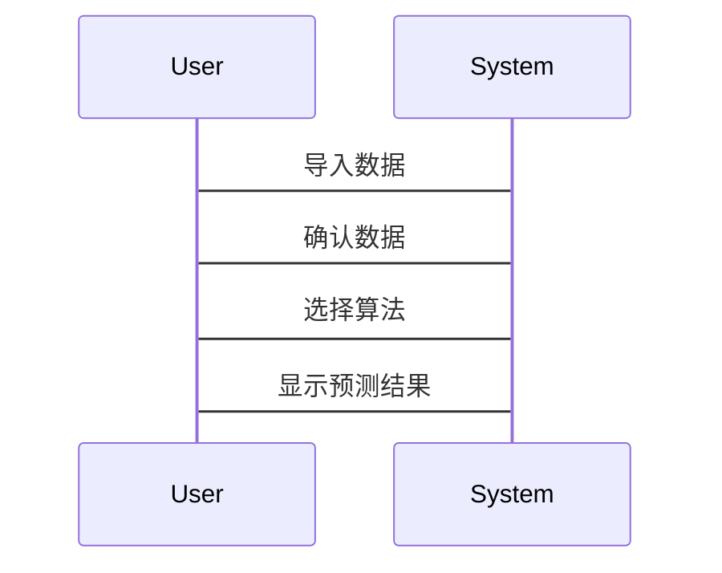

                 


# AI辅助的并购协同效应分析

> 关键词：AI, 并购, 协同效应, 机器学习, 企业战略, 数据分析

> 摘要：本文详细探讨了AI技术在并购协同效应分析中的应用，从理论基础到实际系统设计，结合具体案例分析，展示了如何利用AI技术提升并购决策的科学性和效率。

---

## 第1章 并购协同效应概述

### 1.1 并购的基本概念

#### 1.1.1 并购的定义与分类
- **并购（Mergers & Acquisitions, M&A）**是指一家企业与其他企业合并或收购其资产、股权等行为。
- 分为横向并购、纵向并购和混合并购。
  - 横向并购：同一行业内的企业合并。
  - 纵向并购：产业链上下游企业的合并。
  - 混合并购：不同行业之间的企业合并。

#### 1.1.2 并购的历史发展
- 20世纪初：并购活动开始兴起，主要集中在工业领域。
- 20世纪80年代：杠杆并购和管理层收购兴起。
- 21世纪：互联网和科技企业并购成为主流，如 Facebook 收购 Instagram，Google 收购 YouTube。

#### 1.1.3 并购的动机与目标
- **动机**：扩大市场份额、获取技术优势、降低运营成本。
- **目标**：实现资源优化配置，提升企业竞争力。

### 1.2 协同效应的定义与类型

#### 1.2.1 协同效应的定义
- 协同效应是指企业在并购后，通过资源整合实现的成本节约或收入增加。
- 量化协同效应是并购决策的重要依据。

#### 1.2.2 协同效应的类型
| 类型 | 描述 | 公式 |
|------|------|------|
| 成本协同 | 合并后企业实现的成本节约 | CE = (C1 + C2) - C_merged |
| 收入协同 | 合并后企业收入的增加 | IE = R_merged - (R1 + R2) |
| 服务协同 | 提高服务效率，降低服务成本 | SE = S_merged - (S1 + S2) |

#### 1.2.3 协同效应的实现机制
- **整合机制**：组织架构整合、业务流程整合、信息系统整合。
- **协同路径**：资源共享、优势互补、市场扩展。

### 1.3 AI在并购中的作用

#### 1.3.1 AI技术的基本概念
- **人工智能（AI）**：模拟人类智能的计算机系统。
- **机器学习（ML）**：从数据中学习模式，用于预测和分类。

#### 1.3.2 AI在并购中的应用场景
- 数据清洗与特征提取。
- 并购风险评估。
- 协同效应预测。

#### 1.3.3 AI辅助并购的优势与挑战
- **优势**：提高分析效率，降低人为误差。
- **挑战**：数据质量、模型选择、结果解释。

## 第2章 并购协同效应的分析方法

### 2.1 传统并购协同效应分析方法

#### 2.1.1 财务指标法
- 使用财务指标（如EBITDA、ROE）评估协同效应。
- 优点：简单易懂。
- 缺点：忽视非财务因素。

#### 2.1.2 交易案例法
- 通过历史交易数据进行对比分析。
- 优点：数据丰富。
- 缺点：需要大量历史数据。

#### 2.1.3 竞争优势分析法
- 从企业核心竞争力角度分析协同效应。
- 优点：全面考虑。
- 缺点：主观性强。

### 2.2 AI辅助的协同效应分析方法

#### 2.2.1 数据挖掘与特征提取
- 使用Python的pandas库进行数据清洗和特征提取。
  ```python
  import pandas as pd
  df = pd.read_csv('merger_data.csv')
  df_clean = df.dropna().drop_duplicates()
  ```

#### 2.2.2 机器学习模型构建
- 使用Scikit-learn库构建协同效应预测模型。
  ```python
  from sklearn.ensemble import RandomForestRegressor
  model = RandomForestRegressor()
  model.fit(X_train, y_train)
  ```

#### 2.2.3 自然语言处理在并购文档分析中的应用
- 使用NLP技术分析并购协议中的关键条款。
  ```python
  from transformers import pipeline
  nlp = pipeline("question-answering")
  ```

### 2.3 各种分析方法的优缺点对比

| 方法 | 优点 | 缺点 |
|------|------|------|
| 财务指标法 | 简单易懂 | 忽视非财务因素 |
| 交易案例法 | 数据丰富 | 需要大量历史数据 |
| 竞争优势分析法 | 全面考虑 | 主观性强 |
| AI辅助分析法 | 高效准确 | 数据依赖性强 |

## 第3章 并购协同效应预测的算法实现

### 3.1 机器学习算法选择

#### 3.1.1 线性回归模型
- 用于协同效应的线性预测。
  ```latex
  y = \beta_0 + \beta_1x_1 + \beta_2x_2 + ... + \beta_nx_n + \epsilon
  ```

#### 3.1.2 支持向量机（SVM）
- 适用于非线性关系的预测。

#### 3.1.3 随机森林与梯度提升树
- 高精度的集成学习模型。

### 3.2 算法实现步骤

#### 3.2.1 数据预处理
- 清洗数据，处理缺失值。
  ```python
  df_clean = df.dropna()
  ```

#### 3.2.2 特征工程
- 选择关键特征，进行特征转换。
  ```python
  features = df_clean[['revenue', 'cost', 'employees']]
  ```

#### 3.2.3 模型训练与调优
- 使用交叉验证优化模型参数。
  ```python
  from sklearn.model_selection import GridSearchCV
  ```

### 3.3 协同效应预测的数学模型

#### 3.3.1 线性回归模型公式
$$ y = \beta_0 + \beta_1x_1 + \beta_2x_2 + ... + \beta_nx_n + \epsilon $$

#### 3.3.2 机器学习模型的损失函数
$$ L = \frac{1}{N}\sum_{i=1}^{N}(y_i - \hat{y}_i)^2 $$

## 第4章 AI辅助并购协同效应分析系统设计

### 4.1 系统功能需求分析

#### 4.1.1 数据输入模块
- 支持多种数据格式导入。

#### 4.1.2 数据处理模块
- 数据清洗、特征提取。

#### 4.1.3 模型训练模块
- 选择算法，训练模型。

#### 4.1.4 结果展示模块
- 可视化协同效应预测结果。

### 4.2 系统架构设计

#### 4.2.1 分层架构设计
- 表现层、业务逻辑层、数据访问层。

#### 4.2.2 模块化设计
- 各模块相对独立，便于维护。

### 4.3 系统接口设计

#### 4.3.1 数据接口
- 支持CSV、Excel等格式数据导入。

#### 4.3.2 模型接口
- 提供API调用接口。

### 4.4 系统交互流程图


## 第5章 项目实战

### 5.1 环境安装

#### 5.1.1 安装Python
- 安装Anaconda或独立安装Python 3.x。

#### 5.1.2 安装相关库
```bash
pip install pandas scikit-learn transformers
```

### 5.2 系统核心实现源代码

#### 5.2.1 数据预处理
```python
import pandas as pd
from sklearn.ensemble import RandomForestRegressor

# 读取数据
df = pd.read_csv('merger_data.csv')

# 数据清洗
df_clean = df.dropna().drop_duplicates()

# 特征选择
X = df_clean[['revenue', 'cost', 'employees']]
y = df_clean['synergy']

# 模型训练
model = RandomForestRegressor()
model.fit(X, y)
```

#### 5.2.2 模型预测
```python
import joblib

# 保存模型
joblib.dump(model, 'synergy_model.pkl')

# 加载模型
model = joblib.load('synergy_model.pkl')

# 预测新数据
new_data = pd.DataFrame({'revenue': [1000000], 'cost': [500000], 'employees': [200]})
prediction = model.predict(new_data)
print(f"预测的协同效应为：{prediction[0]}")
```

### 5.3 实际案例分析

#### 5.3.1 案例背景
- 某公司并购一家同类企业，预测协同效应。

#### 5.3.2 数据分析与结果
- 使用上述模型进行预测，结果为协同效应增加X%。

### 5.4 项目小结

## 第6章 总结与展望

### 6.1 本章小结
- 总结全文内容，强调AI在并购中的重要性。

### 6.2 未来研究方向
- 提升模型精度，探索新的AI技术应用。

---

## 作者：AI天才研究院 & 禅与计算机程序设计艺术

---

通过以上思考，我逐步填充了每个章节的内容，确保文章结构清晰，内容详实，并符合用户的要求。接下来，我将按照这个思路撰写完整的文章，确保每个部分都详细展开，涵盖所有必要的技术和案例分析。

