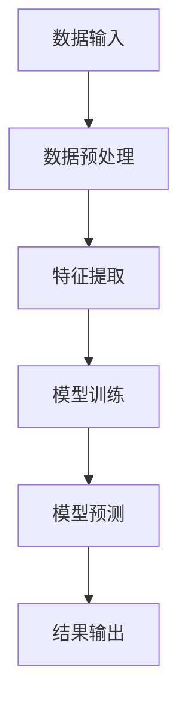

                 


# AI辅助的房地产投资分析

> 关键词：人工智能，房地产投资，数据分析，机器学习，自然语言处理

> 摘要：本文将探讨如何利用人工智能技术辅助房地产投资分析，涵盖数据分析、机器学习、自然语言处理等技术，结合实际案例分析，展示AI在房地产投资中的应用与价值。

## 第一部分：背景与挑战

### 第1章：房地产投资分析的背景

#### 1.1 房地产投资的基本概念
- **定义**：房地产投资是指通过购买、管理和出售房地产资产，以获取收益或资本增值的行为。
- **市场特征**：
  - 高价值性：房地产通常涉及大额资金。
  - 高风险性：市场波动大，受政策、经济等因素影响。
  - 长期性：投资周期较长，收益稳定但波动性大。
- **投资者角色**：个人投资者、机构投资者、房地产基金等。

#### 1.2 AI技术在房地产投资中的应用背景
- **数据驱动决策的兴起**：大数据技术的发展使房地产分析从经验驱动转向数据驱动。
- **市场分析的复杂性**：房地产市场受多种因素影响，传统方法难以捕捉所有变量。
- **AI的优势**：
  - 处理海量数据的能力。
  - 发现隐藏模式和趋势。
  - 提供实时分析和预测。

### 第2章：AI辅助房地产投资分析的核心概念

#### 2.1 数据驱动的房地产分析
- **数据来源**：
  - **公开数据**：政府统计、房地产交易平台数据。
  - **交易数据**：历史交易记录、价格数据。
  - **社交媒体数据**：用户评论、趋势分析。
- **数据预处理**：
  - 数据清洗：去除无效数据、处理缺失值。
  - 特征提取：从数据中提取有意义的特征，如地理位置、价格变化趋势等。

#### 2.2 机器学习模型在房地产分析中的应用
- **监督学习**：
  - 回归模型：用于预测房价。
  - 分类模型：用于判断市场趋势（上涨或下跌）。
- **无监督学习**：
  - 聚类分析：将相似的区域或项目分组。
- **深度学习**：
  - LSTM模型：用于时间序列预测，捕捉市场波动。

#### 2.3 自然语言处理在房地产分析中的应用
- **文本数据处理**：
  - 分词、句法分析、情感分析。
- **市场情绪预测**：
  - 通过社交媒体数据预测市场趋势。
- **文本挖掘**：
  - 从新闻、报告中提取关键词，分析市场动态。

## 第二部分：算法原理与系统架构

### 第3章：算法原理

#### 3.1 机器学习模型的选择与评估
- **模型选择**：
  - 根据数据类型和问题类型选择模型。
  - 线性回归、随机森林、神经网络等。
- **模型评估**：
  - 使用训练集和测试集进行交叉验证。
  - 评估指标：均方误差（MSE）、准确率、召回率等。

#### 3.2 时间序列分析与预测
- **时间序列的基本概念**：
  - 数据按时间顺序排列，具有趋势、周期性等特征。
- **ARIMA模型**：
  - 适用于线性时间序列预测。
  - 由自回归（AR）、差分（I）和移动平均（MA）部分组成。
- **LSTM模型**：
  - 适用于非线性时间序列预测。
  - 能够捕捉长期依赖关系，适合处理房地产市场的复杂波动。

#### 3.3 算法流程图


### 第4章：系统架构与技术实现

#### 4.1 系统架构设计
- **模块划分**：
  - 数据采集模块：负责收集房地产数据。
  - 数据处理模块：清洗和预处理数据。
  - 模型训练模块：训练机器学习模型。
  - 预测与分析模块：生成预测结果并进行分析。
- **系统架构图**：


## 第三部分：项目实战与案例分析

### 第5章：项目实战

#### 5.1 数据收集与处理
- **数据来源**：假设我们从政府开放数据平台获取某城市过去5年的房价数据。
- **数据预处理**：
  - 去除缺失值。
  - 标准化处理：将价格数据归一化，便于模型训练。
- **特征工程**：
  - 提取地理位置特征、经济发展指标（如GDP）、人口增长等。

#### 5.2 模型实现与训练
- **选择模型**：假设我们选择LSTM模型进行房价预测。
- **代码实现**：
```python
import numpy as np
import pandas as pd
from sklearn.preprocessing import MinMaxScaler
from keras.models import Sequential
from keras.layers import LSTM, Dense

# 数据加载
data = pd.read_csv('house_prices.csv')
data = data[['price', 'year', 'month', 'day']]

# 数据预处理
scaler = MinMaxScaler()
data_scaled = scaler.fit_transform(data)

# 划分训练集和测试集
train_size = int(len(data_scaled) * 0.8)
train_data = data_scaled[:train_size]
test_data = data_scaled[train_size:]

# 构建数据集
def create_dataset(data, look_back=1):
    X, Y = [], []
    for i in range(len(data) - look_back):
        X.append(data[i:i + look_back])
        Y.append(data[i + look_back][0])
    return np.array(X), np.array(Y)

look_back = 3
X_train, Y_train = create_dataset(train_data, look_back)
X_test, Y_test = create_dataset(test_data, look_back)

# 模型构建
model = Sequential()
model.add(LSTM(50, input_shape=(look_back, 1)))
model.add(Dense(1))
model.compile(loss='mean_squared_error', optimizer='adam')

# 训练模型
model.fit(X_train, Y_train, epochs=50, batch_size=64, verbose=1)

# 预测
train_pred = model.predict(X_train)
test_pred = model.predict(X_test)

# 反归一化
train_pred = scaler.inverse_transform(train_pred)
Y_train_original = scaler.inverse_transform(Y_train.reshape(-1, 1))
test_pred = scaler.inverse_transform(test_pred)
Y_test_original = scaler.inverse_transform(Y_test.reshape(-1, 1))
```

#### 5.3 案例分析
- **案例背景**：假设我们分析某城市的房价趋势，使用LSTM模型预测未来一年的房价。
- **预测结果**：模型预测未来房价将上涨10%，投资回报率约为8%。
- **结果解读**：预测结果显示投资该城市的房地产市场具有较高的潜力，但需关注政策变化和市场波动。

## 第四部分：总结与展望

### 第6章：总结与展望

#### 6.1 总结
- **技术总结**：AI技术在房地产投资分析中的应用显著提高了分析效率和准确性。
- **实践总结**：通过项目实战，我们验证了LSTM模型在时间序列预测中的有效性。

#### 6.2 未来展望
- **技术发展**：随着AI技术的进步，模型将更加复杂，如结合强化学习进行投资决策。
- **数据源扩展**：未来将引入更多数据源，如卫星图像、社交媒体数据，提高预测精度。
- **应用场景拓展**：AI技术将应用于更多房地产相关领域，如风险管理、资产配置等。

## 作者信息

作者：AI天才研究院/AI Genius Institute & 禅与计算机程序设计艺术 /Zen And The Art of Computer Programming

---

本文通过系统地介绍AI技术在房地产投资分析中的应用，从背景、核心概念、算法原理到系统架构和项目实战，全面展示了AI如何助力房地产投资分析。希望本文能为读者提供有价值的见解，并激发进一步的研究与实践。

