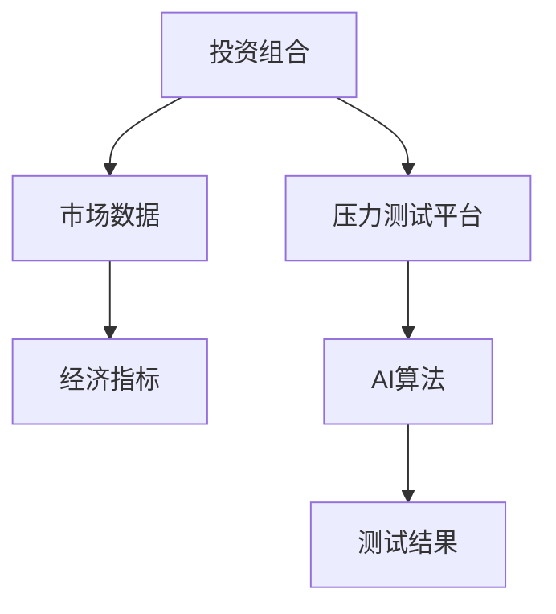
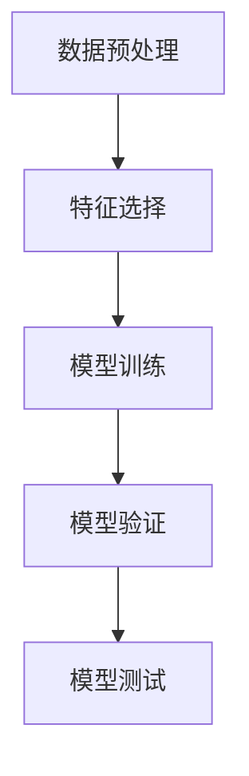
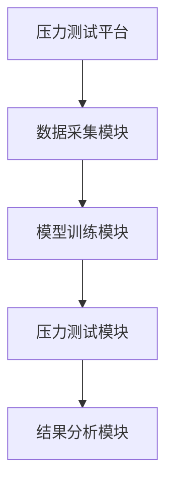

                 


# AI辅助的投资组合压力测试平台

> 关键词：AI，投资组合，压力测试，风险管理，机器学习，金融分析，金融科技

> 摘要：本文探讨了如何利用人工智能技术辅助投资组合的压力测试，以提高金融风险管理的效率和准确性。文章从背景介绍、核心概念、算法原理、系统架构到项目实战，详细阐述了AI在压力测试中的应用，帮助读者理解并掌握如何构建和优化一个高效的投资组合压力测试平台。

---

## 目录

# 第一部分：背景与概念

# 第1章：投资组合压力测试的背景与需求

## 1.1 投资组合压力测试的定义与重要性

### 1.1.1 投资组合压力测试的定义

投资组合压力测试是一种评估投资组合在极端市场条件下表现的工具。通过模拟市场波动、经济衰退或其他潜在风险因素，压力测试帮助投资者了解其组合在不利环境下的抗压能力。

### 1.1.2 压力测试在金融风险管理中的重要性

- **风险识别**：发现潜在的市场风险和投资组合的脆弱性。
- **风险管理**：通过模拟极端情况，制定应对策略，降低损失。
- **合规要求**：许多金融机构需要遵守监管机构的压力测试要求。

### 1.1.3 AI技术在压力测试中的应用前景

AI技术可以处理大量数据，识别复杂模式，并实时调整模型，使压力测试更加高效和精准。

## 1.2 传统压力测试的局限性

### 1.2.1 传统压力测试方法的概述

传统压力测试通常基于历史数据和情景分析，缺乏对复杂市场动态的实时适应能力。

### 1.2.2 传统方法在复杂市场环境中的不足

- **数据依赖性强**：历史数据可能无法反映新的市场情况。
- **计算效率低**：处理大量数据时，传统方法效率较低。
- **模型假设限制**：假设市场行为可能与现实不符。

### 1.2.3 对AI辅助压力测试的需求

- **提高效率**：AI可以快速处理和分析数据。
- **增强准确性**：通过机器学习模型捕捉复杂市场动态。
- **动态适应性**：实时更新模型，适应市场变化。

## 1.3 AI辅助压力测试的核心优势

### 1.3.1 提高压力测试的效率与准确性

AI能够快速处理大量数据，提供更准确的压力测试结果。

### 1.3.2 处理复杂市场情景的能力

机器学习模型可以识别非线性关系，捕捉复杂市场动态。

### 1.3.3 实时监控与动态调整的优势

AI可以实时监控市场变化，动态调整压力测试模型。

## 1.4 本章小结

本章介绍了投资组合压力测试的重要性及其传统方法的局限性，强调了AI辅助压力测试的优势和需求。

---

# 第2章：AI辅助投资组合压力测试的核心概念与联系

## 2.1 压力测试的基本原理

### 2.1.1 压力测试的主要方法

- **蒙特卡洛模拟**：通过随机抽样模拟市场情况，评估投资组合在不同情景下的表现。
- **情景分析**：基于特定市场情景（如经济衰退、市场崩盘）进行压力测试。

### 2.1.2 不同压力测试方法的对比分析

| 方法 | 描述 | 优点 | 缺点 |
|------|------|------|------|
| 蒙特卡洛模拟 | 随机抽样模拟 | 处理复杂情景 | 计算成本高 |
| 情景分析 | 基于特定情景 | 易于解释 | 情景假设可能不准确 |

### 2.1.3 压力测试的核心要素与流程

- **数据采集**：收集市场数据、经济指标等。
- **模型构建**：选择合适的算法（如机器学习模型）。
- **压力测试执行**：模拟极端情景，评估投资组合表现。
- **结果分析**：根据测试结果制定风险管理策略。

## 2.2 AI在压力测试中的应用原理

### 2.2.1 AI技术如何辅助压力测试

- **数据处理**：AI能够快速处理和分析大量数据，识别潜在风险。
- **模型训练**：使用历史数据训练机器学习模型，预测极端情景下的投资组合表现。
- **实时监控**：AI实时监控市场变化，动态调整压力测试模型。

### 2.2.2 机器学习模型在压力测试中的作用

- **风险预测**：利用机器学习模型预测市场风险。
- **情景生成**：生成多种极端情景，模拟投资组合表现。
- **动态调整**：根据实时数据动态调整模型参数。

### 2.2.3 数据驱动的压力测试方法

- **数据来源**：市场数据、历史数据、新闻数据等。
- **数据预处理**：清洗、归一化等。
- **特征提取**：提取关键特征，用于模型训练。

## 2.3 核心概念与联系

### 2.3.1 实体关系图（ER图）分析



### 2.3.2 核心概念属性对比表

| 概念 | 属性 | 描述 |
|------|------|------|
| 压力测试 | 数据来源 | 市场数据、历史数据 |
|        | 方法 | 蒙特卡洛模拟、情景分析 |
|        | 目标 | 评估投资组合在极端情况下的表现 |

## 2.4 本章小结

本章详细解释了压力测试的基本原理和AI在其中的应用，通过ER图和属性对比表，展示了核心概念之间的联系。

---

# 第3章：AI辅助压力测试的算法原理

## 3.1 蒙特卡洛模拟

### 3.1.1 蒙特卡洛模拟的原理

蒙特卡洛模拟通过随机抽样，模拟投资组合在不同市场情景下的表现。

### 3.1.2 使用机器学习改进蒙特卡洛模拟

- **模型训练**：使用历史数据训练机器学习模型，预测市场情景。
- **情景生成**：生成更多样化的市场情景，提高模拟的准确性。

### 3.1.3 实施步骤

1. 收集市场数据。
2. 训练机器学习模型。
3. 生成多种市场情景。
4. 模拟投资组合在每种情景下的表现。
5. 分析结果，制定风险管理策略。

## 3.2 机器学习模型

### 3.2.1 机器学习模型的选择

- **支持向量回归（SVR）**：适用于回归问题。
- **随机森林**：适用于分类和回归问题。
- **神经网络**：适用于复杂非线性关系。

### 3.2.2 机器学习模型的训练

1. 数据预处理：清洗、归一化。
2. 特征选择：提取关键特征。
3. 模型训练：使用训练数据训练模型。
4. 模型验证：使用验证数据调整参数。
5. 模型测试：使用测试数据评估模型性能。

## 3.3 算法流程图



## 3.4 本章小结

本章详细讲解了蒙特卡洛模拟和机器学习模型在压力测试中的应用，展示了如何通过算法原理提高压力测试的效率和准确性。

---

# 第4章：AI辅助压力测试的系统架构

## 4.1 系统功能设计

### 4.1.1 数据采集模块

- **数据源**：市场数据、经济指标、新闻数据等。
- **数据预处理**：清洗、归一化。

### 4.1.2 模型训练模块

- **模型选择**：根据需求选择合适的机器学习模型。
- **模型训练**：使用预处理后的数据训练模型。

### 4.1.3 压力测试模块

- **情景生成**：基于模型生成多种极端市场情景。
- **模拟执行**：模拟投资组合在每种情景下的表现。

### 4.1.4 结果分析模块

- **结果解读**：分析测试结果，识别潜在风险。
- **风险管理策略**：制定应对极端情景的策略。

## 4.2 系统架构设计

### 4.2.1 系统架构图



### 4.2.2 系统接口设计

- **数据接口**：与数据源的接口。
- **模型接口**：与机器学习模型的接口。
- **用户接口**：供用户输入参数和查看结果。

## 4.3 本章小结

本章详细描述了系统的功能设计和架构，展示了如何通过模块化设计实现高效的AI辅助压力测试平台。

---

# 第5章：AI辅助压力测试的项目实战

## 5.1 环境安装

### 5.1.1 安装Python

```bash
# 安装Python
sudo apt-get install python3
```

### 5.1.2 安装机器学习库

```bash
# 安装numpy、pandas、scikit-learn
pip install numpy pandas scikit-learn
```

## 5.2 核心代码实现

### 5.2.1 数据预处理

```python
import pandas as pd
import numpy as np

# 加载数据
data = pd.read_csv('market_data.csv')

# 数据清洗
data.dropna(inplace=True)

# 数据归一化
from sklearn.preprocessing import StandardScaler
scaler = StandardScaler()
scaled_data = scaler.fit_transform(data)
```

### 5.2.2 模型训练

```python
from sklearn.svm import SVR

# 训练模型
model = SVR()
model.fit(scaled_data[:, :-1], scaled_data[:, -1])
```

### 5.2.3 压力测试执行

```python
# 生成极端情景
import random
extreme_scenario = random.choice(scaled_data)

# 模拟投资组合表现
predicted_performance = model.predict(extreme_scenario)
```

## 5.3 项目小结

本章通过实际项目展示了如何安装环境并实现核心代码，帮助读者理解如何将理论应用于实践。

---

# 第6章：最佳实践与注意事项

## 6.1 最佳实践

### 6.1.1 数据质量的重要性

确保数据的准确性和完整性，避免数据偏差。

### 6.1.2 模型的可解释性

选择可解释的模型，便于分析和调整。

### 6.1.3 持续优化

定期更新模型，适应市场变化。

## 6.2 注意事项

- **数据隐私**：确保数据的安全性和隐私性。
- **模型局限性**：认识到模型的局限性，避免过度依赖。
- **实时监控**：持续监控市场变化，及时调整模型。

## 6.3 本章小结

本章提供了最佳实践和注意事项，帮助读者在实际应用中避免常见错误，提高压力测试的效果。

---

# 作者：AI天才研究院/AI Genius Institute & 禅与计算机程序设计艺术 /Zen And The Art of Computer Programming

---

以上是《AI辅助的投资组合压力测试平台》的技术博客文章的完整目录和内容框架。通过逐步分析和推理，我们构建了一个从背景介绍到实际应用的完整体系，帮助读者系统地理解AI在投资组合压力测试中的应用。

