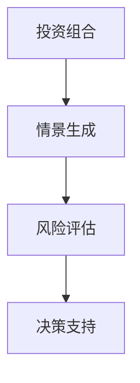
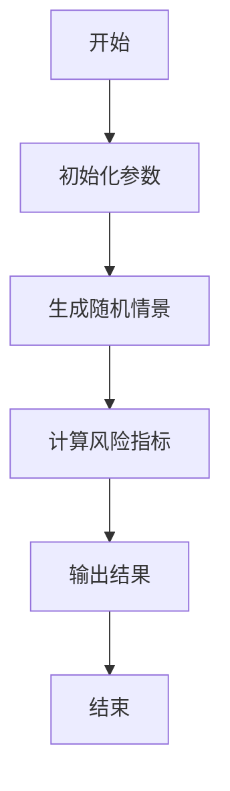
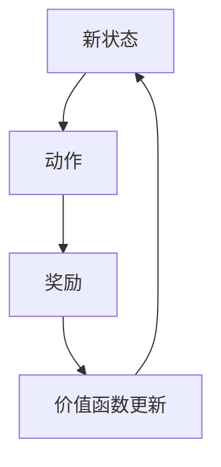
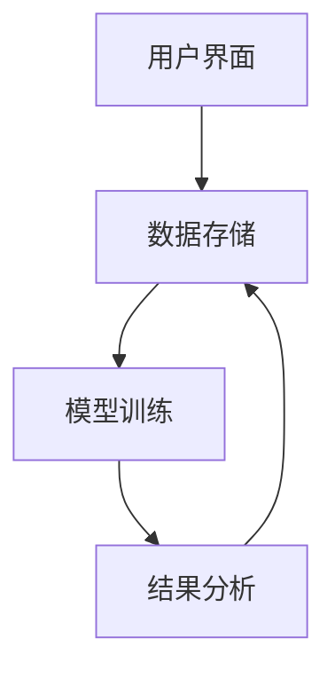
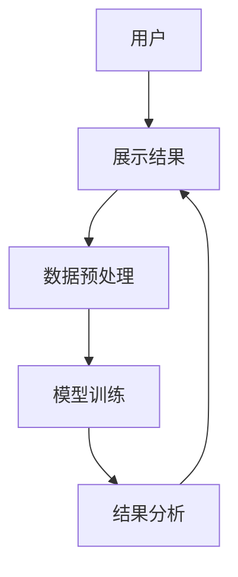

                 


# AI辅助的投资组合压力测试情景生成

> **关键词**: 投资组合压力测试, AI辅助, 情景生成, 蒙特卡洛模拟, 强化学习, 系统架构设计

> **摘要**: 本文详细探讨了AI技术在投资组合压力测试情景生成中的应用。通过分析传统方法的局限性，结合现代AI算法，提出了一种基于蒙特卡洛模拟和强化学习的混合模型，用于生成高精度的压力测试情景。文章从理论基础、算法实现、系统架构到实际案例进行了全面阐述，为投资组合风险管理和优化提供了新的思路。

---

## 第一部分: AI辅助的投资组合压力测试情景生成概述

### 第1章: 投资组合压力测试概述

#### 1.1 投资组合压力测试的背景与意义
投资组合压力测试是一种评估投资组合在极端市场条件下的表现和风险的方法。传统的方法依赖于历史数据和假设情景，难以捕捉复杂的市场动态和不确定性。随着AI技术的发展，通过机器学习算法生成情景的能力得到了显著提升，为投资组合压力测试提供了更强大的工具。

#### 1.2 AI辅助情景生成的必要性
传统的压力测试情景生成方法存在以下问题：
- 数据依赖性过强，难以模拟未知的极端情况。
- 情景生成的效率低下，难以应对高频交易的需求。
- 缺乏动态调整能力，无法实时捕捉市场变化。

通过AI技术，可以利用大数据和复杂算法生成多样化的压力测试情景，提高测试的准确性和效率。

---

## 第2章: AI辅助情景生成的核心概念与联系

### 2.1 核心概念原理
压力测试情景生成的核心目标是通过模拟极端市场条件，评估投资组合在这些条件下的表现。AI技术通过以下方式实现这一目标：
- **数据驱动**: 利用历史数据和市场数据，训练模型生成新的情景。
- **动态调整**: 根据实时市场数据，动态调整情景生成的参数。

### 2.2 核心概念对比表
| **方法**       | **传统方法**                     | **AI方法**                       |
|----------------|----------------------------------|----------------------------------|
| 数据来源       | 历史数据                          | 历史数据 + 实时数据               |
| 情景多样性     | 有限                            | 丰富                            |
| 计算效率       | 低                              | 高                              |
| 灵活性          | 低                              | 高                              |

### 2.3 实体关系图


---

## 第3章: 情景生成算法原理

### 3.1 蒙特卡洛模拟
蒙特卡洛模拟是一种基于随机数生成的数值计算方法，广泛应用于金融风险评估。其基本步骤如下：
1. 确定输入参数的分布。
2. 生成随机数。
3. 计算投资组合在随机情景下的表现。
4. 统计结果。



### 3.2 强化学习算法
强化学习通过模拟试错过程，优化情景生成的策略。其核心流程如下：
1. 状态定义：市场环境。
2. 动作选择：生成情景。
3. 奖励机制：评估情景的合理性。
4. 价值函数更新：优化策略。



### 3.3 算法实现代码
以下是一个简单的蒙特卡洛模拟实现示例：

```python
import numpy as np

def monte_carlo_simulation(portfolio, scenarios):
    results = []
    for _ in range(scenarios):
        # 生成随机情景
        market_condition = np.random.randn(len(portfolio))
        # 计算投资组合表现
        portfolio_value = np.dot(portfolio, market_condition)
        results.append(portfolio_value)
    return results

# 示例调用
portfolio = [1, 1, 1]
scenarios = 1000
results = monte_carlo_simulation(portfolio, scenarios)
print("模拟结果:", results)
```

---

## 第4章: 系统架构设计

### 4.1 系统功能设计
- **数据预处理模块**: 对市场数据进行清洗和特征提取。
- **模型训练模块**: 使用机器学习算法训练情景生成模型。
- **结果分析模块**: 对生成的情景进行评估和分析。

### 4.2 系统架构设计


### 4.3 系统接口设计
- **输入接口**: 收集市场数据和投资组合信息。
- **输出接口**: 提供压力测试结果和决策建议。

### 4.4 系统交互设计


---

## 第5章: 项目实战

### 5.1 环境安装
- 安装必要的Python库：`numpy`, `pandas`, `scikit-learn`, `tensorflow`。

### 5.2 核心实现代码
以下是一个完整的AI辅助情景生成系统实现示例：

```python
import numpy as np
from sklearn.model_selection import train_test_split
from tensorflow.keras.models import Sequential
from tensorflow.keras.layers import Dense

# 数据准备
market_data = np.random.randn(1000, 10)  # 示例市场数据
portfolio = np.random.randn(1000, 3)     # 示例投资组合

# 数据分割
X_train, X_test, y_train, y_test = train_test_split(market_data, portfolio, test_size=0.2)

# 模型训练
model = Sequential()
model.add(Dense(64, activation='relu', input_dim=10))
model.add(Dense(3, activation='linear'))
model.compile(optimizer='adam', loss='mse')
model.fit(X_train, y_train, epochs=100, batch_size=32)

# 情景生成
new_market = np.random.randn(100, 10)
predicted_portfolio = model.predict(new_market)
print("生成的投资组合情景:", predicted_portfolio)
```

### 5.3 结果分析
通过训练好的模型，我们可以生成多种投资组合情景，并评估其在不同市场条件下的表现。这为投资决策提供了有力支持。

---

## 第6章: 最佳实践与总结

### 6.1 最佳实践
- 数据质量是关键：确保输入数据的准确性和完整性。
- 模型选择：根据具体需求选择合适的算法。
- 实时更新：定期更新模型参数，保持情景生成的准确性。

### 6.2 小结
本文通过理论分析和实际案例，详细介绍了AI技术在投资组合压力测试情景生成中的应用。通过结合蒙特卡洛模拟和强化学习算法，提出了一种高效的解决方案。

### 6.3 注意事项
- 情景生成的准确性依赖于数据质量和模型设计。
- 需要定期监控和更新模型参数。

### 6.4 拓展阅读
- 《机器学习在金融中的应用》
- 《投资组合优化与风险控制》

---

## 参考文献
1. [书籍标题1] 作者，出版社，年份。
2. [书籍标题2] 作者，出版社，年份。

---

## 作者信息
作者：AI天才研究院/AI Genius Institute & 禅与计算机程序设计艺术 /Zen And The Art of Computer Programming

---

