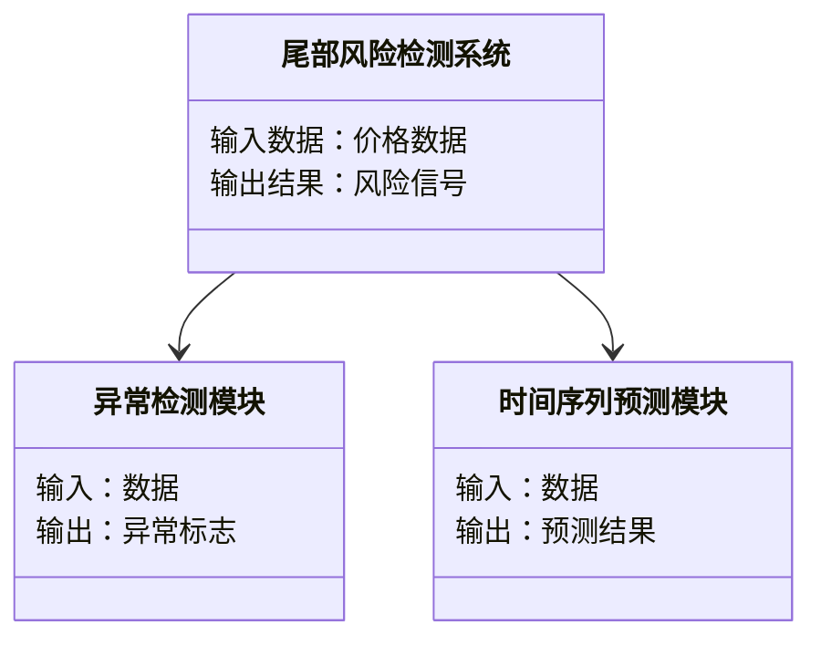
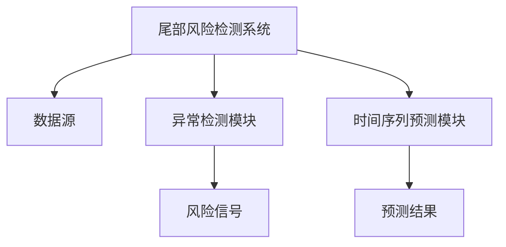

                 


# AI辅助的投资组合尾部风险度量

> 关键词：尾部风险，投资组合，AI技术，风险管理，金融数据

> 摘要：本文探讨了如何利用AI技术辅助投资组合的尾部风险度量。通过分析尾部风险的定义、特征及对投资组合的影响，结合AI技术的优势，提出了一种基于异常检测和时间序列分析的尾部风险度量方法。本文详细讲解了算法原理、系统架构设计和项目实战，为投资组合的风险管理提供了新的思路。

---

## 第一部分: 背景介绍

### 第1章: 投资组合尾部风险的背景与挑战

#### 1.1 问题背景

投资组合的风险管理是金融领域的重要课题。传统上，风险度量主要关注平均情况下的波动性（如标准差）和可能损失的平均值，但忽略了极端事件（尾部风险）的影响。尾部风险指的是投资组合在极端市场条件下可能出现的损失，这种损失通常远超正常波动范围，对投资组合的价值造成重大影响。

#### 1.2 问题描述

尾部风险的主要特征是低概率、高影响。传统统计方法假设数据服从正态分布，但实际金融市场中的极端事件往往不符合这一假设。例如，2008年金融危机和2020年新冠疫情引发的市场崩盘，都显示出尾部风险对投资组合的巨大破坏力。

#### 1.3 解决方案

AI技术，特别是机器学习，能够通过分析历史数据中的异常模式，识别潜在的尾部风险。与传统统计方法相比，AI技术具有以下优势：

1. **非线性关系捕捉**：能够识别复杂的数据模式，尤其是极端事件的前兆。
2. **实时性**：可以通过实时数据分析，快速识别潜在风险。
3. **自适应性**：能够根据市场变化动态调整风险模型。

#### 1.4 边界与外延

本文的尾部风险度量方法主要关注单资产的投资组合，未来可以扩展到多资产组合。此外，本文不考虑市场微观结构（如交易成本）的影响，未来可以进一步研究其对尾部风险的影响。

#### 1.5 核心要素

尾部风险度量的核心要素包括：

- **数据来源**：历史价格数据、市场情绪数据等。
- **模型选择**：异常检测模型和时间序列分析模型。
- **评估指标**：精确率、召回率和F1分数。

---

## 第二部分: 核心概念与联系

### 第2章: 尾部风险的数学模型与属性分析

#### 2.1 尾部风险的数学模型

尾部风险可以表示为随机变量X的分布尾部区域。在概率论中，尾部区域的概率密度函数通常比正态分布的尾部更“厚”，这意味着极端事件发生的概率更高。

#### 2.2 尾部风险与AI技术的联系

AI技术通过以下方式辅助尾部风险度量：

- **异常检测**：识别数据中的异常值，预测潜在的极端事件。
- **时间序列分析**：通过模型预测未来的价格走势，发现潜在的风险信号。

#### 2.3 概念属性对比表格

| 属性 | 尾部风险 | AI技术 |
|------|----------|--------|
| 定义 | 尾部事件的概率与影响 | 数据驱动的预测模型 |
| 特征 | 尾部事件的稀疏性与极端性 | 模型的非线性与复杂性 |
| 应用 | 投资组合风险管理 | 金融数据分析与预测 |

#### 2.4 实体关系图

```mermaid
erd
entity 尾部风险 {
  id
  概率
  影响
}
entity AI技术 {
  模型
  数据
  参数
}
尾部风险 --> AI技术
```

---

## 第三部分: 基于AI的尾部风险度量算法原理

### 第3章: 异常检测算法原理

#### 3.1 异常检测的基本原理

异常检测的目标是识别数据中的异常值。在金融领域，异常值可能代表市场崩盘或其他极端事件的前兆。

#### 3.2 基于深度学习的异常检测

##### 3.2.1 变量分解自编码器（VAE）

变量分解自编码器是一种生成模型，能够学习数据的潜在表示。通过重建损失，可以检测数据中的异常点。

##### 3.2.2 图神经网络（GNN）

图神经网络可以处理金融数据中的关联性，例如股票之间的相互影响。

#### 3.3 时间序列分析

时间序列分析用于预测未来的价格走势，识别潜在的风险信号。

##### 3.3.1 ARIMA模型

ARIMA（自回归积分滑动平均模型）是一种常用的时间序列预测方法。其数学公式为：

$$ ARIMA(p, d, q) $$

其中，p为自回归阶数，d为差分阶数，q为移动平均阶数。

##### 3.3.2 LSTM网络

长短时记忆网络（LSTM）是一种特殊的RNN，能够捕捉时间序列中的长期依赖关系。

---

## 第四部分: 系统分析与架构设计

### 第4章: 系统架构设计

#### 4.1 问题场景介绍

系统需要实时监控多个资产的价格走势，识别潜在的尾部风险。

#### 4.2 系统功能设计

##### 4.2.1 领域模型



#### 4.3 系统架构设计



---

## 第五部分: 项目实战

### 第5章: 项目实战

#### 5.1 环境安装

需要安装以下工具：

- Python 3.8+
- TensorFlow 2.0+
- Pandas 1.0+

#### 5.2 核心代码实现

##### 5.2.1 异常检测代码

```python
import pandas as pd
import tensorflow as tf

def build_model():
    model = tf.keras.Sequential([
        tf.keras.layers.Dense(64, activation='relu'),
        tf.keras.layers.Dense(32, activation='relu'),
        tf.keras.layers.Dense(1, activation='sigmoid')
    ])
    model.compile(optimizer='adam', loss='binary_crossentropy', metrics=['accuracy'])
    return model

model = build_model()
model.fit(X_train, y_train, epochs=10, batch_size=32)
```

##### 5.2.2 时间序列预测代码

```python
import numpy as np
import tensorflow as tf

def build_lstm_model(input_shape):
    model = tf.keras.Sequential([
        tf.keras.layers.LSTM(64, return_sequences=True, input_shape=input_shape),
        tf.keras.layers.LSTM(32),
        tf.keras.layers.Dense(1)
    ])
    model.compile(optimizer='adam', loss='mean_squared_error')
    return model

model = build_lstm_model((None, 1))
model.fit(X_train, y_train, epochs=10, batch_size=32)
```

#### 5.3 案例分析

以某只股票的价格数据为例，训练异常检测模型和时间序列预测模型。通过回测，验证模型在极端市场条件下的表现。

---

## 第六部分: 总结与展望

### 第6章: 总结

本文详细探讨了AI技术在投资组合尾部风险度量中的应用，提出了基于异常检测和时间序列分析的方法，并通过案例分析验证了方法的有效性。

### 第7章: 展望

未来的研究方向包括：

1. 多资产组合的尾部风险度量。
2. 更复杂的模型，如图神经网络。
3. 结合市场微观结构的尾部风险分析。

---

## 作者

作者：AI天才研究院/AI Genius Institute & 禅与计算机程序设计艺术 /Zen And The Art of Computer Programming

---

本文通过结合概率统计和机器学习模型，探讨了AI技术在投资组合尾部风险度量中的应用。通过系统的分析和实战案例，展示了如何利用AI技术提高尾部风险的识别和预测能力。希望本文能够为金融领域的风险管理提供新的思路和参考。

