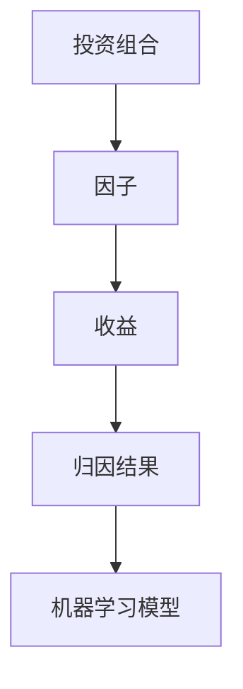
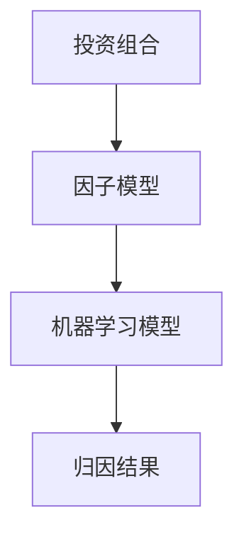

                 


# AI辅助的投资组合归因分析

> 关键词：投资组合归因、机器学习、AI辅助、金融数据分析、数学模型、系统架构、项目实战

> 摘要：本文将详细介绍AI辅助投资组合归因分析的背景、核心概念、算法原理、系统架构以及实际应用。通过逐步分析，帮助读者理解如何利用人工智能技术提升投资组合的分析效率和准确性，最终实现更优化的投资决策。

---

# 第一部分: 投资组合归因分析的背景与基础

## 第1章: 投资组合归因分析概述

### 1.1 问题背景与定义

#### 1.1.1 投资组合归因的定义
投资组合归因分析是一种用于分解投资组合收益来源的方法，旨在识别各个资产、行业或因子对整体收益的贡献程度。通过归因分析，投资者可以更好地理解投资组合的表现，优化资产配置，并评估投资策略的有效性。

#### 1.1.2 归因分析的重要性
- **风险控制**：通过归因分析，投资者可以识别出导致投资组合表现不佳的具体因素，从而采取相应的风险控制措施。
- **策略优化**：归因分析能够帮助投资者了解哪些资产或因子对收益贡献最大，从而优化投资策略。
- **绩效评估**：归因分析是评估投资组合绩效的重要工具，能够分解收益来源，区分主动收益和被动收益。

#### 1.1.3 传统归因方法的局限性
传统归因方法通常基于线性回归或其他统计方法，存在以下局限性：
- **复杂性**：传统方法难以处理高维数据和非线性关系。
- **计算效率**：在处理大规模数据时，传统方法计算效率较低。
- **可解释性**：部分复杂模型的可解释性较差，难以满足投资者对结果的直观理解需求。

### 1.2 AI辅助归因的必要性

#### 1.2.1 数据驱动的归因需求
随着金融市场的数据量激增，传统归因方法难以满足对海量数据的处理需求。AI技术通过大数据分析和机器学习算法，能够更高效地提取有用信息。

#### 1.2.2 AI在金融分析中的优势
- **高效性**：AI算法能够快速处理海量数据，提高归因分析的效率。
- **准确性**：通过机器学习模型，AI能够捕捉复杂的市场规律，提高归因分析的准确性。
- **可扩展性**：AI技术可以轻松扩展到更多的数据源和应用场景。

#### 1.2.3 投资组合归因的AI应用场景
- **主动管理**：通过AI归因分析，主动管理型基金可以更好地评估投资策略的有效性。
- **风险对冲**：利用AI归因分析，投资者可以更好地识别和对冲特定风险。
- **业绩评估**：AI归因分析能够帮助投资者准确评估投资组合的业绩来源。

---

## 第2章: AI与金融数据分析基础

### 2.1 金融数据的特征与挑战

#### 2.1.1 金融数据的多样性
金融数据来源广泛，包括股票价格、债券收益率、市场指数、经济指标等，具有高度的多样性和复杂性。

#### 2.1.2 数据的实时性与复杂性
金融市场数据具有高度的实时性，需要快速处理和分析。此外，金融数据通常具有复杂的非线性关系，传统统计方法难以捕捉。

#### 2.1.3 数据清洗与预处理
在使用AI进行归因分析之前，需要对数据进行清洗和预处理，包括数据缺失值处理、异常值剔除、数据标准化等。

### 2.2 机器学习在金融中的应用

#### 2.2.1 机器学习的基本概念
机器学习是一种通过数据训练模型，使其能够从数据中学习并做出预测或决策的算法。在金融领域，机器学习被广泛应用于风险评估、价格预测、投资组合优化等。

#### 2.2.2 常见金融应用场景
- **价格预测**：利用机器学习模型预测股票、债券等金融资产的价格走势。
- **风险评估**：通过机器学习模型评估投资组合的风险。
- **投资组合优化**：利用机器学习算法优化投资组合的配置。

#### 2.2.3 AI辅助投资的基本原理
AI辅助投资的基本原理是通过机器学习模型分析海量金融数据，提取有用的信息，帮助投资者做出更明智的投资决策。

---

# 第二部分: 投资组合归因的AI方法论

## 第3章: AI辅助归因的核心概念与联系

### 3.1 核心概念原理

#### 3.1.1 投资组合归因的数学模型
投资组合归因可以通过数学模型分解各个资产对整体收益的贡献。常见的模型包括线性回归模型、因子分解模型等。

#### 3.1.2 AI算法在归因中的作用
机器学习算法可以用于归因分析中的特征选择、模型训练和预测。通过AI算法，可以更准确地识别影响投资组合收益的关键因素。

#### 3.1.3 归因分析与风险评估的关系
归因分析可以帮助投资者识别影响投资组合收益的具体因素，从而更好地进行风险评估和管理。

### 3.2 核心概念对比分析

#### 3.2.1 传统归因方法与AI归因方法对比
| 对比维度       | 传统归因方法                     | AI归因方法                     |
|----------------|----------------------------------|----------------------------------|
| 数据处理能力   | 适用于小规模数据                 | 适用于大规模数据                 |
| 计算效率       | 较低                             | 较高                             |
| 可解释性       | 较高                             | 较低                             |
| 灵活性         | 较低                             | 较高                             |

#### 3.2.2 不同AI模型的优缺点
- **线性回归模型**：优点是简单易懂、计算效率高；缺点是难以处理非线性关系。
- **随机森林模型**：优点是能够处理非线性关系，具有较高的鲁棒性；缺点是可解释性较差。
- **神经网络模型**：优点是能够处理复杂的非线性关系，可解释性较强；缺点是计算效率较低。

#### 3.2.3 归因分析的实体关系图



---

## 第4章: AI归因的算法原理与数学模型

### 4.1 算法原理

#### 4.1.1 线性回归模型
线性回归是一种常用的投资组合归因方法，其基本思想是通过线性关系分解各个资产对整体收益的贡献。

#### 4.1.2 因子分解方法
因子分解方法通过将资产收益分解为几个因子的影响，帮助投资者更好地理解收益来源。

#### 4.1.3 解释性AI模型
解释性AI模型是一种能够提供可解释性结果的机器学习模型，适用于需要明确解释收益来源的场景。

### 4.2 数学模型与公式

#### 4.2.1 线性回归模型公式
$$ y = \beta_0 + \beta_1x_1 + \beta_2x_2 + \ldots + \beta_nx_n + \epsilon $$

其中：
- \( y \) 表示投资组合的收益
- \( x_i \) 表示各个资产的收益
- \( \beta_i \) 表示各个资产对整体收益的贡献系数
- \( \epsilon \) 表示误差项

#### 4.2.2 因子分解模型公式
$$ X = W S^T $$

其中：
- \( X \) 表示资产收益矩阵
- \( W \) 表示因子载荷矩阵
- \( S^T \) 表示因子矩阵的转置

### 4.3 举例说明

#### 4.3.1 简单线性回归案例
假设我们有一个投资组合，包含两只股票，我们需要分解这两只股票对整体收益的贡献。

假设投资组合的收益 \( y \) 和两只股票的收益 \( x_1, x_2 \) 满足以下线性关系：
$$ y = 0.05 + 0.7x_1 + 0.3x_2 + \epsilon $$

这表示，当 \( x_1 \) 增加1%时，投资组合收益增加0.7%；当 \( x_2 \) 增加1%时，投资组合收益增加0.3%。

---

## 第5章: 系统架构设计与实现

### 5.1 系统架构设计

#### 5.1.1 领域模型设计


#### 5.1.2 系统架构图


---

## 第6章: 项目实战与案例分析

### 6.1 环境安装与配置

#### 6.1.1 安装Python环境
```bash
pip install numpy
pip install pandas
pip install scikit-learn
```

#### 6.1.2 数据准备
```python
import pandas as pd
import numpy as np

# 生成模拟数据
np.random.seed(42)
n = 100
data = pd.DataFrame({
    '资产1': np.random.normal(0, 1, n),
    '资产2': np.random.normal(0, 1, n),
    '资产3': np.random.normal(0, 1, n),
    '收益': np.random.normal(0, 1, n)
})
```

---

## 第7章: 最佳实践与小结

### 7.1 最佳实践 tips

- **数据清洗**：在使用AI进行归因分析之前，确保数据的完整性和准确性。
- **模型选择**：根据具体场景选择合适的机器学习模型，避免过度复杂化问题。
- **结果解释**：归因分析的结果需要结合市场背景进行解释，避免机械地依赖模型。

### 7.2 小结

本文详细介绍了AI辅助投资组合归因分析的背景、核心概念、算法原理、系统架构以及实际应用。通过AI技术，投资者可以更高效、准确地进行归因分析，优化投资策略，提升投资绩效。

### 7.3 注意事项

- **数据隐私**：在处理金融数据时，需要注意数据隐私和合规性。
- **模型更新**：归因分析的结果需要定期更新，以适应市场的变化。
- **团队协作**：AI归因分析需要多学科团队的协作，包括数据科学家、金融分析师和IT工程师。

### 7.4 拓展阅读

- **书籍推荐**：
  - 《机器学习实战》
  - 《投资学基础》
- **在线课程**：
  - 《金融数据分析与机器学习》
  - 《投资组合管理》

---

# 作者：AI天才研究院 & 禅与计算机程序设计艺术

通过本文的详细讲解，读者可以系统地了解AI辅助投资组合归因分析的核心内容和实际应用。希望本文能够为投资者和数据科学家提供有价值的参考，帮助他们在实际工作中更好地应用AI技术，提升投资决策的科学性和有效性。

