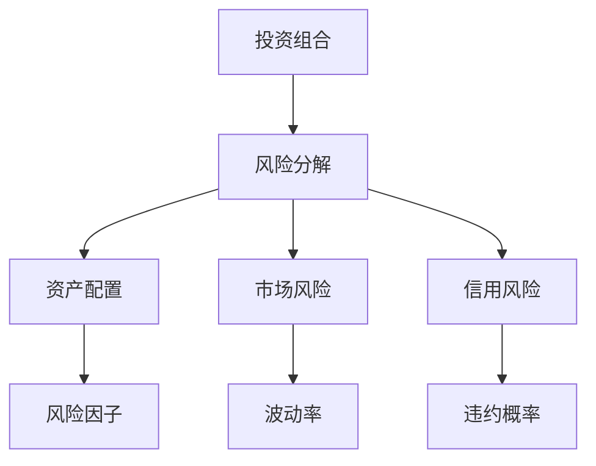
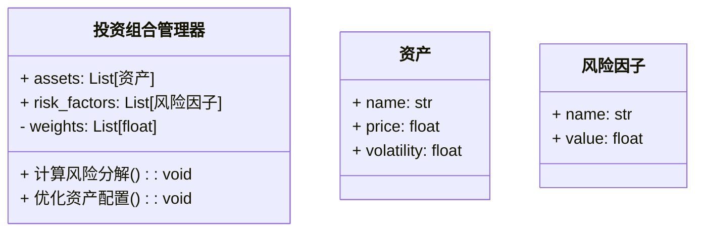

                 


# AI辅助的投资组合风险分解

> 关键词：AI，投资组合，风险分解，金融风险管理，机器学习，深度学习

> 摘要：本文详细探讨了如何利用人工智能技术辅助投资组合风险分解的过程。通过分析投资组合中的多种风险因素，结合AI算法，实现对风险的精准识别、量化和优化管理。文章从背景、概念、算法、系统架构、项目实战等多个维度展开，深入解析AI在投资组合风险分解中的应用和价值。

---

## 第一部分: AI辅助的投资组合风险分解概述

## 第1章: 投资组合风险分解的背景与问题

### 1.1 投资组合风险分解的背景

#### 1.1.1 投资组合管理的发展历程
投资组合管理作为金融领域的核心组成部分，经历了从传统的人工管理到现代的量化分析的演变。随着金融市场的复杂化和全球化，传统的基于经验的管理方式已难以应对日益复杂的市场波动和风险因素。近年来，随着人工智能技术的快速发展，AI在投资组合管理中的应用逐渐成为研究热点。

#### 1.1.2 风险管理在投资组合中的重要性
在投资组合管理中，风险管理是确保投资收益稳定性和可持续性的关键因素。有效的风险管理能够帮助投资者在市场波动中降低损失，抓住潜在的投资机会。传统的风险管理方法依赖于统计分析和历史数据，而AI技术的引入为风险的动态识别和预测提供了新的可能性。

#### 1.1.3 AI技术在金融领域的应用现状
AI技术在金融领域的应用已经渗透到多个方面，包括交易策略优化、市场预测、信用评估等。特别是在投资组合管理领域，AI技术能够通过大数据分析和机器学习算法，帮助投资者更好地识别和量化风险，优化投资组合配置。

### 1.2 投资组合风险分解的核心问题

#### 1.2.1 风险分解的基本概念
投资组合风险分解是指将整体投资组合的风险分解为各个资产或风险因子的贡献，从而实现对风险的精准识别和量化。这种分解有助于投资者了解投资组合中不同资产对整体风险的贡献程度，为风险管理和优化提供数据支持。

#### 1.2.2 投资组合风险的多维度分析
投资组合风险可以从多个维度进行分析，包括市场风险、信用风险、流动性风险等。通过对这些风险的分解，投资者可以更全面地了解投资组合的整体风险状况，并制定相应的风险管理策略。

#### 1.2.3 风险分解的数学模型与方法
风险分解的数学模型主要包括线性回归模型、聚类分析模型、神经网络模型等。这些模型通过分析资产价格波动、市场因子等数据，实现对投资组合风险的分解和预测。

### 1.3 AI辅助风险分解的优势与挑战

#### 1.3.1 AI在风险分解中的独特价值
AI技术能够通过大数据分析和机器学习算法，快速识别和量化投资组合中的风险因子。相比于传统方法，AI能够处理海量数据，发现潜在的风险模式，提供更精准的风险评估结果。

#### 1.3.2 当前技术的局限性
尽管AI技术在风险分解中具有巨大潜力，但目前仍面临一些技术挑战。例如，AI模型的黑箱特性使得风险分解的过程难以解释；此外，数据质量和数据量的不足也可能影响模型的准确性。

#### 1.3.3 应用中的伦理与合规问题
在实际应用中，AI辅助的投资组合风险分解需要遵守相关法律法规，确保数据的隐私性和合规性。此外，还需要关注AI模型的公平性，避免因算法偏见导致的不公正结果。

---

## 第2章: 投资组合风险分解的核心概念与联系

### 2.1 风险分解的基本原理

#### 2.1.1 风险分解的定义与分类
风险分解是指将整体风险分解为多个风险因子的贡献过程。常见的风险分解方法包括基于因子模型的分解和基于聚类分析的分解。

#### 2.1.2 风险分解的数学模型
风险分解的数学模型可以表示为：
$$ R_{total} = \sum_{i=1}^{n} w_i R_i $$
其中，$R_{total}$表示整体风险，$w_i$表示第i个风险因子的权重，$R_i$表示第i个风险因子的风险值。

#### 2.1.3 风险分解的关键要素
风险分解的关键要素包括风险因子的识别、权重的计算以及风险因子之间的相互作用。

### 2.2 AI在风险分解中的核心作用

#### 2.2.1 数据驱动的风险识别
AI技术能够通过大数据分析，识别出传统方法难以发现的风险因子。例如，通过自然语言处理技术分析新闻数据，识别潜在的市场风险。

#### 2.2.2 模型驱动的风险预测
基于机器学习的模型能够对风险进行预测，并根据预测结果优化投资组合配置。例如，使用随机森林模型预测资产的波动率。

#### 2.2.3 AI算法在风险分解中的具体应用
AI算法在风险分解中的具体应用包括聚类分析、强化学习等。例如，聚类分析可以用于将相似的资产归为一类，降低维度；强化学习可以用于动态调整投资组合配置，以应对市场变化。

### 2.3 核心概念对比分析

#### 2.3.1 不同风险分解方法的对比表格
以下是几种常见风险分解方法的对比：

| 方法 | 优点 | 缺点 |
|------|------|------|
| 线性回归 | 计算简单，解释性强 | 无法捕捉非线性关系 |
| 聚类分析 | 适合处理海量数据 | 结果难以解释 |
| 神经网络 | 能够捕捉复杂模式 | 黑箱问题，解释性差 |

#### 2.3.2 AI驱动与传统方法的优劣势分析
AI驱动的风险分解方法的优势在于能够处理海量数据，发现潜在风险模式。但其劣势在于结果难以解释，且模型的准确性依赖于数据质量。

#### 2.3.3 实体关系图（ER图）展示
以下是风险分解的实体关系图：



---

## 第3章: AI辅助投资组合风险分解的算法原理

### 3.1 基于机器学习的风险分解算法

#### 3.1.1 强化学习在风险分解中的应用
强化学习可以通过动态调整投资组合配置，实现风险的最小化。例如，使用Q-learning算法优化资产配置策略。

#### 3.1.2 聚类分析在风险分类中的作用
聚类分析可以将相似的资产归为一类，降低维度。例如，使用K-means算法将资产分为不同类别，进行风险分解。

#### 3.1.3 回归分析在风险预测中的应用
回归分析可以通过历史数据，预测未来的风险。例如，使用线性回归模型预测资产的波动率。

### 3.2 算法实现的数学模型

#### 3.2.1 风险分解的线性回归模型
$$ y = \beta_0 + \beta_1x_1 + \beta_2x_2 + \ldots + \beta_nx_n + \epsilon $$
其中，$y$表示整体风险，$x_i$表示第i个风险因子，$\beta_i$表示回归系数，$\epsilon$表示误差项。

#### 3.2.2 基于神经网络的风险分解模型
$$ f(x) = \sigma(w_2 \cdot \sigma(w_1x + b_1) + b_2) $$
其中，$w_1$和$w_2$表示神经网络的权重，$b_1$和$b_2$表示偏置项，$\sigma$表示激活函数。

### 3.3 算法实现的Python代码示例

```python
import numpy as np
from sklearn.linear_model import LinearRegression

# 生成数据
X = np.random.rand(100, 5)
y = np.random.rand(100, 1)

# 训练线性回归模型
model = LinearRegression()
model.fit(X, y)

# 预测结果
y_pred = model.predict(X)
print("回归系数:", model.coef_)
print("预测结果:", y_pred)
```

---

## 第4章: 系统分析与架构设计

### 4.1 问题场景介绍
投资组合风险分解系统需要处理海量的金融市场数据，包括股票价格、债券收益率、经济指标等。系统的目标是通过AI技术，实现对投资组合风险的实时分解和优化。

### 4.2 系统功能设计

#### 4.2.1 领域模型类图
以下是领域模型类图：



#### 4.2.2 系统架构图
以下是系统架构图：


---

## 第5章: 项目实战

### 5.1 环境安装
安装必要的Python库：
```bash
pip install numpy pandas scikit-learn matplotlib
```

### 5.2 系统核心实现源代码

```python
import numpy as np
from sklearn.cluster import KMeans
from sklearn.metrics import silhouette_score

# 生成数据
X = np.random.rand(100, 5)

# 聚类分析
model = KMeans(n_clusters=3)
model.fit(X)
labels = model.labels_

# 评估模型
score = silhouette_score(X, labels)
print("聚类评估得分:", score)
```

### 5.3 代码应用解读与分析
上述代码实现了基于K-means算法的聚类分析，用于将资产分为不同的类别。评估结果使用轮廓系数（silhouette score）进行衡量。

---

## 第6章: 最佳实践与小结

### 6.1 最佳实践 tips
- 数据预处理是关键，确保数据的完整性和准确性。
- 选择合适的算法，根据具体场景进行模型调优。
- 注重模型的解释性，避免过度依赖黑箱模型。

### 6.2 小结
本文详细探讨了AI辅助的投资组合风险分解方法，从背景、概念、算法、系统架构到项目实战，全面解析了AI在投资组合风险管理中的应用。通过本文的学习，读者可以掌握如何利用AI技术优化投资组合配置，降低风险。

### 6.3 注意事项
- 数据隐私和合规性是需要重点关注的问题。
- 模型的实时性和可扩展性需要在实际应用中进行优化。

### 6.4 拓展阅读
- 《机器学习在金融中的应用》
- 《深度学习与投资组合管理》
- 《Python金融计算入门》

---

作者：AI天才研究院/AI Genius Institute & 禅与计算机程序设计艺术/Zen And The Art of Computer Programming

