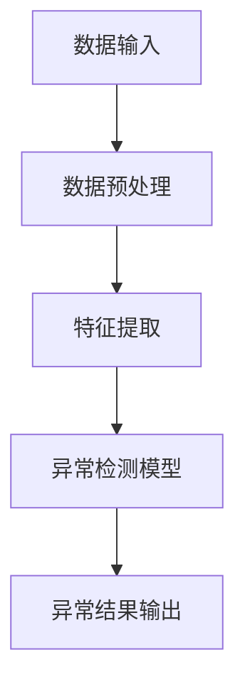
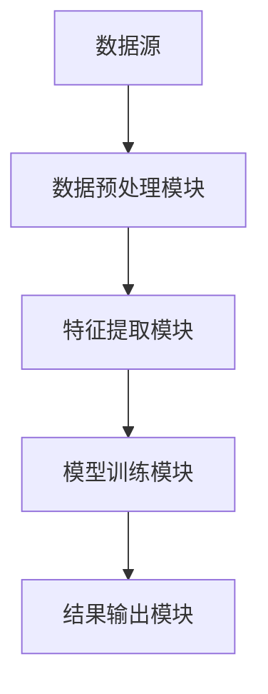

                 


# AI辅助的资产定价异常检测

## 关键词：资产定价，异常检测，人工智能，机器学习，金融数据分析

## 摘要：本文探讨了AI在资产定价异常检测中的应用，从背景介绍到算法实现，结合实际案例，分析了如何利用AI技术提升异常检测的效率和准确性。文章详细阐述了核心概念、算法原理、系统架构，并提供了具体的项目实现步骤和代码示例。

---

# 第1章: 资产定价与异常检测概述

## 1.1 资产定价的基本概念

### 1.1.1 资产定价的定义与作用

资产定价是指对金融资产（如股票、债券等）的价值进行评估和确定的过程。资产定价的核心在于反映其内在价值，帮助投资者做出合理的投资决策。资产定价的准确性直接影响市场的流动性和效率，因此，识别资产定价中的异常情况至关重要。

### 1.1.2 资产定价的主要方法

资产定价的方法主要包括基本面分析和市场定价法：

- **基本面分析**：基于财务报表、行业地位等信息评估资产价值。
- **市场定价法**：通过市场供需关系确定资产价格。

### 1.1.3 异常检测在资产定价中的重要性

异常检测是指识别数据中偏离预期模式或行为的过程。在资产定价中，异常检测可以帮助识别市场操纵、信息错误或突发事件导致的价格偏差，从而帮助投资者避免损失。

---

## 1.2 资产定价异常的定义与分类

### 1.2.1 资产定价异常的定义

资产定价异常是指资产价格在短时间内出现显著偏离正常波动的情况。这种异常可能是由于市场操纵、信息不对称或突发事件导致的。

### 1.2.2 异常类型与特征分析

资产定价异常可以分为以下几类：

1. **短期剧烈波动**：价格在短时间内出现大幅波动。
2. **价格偏离内在价值**：价格与资产的内在价值严重不符。
3. **交易量异常**：交易量突然激增或骤减。

### 1.2.3 异常检测的边界与外延

资产定价异常检测的边界在于如何定义“正常”波动范围。外延则包括识别异常事件的类型和严重程度。

---

## 1.3 AI辅助异常检测的必要性

### 1.3.1 传统异常检测方法的局限性

传统方法依赖于统计指标（如标准差）来判断异常，但在复杂市场环境中容易出现误判。

### 1.3.2 AI技术在异常检测中的优势

AI技术，特别是深度学习，能够处理高维数据和复杂模式，提高异常检测的准确性和效率。

### 1.3.3 资产定价异常检测的未来趋势

随着AI技术的不断发展，异常检测将更加智能化和实时化，帮助投资者更快地识别潜在风险。

---

## 1.4 本章小结

本章介绍了资产定价的基本概念和异常检测的重要性，分析了传统方法的局限性，并指出了AI技术在异常检测中的优势。

---

# 第2章: 资产定价异常检测的核心概念与联系

## 2.1 资产定价异常检测的核心要素

### 2.1.1 数据特征与异常检测的关系

数据特征（如价格、交易量、市场情绪）是异常检测的基础，不同特征的变化会影响异常检测的结果。

### 2.1.2 异常检测的关键属性对比

下表对比了不同异常检测方法的关键属性：

| 方法       | 基于统计 | 机器学习 | 深度学习 |
|------------|----------|----------|----------|
| 算法复杂度 | 低       | 中       | 高       |
| 需要标签   | 否       | 有/无    | 通常有   |
| 适用场景   | 稳定数据 | 多样数据 | 复杂数据  |

### 2.1.3 核心要素的实体关系图

```mermaid
er
    entity 资产 {
        key: 资产ID
        attribute: 资产名称, 资产类型, 市场代码
    }
    entity 价格数据 {
        key: 价格ID
        attribute: 时间戳, 收盘价, 开盘价, 最高价, 最低价
    }
    entity 异常记录 {
        key: 异常ID
        attribute: 异常类型, 异常时间, 异常程度
    }
    资产 -[N:1]-> 价格数据
    价格数据 -[N:1]-> 异常记录
```

---

## 2.2 资产定价异常检测的ER实体关系图

上述ER图展示了资产、价格数据和异常记录之间的关系。通过实体关系图，可以清晰地理解数据结构和异常检测的过程。

---

## 2.3 资产定价异常检测的流程图



---

## 2.4 本章小结

本章通过实体关系图和流程图，详细阐述了资产定价异常检测的核心概念和联系。

---

# 第3章: 资产定价异常检测的算法原理

## 3.1 基于统计的异常检测算法

### 3.1.1 Z-分数方法

Z-分数用于衡量数据点与均值的距离。公式为：

$$ Z = \frac{X - \mu}{\sigma} $$

其中，$\mu$ 是均值，$\sigma$ 是标准差。

### 3.1.2 IQR方法

IQR（四分位间距）用于识别异常值。公式为：

$$ IQR = Q3 - Q1 $$

异常值判断标准为：

$$ X < Q1 - 1.5 \times IQR \quad \text{或} \quad X > Q3 + 1.5 \times IQR $$

### 3.1.3 基于统计方法的Python实现

```python
import numpy as np

def detect_outliers_stat(data):
    mean = np.mean(data)
    std = np.std(data)
    z_scores = [(x - mean) / std for x in data]
    threshold = 3
    outliers = [i for i, z in enumerate(z_scores) if abs(z) > threshold]
    return outliers

# 示例数据
data = [1, 2, 3, 4, 5, 6, 7, 8, 9, 10, 100]
outliers = detect_outliers_stat(data)
print("异常点索引:", outliers)
```

---

## 3.2 基于机器学习的异常检测算法

### 3.2.1 Isolation Forest算法

Isolation Forest是一种基于树结构的无监督学习算法，适用于检测异常值。

### 3.2.2 One-Class SVM算法

One-Class SVM适用于单类分类问题，可以识别数据中的异常点。

### 3.2.3 基于机器学习算法的Python实现

```python
from sklearn.ensemble import IsolationForest

def detect_outliers_ml(data, contamination=0.01):
    model = IsolationForest(contamination=contamination)
    model.fit(data)
    outliers = model.predict(data)
    outliers = [i for i, val in enumerate(outliers) if val == -1]
    return outliers

# 示例数据
data = [1, 2, 3, 4, 5, 6, 7, 8, 9, 10, 100]
outliers = detect_outliers_ml(data)
print("异常点索引:", outliers)
```

---

## 3.3 基于深度学习的异常检测算法

### 3.3.1 Autoencoder网络

Autoencoder是一种无监督学习模型，适用于高维数据的异常检测。

### 3.3.2 LSTM网络

LSTM网络可以捕捉时间序列数据中的复杂模式，适用于金融时间序列的异常检测。

### 3.3.3 基于深度学习算法的Python实现

```python
import tensorflow as tf
from tensorflow.keras import layers

def build_autoencoder(input_dim):
    model = tf.keras.Sequential()
    model.add(layers.Dense(64, activation='relu', input_dim=input_dim))
    model.add(layers.Dense(32, activation='relu'))
    model.add(layers.Dense(64, activation='relu'))
    model.add(layers.Dense(input_dim, activation='sigmoid'))
    model.compile(optimizer='adam', loss='binary_crossentropy')
    return model

# 示例数据
data = np.random.randn(1000, 10)
autoencoder = build_autoencoder(10)
autoencoder.fit(data, data, epochs=10, batch_size=32)
```

---

## 3.4 本章小结

本章详细介绍了基于统计、机器学习和深度学习的异常检测算法，并提供了具体的Python代码示例。

---

# 第4章: 资产定价异常检测系统分析与架构设计

## 4.1 项目介绍

本项目旨在构建一个基于AI的资产定价异常检测系统，利用历史数据训练模型，实时监控市场数据，识别异常情况。

---

## 4.2 系统功能设计

### 4.2.1 数据预处理模块

- 数据清洗：处理缺失值和异常值。
- 数据标准化：将数据标准化为统一格式。

### 4.2.2 特征提取模块

- 提取价格、交易量等特征。
- 使用时间序列特征（如趋势、波动率）。

### 4.2.3 模型训练模块

- 训练异常检测模型。
- 保存模型以便后续使用。

### 4.2.4 结果输出模块

- 输出异常检测结果。
- 提供可视化界面。

---

## 4.3 系统架构设计

### 4.3.1 系统架构图



---

## 4.4 系统接口设计

### 4.4.1 数据接口

- 数据输入接口：接收市场数据。
- 数据输出接口：输出异常检测结果。

### 4.4.2 模型接口

- 训练接口：训练异常检测模型。
- 预测接口：实时预测异常情况。

---

## 4.5 系统交互设计

### 4.5.1 系统交互流程

1. 数据预处理模块接收原始数据。
2. 特征提取模块提取特征。
3. 模型训练模块训练模型。
4. 结果输出模块输出异常结果。

---

## 4.6 本章小结

本章详细设计了资产定价异常检测系统的功能模块和架构，并提供了接口设计和交互流程。

---

# 第5章: 资产定价异常检测项目实战

## 5.1 项目环境安装

```bash
pip install numpy pandas scikit-learn tensorflow matplotlib
```

---

## 5.2 系统核心实现

### 5.2.1 数据预处理

```python
import pandas as pd
import numpy as np

# 数据加载
data = pd.read_csv('asset_prices.csv')
# 数据清洗
data.dropna(inplace=True)
# 标准化
from sklearn.preprocessing import StandardScaler
scaler = StandardScaler()
data_scaled = scaler.fit_transform(data)
```

### 5.2.2 模型训练

```python
from sklearn.ensemble import IsolationForest

model = IsolationForest(n_estimators=100, contamination=0.01)
model.fit(data_scaled)
```

### 5.2.3 结果输出

```python
outliers = model.predict(data_scaled)
outliers = [i for i, val in enumerate(outliers) if val == -1]
print("异常点索引:", outliers)
```

---

## 5.3 项目小结

本章通过实际案例，详细展示了资产定价异常检测项目的实现过程，包括数据预处理、模型训练和结果输出。

---

# 第6章: 资产定价异常检测的最佳实践与总结

## 6.1 最佳实践 tips

- 数据预处理是关键，确保数据质量。
- 选择合适的算法，结合业务需求。
- 实时监控，及时响应异常情况。

---

## 6.2 小结

本文详细介绍了AI辅助的资产定价异常检测，从背景到实现，结合实际案例，为读者提供了全面的技术指导。

---

# 作者：AI天才研究院 & 禅与计算机程序设计艺术

---

