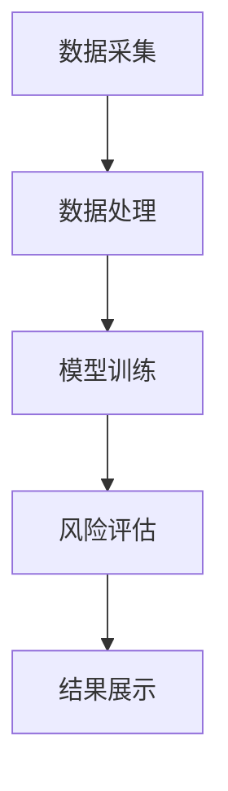
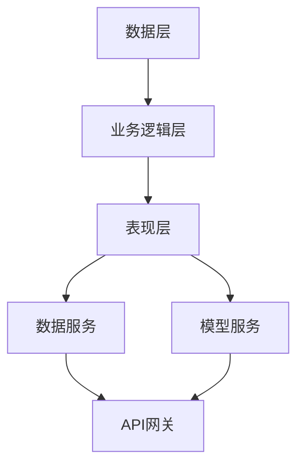
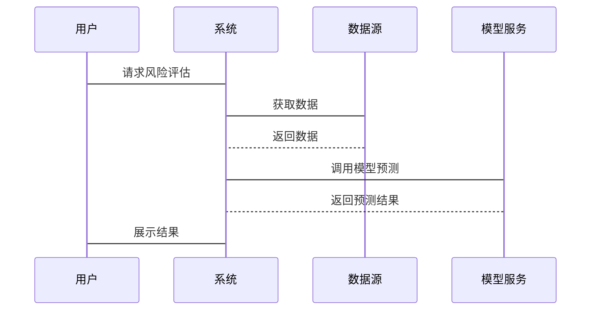

                 


# AI辅助的金融风险评估系统设计

> **关键词**：AI技术、金融风险评估、机器学习算法、深度学习、系统架构设计、风险控制  
> **摘要**：本文探讨了如何利用人工智能技术辅助金融风险评估系统的设计与优化。首先介绍了金融风险评估的基本概念和AI在金融领域的应用潜力，接着分析了AI辅助风险评估的核心算法原理，包括传统机器学习和深度学习算法。随后，详细阐述了系统的架构设计、接口设计以及实际项目中的应用案例。最后，总结了系统设计的关键点和未来的发展方向。

---

## 第一部分: AI与金融风险评估的结合

### 第1章: 金融风险评估的基本概念

#### 1.1 金融风险的定义与分类
金融风险是指在金融活动中，由于内外部因素的影响，可能导致资金损失或收益波动的可能性。常见的金融风险包括市场风险、信用风险、流动性风险和操作风险。  
- **市场风险**：由于市场波动导致资产价格下跌的风险。  
- **信用风险**：债务人或交易对手无法履行合同义务的风险。  
- **流动性风险**：无法迅速以合理价格变现资产的风险。  
- **操作风险**：由于内部流程、人员或系统缺陷导致的损失风险。

#### 1.2 传统金融风险评估方法
传统的金融风险评估方法主要包括以下几种：  
1. **VaR（Value at Risk）**：计算在特定置信水平下，资产组合的最大潜在损失。  
2. **CreditMetrics模型**：用于评估信用风险的方法，基于资产的历史违约率和相关性。  
3. **KMV模型**：通过期权定价理论评估企业违约概率。  

#### 1.3 AI技术在金融领域的应用潜力
人工智能技术的快速发展为金融风险评估带来了新的可能性。通过AI技术，可以实现以下目标：  
1. 提高风险评估的准确性：利用机器学习算法挖掘数据中的隐藏模式，发现传统方法难以察觉的风险因素。  
2. 提升风险评估的效率：通过自动化数据处理和模型训练，减少人工干预，提高处理速度。  
3. 降低金融风险的不确定性：利用实时数据和动态模型，及时捕捉市场变化，优化风险控制策略。

---

## 第二部分: AI辅助金融风险评估的核心概念与原理

### 第2章: AI与金融数据的关系

#### 2.1 金融数据的特征与分类
金融数据具有以下特征：  
1. **时间序列性**：许多金融数据（如股票价格、汇率）具有明显的时间依赖性。  
2. **波动性**：金融市场具有高度的不确定性和波动性。  
3. **相关性**：不同金融资产之间可能存在相关性，影响整体风险评估。  

金融数据可以分为以下几类：  
1. **结构化数据**：如股票价格、交易量、财务报表数据等。  
2. **非结构化数据**：如新闻、社交媒体评论等。  
3. **文本数据**：如公司公告、行业报告等。  

#### 2.2 AI在金融数据处理中的应用
AI技术在金融数据处理中的应用主要包括以下几点：  
1. **数据清洗**：利用自然语言处理（NLP）技术提取有用信息，去除噪声数据。  
2. **数据特征提取**：通过主成分分析（PCA）等方法提取数据的关键特征，降低维度。  
3. **数据增强**：通过生成对抗网络（GAN）等技术生成新的金融数据，增加训练数据的多样性。  

---

## 第三部分: AI辅助金融风险评估的算法原理

### 第3章: 常见的金融风险评估算法

#### 3.1 传统机器学习算法
1. **线性回归**：适用于预测连续型变量，如股票价格预测。  
2. **逻辑回归**：适用于分类问题，如信用评分。  
3. **支持向量机（SVM）**：适用于分类和回归问题，尤其在小样本数据上表现优异。  
4. **随机森林与梯度提升树**：通过集成学习提高模型的准确性和鲁棒性。

#### 3.2 深度学习算法
1. **神经网络基础**：包括感知机、多层感知机（MLP）等，用于处理复杂非线性关系。  
2. **卷积神经网络（CNN）**：适用于图像识别和时间序列数据处理。  
3. **循环神经网络（RNN）与长短期记忆网络（LSTM）**：适用于处理时间序列数据，捕捉长期依赖关系。  

#### 3.3 混合模型与集成学习
1. **混合模型**：通过结合不同模型的优势，提高预测准确性和稳定性。  
2. **集成学习**：通过投票、加权等方法，利用多个模型的结果进行最终预测。  

#### 3.4 算法选择与优化
1. **算法选择的准则**：根据数据类型、任务需求和计算资源选择合适的算法。  
2. **超参数优化与调参**：通过网格搜索、随机搜索或贝叶斯优化等方法，找到最优模型参数。  

---

## 第四部分: AI辅助金融风险评估的系统架构

### 第4章: 系统功能设计

#### 4.1 系统功能模块划分
1. **数据采集模块**：从多种数据源（如数据库、API接口、文件等）获取金融数据。  
2. **数据处理模块**：对数据进行清洗、转换和增强处理，提取特征。  
3. **模型训练模块**：选择合适的算法，进行模型训练和优化。  
4. **风险评估模块**：利用训练好的模型，对风险进行评估和预测。  
5. **结果展示模块**：将评估结果以可视化的方式展示，便于用户理解和决策。  

#### 4.2 系统功能流程图


---

## 第五章: 系统架构设计

### 5.1 分层架构设计
1. **数据层**：负责数据的存储和管理，包括关系型数据库和非关系型数据库。  
2. **业务逻辑层**：负责业务逻辑的实现，如数据处理、模型训练和风险评估。  
3. **表现层**：负责用户界面的展示，如Web界面或移动应用。  

### 5.2 微服务架构设计
1. **数据服务**：提供数据接口，支持其他服务的数据查询和更新。  
2. **模型服务**：负责模型的训练和预测，提供API接口供其他服务调用。  
3. **API网关**：负责路由、鉴权和限流，确保系统的安全性和稳定性。  

### 5.3 系统架构图


---

## 第六章: 系统接口设计

### 6.1 接口定义
1. **数据接口**：定义数据的输入格式和调用方式，如RESTful API。  
2. **模型接口**：定义模型的输入和输出格式，支持批量处理和实时预测。  
3. **结果接口**：定义结果的返回格式，包括风险评分、概率值和置信区间等。  

### 6.2 系统交互设计


---

## 第七章: 项目实战

### 7.1 环境安装
1. **Python环境**：安装Python 3.8及以上版本。  
2. **库的安装**：安装NumPy、Pandas、Scikit-learn、Keras、TensorFlow等库。  
   ```bash
   pip install numpy pandas scikit-learn keras tensorflow
   ```

### 7.2 核心实现源代码
```python
import numpy as np
import pandas as pd
from sklearn.ensemble import RandomForestClassifier
from sklearn.metrics import accuracy_score

# 数据加载
data = pd.read_csv('financial_data.csv')

# 数据预处理
X = data.drop('risk_label', axis=1)
y = data['risk_label']

# 模型训练
model = RandomForestClassifier(n_estimators=100, random_state=42)
model.fit(X, y)

# 模型预测
y_pred = model.predict(X)

# 模型评估
accuracy = accuracy_score(y, y_pred)
print(f'Accuracy: {accuracy}')
```

### 7.3 代码解读
1. **数据加载**：使用Pandas读取CSV格式的金融数据。  
2. **数据预处理**：删除目标变量，将数据分为特征和标签。  
3. **模型训练**：使用随机森林算法进行训练。  
4. **模型预测**：对训练数据进行预测。  
5. **模型评估**：计算准确率，评估模型性能。  

### 7.4 实际案例分析
以银行贷款风险评估为例，通过实际数据训练模型，并对新客户进行风险评分。通过可视化工具展示模型的预测结果，帮助银行做出更明智的信贷决策。

---

## 第八章: 总结与展望

### 8.1 总结
本文详细介绍了AI辅助金融风险评估系统的设计与实现，包括系统的功能模块、算法原理、系统架构和实际案例分析。通过AI技术的应用，可以显著提高风险评估的准确性和效率，降低金融风险的不确定性。

### 8.2 未来展望
随着AI技术的不断进步，金融风险评估系统将更加智能化和自动化。未来的研究方向包括：  
1. **强化学习**：用于动态风险管理和最优决策。  
2. **联邦学习**：在保护数据隐私的前提下，实现跨机构的联合建模。  
3. **可解释性AI（XAI）**：提高模型的透明度和可解释性，增强用户信任。  

---

## 注意事项与最佳实践
1. **数据安全**：在处理金融数据时，需严格遵守数据隐私保护法规，如GDPR。  
2. **模型解释性**：选择可解释性更强的模型，避免“黑箱”模型带来的信任问题。  
3. **实时性**：在金融领域，实时性至关重要，需优化系统的响应速度。  
4. **多模型集成**：通过集成学习，提高模型的稳定性和准确性。  

---

## 作者：AI天才研究院/AI Genius Institute  
**禅与计算机程序设计艺术 /Zen And The Art of Computer Programming**

