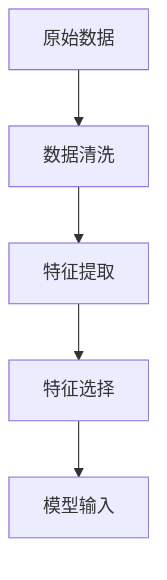
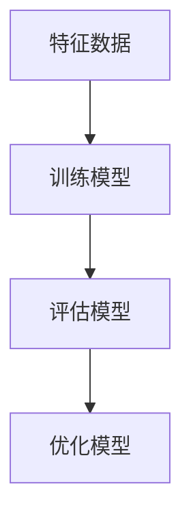
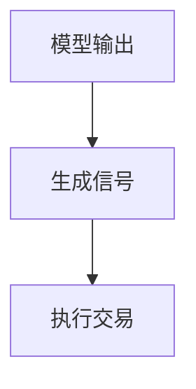
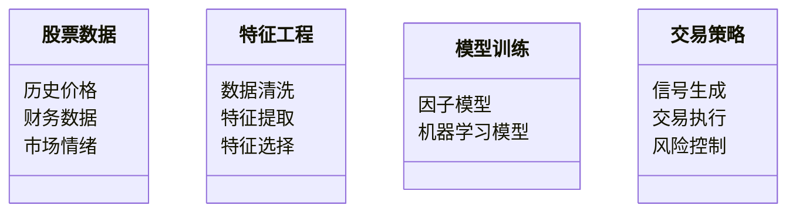
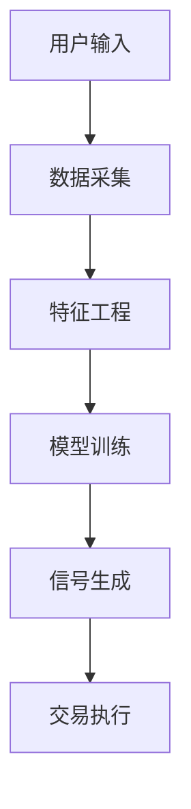

                 


# AI辅助识别价值股轮动机会

> 关键词：AI，价值股，股票轮动，机器学习，投资策略

> 摘要：本文探讨了如何利用人工智能技术辅助识别价值股的轮动机会。通过分析价值股的定义、技术框架、数据特征、模型选择和系统架构，详细讲解了AI在股票投资中的应用。文章还通过实际案例展示了如何通过AI技术实现价值股的识别和轮动策略，为投资者提供了实用的指导和建议。

---

# 第1章：价值股与股票轮动的背景与概念

## 1.1 价值股的基本概念

### 1.1.1 价值股的定义与特征
价值股是指那些市场价格低于其内在价值的股票。其核心特征包括：
- 低市盈率（P/E）：市盈率低于行业平均水平。
- 低市净率（P/B）：市净率低于行业平均水平。
- 高股息率：股息收益率较高，通常高于行业平均水平。

### 1.1.2 价值股的投资策略
价值投资策略强调长期持有优质资产，寻找被市场低估的股票。主要策略包括：
- 穷举法：系统性地筛选出满足特定价值指标的股票。
- 安全边际：买入价格远低于内在价值的股票。
- 逆向投资：在市场恐慌时买入，市场狂热时卖出。

### 1.1.3 价值股与成长股的对比
| 特性 | 价值股 | 成长股 |
|------|--------|--------|
| 估值 | 低于内在价值 | 通常高于内在价值 |
| 股息 | 高 | 低或无 |
| 市盈率 | 低 | 高 |
| 市净率 | 低 | 高 |
| 风险 | 较低 | 较高 |

## 1.2 股票轮动机会的定义

### 1.2.1 股票轮动的定义
股票轮动是指根据市场变化，动态调整投资组合，将资金从表现不佳的股票转移到表现较好的股票的过程。

### 1.2.2 股票轮动的类型
- 行业轮动：根据行业表现切换投资标的。
- 指数轮动：根据指数表现进行投资组合调整。
- 股票轮动：根据个股表现进行投资组合调整。

### 1.2.3 股票轮动的机会捕捉
- 市场周期性：利用市场的周期性变化，寻找低估的资产。
- 行业轮动：选择当前景气度高的行业。
- 个股轮动：筛选出短期内表现超预期的个股。

## 1.3 AI在金融投资中的应用

### 1.3.1 AI在股票分析中的作用
- 数据处理：快速处理大量非结构化数据，如新闻、社交媒体数据。
- 模型构建：利用机器学习算法预测股票价格走势。
- 风险管理：实时监控市场风险，优化投资组合。

### 1.3.2 AI在投资决策中的优势
- 高效性：快速分析市场数据，提供实时投资建议。
- 客观性：基于数据驱动的决策，减少人为情绪干扰。
- 精准性：通过深度学习模型，精准预测市场趋势。

### 1.3.3 AI在股票轮动中的潜力
- 自动化：实现投资组合的自动化调整，降低人工干预成本。
- 高频交易：利用算法交易捕捉短期市场波动。
- 智能选股：通过AI筛选出具有潜在轮动机会的股票。

---

# 第2章：AI辅助识别价值股轮动的核心概念

## 2.1 价值股识别的关键指标

### 2.1.1 市盈率（P/E）与市净率（P/B）
- 市盈率（P/E）= 股票价格 / 每股净利润
- 市净率（P/B）= 股票价格 / 每股净资产

### 2.1.2 股息率与股息支付率
- 股息率 = 每股股息 / 股票价格
- 股息支付率 = 股息 / 净利润

### 2.1.3 赢利能力指标（ROE、ROA）
- 净资产收益率（ROE）= 净利润 / 净资产
- 资产收益率（ROA）= 净利润 / 总资产

## 2.2 股票轮动机会的AI识别方法

### 2.2.1 数据特征提取
- 价格数据：历史收盘价、开盘价、最高价、最低价
- 交易数据：成交量、成交额、换手率
- 财务数据：收入、利润、现金流、资产负债表
- 市场情绪数据：新闻、社交媒体、投资者情绪指数

### 2.2.2 模型选择与训练
- 监督学习：回归分析预测股价，分类模型识别价值股
- 非监督学习：聚类分析发现相似股票
- 深度学习：LSTM预测股价走势，神经网络识别市场模式

### 2.2.3 信号生成与策略优化
- 信号生成：根据模型输出生成买入、卖出信号
- 策略优化：通过回测优化交易策略，控制风险

## 2.3 AI技术在价值股轮动中的应用框架

### 2.3.1 数据流与特征工程


### 2.3.2 模型训练与评估


### 2.3.3 信号生成与策略执行


---

# 第3章：因子模型与机器学习算法

## 3.1 因子模型的构建

### 3.1.1 因子选择与权重分配
- 选择多个因子（如P/E、ROE、股息率）构建因子模型
- 根据因子的重要性分配权重

### 3.1.2 因子组合与优化
- 使用优化算法（如遗传算法）优化因子组合
- 考虑因子间的相关性，避免多重共线性问题

### 3.1.3 因子模型的评估与验证
- 使用回测方法验证因子模型的有效性
- 计算夏普比率、最大回撤等风险调整后收益指标

## 3.2 机器学习算法在股票轮动中的应用

### 3.2.1 监督学习模型
- 线性回归：预测股票价格
- 支持向量机（SVM）：分类股票涨跌
- 随机森林：特征重要性分析，预测股票走势

### 3.2.2 非监督学习模型
- 聚类分析：将股票分为不同类别，识别价值股
- 主成分分析（PCA）：降维，提取关键特征

### 3.2.3 深度学习模型
- LSTM网络：时间序列预测，捕捉股价趋势
- 卷积神经网络（CNN）：处理图像数据，分析K线图

## 3.3 算法原理的数学模型

### 3.3.1 因子模型的数学表达
$$ R_i = \alpha + \beta F_i + \epsilon $$

### 3.3.2 机器学习模型的损失函数
$$ L = \frac{1}{N}\sum_{i=1}^{N}(y_i - \hat{y}_i)^2 $$

---

# 第4章：系统架构设计与实现

## 4.1 系统功能设计

### 4.1.1 领域模型


### 4.1.2 系统架构


---

# 第5章：项目实战与案例分析

## 5.1 项目实战

### 5.1.1 环境搭建
```bash
pip install pandas numpy scikit-learn tensorflow
```

### 5.1.2 数据预处理
```python
import pandas as pd
data = pd.read_csv('stock_data.csv')
data = data.dropna()
```

### 5.1.3 因子计算
```python
def calculate_pe_ratio(price, earnings):
    return price / earnings
```

### 5.1.4 模型训练
```python
from sklearn.linear_model import LinearRegression
model = LinearRegression()
model.fit(X_train, y_train)
```

### 5.1.5 策略优化
```python
def backtest策略：
    计算因子得分
    筛选top N股票
    计算收益与风险指标
```

### 5.1.6 实际案例分析
以沪深300指数为例，展示如何通过AI技术识别价值股并制定轮动策略。

---

# 第6章：最佳实践与总结

## 6.1 最佳实践

### 6.1.1 数据质量
- 数据清洗：处理缺失值、异常值
- 数据增强：补充高频数据、市场情绪数据

### 6.1.2 模型选择
- 根据数据特点选择合适的算法
- 多模型对比，选择表现最优的模型

### 6.1.3 风险管理
- 设置止损点，控制最大回撤
- 分散投资，降低个股风险

## 6.2 小结
本文详细介绍了AI辅助识别价值股轮动机会的方法，从理论到实践，为投资者提供了系统性的指导。

## 6.3 注意事项
- 模型的有效性依赖于数据质量
- 交易成本和滑点会影响实际收益
- 市场存在不确定性，模型仅供参考

## 6.4 拓展阅读
- 《算法交易：机afi策略与及其Python实现》
- 《机器学习在金融中的应用》
- 《股票投资策略与AI结合的前沿研究》

---

# 附录：代码与参考文献

## 附录A：核心代码

```python
import pandas as pd
from sklearn.linear_model import LinearRegression
from sklearn.metrics import mean_squared_error

# 数据加载
data = pd.read_csv('stock_data.csv')

# 数据预处理
data = data.dropna()

# 特征与目标变量分离
X = data[['pe_ratio', 'ro

