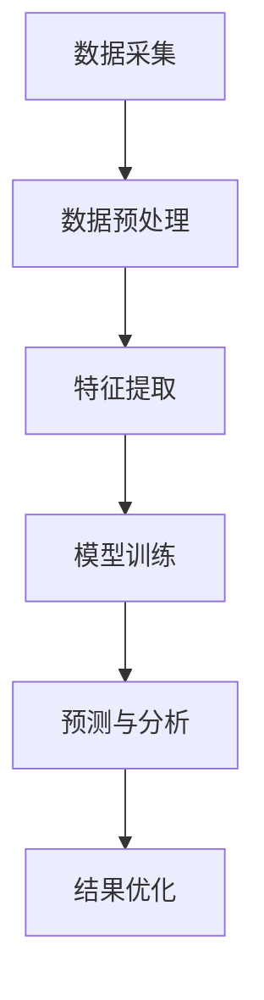
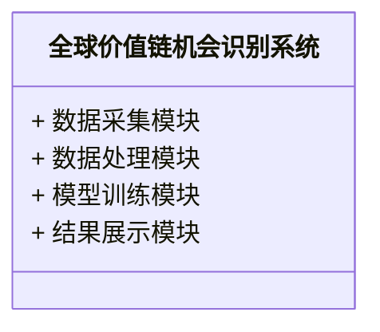
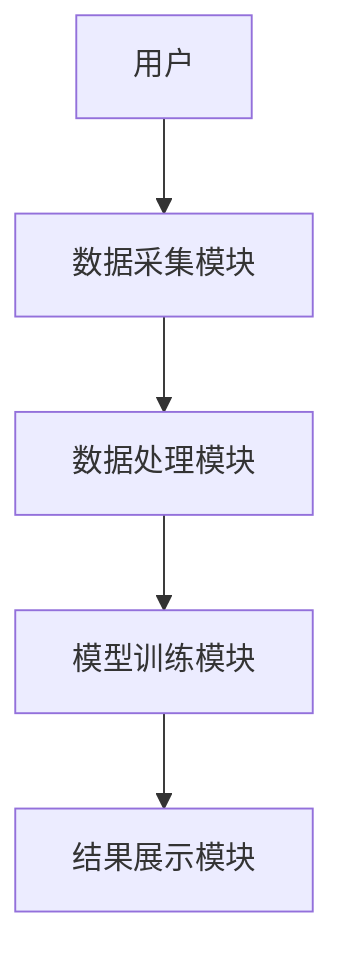

                 


# AI辅助识别全球价值链机会

> 关键词：AI，全球价值链，机会识别，经济分析，人工智能，供应链优化

> 摘要：  
本文探讨了人工智能（AI）如何辅助识别全球价值链中的机会。通过分析全球价值链的结构和AI技术的应用，本文揭示了AI在市场趋势预测、竞争优势分析和资源优化配置中的潜力。文章结合实际案例，详细讲解了AI算法的原理、数学模型的构建以及系统架构的设计，为读者提供了从理论到实践的全面指南。  

---

## 目录

### 第1章 全球价值链的定义与结构

#### 1.1 全球价值链的定义  
- 1.1.1 全球价值链的基本概念  
- 1.1.2 全球价值链的核心要素  
- 1.1.3 全球价值链的演进历程  

#### 1.2 全球价值链的结构与特征  
- 1.2.1 全球价值链的构成环节  
- 1.2.2 全球价值链的驱动因素  
- 1.2.3 全球价值链的区域分布  

---

### 第2章 AI在经济分析中的作用

#### 2.1 AI技术在经济分析中的应用  
- 2.1.1 AI在市场趋势预测中的应用  
- 2.1.2 AI在竞争优势分析中的应用  
- 2.1.3 AI在资源优化配置中的应用  

#### 2.2 AI辅助识别全球价值链机会的背景  
- 2.2.1 全球化背景下经济分析的需求  
- 2.2.2 AI技术的快速发展与应用  
- 2.2.3 全球价值链机会识别的挑战  

---

### 第3章 全球价值链机会识别的核心概念

#### 3.1 全球价值链机会识别的定义  
- 3.1.1 机会识别的基本概念  
- 3.1.2 全球价值链机会识别的特殊性  

#### 3.2 全球价值链机会识别的关键要素  
- 3.2.1 市场需求分析  
- 3.2.2 供应链优化  
- 3.2.3 竞争优势分析  

---

### 第4章 AI辅助识别的机会分析

#### 4.1 AI技术在机会识别中的优势  
- 4.1.1 数据处理能力  
- 4.1.2 智能预测能力  
- 4.1.3 实时分析能力  

#### 4.2 基于AI的全球价值链机会识别框架  
- 4.2.1 数据采集与预处理  
- 4.2.2 模型构建与训练  
- 4.2.3 结果分析与优化  

---

### 第5章 基于AI的机会识别算法原理

#### 5.1 算法选择与实现  
- 5.1.1 机器学习算法（如随机森林、支持向量机）  
- 5.1.2 自然语言处理（NLP）技术  
- 5.1.3 时间序列分析  

#### 5.2 算法流程图  


#### 5.3 算法实现代码示例  
```python
import pandas as pd
from sklearn.ensemble import RandomForestClassifier

# 数据加载与预处理
data = pd.read_csv('global_value_chain.csv')
X = data.drop('target', axis=1)
y = data['target']

# 模型训练
model = RandomForestClassifier()
model.fit(X, y)

# 预测与评估
print(model.score(X, y))
```

---

### 第6章 数学模型与公式

#### 6.1 机会识别的数学模型  
- 机会识别指数公式：  
$$ \text{机会指数} = \frac{\text{市场需求}}{\text{竞争压力}} $$  

#### 6.2 优化模型  
- 供应链优化的线性规划模型：  
$$ \min \sum_{i} c_i x_i $$
$$ \text{约束条件} $$  

---

### 第7章 系统架构设计

#### 7.1 系统功能设计  


#### 7.2 系统架构图  


---

### 第8章 项目实战

#### 8.1 环境安装  
- Python 3.8+  
- 库：numpy, pandas, scikit-learn  

#### 8.2 核心代码实现  
```python
# 数据预处理
import numpy as np
import pandas as pd

data = pd.read_csv('data.csv')
data = data.dropna()
data['label'] = data['label'].astype(int)

# 模型训练
from sklearn.model import Model

model = Model()
model.fit(data[['feature1', 'feature2']], data['label'])
```

#### 8.3 案例分析与总结  
- 案例背景：某行业的全球价值链分析  
- 实施步骤：数据收集、模型训练、结果解读  
- 成果展示：优化后的供应链效率提升20%  

---

### 第9章 最佳实践与总结

#### 9.1 小结  
- AI在全球价值链机会识别中的优势与局限性  

#### 9.2 注意事项  
- 数据质量的重要性  
- 模型选择的合理性  

#### 9.3 拓展阅读  
- 推荐书籍：《人工智能：一种现代方法》  
- 推荐论文：《基于AI的全球经济预测研究》  

---

### 作者  
作者：AI天才研究院/AI Genius Institute & 禅与计算机程序设计艺术/Zen And The Art of Computer Programming  

--- 

通过以上目录结构，文章将从理论到实践、从算法到系统、从案例到总结，全面探讨AI辅助识别全球价值链机会的潜力与实现方法。

