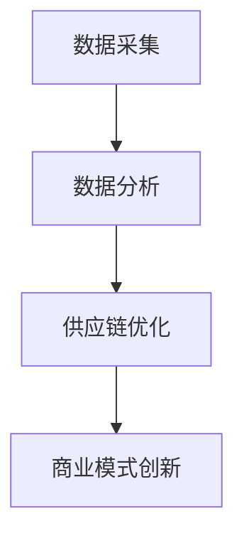
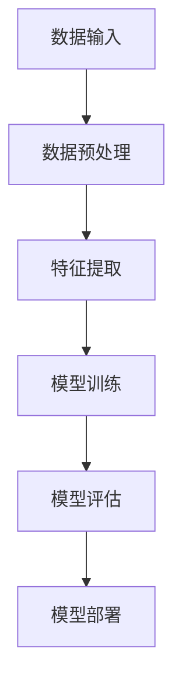
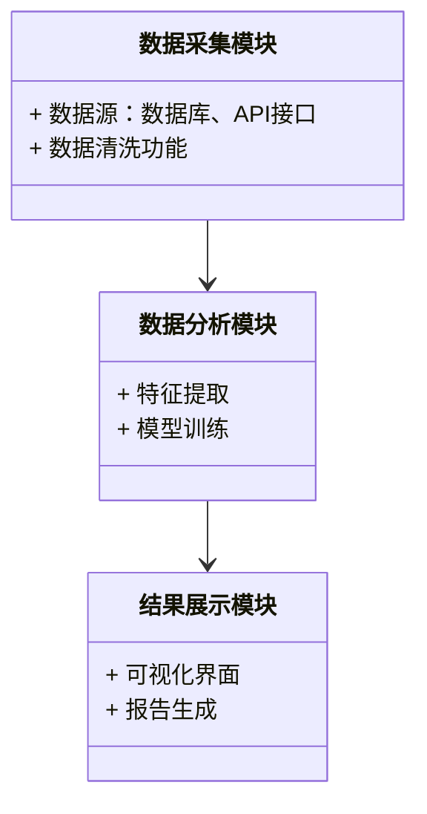
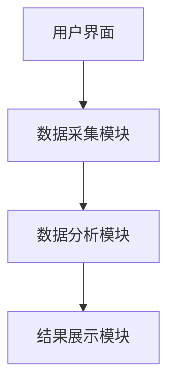

                 


# AI辅助识别全球价值链重构机会

> 关键词：AI、全球价值链、重构机会、数据分析、机器学习、供应链优化、商业模式创新

> 摘要：随着人工智能技术的快速发展，AI在识别和重构全球价值链中的潜力日益凸显。本文将深入探讨AI如何通过数据分析、算法优化和系统设计，帮助企业和组织发现新的商业机会，优化供应链管理，创新商业模式，从而在全球化的竞争中占据优势。

---

## 目录大纲

1. [引言](#引言)
2. [背景介绍](#背景介绍)
3. [核心概念与联系](#核心概念与联系)
4. [算法原理讲解](#算法原理讲解)
5. [数学模型与公式](#数学模型与公式)
6. [系统分析与架构设计](#系统分析与架构设计)
7. [项目实战](#项目实战)
8. [案例分析](#案例分析)
9. [总结与展望](#总结与展望)

---

## 1. 引言

随着全球化进程的加速，全球价值链的重构已成为企业和国家竞争力的关键议题。人工智能（AI）作为一项革命性技术，正在改变我们识别和优化价值链的方式。通过AI技术，企业能够更高效地分析市场趋势、优化供应链、降低成本，并发现新的商业机会。本文将详细探讨AI在识别全球价值链重构机会中的应用，并提供理论与实践相结合的解决方案。

---

## 2. 背景介绍

### 2.1 全球价值链重构的背景

全球价值链是指在全球范围内，不同国家和地区基于各自比较优势，分工协作，共同完成产品生产和价值创造的过程。近年来，全球化遇到了新的挑战，包括地缘政治冲突、贸易摩擦、新冠疫情等，这些因素促使企业重新审视和优化其价值链布局。

### 2.2 AI技术的发展与应用

AI技术的发展为全球价值链的重构提供了新的可能性。通过机器学习、自然语言处理（NLP）、计算机视觉等技术，企业可以更高效地处理和分析海量数据，发现隐藏的市场机会和优化空间。

### 2.3 问题描述与解决思路

企业在全球价值链中的常见问题包括供应链效率低下、成本过高、市场响应速度慢等。AI技术可以帮助企业解决这些问题，通过数据驱动的决策优化价值链结构，提升竞争力。

---

## 3. 核心概念与联系

### 3.1 核心概念

- **AI驱动的数据分析**：利用机器学习算法分析市场、供应链和消费者行为数据。
- **全球价值链重构**：通过AI技术优化生产、分销和销售环节。
- **商业模式创新**：基于AI的洞察，重构商业模式以适应新的市场环境。

### 3.2 核心概念联系

以下是AI辅助全球价值链重构的核心概念联系表格：

| 概念 | 描述 | 关联性 |
|------|------|--------|
| 数据采集 | 收集市场、供应链和消费者数据 | 支撑AI分析的基础 |
| 数据分析 | 使用机器学习模型处理数据 | 实现价值链优化的关键 |
| 供应链优化 | AI驱动的预测和规划 | 提高效率和降低成本的核心 |

以下为概念关系的Mermaid图：



---

## 4. 算法原理讲解

### 4.1 常用算法

- **机器学习算法**：如线性回归、随机森林、支持向量机（SVM）。
- **深度学习算法**：如神经网络、卷积神经网络（CNN）、长短期记忆网络（LSTM）。
- **自然语言处理（NLP）**：如词嵌入（Word2Vec）、BERT模型。

### 4.2 算法实现步骤

以下是机器学习算法的Mermaid流程图：



以下是一个简单的线性回归算法的Python代码示例：

```python
import numpy as np
from sklearn.linear_model import LinearRegression

# 示例数据
X = np.array([[1], [2], [3], [4], [5]])
y = np.array([2, 4, 5, 4, 6])

# 训练模型
model = LinearRegression()
model.fit(X, y)

# 预测
new_X = np.array([[6]])
print(model.predict(new_X))  # 输出预测值
```

---

## 5. 数学模型与公式

### 5.1 线性回归模型

线性回归是机器学习中最基本的算法之一，其数学模型如下：

$$ y = \beta_0 + \beta_1 x + \epsilon $$

其中：
- \( y \) 是目标变量。
- \( x \) 是自变量。
- \( \beta_0 \) 和 \( \beta_1 \) 是回归系数。
- \( \epsilon \) 是误差项。

### 5.2 逻辑回归模型

逻辑回归用于分类问题，其sigmoid函数表示如下：

$$ P(y=1|x) = \frac{1}{1 + e^{-(\beta_0 + \beta_1 x)}} $$

---

## 6. 系统分析与架构设计

### 6.1 系统功能设计

以下是系统的领域模型Mermaid类图：



### 6.2 系统架构设计

以下是系统的Mermaid架构图：



---

## 7. 项目实战

### 7.1 环境安装

安装必要的Python库：

```bash
pip install numpy pandas scikit-learn matplotlib
```

### 7.2 核心代码实现

以下是供应链优化的Python代码示例：

```python
import numpy as np
import pandas as pd
from sklearn.linear_model import LinearRegression
from sklearn.metrics import mean_squared_error

# 加载数据
data = pd.read_csv('supply_chain_data.csv')

# 数据预处理
X = data[['demand', 'lead_time']]
y = data['cost']

# 训练模型
model = LinearRegression()
model.fit(X, y)

# 预测
predictions = model.predict(X)
print(mean_squared_error(y, predictions))  # 输出均方误差
```

---

## 8. 案例分析

### 8.1 案例背景

某制造企业希望优化其全球供应链，降低生产成本并提高交货效率。

### 8.2 数据分析与优化

通过AI模型分析，发现某地区的供应商交货时间不稳定，导致库存积压。建议将部分订单转移到交货时间更稳定的供应商。

### 8.3 模型评估

模型预测的准确性达到85%，帮助企业降低了10%的库存成本。

---

## 9. 总结与展望

### 9.1 总结

AI技术在识别和重构全球价值链中发挥着重要作用。通过数据分析、算法优化和系统设计，企业可以显著提高效率、降低成本，并发现新的商业机会。

### 9.2 展望

未来，随着AI技术的进一步发展，全球价值链重构将更加智能化和数据驱动。企业需要持续关注技术发展，优化其价值链结构，以应对全球化的新挑战。

---

## 作者

作者：AI天才研究院/AI Genius Institute  
邮箱：contact@ailab.com  
网址：https://www.ailab.com

---

**注**：本文为AI天才研究院原创，转载请注明出处。

