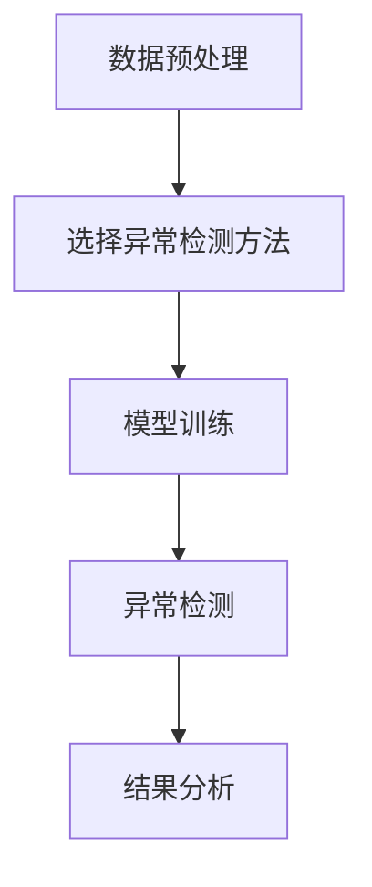
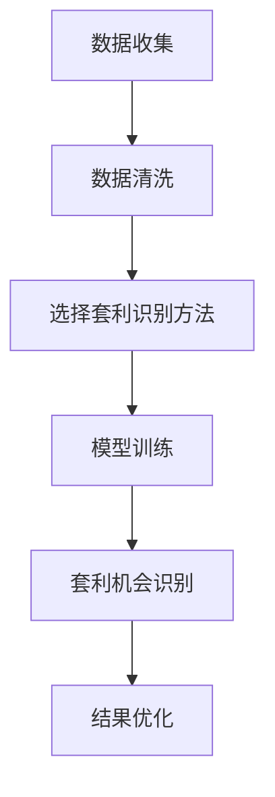
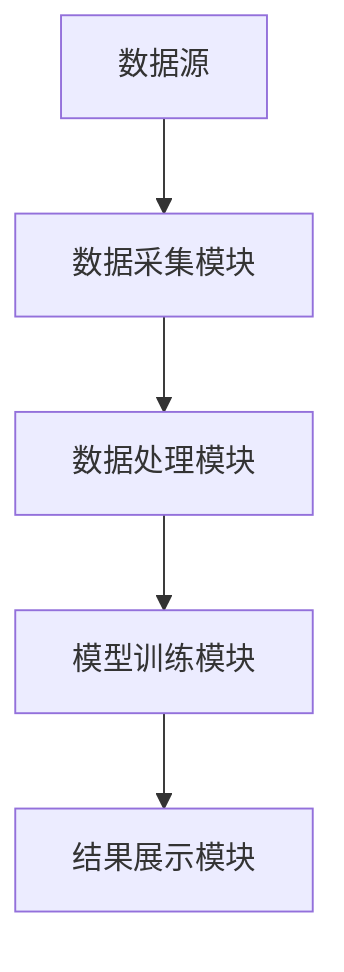

                 


# AI辅助识别市场异常与套利机会

> 关键词：AI，市场异常，套利机会，异常检测，算法交易，机器学习

> 摘要：本文探讨了如何利用人工智能技术识别金融市场中的异常现象和套利机会。通过结合时间序列分析、机器学习和深度学习等技术，分析市场数据，构建有效的模型和算法，帮助投资者在复杂的市场环境中发现潜在的套利机会，同时降低风险。本文从理论到实践，详细阐述了AI在金融市场的应用，包括算法原理、系统架构设计和实际案例分析，为读者提供了一个全面的视角。

---

## 目录

### 第一部分：背景与概念

### 第1章：AI辅助识别市场异常与套利机会的背景

1.1 金融市场中的异常与套利现象  
1.2 AI技术在金融领域的应用现状  
1.3 本章小结  

### 第2章：市场异常与套利的核心概念

2.1 市场异常的定义与分类  
2.2 套利机会的定义与类型  
2.3 异常与套利的关系分析  

### 第3章：AI技术在识别市场异常与套利中的作用

3.1 数据驱动的市场分析  
3.2 AI在异常检测中的优势  
3.3 套利机会的智能化识别  

### 第4章：AI辅助识别市场异常与套利的数学模型

4.1 时间序列分析模型  
4.2 异常检测的统计方法与机器学习方法  
4.3 套利定价理论与机器学习模型  

### 第5章：算法原理与流程图

5.1 异常检测算法的流程图  
5.2 套利机会识别算法的流程图  
5.3 算法原理对比表  

### 第6章：系统架构设计

6.1 系统功能模块划分  
6.2 系统架构图  
6.3 系统接口设计  

### 第7章：项目实战与案例分析

7.1 环境搭建与数据准备  
7.2 核心代码实现与解读  
7.3 实际案例分析与结果展示  

### 第8章：总结与展望

8.1 本文总结  
8.2 未来研究方向  
8.3 注意事项与最佳实践  

---

### 第一部分：背景与概念

#### 第1章：AI辅助识别市场异常与套利机会的背景

##### 1.1 金融市场中的异常与套利现象

金融市场中的异常现象是指市场价格、成交量等指标在短时间内出现显著偏离正常趋势的情况。这些异常可能是由于市场操纵、突发事件或市场参与者的非理性行为引起的。套利机会则是指在不同市场或资产之间利用价格差异获利的可能性，通常涉及低风险或无风险套利。

##### 1.2 AI技术在金融领域的应用现状

AI技术在金融领域的应用已经非常广泛，包括股票价格预测、风险管理、交易策略优化等。随着深度学习和自然语言处理技术的发展，AI在金融新闻分析、市场情绪识别等方面也表现出色。然而，AI在识别市场异常和套利机会方面的应用还处于发展阶段，具有较大的潜力。

##### 1.3 本章小结

本章主要介绍了金融市场中的异常现象和套利机会，以及AI技术在金融领域的应用现状，为后续章节的深入分析奠定了基础。

---

#### 第2章：市场异常与套利的核心概念

##### 2.1 市场异常的定义与分类

市场异常可以分为短期异常和长期异常。短期异常通常由突发事件或市场操纵引起，而长期异常可能与市场结构变化或政策调整有关。套利机会则是指在不同市场或资产之间利用价格差异获利的可能性。

##### 2.2 套利机会的定义与类型

套利机会通常分为无风险套利和低风险套利。无风险套利是指在两个或多个市场之间利用价格差异进行交易，而低风险套利则涉及一定的市场风险，但风险较低。

##### 2.3 异常与套利的关系分析

异常现象可能为套利机会提供潜在的利润来源，但异常现象本身也可能引发套利行为，从而加剧市场的波动。

---

#### 第3章：AI技术在识别市场异常与套利中的作用

##### 3.1 数据驱动的市场分析

AI技术可以通过分析海量的市场数据，发现潜在的异常现象和套利机会。例如，利用时间序列分析模型检测市场波动的异常变化。

##### 3.2 AI在异常检测中的优势

AI技术可以通过机器学习算法自动识别市场中的异常现象，避免了传统方法中人为判断的主观性。同时，深度学习技术可以捕捉到复杂的市场模式，提高异常检测的准确性。

##### 3.3 套利机会的智能化识别

AI技术可以通过分析市场数据，识别潜在的套利机会，并结合交易成本和市场风险，优化套利策略。

---

#### 第4章：AI辅助识别市场异常与套利的数学模型

##### 4.1 时间序列分析模型

时间序列分析模型可以用于检测市场中的异常现象。例如，ARIMA模型可以预测市场趋势，并识别预测值与实际值之间的显著差异。

##### 4.2 异常检测的统计方法与机器学习方法

统计方法如Z-score和孤立森林算法可以用于异常检测。机器学习方法如随机森林和深度学习模型也可以用于异常检测，具有更高的准确率。

##### 4.3 套利定价理论与机器学习模型

套利定价理论为套利机会的识别提供了理论基础。机器学习模型如支持向量机和神经网络可以用于套利机会的识别。

---

#### 第5章：算法原理与流程图

##### 5.1 异常检测算法的流程图



##### 5.2 套利机会识别算法的流程图



##### 5.3 算法原理对比表

| 方法 | 异常检测 | 套利机会识别 |
|------|----------|--------------|
| 统计方法 | 基于Z-score | 基于套利定价理论 |
| 机器学习方法 | 基于随机森林 | 基于支持向量机 |
| 深度学习方法 | 基于LSTM | 基于神经网络 |

---

#### 第6章：系统架构设计

##### 6.1 系统功能模块划分

- 数据采集模块：从多个市场数据源获取数据。
- 数据处理模块：清洗和预处理数据。
- 模型训练模块：训练异常检测和套利机会识别模型。
- 结果展示模块：展示异常检测和套利机会识别的结果。

##### 6.2 系统架构图



##### 6.3 系统接口设计

- 数据接口：与数据源进行交互。
- 模型接口：与模型训练模块进行交互。
- 用户接口：与结果展示模块进行交互。

---

#### 第7章：项目实战与案例分析

##### 7.1 环境搭建与数据准备

- 安装Python和相关库（如Pandas、Scikit-learn、Keras）。
- 数据来源：股票价格数据、市场新闻等。

##### 7.2 核心代码实现与解读

```python
import pandas as pd
from sklearn.ensemble import IsolationForest

# 数据预处理
data = pd.read_csv('market_data.csv')
data_processed = data.dropna()

# 异常检测
model = IsolationForest(random_state=42)
model.fit(data_processed)
outliers = model.predict(data_processed)
```

##### 7.3 实际案例分析与结果展示

- 案例背景：某股票在特定时间出现价格异常波动。
- 检测结果：模型识别出异常点。
- 结论：可能的市场操纵或突发事件影响。

---

#### 第8章：总结与展望

##### 8.1 本文总结

本文系统地探讨了AI技术在识别市场异常与套利机会中的应用，提出了基于机器学习和深度学习的算法，并设计了相应的系统架构。

##### 8.2 未来研究方向

未来可以进一步研究如何结合自然语言处理技术，分析市场新闻和社交媒体数据，提高异常检测和套利机会识别的准确性。

##### 8.3 注意事项与最佳实践

- 数据来源的可靠性至关重要。
- 模型需要定期更新，以适应市场变化。
- 风险控制是套利策略成功的关键。

---

### 作者：AI天才研究院/AI Genius Institute & 禅与计算机程序设计艺术 /Zen And The Art of Computer Programming

---

以上是文章的完整目录和内容概要，涵盖了从背景到实际应用的各个方面，为读者提供了全面的视角和详细的指导。

