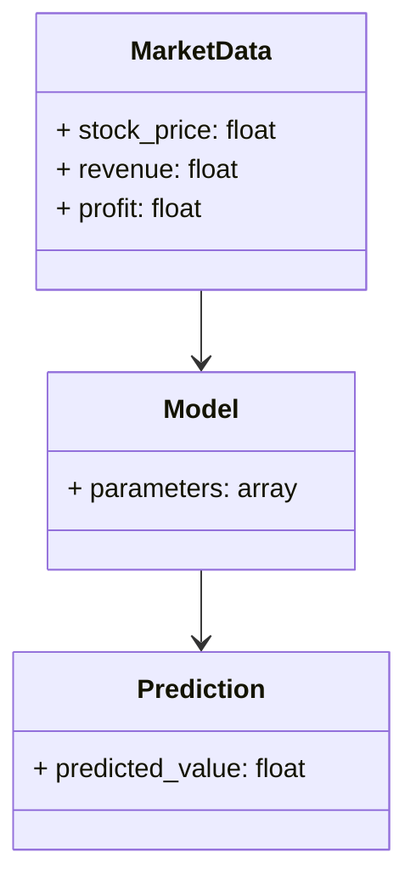
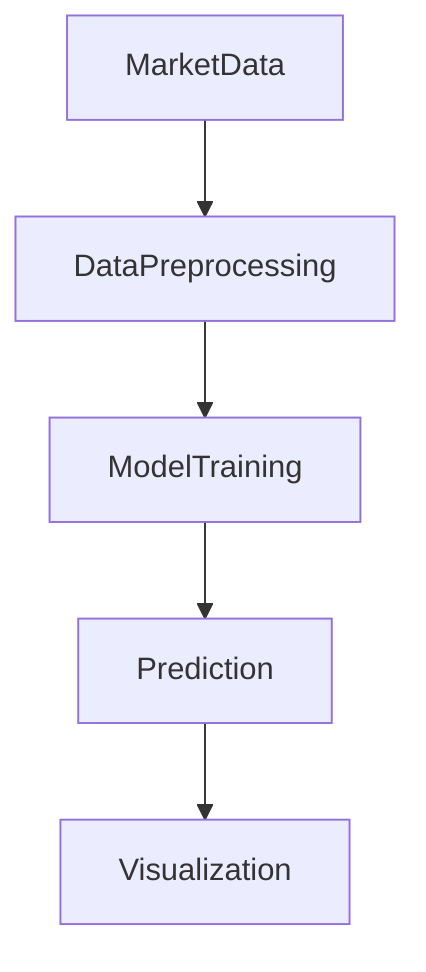
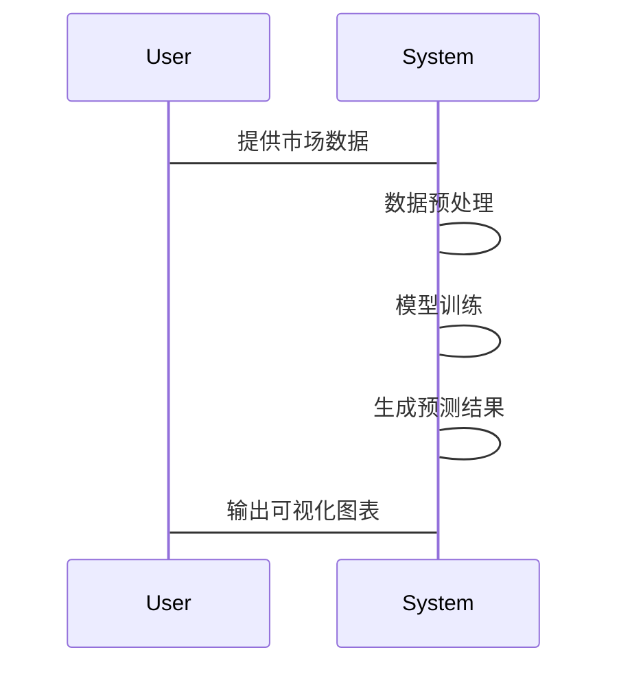

                 


# AI辅助识别市场结构性变化机会

> 关键词：AI技术，市场分析，时间序列分析，LSTM模型，市场趋势预测

> 摘要：本文探讨AI技术如何辅助识别市场结构性变化机会，通过分析市场趋势、预测风险，并结合实际案例，详细阐述AI在市场分析中的应用。

---

## 第1章: AI辅助识别市场结构性变化机会的背景介绍

### 1.1 市场结构性变化的定义与特征

#### 1.1.1 市场结构性变化的定义
市场结构性变化指的是市场中供需关系、竞争格局、消费者行为等因素发生显著变化，导致市场格局重新调整的过程。这种变化可能由技术进步、政策调整、经济波动等多种因素引发。

#### 1.1.2 市场结构性变化的特征
- **突发性**：市场结构性变化往往出人意料，难以在短时间内被发现。
- **复杂性**：涉及多个变量，包括宏观经济、行业动态、消费者行为等。
- **持续性**：一旦发生，可能会对市场产生长期影响。

#### 1.1.3 市场结构性变化的分类
- **行业内部变化**：如技术革新导致的竞争格局变化。
- **外部环境变化**：如政策法规调整或全球经济波动。
- **消费者行为变化**：如新一代消费群体的崛起。

### 1.2 AI在市场分析中的作用

#### 1.2.1 AI技术在市场分析中的优势
- **数据处理能力**：AI能够处理海量数据，提取关键信息。
- **预测准确性**：通过机器学习算法，AI能够提高市场趋势预测的准确性。
- **实时性**：AI可以实时分析市场动态，快速做出反应。

#### 1.2.2 AI技术在市场结构性变化识别中的应用
- **识别潜在机会**：通过分析市场数据，AI可以帮助企业发现新的市场机会。
- **预测市场风险**：AI能够预测市场波动，帮助企业规避风险。
- **优化决策过程**：AI辅助决策，提高企业运营效率。

#### 1.2.3 AI技术与传统市场分析方法的对比
| 特性         | AI技术                         | 传统方法                      |
|--------------|--------------------------------|-------------------------------|
| 数据处理能力 | 高效处理海量数据               | 依赖人工分析，效率较低        |
| 预测准确性   | 基于机器学习，预测更准确       | 依赖经验，预测误差较大        |
| 实时性       | 可实时分析数据                 | 通常滞后，难以实时响应        |

---

## 第2章: AI辅助识别市场结构性变化的核心概念

### 2.1 市场结构性变化的核心要素

#### 2.1.1 数据驱动的市场分析
数据驱动的市场分析是指通过收集和分析大量数据，发现市场规律和趋势。AI技术在这一过程中发挥着关键作用，尤其是处理非结构化数据的能力。

#### 2.1.2 市场趋势预测模型
市场趋势预测模型是基于历史数据，利用机器学习算法预测未来市场趋势的工具。常见的模型包括线性回归、ARIMA和LSTM等。

#### 2.1.3 市场机会识别框架
市场机会识别框架是一种系统化的方法，用于识别和评估市场中的潜在机会。AI技术可以帮助企业快速识别这些机会，并制定相应的策略。

### 2.2 AI技术在市场结构性变化识别中的原理

#### 2.2.1 数据预处理与特征提取
数据预处理是AI分析的第一步，包括数据清洗、标准化和特征提取。例如，使用主成分分析（PCA）提取关键特征。

#### 2.2.2 模型训练与优化
通过训练机器学习模型，AI能够识别市场中的潜在规律。例如，使用LSTM模型预测时间序列数据。

#### 2.2.3 结果解释与可视化
AI分析的结果需要以直观的方式呈现，例如通过图表展示预测结果和趋势变化。

---

## 第3章: AI辅助识别市场结构性变化机会的算法实现

### 3.1 时间序列分析算法

#### 3.1.1 时间序列分析的定义与特点
时间序列分析是一种通过分析历史数据，预测未来趋势的方法。其特点是数据按时间顺序排列，具有很强的依赖性。

#### 3.1.2 常见的时间序列分析方法
- **ARIMA模型**：自回归积分滑动平均模型，适用于线性时间序列数据。
- **LSTM模型**：长短期记忆网络，适用于非线性时间序列数据。

#### 3.1.3 基于AI的时间序列分析模型
使用LSTM模型预测股票价格，代码如下：

```python
import numpy as np
import pandas as pd
from tensorflow.keras.models import Sequential
from tensorflow.keras.layers import LSTM, Dense

# 数据预处理
data = pd.read_csv('stock.csv')
X = data['price'].values
X = X.reshape(-1, 1)
X = X.astype('float32')

# 划分训练集和测试集
train_size = int(len(X) * 0.7)
X_train = X[:train_size]
X_test = X[train_size:]

# 数据标准化
from sklearn.preprocessing import MinMaxScaler
scaler = MinMaxScaler()
X_train_scaled = scaler.fit_transform(X_train.reshape(-1, 1))
X_test_scaled = scaler.transform(X_test.reshape(-1, 1))

# 构建LSTM模型
model = Sequential()
model.add(LSTM(50, input_shape=(None, 1)))
model.add(Dense(1))
model.compile(loss='mean_squared_error', optimizer='adam')

# 训练模型
model.fit(X_train_scaled, X_train_scaled, epochs=50, batch_size=32, verbose=1)

# 预测测试集
X_test_pred_scaled = model.predict(X_test_scaled)
X_test_pred = scaler.inverse_transform(X_test_pred_scaled)

# 绘制预测结果
import matplotlib.pyplot as plt
plt.plot(X_test, label='Actual Price')
plt.plot(X_test_pred, label='Predicted Price')
plt.legend()
plt.show()
```

### 3.2 市场趋势预测的数学模型

#### 3.2.1 线性回归模型
线性回归模型是最简单的预测模型，适用于线性关系的数据。

$$ y = \beta_0 + \beta_1 x + \epsilon $$

#### 3.2.2 ARIMA模型
ARIMA模型适用于非线性时间序列数据，公式如下：

$$ y_t = \phi y_{t-1} + \theta e_{t-1} + e_t $$

#### 3.2.3 LSTM模型
LSTM模型适用于复杂的时间序列数据，公式如下：

$$ f_t = \sigma(W_f [h_{t-1}, x_t]) $$
$$ i_t = \sigma(W_i [h_{t-1}, x_t]) $$
$$ o_t = \sigma(W_o [h_{t-1}, x_t]) $$
$$ g_t = \tanh(W_g [h_{t-1}, x_t]) $$
$$ h_t = f_t \cdot h_{t-1} + i_t \cdot g_t $$
$$ s_t = o_t \cdot \tanh(s_t) $$

---

## 第4章: 系统分析与架构设计方案

### 4.1 问题场景介绍
本文将设计一个基于AI的市场分析系统，用于识别市场结构性变化机会。

### 4.2 系统功能设计

#### 4.2.1 领域模型


#### 4.2.2 系统架构


### 4.3 系统接口设计
- **输入接口**：接收市场数据，包括股票价格、营收等。
- **输出接口**：输出预测结果和可视化图表。

### 4.4 系统交互



---

## 第5章: 项目实战

### 5.1 环境安装
- **Python**：安装Python 3.8及以上版本。
- **库的安装**：使用pip安装numpy、pandas、tensorflow、scikit-learn等库。

### 5.2 核心代码实现

#### 5.2.1 数据预处理
```python
import pandas as pd
import numpy as np

# 读取数据
data = pd.read_csv('market_data.csv')

# 数据清洗
data.dropna(inplace=True)
data = data[~data['revenue'].isnull()]
```

#### 5.2.2 模型训练
```python
from tensorflow.keras.models import Sequential
from tensorflow.keras.layers import LSTM, Dense

model = Sequential()
model.add(LSTM(50, input_shape=(None, 1)))
model.add(Dense(1))
model.compile(loss='mean_squared_error', optimizer='adam')
model.fit(X_train_scaled, X_train_scaled, epochs=50, batch_size=32, verbose=1)
```

### 5.3 实际案例分析
以某公司股票为例，使用LSTM模型预测其未来三个月的股价走势。

---

## 第6章: 最佳实践

### 6.1 小结
AI技术在识别市场结构性变化机会中具有重要作用，能够提高市场分析的效率和准确性。

### 6.2 注意事项
- 数据质量是关键，确保数据准确性和完整性。
- 模型选择要根据具体场景，选择合适的算法。
- 结果解释要清晰，便于决策者理解。

### 6.3 拓展阅读
建议阅读《机器学习实战》和《时间序列分析》等书籍，深入理解AI在市场分析中的应用。

---

# 作者：AI天才研究院 & 禅与计算机程序设计艺术

---

**摘要**：本文详细探讨了AI技术在识别市场结构性变化机会中的应用，通过理论分析和实际案例，展示了AI技术在市场分析中的巨大潜力。

