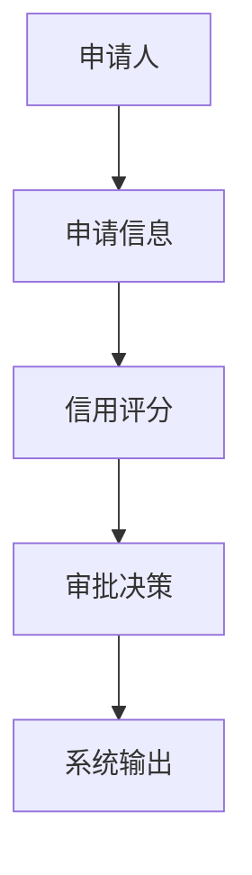
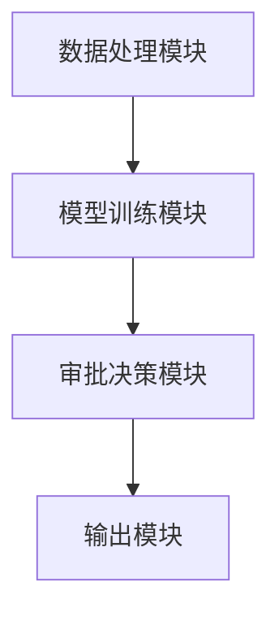
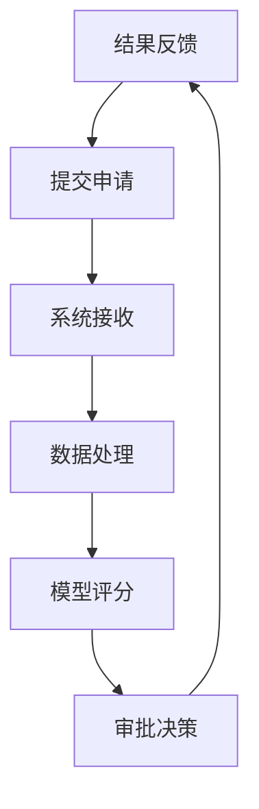

                 


# AI驱动的个人信贷审批系统设计

> 关键词：AI驱动，个人信贷，审批系统，机器学习，系统设计

> 摘要：本文详细探讨了AI驱动的个人信贷审批系统的背景、核心概念、算法原理、系统架构、项目实战以及最佳实践。通过分析传统信贷审批的挑战，介绍了AI技术在其中的应用优势，详细讲解了系统设计的关键要素、算法实现、架构设计和实际案例，为读者提供了全面的系统设计思路和实践经验。

---

## 目录

# 第一部分: AI驱动的个人信贷审批系统背景与核心概念

## 第1章: AI驱动的个人信贷审批系统背景

### 1.1 个人信贷审批的现状与挑战
- 1.1.1 传统信贷审批的流程与问题
  - 现有流程中的低效环节
  - 数据不足和人为错误的问题
- 1.1.2 AI技术在信贷审批中的优势
  - 提高审批效率
  - 增强风险预测能力
- 1.1.3 个人信贷审批的边界与外延
  - 系统的核心功能
  - 边界条件与限制

### 1.2 问题背景与问题描述
- 1.2.1 传统信贷审批的效率问题
  - 人工审核的低效性
  - 数据处理的复杂性
- 1.2.2 数据驱动的信贷审批需求
  - 大数据分析的重要性
  - 数据清洗与特征提取
- 1.2.3 AI技术如何解决信贷审批问题
  - 机器学习模型的应用
  - 自动化审批的优势

### 1.3 系统设计的核心要素与组成
- 1.3.1 数据来源与处理
  - 数据采集与清洗
  - 数据特征提取与分析
- 1.3.2 AI模型的构建与训练
  - 模型选择与训练策略
  - 超参数调优与模型评估
- 1.3.3 系统的可解释性与合规性
  - 模型解释性的重要性
  - 合规性要求与风险控制

### 1.4 本章小结
- 本章总结了AI驱动的个人信贷审批系统的背景与核心概念，分析了传统信贷审批的挑战和AI技术带来的解决方案，为后续章节奠定了基础。

---

## 第2章: AI驱动的信贷审批系统核心概念

### 2.1 AI驱动的信贷审批系统原理
- 2.1.1 数据流与模型训练
  - 数据流的流程图展示
  - 模型训练的步骤与方法
- 2.1.2 模型评分与决策规则
  - 评分标准的制定
  - 决策规则的逻辑分析
- 2.1.3 系统的实时性与响应速度
  - 实时处理的必要性
  - 系统性能优化策略

### 2.2 核心概念的属性特征对比
- 2.2.1 传统信贷审批与AI驱动审批的特征对比
  - 对比表格展示
  - 特征分析与优劣势总结
- 2.2.2 AI驱动审批的核心属性分析
  - 数据驱动的特征
  - 智能算法的优势
- 2.2.3 系统的可扩展性与灵活性
  - 系统架构的扩展性
  - 灵活性与适应性分析

### 2.3 系统的ER实体关系图


---

## 第3章: 机器学习算法在信贷审批中的应用

### 3.1 逻辑回归算法
- 3.1.1 逻辑回归算法原理
  - 简单线性回归的局限性
  - 逻辑函数的引入与作用
- 3.1.2 逻辑回归的数学模型
  $$ P(y=1|x) = \frac{1}{1 + e^{-\beta x}} $$
- 3.1.3 逻辑回归的实现步骤
  - 数据预处理与特征选择
  - 模型训练与参数优化
  - 模型评估与调优

### 3.2 随机森林算法
- 3.2.1 随机森林算法原理
  - 树投票与特征重要性
  - 随机性对模型性能的影响
- 3.2.2 随机森林的数学模型
  - 基于决策树的集成方法
  - 超参数设置与优化
- 3.2.3 随机森林的实现步骤
  - 数据分割与样本选择
  - 决策树的构建与集成
  - 模型性能的评估与分析

### 3.3 神经网络算法
- 3.3.1 神经网络算法原理
  - 网络结构与激活函数
  - 深度学习的优势与挑战
- 3.3.2 神经网络的数学模型
  - 网络层的数学表示
  - 损失函数与优化算法
- 3.3.3 神经网络的实现步骤
  - 神经网络的设计与训练
  - 验证集的使用与过拟合控制
  - 模型的部署与应用

### 3.4 算法对比与选择
- 3.4.1 不同算法的性能对比
  - 准确率、召回率与F1分数
  - 模型复杂度与训练时间
- 3.4.2 根据场景选择合适算法
  - 高维数据的处理
  - 非线性关系的建模
- 3.4.3 算法的可解释性与合规性
  - 模型解释性的重要性
  - 合规性要求对算法选择的影响

### 3.5 本章小结
- 本章详细讲解了机器学习算法在信贷审批中的应用，分析了逻辑回归、随机森林和神经网络的原理、实现步骤和优缺点，为后续的系统设计提供了算法基础。

---

## 第4章: 系统分析与架构设计

### 4.1 系统分析
- 4.1.1 系统目标与功能需求
  - 核心功能模块的定义
  - 用户需求与系统功能的匹配
- 4.1.2 系统的输入与输出
  - 输入数据的来源与格式
  - 输出结果的格式与反馈机制
- 4.1.3 系统的性能需求
  - 响应时间与处理能力
  - 系统可扩展性与负载能力

### 4.2 系统架构设计
- 4.2.1 总体架构设计
  - 分层架构的优缺点
  - 模块化设计的优势
- 4.2.2 模块划分与功能分配
  - 数据处理模块
  - 模型训练模块
  - 审批决策模块
- 4.2.3 系统架构图


### 4.3 系统接口设计
- 4.3.1 系统接口定义
  - API的设计与调用
  - 接口文档的编写与规范
- 4.3.2 接口的交互流程
  - 用户提交申请
  - 系统处理与反馈
  - 审批结果的通知

### 4.4 系统交互设计
- 4.4.1 系统交互流程图


### 4.5 系统的实现与优化
- 4.5.1 系统实现的步骤
  - 环境搭建与依赖管理
  - 数据处理与特征工程
  - 模型训练与部署
- 4.5.2 系统优化策略
  - 性能优化方法
  - 系统容错与异常处理
  - 日志记录与监控

### 4.6 本章小结
- 本章详细分析了系统的架构设计与接口设计，通过模块划分与流程图展示了系统的整体结构，为后续的系统实现奠定了基础。

---

## 第5章: 项目实战

### 5.1 环境搭建与数据准备
- 5.1.1 开发环境的配置
  - Python版本与依赖管理
  - 数据库与存储的设置
- 5.1.2 数据的获取与清洗
  - 数据来源与预处理
  - 数据分割与训练集、测试集的划分

### 5.2 系统核心实现
- 5.2.1 数据处理与特征工程
  - 数据清洗与转换
  - 特征选择与降维
- 5.2.2 模型训练与部署
  - 选择合适的算法
  - 模型训练与参数调优
  - 模型部署与接口开发
- 5.2.3 系统功能的实现
  - 用户界面的设计与实现
  - 审批流程的自动化
  - 结果反馈与日志记录

### 5.3 代码实现与分析
- 5.3.1 数据处理代码
  ```python
  import pandas as pd
  data = pd.read_csv('credit_data.csv')
  data = data.dropna()
  data['age'] = data['age'].astype(int)
  ```

- 5.3.2 模型训练代码
  ```python
  from sklearn.linear_model import LogisticRegression
  model = LogisticRegression()
  model.fit(X_train, y_train)
  ```

- 5.3.3 模型评估代码
  ```python
  from sklearn.metrics import accuracy_score
  y_pred = model.predict(X_test)
  print(accuracy_score(y_test, y_pred))
  ```

### 5.4 实际案例分析
- 5.4.1 案例背景与数据特征
  - 案例的选取与分析
  - 数据特征的详细分析
- 5.4.2 系统的审批流程
  - 用户提交申请
  - 系统处理与评分
  - 审批结果的反馈
- 5.4.3 案例分析与总结
  - 审批结果的合理性分析
  - 系统表现与优化建议

### 5.5 本章小结
- 本章通过实际项目实战，详细讲解了系统的实现过程，从数据处理到模型训练，再到系统部署，为读者提供了完整的项目经验。

---

## 第6章: 最佳实践与总结

### 6.1 最佳实践
- 6.1.1 数据处理的注意事项
  - 数据清洗与特征工程的技巧
  - 数据安全与隐私保护
- 6.1.2 模型选择与优化
  - 模型调优的常见方法
  - 多模型融合的应用场景
- 6.1.3 系统设计的注意事项
  - 系统架构的可扩展性
  - 系统性能的优化策略

### 6.2 项目小结
- 项目目标的达成
- 系统设计与实现的总结
- 经验与教训的分享

### 6.3 注意事项
- 系统的可解释性与合规性
- 模型的稳定性和可靠性
- 数据安全与隐私保护

### 6.4 拓展阅读
- 推荐的相关书籍与论文
- 行业动态与最新技术发展
- 进一步学习的资源与建议

### 6.5 本章小结
- 本章总结了项目的最佳实践，提出了系统设计与实现中的注意事项，并为读者提供了进一步学习的方向。

---

## 作者信息

作者：AI天才研究院/AI Genius Institute & 禅与计算机程序设计艺术/Zen And The Art of Computer Programming

---

以上是一个详细的《AI驱动的个人信贷审批系统设计》的目录大纲，涵盖了从背景介绍到系统实现的各个方面，内容丰富且逻辑清晰，为读者提供了全面的系统设计思路和实践经验。

