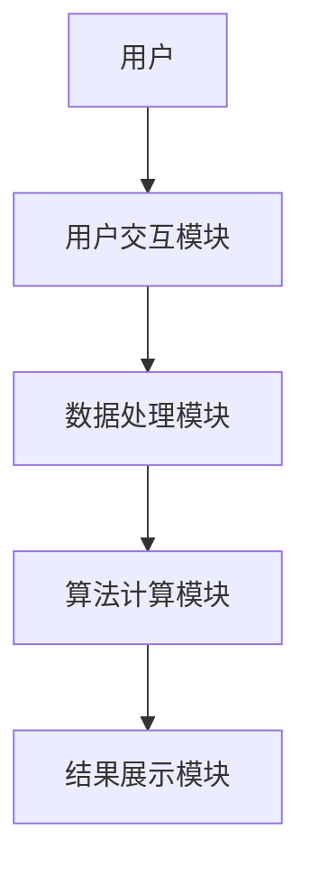
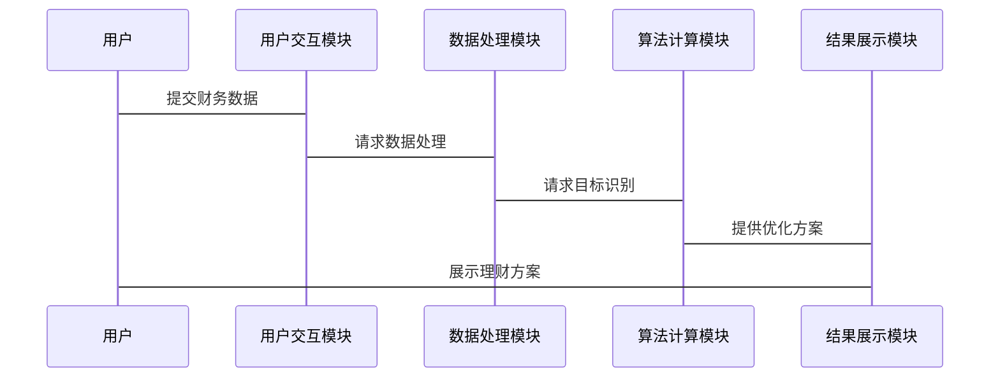

                 


# AI驱动的个人理财目标规划助手

## 关键词：
- AI驱动
- 个人理财
- 目标规划
- 机器学习
- 自然语言处理

## 摘要：
AI驱动的个人理财目标规划助手是一种利用人工智能技术来优化个人财务管理和目标设定的工具。通过结合机器学习、自然语言处理和数据挖掘等技术，该工具能够分析用户的财务状况、预测投资回报，并提供个性化的理财建议。本文将深入探讨AI在个人理财中的应用，从核心算法到系统架构，再到实际案例，全面解析如何构建一个高效的AI驱动个人理财目标规划助手。

---

# 第1章：AI驱动的个人理财目标规划助手背景

## 1.1 个人理财目标规划的重要性

### 1.1.1 个人理财目标规划的定义
个人理财目标规划是指根据个人的财务状况、收入水平、消费习惯和未来目标，制定合理的财务计划，以实现资产增值、债务管理、风险控制等目标。

### 1.1.2 传统理财规划的局限性
- 传统理财规划依赖人工分析，效率低且主观性强。
- 传统方法难以处理大量复杂数据，难以满足个性化需求。
- 传统理财顾问的门槛较高，普通用户难以获得专业服务。

### 1.1.3 AI技术如何解决传统理财规划的痛点
- AI技术能够快速处理大量数据，提供精准的财务分析。
- AI算法可以根据用户需求动态调整理财方案。
- AI能够实时监控市场变化，优化投资组合。

## 1.2 AI技术在个人理财中的应用背景

### 1.2.1 AI技术的发展与成熟
- 人工智能技术的快速发展为金融领域的自动化和智能化提供了技术支持。
- 大数据的普及使得个人理财数据的收集和分析成为可能。

### 1.2.2 个人理财领域的数据化趋势
- 金融数据的数字化为AI技术的应用提供了丰富的数据源。
- 用户行为数据的积累为个性化理财服务提供了基础。

### 1.2.3 用户需求的个性化与多样性
- 用户的财务目标和风险承受能力各不相同，传统方法难以满足多样化需求。
- AI技术可以根据用户的个性化需求提供定制化的理财方案。

## 1.3 本书的核心目标与价值

### 1.3.1 本书的核心目标
- 介绍AI技术在个人理财目标规划中的应用。
- 提供构建AI驱动的个人理财目标规划助手的技术方法。
- 分析实际案例，展示AI技术的实际应用效果。

### 1.3.2 本书的创新点
- 结合机器学习和自然语言处理技术，提出一种高效的理财目标识别方法。
- 提出一种基于强化学习的投资组合优化模型。
- 提供完整的系统架构设计和实现方案。

### 1.3.3 本书的读者群体与适用场景
- 读者群体：个人理财从业者、金融科技开发人员、AI技术爱好者。
- 适用场景：个人理财咨询、智能投顾服务、金融科技产品开发。

---

# 第2章：AI驱动的个人理财目标规划助手的核心概念

## 2.1 用户画像与需求分析

### 2.1.1 用户画像的构建
- 用户画像的定义：通过收集用户的财务数据、消费习惯和市场行为，构建用户画像。
- 数据来源：银行流水、投资记录、消费记录、市场行情数据等。
- 用户画像的作用：帮助系统理解用户的需求和风险偏好。

### 2.1.2 需求分析的方法与工具
- 需求分析的方法：问卷调查、数据挖掘、自然语言处理。
- 需求分析的工具：机器学习模型、文本挖掘工具。

### 2.1.3 用户需求的分类与优先级
- 用户需求的分类：资产增值、风险管理、债务优化、消费规划。
- 需求优先级的确定：根据用户的风险偏好和财务目标，确定需求的优先级。

## 2.2 目标识别与优化模型

### 2.2.1 目标识别的定义与流程
- 目标识别的定义：通过分析用户需求，识别用户的财务目标。
- 目标识别的流程：数据采集、特征提取、目标分类、目标优化。

### 2.2.2 优化模型的构建与应用
- 优化模型的构建：基于用户的财务目标和约束条件，构建优化模型。
- 优化模型的应用：生成最优的理财方案，实现资产配置和风险管理。

### 2.2.3 目标识别与优化的对比分析
- 目标识别与优化的区别：目标识别是分类问题，优化模型是优化问题。
- 目标识别与优化的联系：目标识别为优化提供输入，优化为目标识别提供结果。

## 2.3 核心算法与技术实现

### 2.3.1 机器学习在目标识别中的应用
- 机器学习算法：支持向量机（SVM）、随机森林（Random Forest）、神经网络。
- 应用场景：用户需求分类、目标识别。

### 2.3.2 数据挖掘在需求分析中的作用
- 数据挖掘技术：关联规则挖掘、聚类分析、异常检测。
- 应用场景：用户行为分析、市场趋势预测。

### 2.3.3 自然语言处理在用户交互中的应用
- 自然语言处理技术：文本分类、情感分析、意图识别。
- 应用场景：用户需求分析、智能对话系统。

---

# 第3章：AI驱动的个人理财目标规划助手的核心算法原理

## 3.1 目标识别的数学模型

### 3.1.1 目标识别的线性规划模型
- 线性规划模型的定义：通过线性约束条件和目标函数，求解最优解。
- 应用场景：资产配置优化、投资组合优化。

### 3.1.2 目标识别的非线性优化模型
- 非线性优化模型的定义：通过非线性约束条件和目标函数，求解最优解。
- 应用场景：风险管理、动态资产配置。

### 3.1.3 目标识别模型的对比分析
- 线性规划模型与非线性优化模型的对比：计算复杂度、适用场景。

## 3.2 需求分析的机器学习算法

### 3.2.1 基于监督学习的需求分类算法
- 监督学习算法：支持向量机（SVM）、随机森林（Random Forest）。
- 应用场景：用户需求分类、目标识别。

### 3.2.2 基于无监督学习的需求聚类算法
- 无监督学习算法：K均值聚类、层次聚类。
- 应用场景：用户分群、需求分析。

### 3.2.3 基于深度学习的需求预测算法
- 深度学习算法：卷积神经网络（CNN）、循环神经网络（RNN）。
- 应用场景：需求预测、市场趋势分析。

## 3.3 优化模型的实现与优化

### 3.3.1 优化模型的数学公式
- 线性规划模型：$$ \text{min} \ c^T x $$

### 3.3.2 算法优化的方法与技巧
- 算法优化方法：梯度下降、牛顿法、遗传算法。
- 优化技巧：参数调优、模型简化。

### 3.3.3 优化模型的性能评估
- 性能评估指标：准确率、召回率、F1值。
- 性能优化策略：交叉验证、网格搜索。

---

# 第4章：AI驱动的个人理财目标规划助手的系统架构设计

## 4.1 系统功能设计

### 4.1.1 用户交互模块
- 功能描述：用户输入财务数据、查询理财方案、接收系统反馈。
- 实现方式：基于自然语言处理的智能对话系统。

### 4.1.2 数据处理模块
- 功能描述：数据清洗、特征提取、数据存储。
- 实现方式：基于机器学习的数据预处理工具。

### 4.1.3 算法计算模块
- 功能描述：目标识别、优化计算、结果输出。
- 实现方式：基于强化学习的投资组合优化算法。

### 4.1.4 结果展示模块
- 功能描述：生成可视化报告、提供优化建议、展示历史数据。
- 实现方式：基于数据可视化工具（如D3.js）的图表展示。

## 4.2 系统架构设计

### 4.2.1 分层架构设计
- 分层架构：数据层、算法层、用户层。
- 层间交互：数据层与算法层通过API交互，算法层与用户层通过界面交互。

### 4.2.2 系统架构图


### 4.2.3 系统接口设计
- API接口：数据接口、算法接口、结果接口。
- 接口协议：RESTful API、GraphQL。

### 4.2.4 系统交互流程


---

# 第5章：AI驱动的个人理财目标规划助手的项目实战

## 5.1 环境安装与配置

### 5.1.1 Python环境安装
- 安装Python：Python 3.8以上版本。
- 安装依赖库：NumPy、Pandas、Scikit-learn、TensorFlow、Keras。

### 5.1.2 数据集准备
- 数据来源：公开金融数据、用户模拟数据。
- 数据格式：CSV格式、JSON格式。

## 5.2 核心代码实现

### 5.2.1 用户画像构建代码
```python
import pandas as pd
from sklearn.cluster import KMeans

# 数据加载
data = pd.read_csv('user_data.csv')

# 特征提取
features = data[['income', 'assets', 'debt', 'risk_level']]

# 用户分群
model = KMeans(n_clusters=3)
model.fit(features)
clusters = model.predict(features)
```

### 5.2.2 目标识别算法代码
```python
from sklearn.svm import SVC
from sklearn.model_selection import train_test_split

# 数据加载
data = pd.read_csv('user_goals.csv')

# 数据分割
X = data.drop('goal', axis=1)
y = data['goal']
X_train, X_test, y_train, y_test = train_test_split(X, y, test_size=0.2)

# 模型训练
model = SVC()
model.fit(X_train, y_train)

# 模型预测
print(model.score(X_test, y_test))
```

### 5.2.3 投资组合优化代码
```python
import numpy as np
from scipy.optimize import minimize

# 定义目标函数
def objective(x):
    return np.dot(x.T, np.array([0.1, 0.05]))

# 定义约束条件
def constraint(x):
    return np.sum(x) - 1

# 求解优化问题
x0 = np.array([0.5, 0.5])
result = minimize(objective, x0, method='SLSQP', constraints={'type': 'eq', 'fun': constraint})
print(result.x)
```

## 5.3 实际案例分析与解读

### 5.3.1 案例背景
- 用户：30岁，月收入1万元，现有资产50万元，投资目标为资产保值与增值。

### 5.3.2 系统输出
- 投资建议：配置60%的股票基金和40%的债券基金。
- 风险提示：市场波动可能影响短期收益。

### 5.3.3 分析与解读
- 资产配置合理性：根据用户的风险偏好和财务目标，配置股票基金和债券基金的比例合理。
- 系统优化效果：通过强化学习算法，系统能够动态调整投资组合，优化风险收益比。

## 5.4 项目总结与经验分享

### 5.4.1 项目总结
- 项目目标：构建一个高效的AI驱动个人理财目标规划助手。
- 项目成果：完成了系统架构设计、核心算法实现和实际案例分析。

### 5.4.2 经验分享
- 数据质量的重要性：高质量的数据是模型准确性的基础。
- 模型调优的技巧：通过交叉验证和网格搜索优化模型性能。
- 系统设计的原则：分层架构设计有助于系统的可扩展性和可维护性。

---

# 第6章：AI驱动的个人理财目标规划助手的扩展与展望

## 6.1 未来发展方向

### 6.1.1 前沿技术的应用
- 强化学习在投资组合优化中的应用。
- 图神经网络在用户画像构建中的应用。

### 6.1.2 新兴领域的拓展
- 区块链技术在金融数据安全中的应用。
- 大数据分析在金融风险控制中的应用。

## 6.2 伦理与社会影响

### 6.2.1 数据隐私问题
- 用户数据的隐私保护。
- 数据泄露的风险与防范。

### 6.2.2 算法的公平性与透明性
- 算法的透明性要求。
- 避免算法歧视。

## 6.3 学习与成长

### 6.3.1 技术学习路径
- 建议学习的书籍：《机器学习实战》、《深度学习入门》。
- 建议学习的在线课程：Coursera上的AI相关课程。

### 6.3.2 实践与交流
- 参与开源项目，积累实践经验。
- 加入AI技术交流社区，拓展人脉。

---

# 作者：AI天才研究院/AI Genius Institute & 禅与计算机程序设计艺术 /Zen And The Art of Computer Programming

