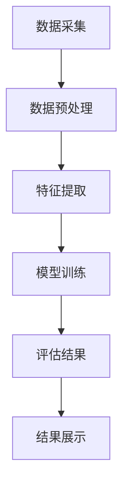
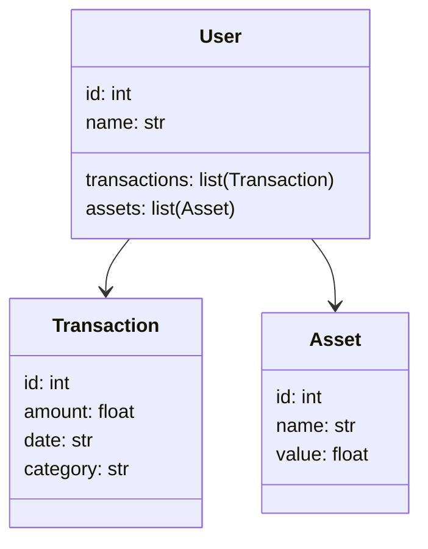
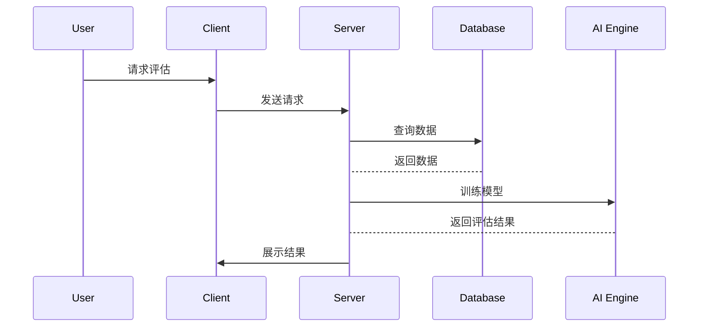

                 


# AI驱动的个人财务健康指数动态评估系统

## 关键词：AI，个人财务，健康指数，动态评估，系统架构

## 摘要：本文介绍了一种基于人工智能技术的个人财务健康指数动态评估系统，通过数据驱动的方法，实时分析和评估个人的财务状况，为用户提供智能化的财务健康建议和决策支持。文章详细阐述了系统的核心概念、算法原理、系统架构、项目实现以及最佳实践，帮助读者全面理解并应用这一创新的财务评估系统。

---

# 第1章: 背景介绍

## 1.1 问题背景

### 1.1.1 传统个人财务评估的局限性
传统的个人财务评估方法通常依赖于静态的财务指标，如资产负债表、收入支出分析等，难以实时捕捉财务状况的变化。这种方法不仅效率低下，还可能因为数据更新不及时而导致评估结果的偏差。

### 1.1.2 人工智能在财务评估中的优势
人工智能技术能够通过大数据分析和机器学习算法，实时处理海量的财务数据，快速识别潜在的财务风险，并提供个性化的财务建议。AI技术的应用使得财务评估更加智能化、动态化和精准化。

### 1.1.3 动态评估的必要性
个人的财务状况会随着收入、支出、资产变动等因素的变化而不断波动。动态评估能够及时反映这些变化，帮助用户更好地管理和优化财务状况，避免因信息滞后导致的决策失误。

## 1.2 问题描述

### 1.2.1 财务健康指数的定义
财务健康指数是衡量个人财务状况健康程度的综合指标，通常包括收入稳定性、支出合理性、资产配置优化性等多个维度。

### 1.2.2 动态评估的核心要素
动态评估的核心要素包括实时数据采集、模型训练与优化、结果展示与反馈等。

### 1.2.3 系统的目标与范围
系统的目标是通过AI技术，实时评估个人的财务健康指数，并提供智能化的财务建议。系统的范围涵盖数据采集、模型构建、结果展示等多个模块。

## 1.3 问题解决

### 1.3.1 AI驱动的解决方案
AI技术的应用使得系统能够实时处理海量数据，快速生成评估结果，并根据用户的行为反馈不断优化模型。

### 1.3.2 数据驱动的动态评估方法
通过收集和分析用户的财务数据，系统能够动态调整评估指标，确保评估结果的准确性和及时性。

### 1.3.3 系统架构的设计思路
系统架构设计以模块化为主，包括数据采集模块、模型训练模块、结果展示模块等，各模块之间通过接口进行交互。

## 1.4 系统的边界与外延

### 1.4.1 系统的功能边界
系统的主要功能包括数据采集、模型训练、结果展示等，不涉及外部系统的数据存储和管理。

### 1.4.2 外部系统的交互
系统可能需要与银行、第三方支付平台等外部系统进行数据交互，以获取最新的财务数据。

### 1.4.3 系统的可扩展性
系统设计时充分考虑了扩展性，未来可以接入更多的数据源和评估指标，进一步提升评估的准确性和全面性。

## 1.5 核心概念与联系

### 1.5.1 核心概念原理
AI驱动的财务健康指数评估系统通过收集和分析用户的财务数据，利用机器学习算法生成评估结果，并根据用户反馈不断优化模型。

### 1.5.2 核心概念属性特征对比表格
| 属性       | 传统评估方法 | AI驱动评估系统 |
|------------|--------------|----------------|
| 数据来源   | 静态数据     | 动态数据       |
| 处理速度   | 慢           | 快             |
| 精确度     | 较低         | 高             |

### 1.5.3 ER实体关系图架构
```mermaid
erDiagram
    user {
        User
        [1..n] Transaction
        [1..n] Asset
    }
    transaction {
        Transaction
        [1] User
        [1] Category
    }
    category {
        Category
        [1..n] Transaction
    }
    asset {
        Asset
        [1..n] User
    }
```

---

# 第2章: 核心概念与联系

## 2.1 AI与财务健康指数的结合

### 2.1.1 AI在数据处理中的作用
AI技术能够快速处理和分析海量的财务数据，发现数据中的潜在规律和趋势。

### 2.1.2 财务健康指数的计算方法
财务健康指数通常由多个评估指标加权计算得出，AI技术可以动态调整各个指标的权重，以反映最新的财务状况。

### 2.1.3 动态评估的实现机制
通过实时数据采集和模型训练，AI系统能够动态调整评估指标，确保评估结果的准确性和及时性。

## 2.2 数据驱动的动态评估模型

### 2.2.1 数据来源与处理
系统需要采集用户的历史交易记录、资产信息、收支流水等数据，并对其进行清洗和预处理。

### 2.2.2 模型的输入与输出
模型的输入包括经过处理的财务数据，输出是个人财务健康指数及其详细解读。

### 2.2.3 模型的训练与优化
通过机器学习算法，系统能够不断优化模型参数，提升评估结果的准确性和可靠性。

## 2.3 系统的核心要素

### 2.3.1 数据采集模块
负责采集用户的财务数据，包括交易记录、资产信息等。

### 2.3.2 模型训练模块
利用机器学习算法，对采集的数据进行训练，生成评估结果。

### 2.3.3 结果展示模块
将评估结果以可视化的方式呈现给用户，并提供个性化的财务建议。

---

# 第3章: 算法原理讲解

## 3.1 算法原理概述

### 3.1.1 算法的基本原理
机器学习算法通过学习数据中的模式和特征，生成预测结果。在财务健康指数评估中，常用的算法包括回归分析、聚类分析等。

### 3.1.2 算法的核心思想
回归分析用于预测财务健康指数，聚类分析用于识别财务风险。

### 3.1.3 算法的优缺点
回归分析简单易用，但对非线性关系的处理能力有限；聚类分析能够发现数据中的潜在结构，但需要大量数据支持。

## 3.2 算法流程图



## 3.3 算法实现代码

### 3.3.1 环境安装
需要安装Python、机器学习库（如scikit-learn）等。

### 3.3.2 核心代码实现

```python
import pandas as pd
from sklearn.linear_model import LinearRegression
from sklearn.metrics import mean_squared_error

# 数据加载
data = pd.read_csv('financial_data.csv')

# 特征提取
features = data[['income', 'expenses', 'assets']]
target = data['health_index']

# 模型训练
model = LinearRegression()
model.fit(features, target)

# 预测结果
predictions = model.predict(features)
print(mean_squared_error(target, predictions))
```

### 3.3.3 代码应用解读与分析
上述代码展示了如何利用线性回归算法对财务健康指数进行预测。通过训练模型，系统能够根据用户的收入、支出和资产情况，预测其财务健康指数，并提供相应的建议。

---

# 第4章: 系统分析与架构设计方案

## 4.1 问题场景介绍

### 4.1.1 项目介绍
本项目旨在开发一个基于AI的个人财务健康指数动态评估系统，通过实时数据分析，为用户提供智能化的财务建议。

### 4.1.2 系统功能设计

#### 4.1.2.1 领域模型mermaid类图


### 4.1.2.2 系统架构设计

#### 4.1.2.2.1 系统架构mermaid架构图
```mermaid
archi
    partitions horizontal
        Client
        Server
        Database
    partitions vertical
        User Interface
        AI Engine
        Database
```

### 4.1.2.3 系统接口设计
系统需要与第三方数据源（如银行、支付平台）进行接口对接，获取用户的财务数据。

### 4.1.2.4 系统交互mermaid序列图


---

# 第5章: 项目实战

## 5.1 环境安装

### 5.1.1 安装Python和相关库
需要安装Python 3.8及以上版本，安装scikit-learn、pandas等库。

## 5.2 核心代码实现

### 5.2.1 数据加载与处理
```python
import pandas as pd
import numpy as np

# 数据加载
data = pd.read_csv('financial_data.csv')

# 数据清洗
data = data.dropna()
data = data.drop_duplicates()
```

### 5.2.2 模型训练与预测
```python
from sklearn.model

