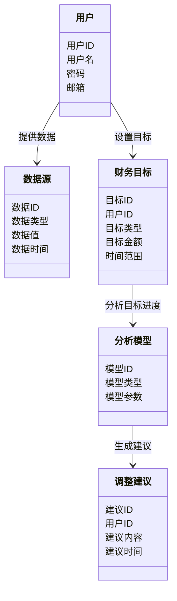
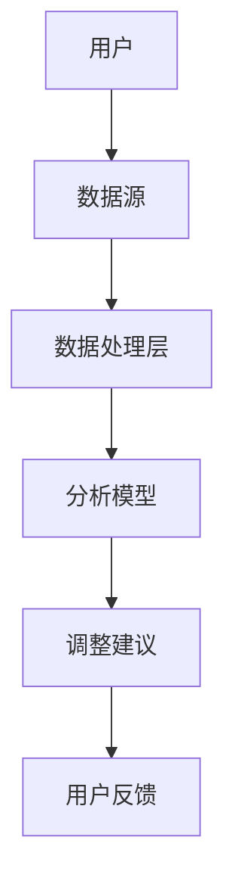
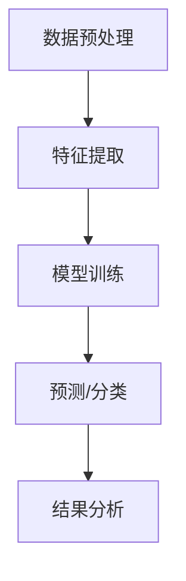

                 


# AI驱动的个人财务目标追踪与调整系统

> 关键词：人工智能、个人财务管理、目标追踪、系统架构、算法优化

> 摘要：本文介绍了一种基于人工智能的个人财务目标追踪与调整系统，详细阐述了系统的建设目标、核心算法、系统架构以及实现方法，结合实际案例，分析了系统的应用场景和优化方向，为个人财务管理提供了新的思路。

---

## 第一部分: AI驱动的个人财务目标追踪与调整系统概述

### 第1章: 系统背景与核心概念

#### 1.1 问题背景与目标
##### 1.1.1 传统个人财务管理的痛点
在传统的个人财务管理中，许多人面临以下问题：
- 数据分散：账单、银行流水、投资记录分散在不同平台，难以整合。
- 手动分析耗时：需要手动记录和分析收支情况，容易出错。
- 目标管理困难：难以实时追踪财务目标的进展，缺乏动态调整的工具。
- 个性化需求未满足：不同人的财务目标和风险承受能力不同，但传统系统难以提供个性化的建议。

##### 1.1.2 AI技术在财务管理中的应用前景
人工智能技术在财务管理中的应用前景广阔：
- **数据处理能力**：AI能够快速处理大量财务数据，发现规律。
- **预测与优化**：通过机器学习模型，AI可以预测财务状况并提供优化建议。
- **实时调整**：AI能够实时监控财务数据，动态调整目标和策略。

##### 1.1.3 系统建设目标与意义
本系统的建设目标是打造一个智能化的个人财务管理工具，帮助用户实现以下目标：
- 实时追踪财务目标的进展。
- 根据市场变化和用户收支情况，动态调整财务策略。
- 提供个性化的财务建议，帮助用户优化资产配置。

系统的意义在于：
- 提高财务管理效率，降低人为错误。
- 帮助用户更好地实现财务自由。
- 为个人用户提供智能化的财务管理和决策支持。

#### 1.2 核心概念与定义
##### 1.2.1 AI驱动的定义与特点
AI驱动的系统是指利用人工智能技术（如机器学习、深度学习）来处理和分析数据，提供自动化、智能化的决策支持。其特点包括：
- 数据驱动：依赖大量数据进行分析和预测。
- 自适应性：能够根据输入数据动态调整模型。
- 高效性：通过自动化处理提高效率。

##### 1.2.2 财务目标的定义与分类
财务目标是指用户在一定时间内希望实现的财务成果，通常包括：
- **短期目标**：如应急基金储备、短期储蓄目标。
- **中期目标**：如购房首付、旅行基金。
- **长期目标**：如退休计划、资产传承。

##### 1.2.3 系统的边界与外延
系统的边界是指其处理的财务数据范围和功能范围。系统的外延包括与之交互的第三方服务（如银行、投资平台）和用户端的应用界面。

##### 1.2.4 核心概念与联系
通过表格和实体关系图，我们可以清晰地理解系统的核心概念及其联系。

#### 1.3 核心概念对比与ER图
##### 1.3.1 核心概念对比
| 概念 | 描述 |
|------|------|
| 财务目标 | 用户希望实现的财务成果 |
| 数据源 | 包括银行流水、账单、投资记录等 |
| 分析模型 | 用于预测和优化的数学模型 |
| 调整建议 | 根据分析结果提出的财务调整方案 |

##### 1.3.2 ER实体关系图
```mermaid
erd
    财务目标
        目标ID
        用户ID
        目标类型
        目标金额
        时间范围
    数据源
        数据ID
        数据类型
        数据值
        数据时间
    分析模型
        模型ID
        模型类型
        模型参数
    调整建议
        建议ID
        用户ID
        建议内容
        建议时间
```

---

## 第二部分: 系统设计与算法原理

### 第2章: 系统设计与架构

#### 2.1 问题场景介绍
##### 2.1.1 个人财务目标管理的典型场景
- 用户设定多个财务目标（如应急基金、购房首付）。
- 系统需要实时追踪目标的进展，并根据收支变化调整目标实现的时间表。

##### 2.1.2 用户角色与权限
- **普通用户**：录入数据、查看目标进度、接收调整建议。
- **管理员**：维护系统、管理数据源、调整模型参数。

#### 2.2 系统功能设计
##### 2.2.1 领域模型设计


#### 2.3 系统架构设计
##### 2.3.1 系统架构图


---

### 第3章: 算法原理与实现

#### 3.1 算法原理讲解
##### 3.1.1 机器学习与深度学习在财务分析中的应用
- **回归分析**：用于预测未来的财务状况。
- **分类算法**：用于判断收支类型（如消费、投资）。
- **聚类分析**：用于发现财务数据中的模式。

##### 3.1.2 算法流程图


#### 3.2 数学模型与公式
##### 3.2.1 线性回归模型
$$ y = \beta_0 + \beta_1x_1 + \beta_2x_2 + \cdots + \beta_nx_n $$

---

## 第三部分: 项目实战与优化

### 第4章: 项目实战

#### 4.1 环境安装与配置
- **Python**：安装Python 3.8及以上版本。
- **库的安装**：`pip install numpy pandas scikit-learn`

#### 4.2 核心代码实现
##### 4.2.1 数据预处理
```python
import pandas as pd
import numpy as np

# 读取数据
data = pd.read_csv('financial_data.csv')
# 去除缺失值
data.dropna(inplace=True)
```

##### 4.2.2 模型训练
```python
from sklearn.linear_model import LinearRegression
model = LinearRegression()
model.fit(X_train, y_train)
```

#### 4.3 实际案例分析
- **案例背景**：用户设定的财务目标是“3个月内储蓄5万元”。
- **数据输入**：用户过去6个月的收支记录。
- **系统输出**：预测目标实现的可能性，并提出调整建议。

---

### 第5章: 优化与调整

#### 5.1 系统性能优化
- **数据压缩**：减少数据存储空间。
- **算法优化**：使用更高效的模型（如XGBoost）。

#### 5.2 用户体验优化
- **可视化界面**：直观展示目标进度。
- **智能提醒**：根据目标进展发送提醒。

#### 5.3 数据安全与隐私保护
- **数据加密**：对敏感数据进行加密处理。
- **访问控制**：严格控制数据访问权限。

---

## 第四部分: 总结与展望

### 第6章: 总结与展望

#### 6.1 系统总结
- **优势**：高效、智能、个性化。
- **不足**：数据依赖性强，模型需要持续优化。

#### 6.2 未来展望
- **结合区块链技术**：提高数据的安全性和透明性。
- **引入更多AI技术**：如自然语言处理，进一步提升用户体验。

---

## 作者：AI天才研究院/AI Genius Institute & 禅与计算机程序设计艺术 /Zen And The Art of Computer Programming

